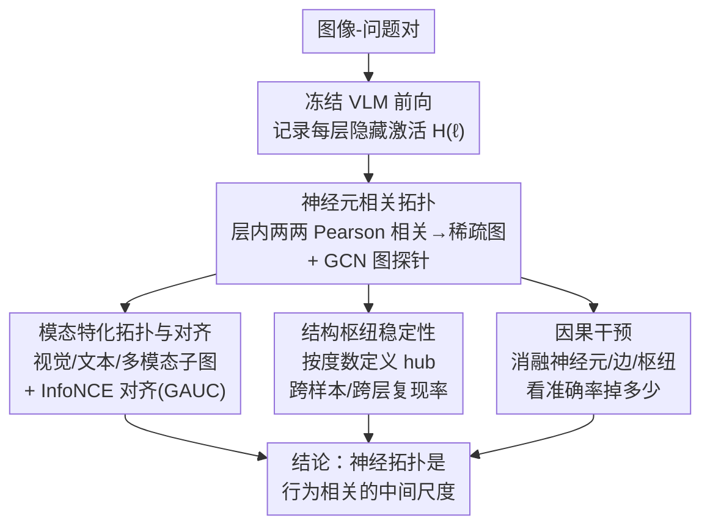

# Structural Graph Probing of Vision-Language Models

**会议**: CVPR 2026  
**论文**: [CVF Open Access](https://openaccess.thecvf.com/content/CVPR2026/html/He_Structural_Graph_Probing_of_Vision-Language_Models_CVPR_2026_paper.html)  
**代码**: https://github.com/he-h/vlm-graphprobing  
**领域**: 多模态VLM / 可解释性  
**关键词**: 神经拓扑, 相关图, 图探针, 跨模态结构, 因果干预

## 一句话总结
这篇论文把视觉-语言模型每一层的神经元两两相关性建成一张"相关图"，用 GCN 图探针证明这种**群体级拓扑结构**能预测模型行为、刻画跨模态融合随深度的演化、并定位出扰动后会显著改变输出的"枢纽神经元"，从而提出一个介于"局部归因"和"完整电路恢复"之间的全新可解释性中间尺度。

## 研究背景与动机

**领域现状**：现在解释 VLM 内部机制的主流手段，是各种"局部归因"——注意力图、显著图、patch 归因、单组件检查。这些方法擅长回答"哪个输入 token / 图像区域最重要"。

**现有痛点**：但 transformer 类 VLM 的计算是**分布在大量交互单元的群体里**的，而不是集中在少数几条孤立通路上。局部归因只能告诉你"谁亮了"，却说不清这些单元在层内、跨层、跨模态之间是**怎么组织起来协同完成多模态推理的**。换句话说，现有可解释性大多停留在描述层面。

**核心矛盾**：可解释性有两个极端——一端是"单神经元/单 token 归因"，简单但太碎，看不到全局组织；另一端是"完整电路恢复（circuit recovery）"，理论上最彻底但计算上几乎不可行、也难以跨层跨模型比较。中间缺一个既能暴露行为相关组织、又足够可处理的尺度。

**切入角度**：作者借鉴了神经科学和机制可解释性的共同教训——复杂计算往往在**结构化群体、交互模式、枢纽式组织**的层面上才最容易被理解，而不是在孤立单元的层面。于是他们假设：层内神经元的**共激活相关结构（co-activation topology）**本身就携带关于模型行为的实质信息，值得当作一个独立的分析层级。

**核心 idea**：把每个 transformer 层表示成一张"神经元-神经元相关图"，用图神经网络去探测这张图，从而在"群体拓扑"这个中间尺度上同时回答三个问题——拓扑能不能预测行为、跨模态结构如何随深度演化、扰动拓扑定义的枢纽是否会因果地改变输出。

## 方法详解

这是一篇**分析/可解释性**论文，没有提出新模型或新训练目标，而是提出一套"研究设计 + 探针方法"：给定一个**冻结**的 VLM，从它的隐藏激活里构造相关图，再用一套图探针和干预实验来检验"神经拓扑是否行为相关"。下面先讲整体研究框架，再拆开四个方法支柱。

### 整体框架

整条管线是：输入一个图像-问题对 → 冻结 VLM 前向一次、记录每层隐藏激活 → 把每层做成一张神经元相关图 → 用 GCN 把图压成一个固定维度的"结构签名" → 在这个签名上做三类分析（行为可预测性、跨模态结构、因果干预）。关键约束是：下游分析模块**只看图结构和神经元身份，从不接触激活的具体数值**，因此探针学到的全部是"神经元如何组织"而非"单个神经元编码了什么"。

### 关键设计

**1. 神经元相关拓扑 + GCN 图探针：把"层内群体结构"做成可学习对象**

针对"局部归因看不到群体组织"这个痛点，作者把每层表示成一张加权图 $G^{(\ell)}=(V,E,W^{(\ell)})$：节点是神经元（$|V|=d$，即隐藏维度），边权是两个神经元在同一次前向中、跨所有 token 的激活曲线之间的 Pearson 相关：

$$W^{(\ell)}_{ij} = \mathrm{corr}\!\left(H^{(\ell)}_{i,:},\, H^{(\ell)}_{j,:}\right)$$

注意这里 $H^{(\ell)}\in\mathbb{R}^{d\times N}$，行是神经元、列是 token，所以图刻画的是"哪些神经元在这次推理里响应模式相似"，是一种层内**群体共激活结构**，而不是模型真实的连线图。为了避免直接泄露激活数值或 token 语义，每个神经元只用一个**可学习的 one-hot 身份嵌入**当节点特征，再让 GCN 在相关图上做卷积 $Z^{(\ell)}=\sigma(D^{-1/2}W^{(\ell)}D^{-1/2}XW_g)$，最后用 mean+max 双池化拼成层级签名 $h^{(\ell)}=\mathrm{Concat}(\mathrm{Mean}(Z^{(\ell)}),\mathrm{Max}(Z^{(\ell)}))$——mean 抓整体相关倾向，max 留住高响应的显著结构。因为 GCN 只吃图结构和身份，探针的好坏就直接对应"拓扑里有没有行为信号"。为应对每层上千神经元、上千万条边的规模问题，作者只保留相关性最强的 top-k 比例的边（稀疏度 ≤0.2），实验证明最强的那批相关已经集中了几乎全部可预测信号。

**2. 模态特化拓扑与跨模态对齐：用同一次前向拆出视觉/文本/多模态三张图**

针对"想看跨模态是怎么融合的"这个问题，作者在同一次多模态前向里，按 token 类型的位置索引把隐藏状态切成视觉子集 $H^{(\ell)}_{vis}$ 和文本子集 $H^{(\ell)}_{text}$，用相同的相关构图流程得到 $G^{(\ell)}_{vis}$、$G^{(\ell)}_{text}$，再加上完整的多模态图 $G^{(\ell)}$，三者之差就反映了相关结构如何特化到视觉、文本及其联合语境。在此之上，作者还做了一层**跨模态图对齐**：不做显式节点匹配，而是把不同模态条件下的图级嵌入做对比学习，用对称 InfoNCE（同一样本同一层为正对、不同样本或不同层为负对）训练，再用 Graph AUC（GAUC，衡量匹配图嵌入被排在不匹配之前的可靠度）评估两条模态通路在结构空间里有多接近。这个设计让"视觉和语言通路是否被多模态训练拉到同一结构空间"成了一个可量化的问题。

**3. 结构枢纽稳定性：按图的度数定义 hub，看它跨样本/跨层是否复现**

针对"拓扑里有没有稳定的结构角色"这个问题，作者把神经元 $i$ 的度数定义为它所有边权绝对值之和 $d^{(\ell)}_i=\sum_j|W^{(\ell)}_{ij}|$，度数排前 k% 的就是**枢纽神经元（hub）**，并用跨样本复现率 $\pi^{(\ell)}_i=\frac{1}{|S|}\sum_{s\in S}\mathbb{1}[i\in H^{(\ell)}_s]$ 衡量同一个 hub 在不同输入下反复出现的频率。这个设计的价值在于它能**区分三种 hub 来源**——图拓扑定义的 hub、单模态子图定义的 hub、纯激活幅度定义的 hub——从而验证"结构中心性"是不是比"激活大"更稳定、更本质的角色刻画。

**4. 因果干预：从"相关"逼近"因果"，三个层级各打一拳**

前三个设计证明的都是"拓扑和行为相关"，但相关不等于因果。作者用三类递进的干预来检验"拓扑定义的组件是否真的因果重要"：(a) **神经元消融**——把每个样本里图度数排前 1% 的神经元置零，和"随机选"、"按激活幅度选"对比谁掉点更多；(b) **边级干预**——对全数据集聚合度数最高的那条边，把一个端点的激活替换成它伙伴的激活（IDENTICAL）、伙伴的取反激活（OPPOSITE）或随机向量（RANDOM），看哪种破坏最大；(c) **枢纽扰动**——直接对少数 hub 神经元做正负缩放，其余激活全部固定。这套设计把"结构中心性"当成一个**选取干预靶点的标准**来检验，而不是泛泛地说"某神经元重要"。

## 实验关键数据

评测对象是三个代表性 VLM：InternVL3-1B、Qwen2.5-VL-3B、LLaVA-1.5-7B（部分实验扩展到 7B/13B 规模）；任务覆盖 CLEVR（数量 grounding）、TDIUC（语义识别）、MHaluBench（幻觉检测），以及 MMMU/MMMU-Pro/BLINK/EMMA 等更广的多模态基准。每个数据集按 80/20 划分，在每层的图表示上分别训练线性探针和 GCN 探针。

### 主实验：图探针 vs 线性探针

| 数据集 | InternVL3-1B 线性(Acc) | InternVL3-1B GCN(Acc) | LLaVA-1.5-7B 线性(Acc) | LLaVA-1.5-7B GCN(Acc) |
|--------|------|------|------|------|
| TDIUC | 0.884 | 0.965 | 0.971 | 0.954 |
| CLEVR | 0.980 | 0.993 | 0.602 | 0.679 |
| MMMU | 0.293 | 0.321 | 0.314 | 0.279 |
| BLINK | 0.549 | 0.592 | 0.647 | 0.592 |

在 grounding 类任务（CLEVR 计数、TDIUC）上 GCN 探针普遍优于线性基线：CLEVR 计数上 GCN 相对线性提升最明显，LLaVA 上 +7.7%、Qwen2.5-VL 上 +4.3%、InternVL3 上 +1.3%。而在 MMMU 等更宽泛的基准上提升参差不齐，说明拓扑在"内部多模态组织与目标输出对齐更紧"的 grounding 任务上信息量最大。把 CLEVR 计数当回归做时，三个模型的 GCN 探针都同时降低 MSE、提升 $R^2$ 与 Pearson（如 LLaVA：MSE 0.605→0.379，$R^2$ 0.884→0.928），说明优势能延伸到细粒度数值估计而非只是离散分类。

### 幻觉检测与跨模态对齐

| MHaluBench | InternVL3-1B | Qwen2.5-VL-3B | LLaVA-1.5-7B |
|------|------|------|------|
| word2vec 均值嵌入 | 0.664 | 0.654 | 0.649 |
| 文本长度基线 | 0.500 | 0.633 | 0.642 |
| GCN 图探针 | **0.789** | **0.910** | **0.908** |

图探针在幻觉检测上大幅超过纯文本基线，说明"回答是否落地/是否幻觉"这种信息也编码在神经元相关结构里，而不只是浅层词法线索。跨模态对齐（LLaVA 第 6 层，GAUC）方面：多模态↔多模态自对齐最高（0.960），文本↔图像通路 0.819，而 LLaVA 的文本图 vs 原始 LLaMA 骨干文本图只有 0.680——说明多模态微调**实质性地改写**了继承自语言骨干的文本侧拓扑，同时让视觉/文本通路进入部分对应但仍保留有意义差异的状态。

### 关键发现

- **干预证据最有说服力**：消融图度数排前 1% 的神经元，掉点远大于随机或按激活幅度选（如某设置准确率掉 -85.7%，而激活选只掉 -48% 量级）；边级干预里 OPPOSITE（取反伙伴激活）破坏最大、IDENTICAL 几乎不掉甚至略升，说明强边的行为重要性取决于两端协同活动的**符号与对齐**，而不仅是端点神经元各自的重要性。
- **枢纽是稳定的结构角色**：图定义的 hub 跨样本复现率显著高于激活定义和模态特化的 hub，且**中间层**的 hub 稳定性最强，恰好与跨模态耦合最强的区域重合。
- **跨模态融合随深度增强**：视觉-文本、文本-文本 token 相关随层数升高，视觉-视觉相关相对平坦，符合"后层多模态整合越来越强"的直觉（作者强调这是描述性统计而非机制证据）。
- **稀疏即足够**：稀疏度从 0.01 扫到 0.20，探针准确率几乎不变，说明最强相关已集中了主要可预测信号，稠密图既无必要也代价高。

## 亮点与洞察

- **提出了一个真正的"中间尺度"**：神经拓扑比局部归因更丰富（看到群体组织）、比完整电路恢复更可处理（能跨层、跨模态、跨模型比较），填补了 VLM 可解释性两个极端之间的空白，这是全文最"啊哈"的定位。
- **"探针只看结构、不看数值"的洁癖设计很巧**：用 one-hot 身份嵌入 + GCN，强制探针只能利用拓扑信息，这样"探针能预测行为"就直接等价于"拓扑携带行为信号"，堵死了"其实是激活数值泄露"的解释，方法论上很干净。
- **相关→因果的三级干预链可迁移**：神经元消融、边级 IDENTICAL/OPPOSITE/RANDOM、枢纽缩放这套递进干预，是验证任何"结构定义组件"因果重要性的通用范式，可以搬到纯语言模型或其他网络的拓扑分析上。
- **枢纽的对称敏感性是个有趣发现**：hub 神经元被放大或抑制都会掉点，说明它们工作在一个较窄的功能区间内，这对模型编辑/鲁棒性研究有启发。

## 局限性 / 可改进方向

- **相关图不是真实连线图**：作者反复承认神经元相关拓扑只是"共激活结构"的描述，不等于模型的因果电路；跨模态相关随深度增强等结论是描述性的，不能直接当作机制证据。
- **因果定位偏弱**：不同模型最敏感的层差异很大（InternVL3 在第 11 层、Qwen2.5-VL 在第 0 层），作者明确说这不能当作"多模态融合发生在某层"的确定性定位，干预实验更多是"存在性证据"而非精确机制。
- **规模与任务覆盖有限**：主结果集中在 1B–7B 三个模型、少数任务，更大模型、更复杂推理任务上拓扑信号是否依然显著仍待验证；广基准（MMMU 等）上提升不稳定也提示该方法对 grounding 任务更友好。
- **探针表现 ≠ 机制**：作者自己强调可预测性只用来论证"拓扑是结构化且行为相关的表示"，不能仅凭探针准确率就声称发现了机制——这个 caveat 贯穿全文，使用时要小心别过度解读。

## 相关工作与启发

- **vs 局部归因方法（注意力流、显著图、patch 归因、组件检查）**：它们给的是局部、token 级解释，看不到跨层计算的全局组织；本文把视角抬到层内群体拓扑，回答"计算如何在群体中组织"，互补而非替代。
- **vs 语言模型机制可解释性（稀疏特征、因果中介路径、事实关联编辑）**：那条线主要在纯语言模型上找电路和可编辑机制；本文把"结构视角"延伸到 VLM，用神经元相关图 + 模态特化子图 + 因果干预专门刻画**多模态**行为。
- **vs 表示相似性 / 神经连接 / transformer 涌现模块化**：以往工作研究表示相似度或连接模式，但没有把 VLM 层当成神经元相关图、也没用这种拓扑去分析多模态行为；本文用图嵌入、模态子图、对结构显著神经元的因果干预把这个视角补全。

## 评分
- 新颖性: ⭐⭐⭐⭐⭐ 把"层内神经元相关图 + 图探针 + 因果干预"组合成 VLM 可解释性的中间尺度，视角新且自洽。
- 实验充分度: ⭐⭐⭐⭐ 覆盖三模型多任务，预测/结构/干预三线呼应；但广基准提升不稳、最大规模有限。
- 写作质量: ⭐⭐⭐⭐⭐ 论证克制、反复标注"相关非因果/描述非机制"，公式与图表配合清楚。
- 价值: ⭐⭐⭐⭐ 提供了可迁移的拓扑探针范式和开源代码，对可解释性社区有方法论价值，但离实用机制定位尚有距离。

<!-- RELATED:START -->

## 相关论文

- [\[CVPR 2026\] StructXLIP: Enhancing Vision-Language Models with Multimodal Structural Cues](structxlip_enhancing_vision-language_models_with_multimodal_structural_cues.md)
- [\[CVPR 2026\] GraphVLM: Benchmarking Vision Language Models for Multimodal Graph Learning](graphvlm_benchmark_vlm_graph_learning.md)
- [\[CVPR 2026\] CASPA: Graph-Structured Concept Anchors for Modality-Agnostic Adaptation in Vision-Language Models](caspa_graph-structured_concept_anchors_for_modality-agnostic_adaptation_in_visio.md)
- [\[CVPR 2026\] Beyond Graph Model: Reliable VLM Fine-Tuning via Random Graph Adapter](beyond_graph_model_reliable_vlm_fine-tuning_via_random_graph_adapter.md)
- [\[CVPR 2026\] VisualOverload: Probing Visual Understanding of VLMs in Really Dense Scenes](visualoverload_probing_visual_understanding_of_vlms_in_really_dense_scenes.md)

<!-- RELATED:END -->
