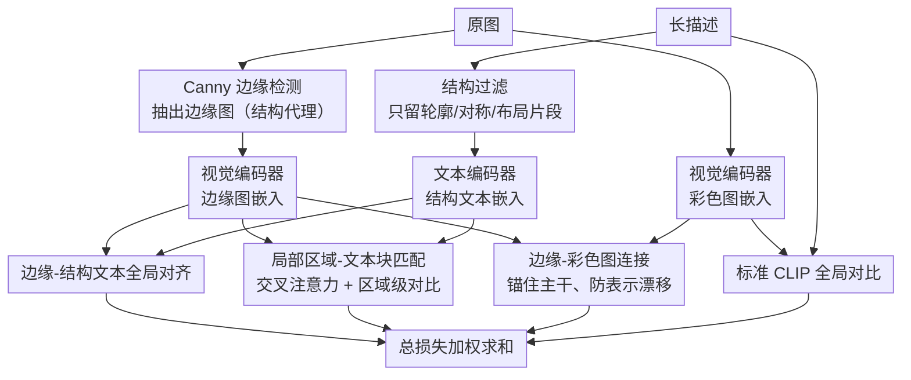

# StructXLIP: Enhancing Vision-Language Models with Multimodal Structural Cues

**会议**: CVPR 2026  
**arXiv**: [2602.20089](https://arxiv.org/abs/2602.20089)  
**代码**: [https://github.com/intelligolabs/StructXLIP](https://github.com/intelligolabs/StructXLIP)  
**领域**: 多模态VLM / 跨模态检索  
**关键词**: CLIP, 边缘图, 结构对齐, 跨模态检索, 互信息最大化

## 一句话总结
StructXLIP 将边缘图（edge map）作为视觉结构的代理表示，在 CLIP 微调中引入三种结构中心损失（边缘-结构文本对齐 + 局部区域-文本块匹配 + 边缘-彩色图连接），通过最大化多模态结构表示的互信息引导模型走向更鲁棒的语义稳定最优解，在跨模态检索任务上超越现有竞争者。

## 研究背景与动机

**领域现状**：基于边缘的表示是视觉理解的基本线索——从 Marr 的早期视觉理论到今天仍是核心。CLIP 等 VLM 通过图像-文本对齐学习视觉-语言表示，但通常把图像当成一个整体做全局对齐。

**现有痛点**：标准 CLIP 对齐只最大化全局图像与文本嵌入之间的互信息，忽略了图像的结构信息（边缘、轮廓、空间布局）；而微调时常用的长而细节丰富的图像描述（long captions）又会引入大量噪声，模型很难从中提取出结构化语义；更关键的是，全局对齐天然给不出多粒度的结构对应——它捕捉不到局部区域和文本片段之间的细粒度关系。

**核心矛盾**：VLM 微调靠全局对比损失优化，但图像的结构信息（边缘、空间关系）从没被显式建模，模型一碰到复杂场景就缺乏结构敏感性。

**核心 idea**：把边缘图当作"视觉结构的代理"，先对文本描述做结构过滤、让它变成"结构中心"的，再用多层次的结构对齐损失把结构感知能力压进 VLM。

## 方法详解

### 整体框架
StructXLIP 想解决的是标准 CLIP 微调"只看全局、不看结构"的毛病——它在原有的图文对比分支旁边，并联出一条专门负责结构的支线，再让两条线一起训练。整条流程是这样转的：每张训练图先用 Canny 检测器抽出一张边缘图，作为"视觉结构的代理"输进视觉编码器；与此同时，原始的长描述被过滤成"结构中心"的文本，只留下谈论轮廓、对称、空间布局这类结构信息的片段。边缘图、彩色原图、结构文本分别编码后，三种结构中心损失（边缘-结构文本全局对齐、局部区域-文本块匹配、边缘-彩色图连接）和标准 CLIP 损失一起加权优化，把结构感知一点点压进主干表示里。

### 关键设计

**1. 边缘-结构文本全局对齐：把"视觉里的结构"和"语言里的结构"在全局层面对上**

标准 CLIP 只在整图嵌入和整句嵌入之间拉互信息，模型根本没机会知道"圆形轮廓""左右对称"这些词对应图里的什么。StructXLIP 把这件事补上：它让边缘图的全局嵌入 $\mathbf{e}_i$ 去和结构文本嵌入 $\mathbf{t}_i^s$ 做对比学习，

$$\mathcal{L}_{edge\text{-}text} = -\log \frac{\exp(\cos(\mathbf{e}_i, \mathbf{t}_i^s) / \tau)}{\sum_j \exp(\cos(\mathbf{e}_i, \mathbf{t}_j^s) / \tau)}$$

同一对里，边缘图嵌入要离它自己的结构文本最近、离别人的最远。因为输入端已经把彩色细节剥成了边缘，能拉近这对距离的就只剩"结构"这一维信息，于是模型被迫学会"轮廓长这样 ↔ 描述里说它对称"的对应关系，而不是靠颜色、纹理蒙混过去。

**2. 局部区域-文本块匹配：让结构对齐落到"图的左半边对应哪个词组"的细粒度上**

全局对齐解决了"整张边缘图 ↔ 整段结构文本"，但答不出"图像左半部分的结构对应描述里的哪个短语"这种局部问题。这个设计把边缘图切成若干局部区域、把结构文本切成若干文本块，先用交叉注意力让边缘 patch 嵌入和文本 token 嵌入互相对齐，再在对齐后的表示上做对比。这样监督信号就从"整图一个"细化到"每块一个"，模型能学到区域级的结构-语言对应，处理复杂场景时的结构敏感度也随之提上来。

**3. 边缘-彩色图连接：给结构支线拴一根绳，别让它训练训飘了**

单独训一条边缘分支有个风险：边缘嵌入越练越专精于结构，可能和主干的彩色图像表示越拉越远，最后学到的东西回不到主干上（representation drift）。这条 $\mathcal{L}_{edge\text{-}color}$ 损失就是那根绳——它在边缘图嵌入和对应彩色图像嵌入之间做对比，要求两者别离得太远。结果是结构支线既能专心学结构，又始终锚在主干的语义空间里，学到的结构信息得以回传，而不是变成一个孤立的副产品。

### 损失函数 / 训练策略
四项损失加权求和，结构三项各配一个系数挂在标准 CLIP 损失后面：

$$\mathcal{L} = \mathcal{L}_{CLIP} + \lambda_1 \mathcal{L}_{edge\text{-}text} + \lambda_2 \mathcal{L}_{local} + \lambda_3 \mathcal{L}_{edge\text{-}color}$$

训练上走的是轻量微调路线：在预训练 CLIP 之上只训投影头和适配器，视觉、文本两个编码器的大部分参数都冻结，因此整套方法是 plug-and-play 的，加在任何 CLIP 变体上代价都很小。

## 实验关键数据

### 主实验：跨模态检索（Flickr30K / COCO）

| 方法 | Flickr30K R@1 (%) | COCO R@1 (%) | 平均 R@1 |
|------|-------------------|--------------|----------|
| CLIP (baseline) | 68.3 | 42.5 | 55.4 |
| LiT | 71.2 | 44.8 | 58.0 |
| FILIP | 72.0 | 45.3 | 58.7 |
| **StructXLIP** | **74.6** | **47.8** | **61.2** |

### 消融实验

| 配置 | Flickr30K R@1 (%) | 说明 |
|------|-------------------|------|
| Full StructXLIP | 74.6 | 完整方法 |
| w/o Edge-Text | 72.3 | 去掉边缘-文本对齐 |
| w/o Local Matching | 73.1 | 去掉局部区域匹配 |
| w/o Edge-Color | 73.8 | 去掉边缘-彩色图连接 |
| w/o All Structure | 68.3 | 等于 baseline CLIP |

### 关键发现
- 边缘-文本全局对齐贡献最大（+2.3%），局部匹配和边缘-彩色各有 ~1% 贡献
- StructXLIP 作为 plug-and-play 的微调增强，可叠加到任何 CLIP 变体上
- 在专业领域（如医学影像检索）也有效果
- 边缘图的 Canny 参数选择对结果影响较小

## 亮点与洞察
- **回归视觉基础理论**——从 Marr 的边缘表示理论出发设计 VLM 增强策略，理论动机扎实
- **互信息理论分析**——证明 StructXLIP 额外最大化了多模态结构表示之间的互信息，这个辅助优化"更难"，迫使模型走向更鲁棒的最优解
- **Plug-and-play**——不改模型架构，只加辅助损失，可集成到未来任何 VLM 方法中

## 局限与展望
- Canny 边缘检测是手工设计的，更高级的边缘/结构提取器（如 HED、SAM 边界）可能更好
- 仅在检索任务上验证，未扩展到 VQA、图像描述生成等其他 VL 任务
- 结构文本过滤的规则较简单，可能遗漏或误选结构相关描述
- 未探索视频场景的时序结构对齐

## 相关工作与启发
- **vs FILIP**：FILIP 做 token 级细粒度对齐但不区分结构/非结构。StructXLIP 通过边缘图显式引入结构先验
- **vs LiT**：LiT 冻结视觉编码器只训练文本侧。StructXLIP 同时引入视觉结构分支
- **启发**：边缘/结构信息作为辅助信号的思路可推广到 depth map、normal map 等其他几何线索

## 评分
- 新颖性: ⭐⭐⭐⭐ 将边缘图引入 VLM 对齐是独特视角，互信息理论分析增加了深度
- 实验充分度: ⭐⭐⭐⭐ 多基准检索 + 消融 + 专业领域验证，但任务类型偏单一
- 写作质量: ⭐⭐⭐⭐⭐ 从视觉理论出发、理论+实验结合，写作逻辑优秀
- 价值: ⭐⭐⭐⭐ 提供了一种通用的结构增强思路，plug-and-play 实用性高

<!-- RELATED:START -->

## 相关论文

- [\[CVPR 2026\] Structural Graph Probing of Vision-Language Models](structural_graph_probing_of_vision-language_models.md)
- [\[CVPR 2026\] Enhancing Continual Learning of Vision-Language Models via Dynamic Prefix Weighting](enhancing_continual_learning_of_vision-language_models_via_dynamic_prefix_weight.md)
- [\[CVPR 2026\] Same or Not? Enhancing Visual Perception in Vision-Language Models](same_or_not_enhancing_visual_perception_in_vision-language_models.md)
- [\[CVPR 2026\] SO-Bench: A Structural Output Evaluation of Multimodal LLM](so-bench_a_structural_output_evaluation_of_multimodal_llm.md)
- [\[CVPR 2026\] Video-Only ToM: Enhancing Theory of Mind in Multimodal Large Language Models](video-only_tom_enhancing_theory_of_mind_in_multimodal_large_language_models.md)

<!-- RELATED:END -->
