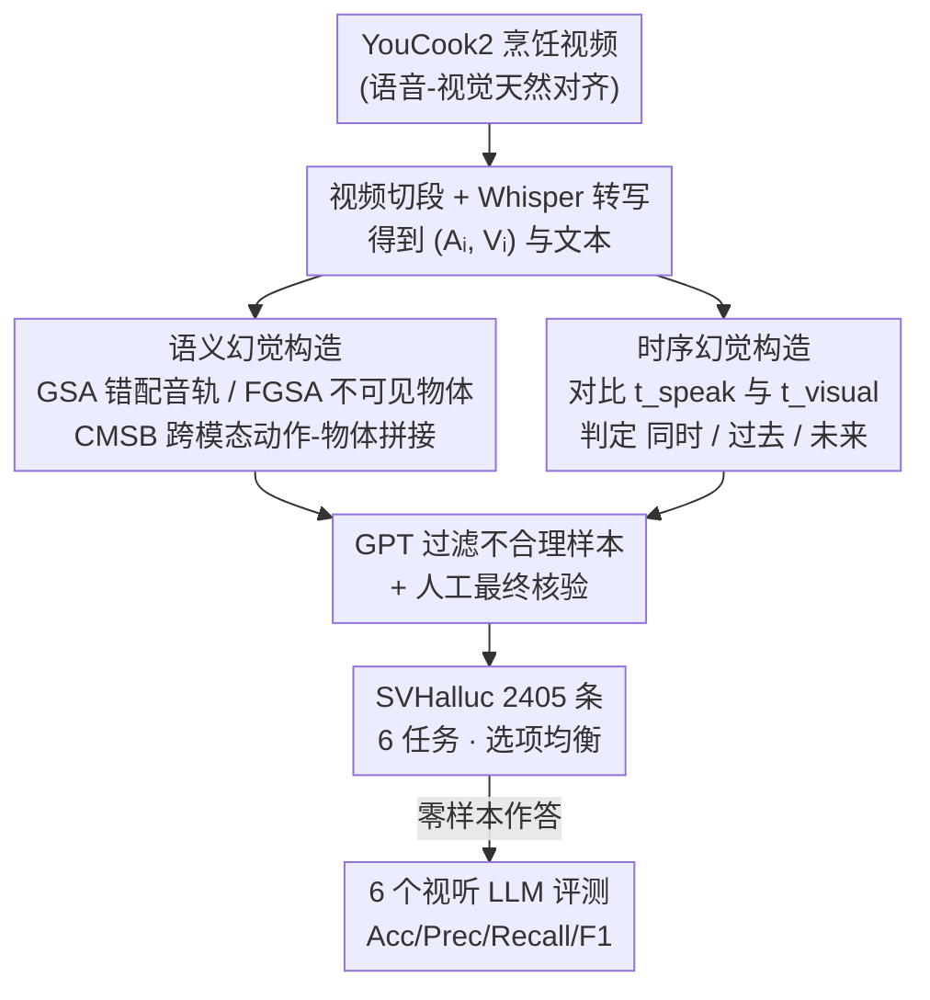

# SVHalluc: Benchmarking Speech-Vision Hallucination in Audio-Visual Large Language Models

**会议**: CVPR 2026  
**arXiv**: [2606.02642](https://arxiv.org/abs/2606.02642)  
**代码**: 项目页 https://chenshuang-zhang.github.io/projects/svhalluc/ （未见开源代码仓库）  
**领域**: 多模态VLM / 幻觉评测  
**关键词**: 语音-视觉幻觉、视听LLM、跨模态对齐、时序理解、Benchmark

## 一句话总结
SVHalluc 是首个系统评测「视听大模型能否把**语音内容**与对应视觉信号对齐」的 benchmark，从语义和时序两个维度各设计 3 个由粗到细的任务（共 6 个、2405 条样本），实验揭示当前开源视听 LLM 在多数任务上接近随机猜测，而 Gemini 2.5 Pro 大幅领先——根因不是单模态感知差，而是跨模态整合能力缺失。

## 研究背景与动机
**领域现状**：视听大语言模型（audio-visual LLM，如 Qwen3-Omni、VideoLLaMA 2、Gemini 2.5 Pro）能同时处理视频和音频，被寄望于真实世界的多模态理解。但和所有 MLLM 一样，它们会产生「看似合理却没有根据」的输出，即幻觉（hallucination）。

**现有痛点**：现有的视听幻觉 benchmark（AVHBench、AV-Odyssey 等）几乎都只用**环境声**（狗叫、警笛）作为「某事件是否发生」的指示器，把视听理解退化成「音频里狗在叫吗？」「听到警笛时人在干什么？」这类问题。这有两个根本缺陷：① 环境声只能指示一个简单事件的发生，语义贫乏；② 环境声只标记「当下这一刻」，无法描述过去/未来。

**核心矛盾**：人类**语音**承载的信息和环境声完全不同——语音内容无法被概括成「有人在说话」这一句话，它可能是指令、可能是无关闲聊，可能在描述当下、也可能在讲过去或未来发生的事。这种「语音内容 ↔ 视觉场景」之间复杂的语义和时序关系，恰恰是现有 benchmark 完全忽略的盲区，也是新的幻觉来源。

**本文目标**：构造一个能系统诊断「语音诱导的视觉幻觉」的评测，回答两个问题——模型能否找到语音内容与视觉证据的**语义对应**（而不是凭空脑补不存在的实体）？模型能否判断语音所述事件**何时**在画面中发生（同时/过去/未来，而不是把事件幻觉到错误时间）？

**切入角度**：作者观察到语音相比环境声多了「丰富语义」和「时序结构」两个维度，于是把语音-视觉幻觉正交拆成**语义幻觉**和**时序幻觉**两条主线，每条再设计由粗到细的三个任务，形成可逐层定位失败模式的诊断套件。

**核心 idea**：用「错配/跨模态绑定」的可控样本，逼模型在语音和视觉冲突时做出判断，从而暴露它「默认语音描述了画面」的对齐偏置（alignment bias）。

## 方法详解

### 整体框架
SVHalluc 本质是一个 benchmark，由两部分构成：**任务体系**（评什么）和**数据构造流水线**（怎么造样本）。任务体系沿两个互补维度展开——语义幻觉（speech 内容是否被视觉证据支持）和时序幻觉（speech 所述事件相对说话时刻发生在何时），每个维度下设 3 个由粗到细（coarse-to-fine）的诊断任务，共 6 个任务、2405 条视频-问题对。所有任务统一成两选/多选的问答格式，模型零样本作答。

数据构造是一条「以原始对齐的语音-视频对为正样本、通过受控扰动生成负样本」的自动化流水线，配合 GPT 过滤和人工核验保证质量。整条流水线从 YouCook2 烹饪视频出发：切段 → Whisper 转写 → 针对每个任务用不同的扰动策略造正/负样本 → GPT 过滤不合理样本 → 人工最终核验。

### 关键设计

**1. 语义幻觉的三个由粗到细任务：从「整段对不对」逼到「跨模态乱绑」**

语义维度要回答「语音说的内容，视觉里到底有没有」。作者设计三层递进的两选任务。**GSA（Global Semantic Alignment，全局语义对齐）**问「这段语音是否描述了视频里的视觉事件？」，正样本是 YouCook2 原始对齐对 $(A_i, V_i)$，负样本是把另一个视频 $j$ 的音频 $A_j$ 配到当前视频 $V_i$ 上、形成被破坏的 $(A_j, V_i)$——哪怕语音在讲煮面、画面在煎肉饼这种明显冲突，也考模型敢不敢说「不对齐」。**FGSA（Fine-Grained Semantic Alignment，细粒度语义对齐）**把粒度降到物体级，问「视频里能看到 [object] 吗？」，正样本填可见物体、负样本填「语音提到但画面看不到」的物体，专测模型会不会把听到的实体脑补成可见。**CMSB（Cross-Modal Semantic Binding，跨模态语义绑定）**最难，问「视频里能看到 [event] 吗？」，其中的 event 是用 GPT 抽取的「语音里的动作 + 视觉里的物体」或「视觉里的动作 + 语音里的物体」这种交叉组合（再用 GPT 过滤掉不现实的组合），这些事件在画面里从未真正发生，正确答案恒为「no」——模型若答「yes」，说明它把语音和视觉碎片错误绑定，幻觉出了不存在的复合事件。

**2. 时序幻觉的三个由粗到细任务：用「说话时刻 vs 事件可见时刻」诊断时间错位**

时序维度要回答「语音说的事，相对说话那一刻，在画面里是同时/过去/未来发生」。作者对每条样本标注两个时间锚点：说话时刻 $t_{speak}$ 与所述事件在画面中真正发生的时刻 $t_{visual}$；若两者接近则判为「时序对齐（present）」，$t_{visual}$ 远小于 $t_{speak}$ 判为「过去」、远大于判为「未来」。基于此设三任务：**TA（Temporal Alignment）**两选问「听到语音时，所述事件是否正在同步发生？」；**TF（Temporal Forecasting）**三选问「相对说话时刻，所述事件发生在 (A)过去 (B)现在 (C)未来？」，进一步考细粒度时间推理；**CMTB（Cross-Modal Temporal Binding，跨模态时序绑定）**多选问「听到语音时画面里在发生什么视觉动作？」，三个选项分别是「语音提到但发生在别的时间的事件（干扰）」「说话时画面真正在发生的事件（正确）」「来自其他视频的干扰事件」——这里语音故意充当干扰项，考模型在语音描述异时事件时，能否仍锚定到当前可见动作而不被带偏。

**3. 「正样本=原始对齐对、负样本=受控扰动」的自动化构造 + GPT/人工双重质控**

整个 benchmark 的可信度建立在样本构造上。素材取自 YouCook2 验证集（解说与画面动作天然对齐），按标注切成 procedure 片段，用 Whisper 做 ASR 拿到语音转写。正样本直接用原始对齐对；负样本则按任务定制扰动：GSA 换音轨、FGSA 填不可见物体、CMSB 做跨模态动作-物体拼接、时序任务则靠 $t_{speak}$ 与 $t_{visual}$ 的远近自动打标。GPT 在两处发力——抽取可见/不可见物体与动作、过滤不合理组合和劣质样本（如语音过短或不清晰描述场景）；最后再加 human-in-the-loop 人工核验。每个任务的选项数量做了**均衡**（option-balanced），并报告随机猜测基线作参照，保证「接近随机」这一结论是公平的。

### 损失函数 / 训练策略
本文是纯 benchmark 工作，所有模型均**零样本**评测，不涉及训练。评测指标：两选任务报 Accuracy、Precision、Recall、F1（以「yes」为正类），其中 $\text{Accuracy} = \frac{\text{预测正确数}}{\text{总样本数}}$、$\text{F1} = \frac{2 \cdot P \cdot R}{P + R}$；多选任务报 Accuracy。分析实验额外用 WER（词错误率）、WIP（词信息保留率）评 ASR 能力，用 mIoU 评语音段时间定位能力。

## 实验关键数据

### 主实验
评测 6 个视听 LLM（开源 Qwen3-Omni / Qwen2.5-Omni / video-SALMONN 2 / VideoLLaMA 2 + 商用 Gemini 2.5 Pro，含 video-SALMONN）。下表为语义幻觉准确率（Acc，%）：

| 模型 | GSA | FGSA | CMSB |
|------|-----|------|------|
| Gemini 2.5 Pro | **93.10** | **86.06** | **78.56** |
| video-SALMONN | 52.05 | 49.84 | 61.10 |
| video-SALMONN 2 | 53.92 | 79.58 | 72.77 |
| VideoLLaMA 2 | 50.00 | 67.57 | 73.03 |
| Qwen2.5-Omni | 77.70 | 81.08 | 72.28 |
| Qwen3-Omni | 55.10 | 79.50 | 74.34 |
| 随机猜测 | 50.00 | 50.00 | 50.00 |

时序幻觉准确率（Acc，%；TF/CMTB 为多选）：

| 模型 | TA | TF | CMTB |
|------|-----|-----|------|
| Gemini 2.5 Pro | **85.17** | **53.89** | **69.25** |
| video-SALMONN | 50.00 | 32.81 | 37.39 |
| video-SALMONN 2 | 50.00 | 33.33 | 48.58 |
| VideoLLaMA 2 | 50.00 | 32.25 | 45.72 |
| Qwen2.5-Omni | 50.27 | 31.52 | 53.10 |
| Qwen3-Omni | 51.11 | 30.60 | 61.75 |
| 随机猜测 | 50.00 | 33.33 | 33.33 |

关键结论：① 开源模型在 GSA、TA、TF 上几乎贴着随机线，多个模型在 GSA 上 recall 接近 100% 但 precision 低，说明它们**默认「语音描述了画面」**（高对齐偏置），即便语音和视频明显冲突也答「对齐」；② Gemini 2.5 Pro 在所有任务上大幅领先（GSA 93.10%），既证明 benchmark 可解、又暴露开源与商用模型的巨大鸿沟；③ TF 三选任务对所有开源模型都是重灾区，全部低于或接近 33.3% 随机线。

### 消融实验
作者用 Qwen3-Omni 在不同输入条件下做分析（Acc，%）：

| 配置 | 语义平均 | 时序平均 | 说明 |
|------|---------|---------|------|
| 原始 Qwen3-Omni | 69.64 | 47.82 | 完整视频+音频 |
| + 语音转写文本 | 70.94 | 44.49 | 把 Whisper 转写拼进文本输入 |
| 仅视频输入 | 73.92 | 43.55 | 去掉音频 |
| 仅音频输入 | 60.03 | 41.80 | 去掉视频 |
| 随机猜测 | 50.00 | 38.88 | — |

### 关键发现
- **失败根因不是单模态感知**：Qwen3-Omni 在 SVHalluc 上的 ASR 词错误率仅 0.0915、WIP 高达 0.8863，说它「听得清」；语音段时间定位 mIoU 达 0.8844，说它「知道何时在说话」。两个单模态能力都很强，但跨模态整合仍崩——这把矛头精准指向「跨模态对齐」而非感知。
- **加语音转写文本是把双刃剑**：在 FGSA、CMSB 上提分（语音以文本形式更易被 LLM 理解），但在 CMTB 上**反而掉点**——因为 CMTB 里语音本就是描述异时事件的干扰项，把它显式喂成文本会加剧时序幻觉；GSA/TA/TF 几乎不变，说明这些任务的难度超出了「能不能识别语音」本身。
- **单模态消融暴露依赖关系**：仅视频输入时 FGSA、CMSB 反而变好（语音在这些任务里是干扰），但 CMTB 掉点（时序定位离不开语音）；GSA、TA、TF 去掉任一模态影响都很小——恰恰说明模型根本没在做语音-视觉对齐，而是各看各的。

## 亮点与洞察
- **把「语音」从环境声里拎出来当一等公民**：这是 benchmark 设计上的关键洞察——语音的语义不可被「有人在说话」概括，且天然带过去/现在/未来的时间指向，于是幻觉模式比环境声丰富得多。语义×时序的正交拆解干净且可诊断。
- **CMSB / CMTB 的「跨模态绑定」设计很巧**：用「语音动作 + 视觉物体」的交叉拼接造出物理上从未发生的事件，正确答案恒为「no」，直接量化模型「把碎片乱绑」的幻觉倾向；CMTB 让语音充当时序干扰项，把「会不会被语音带偏」做成可测指标。这套「受控冲突」思路可迁移到任意需要测跨模态对齐的场景。
- **「单模态强 ≠ 跨模态强」被实测坐实**：ASR 准、VAD 准、却整合失败，这条诊断链（分别拆出感知能力再排除）很有说服力，给后续「该改哪里」指了明路——问题在模态融合层，不在编码器。
- **高 recall + 低 precision = 对齐偏置**的诊断很犀利：它把「模型默认信任语音」这一隐性 bug 用 P/R 分解显式量化出来。

## 局限性 / 可改进方向
- **数据域单一**：全部样本来自 YouCook2 烹饪视频，场景、动作、物体分布偏窄，结论能否推广到对话、体育、户外等场景未知。
- **伪标签依赖**：负样本构造、可见/不可见物体抽取大量依赖 GPT，ASR 用 Whisper、时间锚点和 VAD 用 Silero 做伪真值——这些工具自身的误差会传导进 benchmark，作者虽加了人工核验但规模未充分披露。
- **只诊断不开药**：本文系统性地揭示了失败，但没有提出缓解方法（如训练策略或推理时对齐机制），「怎么修」留给未来。
- **时序判定阈值偏经验**：$t_{speak}$ 与 $t_{visual}$「接近/远离」的划分标准依赖经验设定，过去/现在/未来的边界可能影响 TF/TA 的难度，缺少对阈值敏感性的分析。

## 相关工作与启发
- **vs AVHBench / AV-Odyssey / 环境声类 benchmark**：它们用环境声指示单一事件发生，问题简单（「狗在叫吗」「警笛响时人在干嘛」），只覆盖有限语义且只标记当下时刻；本文换成语音内容，引入丰富语义 + 过去/现在/未来时序，暴露了前者完全捕捉不到的幻觉模式。
- **vs AVTrustBench / WorldSense**：AVTrustBench 关注鲁棒性（对抗、组合推理、识别「无正确选项」），WorldSense 测综合全模态理解；本文聚焦更窄但更根本的问题——**语音-视觉对齐**，并提供逐层诊断而非综合打分。
- **vs POPE / BEAF / CIEM 等视觉-语言幻觉 benchmark**：那些只测图像里物体是否存在（视觉幻觉）；本文把幻觉问题扩展到「语音内容 ↔ 视觉」的跨模态对齐，是幻觉评测在视听场景的自然延伸。
- **启发**：「单模态能力拆解 + 受控跨模态冲突样本」这套诊断方法论，可直接复用于其他多模态对齐评测（如图-文时序、视频-字幕一致性）；高 recall/低 precision 作为「盲目信任某一模态」的探针也很通用。

## 评分
- 新颖性: ⭐⭐⭐⭐⭐ 首个语音-视觉幻觉 benchmark，把语音从环境声里独立出来并正交拆成语义×时序，盲区填得准。
- 实验充分度: ⭐⭐⭐⭐ 覆盖 6 个主流模型 + 三层诊断 + 单模态消融与伪标签验证，链条完整；但数据域仅 YouCook2、缺缓解方法。
- 写作质量: ⭐⭐⭐⭐⭐ 动机层层递进，任务定义清晰，由粗到细的结构便于读者复述失败模式。
- 价值: ⭐⭐⭐⭐⭐ 揭示了开源视听 LLM「单模态强、跨模态崩」的根本短板，对安全应用和后续模型改进有直接指导意义。

<!-- RELATED:START -->

## 相关论文

- [\[CVPR 2026\] AV-Reasoner: Improving and Benchmarking Clue-Grounded Audio-Visual Counting for MLLMs](av-reasoner_improving_and_benchmarking_clue-grounded_audio-visual_counting_for_m.md)
- [\[CVPR 2026\] Benchmarking Single-Factor Physical Video-to-Audio Generation](benchmarking_single-factor_physical_video-to-audio_generation.md)
- [\[CVPR 2026\] GraphVLM: Benchmarking Vision Language Models for Multimodal Graph Learning](graphvlm_benchmark_vlm_graph_learning.md)
- [\[NeurIPS 2025\] Watch and Listen: Understanding Audio-Visual-Speech Moments with Multimodal LLM](../../NeurIPS2025/multimodal_vlm/watch_and_listen_understanding_audio-visual-speech_moments_with_multimodal_llm.md)
- [\[CVPR 2026\] FAVE: A Structured Benchmark for Fine-Grained Audio-Visual Temporal Evaluation in Multimodal LLMs](fave_a_structured_benchmark_for_fine-grained_audio-visual_temporal_evaluation_in.md)

<!-- RELATED:END -->
