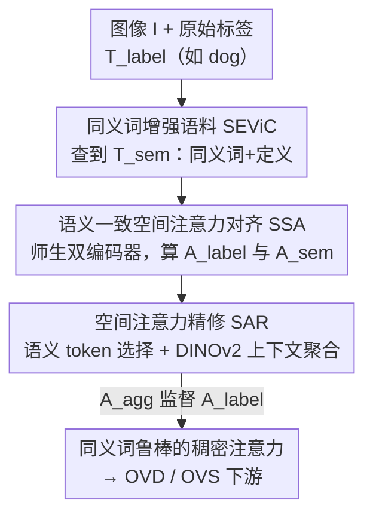

# SynCLIP: Synonym-Coherent Language-Image Pretraining for Robust Open-Vocabulary Dense Perception

**会议**: CVPR 2026  
**论文**: [CVF Open Access](https://openaccess.thecvf.com/content/CVPR2026/html/Xie_SynCLIP_Synonym-Coherent_Language-Image_Pretraining_for_Robust_Open-Vocabulary_Dense_Perception_CVPR_2026_paper.html)  
**代码**: https://github.com/Justlovesmile/SynCLIP  
**领域**: 多模态VLM  
**关键词**: 开放词汇感知, CLIP, 同义词鲁棒性, 空间注意力对齐, 视觉基础模型

## 一句话总结
SynCLIP 发现现有 CLIP 类开放词汇密集感知方法存在「同义词导致的定位不一致」——同一物体换个近义说法，空间注意力就会漂移；它用一个「同义词→原标签」的空间注意力对齐损失（SSA）加上借助 DINOv2 做语义 token 选择与上下文聚合的注意力精修（SAR），在 OV-COCO/OV-LVIS 上既刷到 CLIP 类 SOTA，又把换近义词时的掉点从 ~9 AP 压到 4.4 AP。

## 研究背景与动机
**领域现状**：开放词汇密集感知（Open-Vocabulary Dense Perception, OVDP，涵盖开放词汇检测 OVD 与分割 OVS）靠文本表达来表示类别，从而识别/定位训练时没见过的新类。主流做法是把 CLIP 这类在大规模图文对上预训练的 VLM 的全局图文对齐迁移到区域级，让视觉区域和类别文本对上号，代表工作有 CLIPSelf、CLIM、DeCLIP 等。

**现有痛点**：这些方法只关注「区域↔文本」对齐，却忽略了一个真实部署中很要命的问题——**同义词导致的定位不一致**（synonym-induced grounding inconsistency）。同一个物体，用 "zebra"、"striped horse"、"hippotigris" 这些语义等价的说法去描述，模型产生的空间注意力分布会差异巨大，注意力被引到不同区域。论文实测：把 OV-COCO 上 F-ViT 的类别名换成同义词，novel 类 AP 直接大幅下滑。

**核心矛盾**：CLIP 的全局表征很强但缺乏局部区域表征能力，注意力容易跑到无关区域；区域级对齐方法（如 DeCLIP）缓解了局部对齐，但**仍没有任何机制约束「不同说法要给出一致的注意力」**。换句话说，现有训练目标里根本没有「同义词不变性」这一项。

**本文目标**：让 OVDP 在语言表达多样化（同义词、定义性长描述）的真实场景下也能稳定定位，即获得 synonym-robust grounding 能力。

**切入角度**：作者观察到，语义更丰富的「同义词+定义」拼起来的表达，其注意力图反而**更准更稳**，可以当作「老师」去校准原始单标签（如 "dog"）那张容易漂移的注意力图。

**核心 idea**：构造同义词增强语料，用「丰富表达的注意力」对齐「原始标签的注意力」来强制同义词一致性（SSA），再借视觉基础模型的空间上下文把对齐后的注意力精修锐化（SAR）。

## 方法详解

### 整体框架
SynCLIP 基于 DeCLIP 框架，在预训练阶段插入两个模块协同工作：**SSA（语义一致空间注意力对齐）** 负责让「原标签」与「同义词增强表达」产生的注意力图趋于一致，**SAR（空间注意力精修）** 负责把增强表达那张注意力进一步锐化成更精确的监督信号。整条流水线的输入是一张图 $I$ 加上一组原始类别标签 $T_{label}$；先从预先构建的同义词语料 SEViC 里查到对应的同义词增强表达 $T_{sem}$（例如 "dog" → "dog, puppy, canine, a common domesticated carnivorous mammal ..."）；图像分别过「学生」视觉编码器 $F_v$ 和冻结的「老师」$F_v^*$ 得到稠密特征，文本过冻结的 CLIP 文本编码器；两路文本各自和视觉特征算出注意力图 $A_{label}$、$A_{sem}$；SAR 借 DINOv2 把 $A_{sem}$ 精修聚合成 $A_{agg}$；最后用 $A_{agg}$ 去监督 $A_{label}$，逼学生在「单标签输入」下也产出和「丰富表达」一样准、一样稳的注意力。

### 关键设计

**1. SEViC 同义词增强语料：给「同义词不变性」造训练数据**

SSA 要对齐「原标签」和「丰富表达」，前提是先有足够多样的同义表达，于是作者先造了 SEViC（Synonym-Enriched Visual Corpus）。它建在 COCO2017 训练图像上，把 COCO 与 LVIS 的类别名合并成 1,232 个类（再加 "object"、"background" 两个 meta 类表示全局语义），每个类用 LVIS 自带的同义词与定义、并用 LLM（如 DeepSeek）自动生成多个同义词和简短定义，全部经 LLM 一致性校验过滤。最终是 118,287 张图、1,234 个类、11,558 条语义增强表达的图文语料。它的价值不在算法本身，而在于把「同义说法应当指同一物体」这条监督信号变成了可学的数据——没有它，后面的对齐损失无米下锅。

**2. SSA 语义一致空间注意力对齐：用「丰富表达」当老师校准「单标签」的漂移**

这一步直接针对「同义词换说法注意力就漂」的痛点。SSA 采用**师生双视觉编码器**：学生 $F_v$ 与其冻结副本老师 $F_v^*$ 各自抽稠密特征 $X_{dense}=F_v(I)$、$X^*_{dense}=F_v^*(I)$。原标签文本 $t_{label}$ 与增强表达文本 $t_{sem}$（均由冻结 CLIP 文本编码器得到）分别与视觉特征做余弦相似度，得到两张注意力图

$$A_{label}=\frac{t_{label}\,X_{dense}^\top}{\|t_{label}\|\cdot\|X_{dense}\|},\qquad A_{sem}=\frac{t_{sem}\,{X^*_{dense}}^\top}{\|t_{sem}\|\cdot\|X^*_{dense}\|}.$$

其中稠密特征 $X_{dense}$ 来自把视觉编码器最后一层注意力替换为「相关性自注意力」$\text{Attn}_{csa}=\text{SoftMax}(qq^\top/\tau)+\text{SoftMax}(kk^\top/\tau)$（温度 $\tau=\sqrt{d}$）后去掉 [CLS] token 的结果。语义对齐损失就是逐元素 L2 拉近两张图：$\mathcal{L}_{semantic}=\frac{1}{nm}\sum_{i,j}\|A_{label}^{i,j}-A_{sem}^{i,j}\|_2$。因为「同义词+定义」拼出来的丰富表达注意力本就更准更稳，把它当参考来约束单标签，就把语言多样性引起的注意力漂移压了下去。

**3. SAR 空间注意力精修：借 DINOv2 把对齐目标从「稳」变「又稳又准」**

SSA 只解决了一致性，但增强表达带来的冗余信息会让注意力不够精确（消融里单用 SSA 几乎不涨点），SAR 来补这一刀，分两步。第一步**语义 token 选择**：从增强表达的注意力 $A_{sem}$ 里挑出每条表达 attention 分数最高的 top-$k$ 个 token 索引 $\mathcal{K}=\text{TopK}(A_{sem},k)$，作为最具语义代表性的空间位置。第二步**上下文感知聚合**：用一个预训练 VFM（DINOv2）抽稠密特征 $X^{VFM}_{dense}$，对每个被选 token 与全图 token 算余弦相似 $s_{i,j}=\frac{x_i\cdot x_j}{\max(\|x_i\|\|x_j\|,\epsilon)}$，得到 $k$ 张空间相关图，再对 $k$ 张取均值聚成 $A_{spa}$。最后把语义注意力与空间相关注意力线性融合 $A_{agg}=\alpha A_{spa}+\beta A_{sem}$（默认 $\alpha=\beta=0.5$），用它替换原来的 $A_{sem}$ 去监督：$\mathcal{L}^{+}_{semantic}=\frac{1}{nm}\sum_{i,j}\|A_{label}^{i,j}-A_{agg}^{i,j}\|_2$。这样 DINOv2 的空间上下文推理能力把注意力锐化到真正相关的区域，使监督目标既保留同义词语义、又有精确空间定位。$k$ 不是越大越好——取太多会引入无关线索（实验 $k=7$ 最优）。

### 损失函数 / 训练策略
最终训练目标在 DeCLIP 原有损失基础上加入精修后的语义对齐损失 $\mathcal{L}^{+}_{semantic}$，其默认权重 0.05。VFM 用 DINOv2，聚合系数 $\alpha=\beta=0.5$。4 卡、每卡 batch 8，AdamW，学习率 $2\times10^{-5}$，weight decay 0.1，训练 6 个 epoch。下游用 F-ViT 作 baseline，构成 F-ViT+SynCLIP。

## 实验关键数据

### 主实验
两个开放词汇 benchmark：OV-COCO（48 base / 17 novel 类，指标 $\text{AP}^{novel}_{50}$）与更难的 OV-LVIS（866 base / 337 rare 类，指标 mask $\text{mAP}^{mask}_r$）。SynCLIP 在 CLIP 类方法里取得 SOTA。

| 数据集 | 指标 | Backbone | 本文 SynCLIP | 之前 SOTA (DeCLIP) | 提升 |
|--------|------|----------|--------------|--------------------|------|
| OV-COCO | $\text{AP}^{novel}_{50}$ | ViT-B/16 | 43.6 | 41.1 | +2.5 |
| OV-COCO | $\text{AP}^{novel}_{50}$ | ViT-L/14 | 49.8 | 46.2 | +3.6 |
| OV-LVIS | $\text{mAP}^{mask}_r$ | ViT-B/16 | 27.8 | 26.8 | +1.0 |
| OV-LVIS | $\text{mAP}^{mask}_r$ | ViT-L/14 | 37.2 | 37.2 | 持平 |

### 同义词鲁棒性评测
把类别名换成同义词后看掉多少点，这是论文最核心的卖点——SynCLIP 掉点最少。

| 方法 | 原始 $\text{AP}^{novel}_{50}$ | 换同义词后 | 掉点 |
|------|------|------|------|
| F-ViT+CLIPSelf | 37.6 | 28.8 | −8.8 |
| F-ViT+DeCLIP | 41.0 | 31.5 | −9.5 |
| F-ViT+SynCLIP | 43.6 | 39.2 | **−4.4** |

base 类同样几乎不掉（−0.6 vs DeCLIP −2.2），说明一致性提升不是以牺牲 base 性能换来的。

### 消融实验
OV-COCO 上拆 SSA / SAR（baseline 即 DeCLIP）：

| SSA | SAR | $\text{AP}^{novel}_{50}$ | 说明 |
|-----|-----|------|------|
| ✘ | ✘ | 41.0 | baseline |
| ✔ | ✘ | 41.1 | 单用 SSA 几乎不涨（增强表达冗余信息干扰精度） |
| ✘ | ✔ | 42.2 | 单用 SAR 已明显提升 |
| ✔ | ✔ | 43.6 | 二者互补，最佳 |

### 关键发现
- **SAR 是涨点主力，但 SSA 不可省**：单用 SSA 仅 +0.1，单用 SAR +1.2，但只有两者合用才到 43.6——SSA 提供同义词一致性的「稳」，SAR 提供 DINOv2 上下文的「准」，互补缺一不可。
- **语义 token 数 $k$ 有甜点**：$k$ 从 1→7 时 $\text{AP}^{novel}_{50}$ 由 42.5 升到峰值 43.6，再增到 10、20 反而跌到 42.2、41.5——选太多 token 会引入无关线索污染空间定位。
- **难数据集增益收窄**：OV-LVIS ViT-L/14 上与 DeCLIP 持平（37.2），作者归因于 LVIS 细粒度长尾、词汇高度重叠，模型更易过拟合高频名词。⚠️ 在最大 backbone 的最难设定下，本文相对优势确实不明显。

## 亮点与洞察
- **问题发现本身就是贡献**：作者第一个明确指出并量化「同义词导致的定位不一致」，用「换个近义词 AP 掉 ~9」这个简单实验把痛点摆到台面上，比方法更值得记住。
- **「丰富表达当老师」的巧思**：不额外训练老师，而是利用「同义词+定义的长表达注意力天然更稳」这一现成性质，把它当作免费的对齐参考，思路很经济。
- **VFM 当空间先验的复用方式**：SAR 不让 DINOv2 参与梯度，只借它的空间相关性给注意力做上下文锐化，是一种轻量「即插即用蒸馏」，可迁移到任何需要把粗注意力锐化的密集预测任务。
- **同义词不变性可作为通用正则**：把「语义等价的不同输入应产生一致内部表征」做成对齐损失，这个范式可推广到 OCR、VQA、检索等任何受词汇变体困扰的多模态任务。

## 局限与展望
- 作者承认 OV-LVIS 这类细粒度长尾、词汇重叠严重的场景下增益有限（大 backbone 上仅与 DeCLIP 持平），同义词一致性对「本就高度近义」的密集类别帮助会被稀释。
- 方法强依赖 SEViC 同义词语料的质量，而语料由 LLM（DeepSeek）自动生成 + LLM 校验，⚠️ LLM 生成的同义词/定义若有噪声或偏置，会直接污染对齐目标，论文未深入分析这部分的失败案例。
- $\alpha,\beta$ 直接固定 0.5、$k=7$ 是 OV-COCO 上调出来的，跨数据集是否仍最优、对超参的鲁棒性论文主要放在附录，正文证据有限。
- 改进思路：让同义词增强表达的权重随类别难度自适应（高频近义类少对齐、稀有类多对齐），或把师生注意力对齐扩展到多尺度，可能缓解 LVIS 上的增益瓶颈。

## 相关工作与启发
- **vs DeCLIP**: DeCLIP 从 VFM 迁移空间相关模式做区域级上下文一致性，是本文的直接 baseline 与框架底座；SynCLIP 在其上补了「同义词一致性」这一 DeCLIP 完全没有的维度，因此换同义词时鲁棒性大幅领先（−4.4 vs −9.5）。
- **vs CLIPSelf / CLIM**: 二者用裁剪区域自蒸馏或伪区域 mosaic 对齐来增强区域级表征，但只对齐「区域↔单一文本」，没约束「不同文本说法之间」的一致性，所以同义词替换下掉点最多（CLIPSelf −8.8）。
- **vs ViLD / RegionCLIP / RO-ViT 等 OVD/OVS 主线**: 它们把 CLIP 文本嵌入当分类器或注意力 query 扩展到密集感知，关注的是「如何把 CLIP 用起来」，而 SynCLIP 关注的是「CLIP 在语言变体下不稳」这一被普遍忽视的鲁棒性问题，二者正交、可叠加。

## 评分
- 新颖性: ⭐⭐⭐⭐ 首次提出并量化同义词定位不一致问题，对齐+精修方案清晰但组件（师生对齐、VFM 蒸馏）多为已有思路重组
- 实验充分度: ⭐⭐⭐⭐ 两 benchmark + 专门的同义词鲁棒性评测 + 组件/超参消融较完整，但大 backbone 难数据集增益偏弱
- 写作质量: ⭐⭐⭐⭐ 动机用一张「换近义词掉点」图讲得很有说服力，方法与公式交代清楚
- 价值: ⭐⭐⭐⭐ 指出了 OVDP 真实部署的一个实际痛点，SEViC 语料与「同义词不变性」范式有复用价值

<!-- RELATED:START -->

## 相关论文

- [\[CVPR 2026\] Reconstructing CLIP for Open-Vocabulary Dense Perception](reconstructing_clip_for_open-vocabulary_dense_perception.md)
- [\[CVPR 2026\] Vocabulary Scaling Law: Tuning Open-vocabulary Predictors for Their Openness](vocabulary_scaling_law_tuning_open-vocabulary_predictors_for_their_openness.md)
- [\[CVPR 2026\] Concept-Aware Batch Sampling Improves Language-Image Pretraining](concept-aware_batch_sampling_improves_language-image_pretraining.md)
- [\[CVPR 2026\] Towards Open-Vocabulary Industrial Defect Understanding with a Large-Scale Multimodal Dataset](towards_open-vocabulary_industrial_defect_understanding_with_a_large-scale_multi.md)
- [\[CVPR 2026\] Improving Calibration in Test-Time Prompt Tuning for Vision-Language Models via Data-Free Flatness-Aware Prompt Pretraining](improving_calibration_in_test-time_prompt_tuning_for_vision-language_models_via_.md)

<!-- RELATED:END -->
