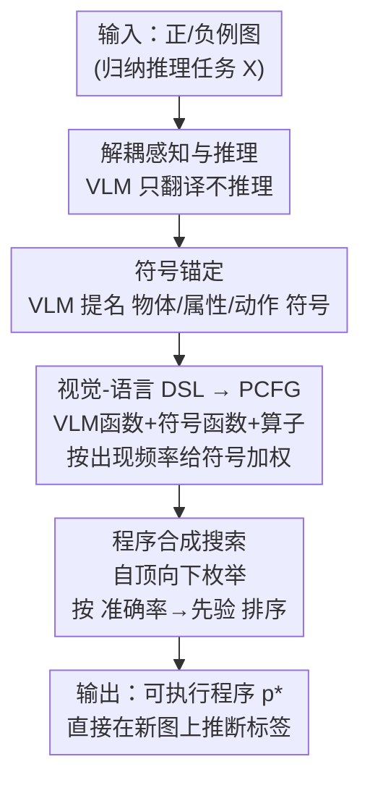

# Synthesizing Visual Concepts as Vision-Language Programs

**会议**: CVPR 2026  
**论文**: [CVF Open Access](https://openaccess.thecvf.com/content/CVPR2026/html/Wust_Synthesizing_Visual_Concepts_as_Vision-Language_Programs_CVPR_2026_paper.html)  
**代码**: 无（项目页 ml-research.github.io/vision-language-programs）  
**领域**: 多模态VLM / 神经符号  
**关键词**: 视觉-语言程序, 神经符号推理, 程序合成, 归纳视觉推理, 概率上下文无关文法

## 一句话总结
把 VLM 当成"感知函数"而不是"推理器"——让它从图像里抽出结构化符号描述，再用程序合成在一套领域专用语言上搜出一段可执行的逻辑程序来表达视觉规则，从而在归纳视觉推理任务上稳定超过直接 prompt VLM，且程序天然可解释、可人工修正。

## 研究背景与动机
**领域现状**：视觉-语言模型（VLM）在多模态任务上表现强，但在"系统性视觉推理"上反复翻车，尤其是**归纳推理**——给一组正例图、一组负例图，让模型总结出区分两者的规则（如 Bongard 任务）。VLM 常常给出一条违反约束的规则：论文 Fig.1 里 VLM 提出"包含蜡烛"，结果这条规则错误地满足了某张负例图。

**现有痛点**：两条已有路线都不够用。一是**测试时扩展**（让模型靠超长 chain-of-thought "想得更久"），既贵又容易陷入自相矛盾、重复循环；二是**神经符号方法**虽然能从样例归纳出可解释的逻辑程序，但它们要么依赖"显式 query 驱动程序生成"（只能做问答式推理，做不了纯归纳），要么依赖**领域专用的物体检测器/固定谓词词表**，换个视觉域就失效。

**核心矛盾**：感知的灵活性（VLM 强）和推理的系统性（符号程序强）被绑死在同一个模块里。VLM 把感知和推理混在一团黑箱里端到端做，于是感知错误和推理错误互相污染、还无法定位；而传统神经符号把推理做好了，却用僵硬的领域检测器把感知卡死了。

**本文目标**：在不训练、不依赖手工检测器的前提下，从少量带标签图像里归纳出既符合任务约束、又人类可读、还能直接在新图上执行的视觉规则。

**切入角度**：作者主张**把感知和推理解耦**——不让 VLM 去推理，只让它干自己最擅长的事：把图像翻译成结构化的符号描述（有哪些物体、属性、动作）。推理交给一套确定性的符号程序合成去做。

**核心 idea**：用 VLM 当"可调用的感知函数"嵌进一套领域专用语言（DSL），再用概率上下文无关文法 + 枚举搜索合成出最能区分正负例的可执行程序——即 **Vision-Language Programs (VLP)**。

## 方法详解

### 整体框架
VLP 的输入是一个归纳推理任务 $X=\{(I_1,y_1),\dots,(I_n,y_n)\}$（每张图配二值标签，$y_i=1$ 表示该图满足某条隐含视觉规则、$y_i=0$ 表示不满足），输出是一段可执行程序 $p^*$，它把任意新图映射为布尔预测 $\hat y = p^*(I)$。整条流水线**不训练**，三个阶段串行跑：先让 VLM 针对当前任务"提名"出相关的物体/属性/动作符号（符号锚定），再把这些符号 + 一套固定的函数原语组装成一个概率上下文无关文法（DSL→PCFG），最后在这个文法定义的程序空间里枚举搜索，挑出"在样例上准确率最高、且生成先验最大"的程序作为答案。

关键之处在于 VLM 只在前两步出现：它负责提名符号、并作为"VLM 函数"在执行时把图像翻译成结构化符号状态（如 `[[birthday cake], [candles, colorful]]`）；真正的逻辑组合与搜索完全是确定性符号过程。这样感知错误能被定位到具体某张图、某个函数输出，推理则保证语法合法、逻辑自洽。

### 关键设计

**1. 解耦感知与推理：让 VLM 当感知函数、不让它推理**

这是整篇论文的立身之本，直接针对"VLM 把感知与推理混在黑箱里互相污染"的痛点。VLP 不在 VLM 内部嵌入推理，而是**只用它产出结构化视觉描述**，把这些描述编译成符号程序，由确定性的程序执行/搜索去做逻辑。带来的好处是双重的：一方面程序由文法保证语法合法、逻辑自洽，不会像 prompt 那样输出违反约束的规则；另一方面感知和推理被分开，错误可以被追溯到具体某张图的某个函数输出（论文 Discussion 里报告 Kimi 在约 13% 的 COCOLogic 样例上产生格式错误的表示——这类错误在端到端 VLM 里根本无法定位）。论文 Fig.3 给了直观对比：Qwen3 直接 prompt 时给出一条关于"丰富/盈余"的含糊规则、把 query 图分错，而同一个底模套上 VLP 后搜出 `p* = (exists_property (get_objects IMG) round)`，先识别出每张图里的物体、再推断"所有正例都含 round 属性的物体"，对 query 图全分对。

**2. 符号锚定：用 VLM 动态生成任务专属词表，而非固定谓词**

针对"传统神经符号靠固定词表/检测器、换域就废"的痛点。符号锚定阶段把连续视觉输入映射到离散、带类型约束的符号，定义三种基本符号类型 $G=\{\text{object}, \text{property}, \text{action}\}$。词表**不是预先写死的**，而是对每个任务 $X$ 现查现用：对每个类型 $G_i$ 查询预训练 VLM $M$，得到一组锚定 $M(G_i, X)=E_i=\{e_{i,1},\dots,e_{i,m_i}\}$。比如 Fig.2 里 `birthday cake`、`candles` 锚定 object 类型，`colorful`、`lit` 锚定 property，`blow`、`burn` 锚定 action。所有类型的锚定汇成一个统一符号池 $E=\bigcup_i E_i$，作为后续构造视觉概念的语义基底。正因为词表随任务动态生成，VLP 才能泛化到新域、新视觉组合，而无需任何领域预训练——这正是它相对前作（依赖领域检测器把图转符号）的关键扩展。论文也强调三类符号只是当前选择、框架并不限于此，可按需扩展类型。

**3. 视觉-语言 DSL + 概率文法：把感知与推理拼成可搜索的程序空间**

DSL 定义了一套**跨任务不变**的符号接口（任务相关的语义由锚定的符号承载，DSL 只管语法和函数结构），含三类函数：**VLM 函数** $V$ 把图像翻译成结构化符号表示，$v(I, E_v)=s$（如 `get_objects` 只依赖 object 与 property 锚定，输出物体-属性映射）；**符号函数** $F$ 在符号表示上做逻辑/算术，每个都是可解释的推理步（如 `exists_object(s,e)` 判断物体 $e$ 是否出现、返回布尔，还有计数、属性判断等）；**程序算子** $O$ 用逻辑连接词（AND/OR/NOT）和比较算子（=,<,>）把原语组合成可执行程序。

接着 VLP 从 DSL 的类型系统**确定性地**导出一个概率上下文无关文法 $\Gamma=(N,\Sigma,R,S,P)$：非终结符 $N$ 对应所有合法返回类型 $T=G\cup\{\text{IMG},\text{bool},\text{int},S\}$，终结符 $\Sigma$ 是 DSL 函数与锚定符号，起始符固定为 `bool`（因为程序最终要分类图像）。产生式规则由函数的类型签名生成——一个接收 $\tau_1,\dots,\tau_k$、返回 $\tau_{out}$ 的函数 $f$ 产出规则 $\tau_{out}\to f(\tau_1,\dots,\tau_k)$，递归展开起始符就能得到类型一致的完整程序。由于 VLP 不训练，结构性规则用**均匀权重**，唯一的数据驱动偏置加在锚定符号的终结规则上：给每个符号 $e$ 直接打分

$$w(e) = \frac{n_{pos}}{N_{pos}} \cdot \frac{n_{pos}}{n_{pos}+n_{neg}}$$

其中 $n_{pos}$、$n_{neg}$ 是 $e$ 在正/负例中的出现次数，$N_{pos}$ 是正例总数；当 $n_{pos}=0$ 时用平滑常数 $w(e)=0.01$ 避免零权重。这个权重是**频率 × 在正例上的精确率**的乘积，直觉是"既常出现在正例、又少出现在负例"的符号最有判别力。作者特意**不在类型内做归一化**——归一化会让词表大的类型被人为压低相对质量，而这里用未归一化权重直接参与搜索的生成先验，保证高判别力符号无论其类型词表多大都被优先。

**4. 程序合成搜索：自顶向下枚举 + 准确率优先排序**

给定文法 $\Gamma$，VLP 从起始符 `bool` 出发做**自顶向下枚举搜索**，迭代展开非终结符、优先扩展累计规则权重高的推导以高效遍历庞大程序空间。对每个完全展开的候选程序 $p$，计算它在任务上的准确率

$$\mathrm{Acc}(p) = \frac{1}{n}\sum_{i=1}^{n} \mathbb{1}[p(I_i)=y_i]$$

以及生成先验 $W(p)$（构造该程序用到的所有产生式规则权重之积）。为提速，所有 VLM 函数 $V$ 的输出在搜索前对每张图**预计算**好（这样搜索期只做符号运算，不重复调 VLM）。候选按两级准则排序：**主**按准确率 $\mathrm{Acc}(p)$，**次**用先验 $W(p)$ 打破平局，最终选 top-1 程序 $p^*$。相比 LLM 直接吐程序，这种显式合成保证产出的程序语法合法、可执行，杜绝格式错误拖累下游推理。

### 一个完整示例
以 Bongard-RWR 的"圆形 vs 非圆形物体"任务为例（Fig.3）：① 符号锚定让 Qwen3-VL 针对这组图提名出 object/property/action 符号，其中 property 含 `round`；② DSL+PCFG 把 `get_objects`、`exists_property`、`round` 等组装成程序空间，并按 $w(e)$ 给 `round` 之类高判别符号加权；③ 搜索时对每张支持图预计算 `get_objects` 输出，枚举候选并算准确率，发现 `(exists_property (get_objects IMG) round)` 在所有正例为真、负例为假，准确率最高被选为 $p^*$；④ 在 query 图上执行该程序，全部分类正确。对照之下，同一个 Qwen3 直接 prompt 只能给出"场景含丰富/盈余物品"这种含糊规则，把 query 图分错。

## 实验关键数据

四个研究问题（RQ1 跨域提升、RQ2 对比专用推理模型、RQ3 样本数扩展、RQ4 知识注入/捷径消除）。评测用平衡准确率（balanced accuracy），数据集含真实图 Bongard-HOI/OpenWorld/RWR、真实+复杂逻辑的 COCOLogic、合成的 CLEVR-Hans3；底模覆盖 InternVL3-8B/14B、Kimi-VL-A3B、Qwen2.5-VL-7B、Qwen3-VL-30B 等。每模型采样生成 3 次，用 Heap Search 算法、10 秒预算合成程序，最大程序深度 Bongard 任务为 4、COCOLogic/CLEVR-Hans3 为 6。

### 主实验（RQ1：VLP 跨域增强 VLM，平衡准确率 %）

| 模型 | 平均 | Bongard-HOI | Bongard-OW | Bongard-RWR | COCOLogic | CLEVR-Hans3 |
|------|------|------|------|------|------|------|
| InternVL3-8B | 57.4 | 60.5 | 59.2 | 47.2 | 71.5 | 48.3 |
| **w/ VLP** | **70.9 (+13.5)** | 77.7 (+17.2) | 67.5 (+8.3) | 53.9 (+6.7) | 81.0 (+9.5) | 74.4 (+26.1) |
| Qwen2.5-VL-7B | 60.1 | 65.2 | 66.2 | 49.7 | 73.2 | 46.1 |
| **w/ VLP** | **69.5 (+9.4)** | 68.8 | 62.9 | 49.2 | 80.5 | 86.1 (+40.0) |
| Qwen3-VL-30B | 63.4 | 69.0 | 68.5 | 55.8 | 73.9 | 50.0 |
| **w/ VLP** | **68.9 (+5.5)** | 74.5 | 66.3 | 58.3 | 79.1 | 66.1 (+16.1) |

平均提升最高达 +13.5%，**小模型受益最大**（InternVL3-8B、Qwen2.5-VL-7B），且模型尺寸对 VLP 后的表现影响很小。提升最猛的是合成、组合复杂的 CLEVR-Hans3（含 5–10 个物体，对 VLM 更 OOD），说明感知不确定性越高、结构化推理的优势越大。唯一没拿到整体最优的是 Bongard-OpenWorld，作者排查发现该数据集有不少标注错误——直接 prompt 的 VLM 会生成模糊规则恰好"迁就"了错误标注，而 VLP 严格地与（错标的）样例逻辑一致，反而在 query 上失分。作者还在补充材料中验证：VLP 的增益**主要来自符号搜索过程**，而非"结构化符号表示"这一输入格式本身。

### 对比专用推理模型（RQ2：准确率 / token 数）

| 模型 | COCOLogic Acc | COCOLogic Tokens | CLEVR-Hans3 Acc | CLEVR-Hans3 Tokens |
|------|------|------|------|------|
| Kimi w/ Think | 52.2 | 106,446 | 30.0 | 46,941 |
| Kimi w/ VLP | **68.3** | **43,958** | **83.3** | **6,584** |
| Qwen3 w/ Think | 81.8 | 108,346 | 46.7 | 106,922 |
| Qwen3 w/ VLP | 78.8 | **22,341** | **68.3** | **5,052** |
| GPT-5 w/ Think | 78.5 | 115,813 | 65.0 | 98,046 |
| GPT-5 w/ VLP | **81.8** | **17,404** | **68.3** | **8,058** |
| GPT-5 w/ Think+VLP | **84.3** | 183,387 | **70.0** | 84,642 |

把 VLP 套在**非推理模型**上，几乎全面超过专用"Thinking"模型（仅 Qwen3 在 COCOLogic 例外），而且 token 消耗**少一个数量级**（如 CLEVR-Hans3 上 Kimi 从 4.7 万降到 6,584）。更有意思的是 GPT-5（低推理强度）+VLP 同时超过 GPT-5 Thinking 和 GPT-5-chat+VLP，说明 VLP 的符号推理与 VLM 的 think 模式是**正交互补**的——Think+VLP 还能再叠加涨到 84.3。

### 关键发现
- **样本越多越好（RQ3）**：把每任务输入图从 20 增到 100，VLP 持续涨、基线停滞甚至下降。原因是 VLM 联合处理所有图时单张图被分摊的注意力少、学到过度抽象的表示（如 InternVL3-14B 在"扛冲浪板"任务上 20 图时只学到笼统的 `holding`，100 图时才精化出 `holding`+`walking`+`surfboard`）；而 VLP 靠更多证据能搜出更精确的程序。
- **可交互修正与捷径消除（RQ4）**：VLP 的模块化让人能检查/编辑 DSL。CLEVR-Hans3 上 InternVL3 很少用到 `size` 属性（size 相对、依赖上下文），手动给 DSL 加一个专问物体大小的 VLM 函数后准确率涨到 96%；Qwen3 则被发现把 `red`、`gold` 当成捷径，人工从属性里移除这俩词后性能再提 13.3%。这是端到端 VLM 做不到的"打开盒子改一处"。
- **失败模式可追溯**：约 13% 的 Kimi-COCOLogic 样例出现格式错误的符号表示、以及"感知到却没写进属性描述"的遗漏，但 VLP 能把这些错误定位到单张图，提供可操作的 debug 线索。

## 亮点与洞察
- **"VLM 即可调用函数"的范式转变**：最让人"啊哈"的是把 VLM 从"单体端到端预测器"降格为程序里的一个 `get_objects(IMG)` 调用——感知和推理彻底分家，于是既保留神经感知的丰富性，又拿回符号程序的可靠性与可控性。这个解耦思路可迁移到任何"需要可解释规则 + 灵活感知"的任务（如医疗、机械工程的人在环诊断）。
- **不归一化的符号权重很巧**：$w(e)=\frac{n_{pos}}{N_{pos}}\cdot\frac{n_{pos}}{n_{pos}+n_{neg}}$ 用"频率×精确率"直接当生成先验，且**故意不在类型内归一化**，避免大词表类型被人为打压——一个小细节却直接决定了高判别符号能否在搜索里浮上来。
- **训练免费 + token 高效**：整条流水线不训练，靠预计算 VLM 输出 + 符号搜索，反而比专用推理模型省一个数量级的 token，说明"把推理外包给确定性符号搜索"在算力上也是划算的。

## 局限与展望
- 作者承认 VLP 目前**缺少显式物体表示**，无法处理空间关系；扩展结构化物体表示后才能用于需要空间推理的专家域。
- 感知质量受限：VLM 一次性提名所有符号（如 `get_objects`）会遗漏部分属性；逐符号单独 prompt 能提升锚定质量但 prompt 开销大增，作者把当前做法当作权衡，并设想"搜索期预选有潜力的符号"来降本。
- DSL 目前需人工/半自动配置，作者把"自动扩展 DSL 原语集（不只是符号、还包括函数）"列为未来方向，补充材料里给了初步可行性验证。
- ⚠️ 我的观察：方法重度依赖 VLM 锚定阶段提名出"正确的"符号——若关键概念压根没被提名，后续搜索再强也补不回来（RQ4 里人工补 `size` 函数正说明这点）；这把"感知瓶颈"从黑箱搬到了符号池，但没消除它。

## 相关工作与启发
- **vs 程序驱动视觉推理（VisProg / ViperGPT / CodeVQA / NePTune）**：它们用基础模型基于**自然语言指令/问题**生成可执行程序，本质是 query 驱动；VLP 只从**带标签视觉样例**归纳程序，揭示正负例之间的概念差异，能做纯归纳任务。
- **vs Wüst et al.（本文前作）**：前作同样从正负视觉样本归纳程序，但**依赖领域专用物体检测器**把图转符号、限制了适用范围；VLP 用 VLM 函数直接从自然图像合成程序，去掉领域预训练、把适用面打开。
- **vs 传统神经符号概念归纳（ILP / 概率逻辑）**：传统方法在复杂合成场景有效，但依赖预定义谓词和领域检测器，开放世界受限；VLP 用动态 VLM 锚定的词表替代固定谓词，换来跨域泛化。
- **vs 直接/结构化 prompt VLM**：直接 prompt 容易给出违反约束、过度抽象的规则；VLP 的程序由文法保证语法合法、逻辑自洽，补充实验还表明增益主要来自符号搜索而非输入格式。

## 评分
- 新颖性: ⭐⭐⭐⭐⭐ "VLM 当可调用感知函数 + 程序合成做推理"的解耦范式干净有力，把神经符号从固定检测器里解放出来
- 实验充分度: ⭐⭐⭐⭐ 5 数据集 × 多底模 + 4 个 RQ（跨域/对比推理模型/样本扩展/人在环修正）覆盖全面，仅缺更大规模真实域验证
- 写作质量: ⭐⭐⭐⭐⭐ 三阶段 pipeline 与 DSL/PCFG 形式化讲得清楚，Fig.2/3 的定性例子很有说服力
- 价值: ⭐⭐⭐⭐ 可解释、可人工修正、token 高效，对需要透明决策的归纳推理场景有实用价值

<!-- RELATED:START -->

## 相关论文

- [\[CVPR 2026\] Perception Programs: Unlocking Visual Tool Reasoning in Language Models](perception_programs_visual_tool_reasoning.md)
- [\[CVPR 2026\] Don't Show Pixels, Show Cues: Unlocking Visual Tool Reasoning in Language Models via Perception Programs](dont_show_pixels_show_cues_unlocking_visual_tool_reasoning_in_language_models_vi.md)
- [\[CVPR 2026\] Same or Not? Enhancing Visual Perception in Vision-Language Models](same_or_not_enhancing_visual_perception_in_vision-language_models.md)
- [\[CVPR 2026\] SVHalluc: Benchmarking Speech-Vision Hallucination in Audio-Visual Large Language Models](svhalluc_benchmarking_speech-vision_hallucination_in_audio-visual_large_language.md)
- [\[CVPR 2026\] LLMind: Bio-inspired Training-free Adaptive Visual Representations for Vision-Language Models](llmind_bio-inspired_training-free_adaptive_visual_representations_for_vision-lan.md)

<!-- RELATED:END -->
