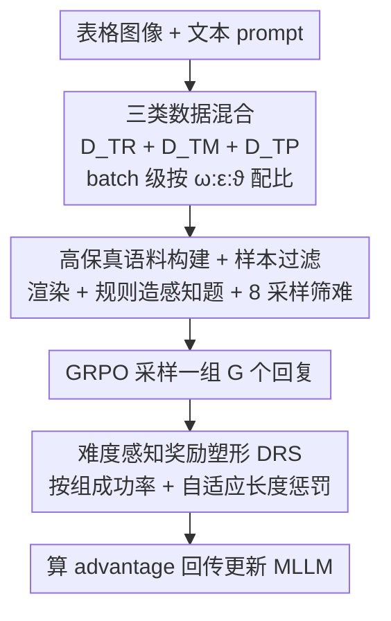

# TableMix: Enhancing Multimodal Table Reasoning in MLLMs from a Data-Centric Perspective

**会议**: CVPR 2026  
**论文**: [CVF Open Access](https://openaccess.thecvf.com/content/CVPR2026/html/Liu_TableMix_Enhancing_Multimodal_Table_Reasoning_in_MLLMs_from_a_Data-Centric_CVPR_2026_paper.html)  
**代码**: 无  
**领域**: 多模态VLM  
**关键词**: 多模态表格推理, MLLM, 数据混合, GRPO, 奖励塑形

## 一句话总结
针对多模态大模型（MLLM）做表格推理时反而打不过纯文本模型的反常现象，TableMix 从数据角度切入：在每个训练 batch 里同时混入「多模态表格推理 + 纯文本数学推理 + 简单表格感知」三类数据，来同时修复被对齐预训练削弱的推理力、保住视觉感知力，再配一个按难度调奖励的 DRS 机制，最终在 7 个表格基准上既碾压多模态基线、也追平甚至超过最强纯文本方法 Table-R1。

## 研究背景与动机
**领域现状**：表格推理（Table Reasoning）目前分两条路线——一条把表格序列化成 HTML/Markdown 喂给纯文本 LLM，另一条直接把表格**图像**喂给 MLLM。后者理论上更强，因为保留了颜色、高亮、图标、字体这些序列化会丢掉的视觉线索。

**现有痛点**：但文献里出现一个反直觉的持续现象——多模态方法在主流推理 benchmark 上**一直输给**纯文本方法。论文用 Figure 1 举例：多模态模型 Turbo 和纯文本模型 Table-R1 用的是几乎相同的 RL（GRPO）策略，Turbo 却在多个 benchmark 上明显落后。也就是说，单靠先进的 RL 技巧补不上这个差距。

**核心矛盾**：作者把根因归到**视觉-语言对齐预训练**。现代 MLLM = 预训练 LLM + 视觉编码器 + 对齐预训练，而这个对齐阶段虽然建立了视觉 grounding，却**无意中削弱了底层 LLM 的内在推理能力**。表格推理偏偏极度依赖逻辑、算术、结构化计算，所以这种退化在表格任务上格外致命；推理底子坏了，直接上 RL 自然收效有限。

**本文目标**：在**不损害视觉感知**的前提下，把 MLLM 被削弱的推理内核「修回来」。

**切入角度**：一个朴素直觉——既然推理核被退化，那就用纯文本数学推理数据（如 MetaMath）和主任务表格数据交错共训来「修复」它。实验确实验证了这能涨点，但又引出新问题（见下文的 reasoning-perception tension）。

**核心 idea**：从数据角度而非模型角度解决——用**有原则的三类数据混合**同时修复推理、保住感知，再加一个**难度感知的奖励塑形**让简单题简答、难题深想。

## 方法详解

### 整体框架
TableMix 是一个数据为中心的 RL 微调框架，骨干是 Qwen2.5-VL-7B。它不改模型结构，而是在两个地方动手：**喂什么数据**和**怎么给奖励**。输入是表格图像 + 文本 prompt，输出是带 `<think>...</think>` 推理过程和 `\boxed{}` 答案的回复。

整个流程是：先按比例在 **batch 级别**把三类数据（多模态表格推理 $D_{TR}$、纯文本数学推理 $D_{TM}$、多模态表格感知 $D_{TP}$）混成一个训练 batch；这个 batch 喂进 GRPO 做 RL，每个 query 采样一组 $G$ 个回复；再用 **难度感知奖励塑形（DRS）** 根据这组回复的成功率动态调整对「正确且简短」回复的奖励；最后照常算 advantage、回传更新。三类数据混合解决「修推理又会反噬感知」的张力，DRS 解决「混合数据难度不均导致简单题也啰嗦推理」的浪费。

### 关键设计

**1. 三类数据混合：一个 batch 同时修推理、保感知**

这是全文核心，直接针对「对齐预训练削弱推理 + 修推理又会反噬感知」这条因果链。作者分三步搭起最终配方。第一步「修复推理核」：往训练数据里掺纯文本数学推理数据 $D_{TM}$（MetaMath、DeepScaleR、GSM8K 等），因为复杂表格推理本质就是数值聚合、条件过滤、序列推断，这些和数学推理模式高度同构，掺进去能把被削弱的逻辑底子「续上」，实验证明这步就显著涨点。第二步暴露出**推理-感知张力（reasoning-perception tension）**：模型抽象推理一变强，对表格的低层视觉感知反而退化，原本能答对的简单感知题（如直接读某格数值）开始答错（Figure 3 里 Qwen2.5-VL 微调后把表内数字读错）。第三步「最终配方」：再掺第三类**简单多模态表格感知数据 $D_{TP}$**，强迫模型在学复杂推理的同时不断「复习」基本视觉感知，做到「学会思考时不丢掉看的能力」。

三类数据在 batch 级按采样比例 $\omega, \epsilon, \vartheta$（$\omega+\epsilon+\vartheta=1$）混合：

$$B \leftarrow \omega \cdot D_{TR} + \epsilon \cdot D_{TM} + \vartheta \cdot D_{TP}$$

直觉上 $D_{TR}$ 应占主导（最对齐目标任务），$D_{TM}$ 适量补推理，$D_{TP}$ 占最小份额防感知退化；实验最优为 $\omega=0.7,\ \epsilon=0.2,\ \vartheta=0.1$。关键是混合发生在 **batch 内**而非两阶段顺序训练——消融显示两阶段（先数学后表格或反之）都会略掉点，作者推测是分离训练削弱了视觉与语言模态的对齐。

**2. 难度感知奖励塑形 DRS：简单题逼它简答、难题放它深想**

混合数据集横跨「一眼能答的感知题」到「需要长链 CoT 的多步推理」，难度极不均。标准 GRPO 对所有样本一视同仁，会鼓励连 trivial 题也生成冗长推理，既浪费算力又容易因过度推理引入幻觉和无谓错误。DRS 的核心洞察是：**如果一道题在一组采样里高成功率被答对，它大概率就是简单题，不该再奖励长篇大论**。

具体地，对输入 $x$ 的一组回复 $\{y_i\}_{i=1}^{G}$，先算组成功率 $p(x)=\frac{1}{G}\sum_{i=1}^{G}\mathbb{1}(r_{acc}(y_i)=1)$。只有当 $p(x)>\delta$（即这题已被「掌握」）时，才对正确回复施加自适应长度惩罚：

$$\hat{r}_{acc}(y_i)=\begin{cases}1-\tanh\!\left(k(t)\cdot \dfrac{L_i-L_{\min}^{correct}}{L_{\min}^{correct}}\right) & y_i \text{ 正确}\\[4pt] 0 & y_i \text{ 错误}\end{cases}$$

其中 $L_i$ 是回复 $y_i$ 的 token 长度，$L_{\min}^{correct}$ 是该组所有正确回复里的最短长度——也就是说，越长的正确回复奖励越低，把模型往「最短正确答案」推。$k(t)=\min(k_{max},\ \frac{k_{max}}{T}\cdot t)$ 是随训练步 $t$ 退火的系数（$k_{max}=1.0$，$T$ 为总步数），早期惩罚弱、让模型先把长链 CoT 推理学起来，后期再逐步收紧鼓励简洁。低成功率（难题）则**完全不加**长度惩罚，放它充分逐步推理。这样在难度混合的设定下自然平衡了推理深度与效率，且不损训练稳定性。⚠️ 公式中 $\tanh$ 项与退火细节以原文 Eq.(5)(6) 为准。

GRPO 本身沿用标准做法：对 $x$ 采样 $G$ 个回复，用「准确性奖励 $r_{acc}\in\{0,1\}$ + 格式奖励 $r_{format}\in\{0,1\}$」做可验证奖励，advantage 用组内相对比较 $A_i=\frac{r_i-\text{mean}(\{r\})}{\text{std}(\{r\})}$ 算，免去单独的 reward model。

**3. 高保真语料构建 + 样本过滤：给可验证奖励喂干净数据**

RL 的效果高度依赖数据质量。作者从 TabMWP、WTQ、HiTab、TAT-QA、TabFact、InfoTabs 等十余个公开数据集采集表格推理数据，对没有原生表格图的数据集用渲染管线统一成标准视觉格式；数学侧默认用 MetaMath（难度与表格推理最匹配）；感知侧用规则法造简单 QA（如「读出表中某个数值」）。为防数据泄漏严格遵守各 benchmark 官方训练/测试划分。**样本过滤**很关键：用 base 模型对每个候选样本做 8 次采样，若 8 次里答对超过 6 次就判为「太简单」剔除，同时移除那些不看图也能答对的样本——因为过多简单样本会破坏 RL 稳定性、提供低质量学习信号并浪费算力。

## 实验关键数据

### 主实验
骨干 Qwen2.5-VL-7B，2 epoch、global batch 256、AdamW、lr $1\times10^{-6}$、RL 每 query 采 $G=16$ 个回复、KL 系数 0.01、阈值 $\delta=0.5$。7 个表格基准（准确率，%）：

| 方法 | 模态 | TabMWP | WTQ | HiTab | TAT-QA | TabFact | InfoTabs |
|------|------|--------|-----|-------|--------|---------|----------|
| Table-R1 | 纯文本SOTA | 96.40 | 81.20 | 81.40 | 73.86 | 87.60 | 87.90 |
| Qwen2.5-VL-7B | 多模态base | 92.48 | 65.85 | 67.09 | 70.54 | 83.01 | 77.91 |
| HIPPO-8B | 多模态 | 87.34 | 55.71 | 63.13 | 61.40 | 82.29 | 75.70 |
| Turbo-8B | 多模态(GRPO) | 96.75 | 67.80 | 72.15 | 73.21 | 85.81 | 81.89 |
| **TableMix** | 多模态 | **99.20** | **81.32** | **82.25** | **78.52** | **88.96** | **88.72** |

TableMix 不仅在多模态阵营里全面 SOTA（对最直接的对手 Turbo 各项均大幅领先），还**反超**了最强纯文本方法 Table-R1，TabMWP 近 100%。这直接验证了「修推理 + 保感知」能释放图像表格方法的潜力。

零样本泛化（held-out 的 TableVQA-Bench，%）：

| 方法 | Fin. | VWTQ | Syn. | VTab. | AVG. |
|------|------|------|------|-------|------|
| Qwen2.5-VL-7B | 97.6 | 58.5 | 66.8 | 81.6 | 70.2 |
| Ovis2-8B | 92.4 | 59.6 | 62.4 | 84.8 | 69.7 |
| **TableMix** | **98.0** | **74.9** | **79.2** | **92.0** | **82.3** |

TableMix 在未见分布上平均最高（82.3），说明学到的推理技能能迁移到新场景。

### 消融实验
| 配置 | 效果 | 说明 |
|------|------|------|
| 单一数据源（仅表格 / 仅数学） | 有可观提升 | 但弱于三类混合，印证「增强内在推理能助力领域任务」 |
| batch 内混合（默认） | 最优 | 优于两阶段 |
| 两阶段（先数学后表格 / 反之） | 略掉点 | 分离训练削弱视觉-语言对齐 |
| 数学源 MetaMath（默认） | 最佳 | 推理风格最贴表格推理 |
| 数学源 DeepScaleR（太难）/ GSM8K（太简单） | 增益减弱 | 难度不匹配 |
| 数学源 Geo3K（几何） | 增益有限 | 领域差距大 |
| GRPO + DRS vs 标准 GRPO | 准确率持平/略升 + token ↓~20% | InfoTabs 上甚至更好，减少过度推理 |
| 阈值 $\delta=0.5$ | 最优 | $\delta$ 过高/过低均训练不稳，$\delta=0$ 尤差 |

### 关键发现
- **三类混合 > 任何单一数据源**：数学数据修推理是涨点主力，但会反噬感知，必须靠 $D_{TP}$ 把感知拉回，缺一不可。
- **DRS 几乎免费提效**：在不掉准确率（部分基准还涨）的前提下把推理 token 砍掉约 20%，说明「简单题简答」既省算力又减幻觉。
- **数学源风格匹配比难度更重要**：MetaMath 赢在推理风格与表格任务同构，太难/太简单/跨域（几何）都不如它，提示「修推理」要选与目标任务推理模式对齐的数据。

## 亮点与洞察
- **把「多模态打不过纯文本」归因到对齐预训练削弱推理**，并用纯文本数学数据反向「修复」，这个诊断+药方组合很有解释力，也很可复用——任何因对齐/微调退化了某种能力的模型，都可考虑掺对应能力的纯文本数据共训。
- **reasoning-perception tension 是被实验逼出来的真问题**：作者没有一上来就给三类数据，而是先掺数学发现感知退化、再补感知数据，这种「现象驱动设计」让第三类数据的必要性非常扎实。
- **DRS 用「组成功率」当难度的免费代理**：不需要额外难度标注或 reward model，直接复用 GRPO 组内采样的成功率判难易，再用退火长度惩罚动态控制 CoT 长度，思路可迁移到任何 mixed-difficulty 的 RL 训练。

## 局限与展望
- **依赖可验证奖励**：方法建立在「答案能自动判对错」上（accuracy reward），对开放式/无标准答案的表格任务（如 FeTaQA 这类需要 DeepSeek-V3 来标准化评测）适配性如何，正文未充分展开。
- **比例需调**：$\omega:\epsilon:\vartheta=0.7:0.2:0.1$ 和阈值 $\delta=0.5$ 是在该配置下调出的最优，换骨干/换数据集是否仍是这组值需要重新搜，论文只证了「在一定扰动范围内稳健」。
- **只验证了 7B 骨干**：是否在更大/更小 MLLM 上同样有效、数据混合最优配比是否随模型规模变化，没有给出。
- ⚠️ DRS 的退火与长度惩罚公式细节（如 $\tanh$ 项、$k(t)$ 边界）建议对照原文 Eq.(5)(6) 核对。

## 相关工作与启发
- **vs Turbo**：两者都用 GRPO 做多模态表格推理，但 Turbo 只靠 RL，撞上了「推理核被预训练削弱」的天花板；TableMix 多了数据混合这一层，直接修复推理底子，因此各项基准大幅反超 Turbo——印证「数据为中心」的改进能超越纯 RL 微调。
- **vs Table-R1（纯文本 SOTA）**：Table-R1 走序列化表格 + 纯文本 LLM 路线，天然不丢推理力但丢了视觉线索；TableMix 走图像路线却通过混入数学数据把推理力补齐，首次让多模态方法在多个基准上追平甚至超过它，弥合了长期存在的模态性能差距。
- **vs HIPPO / SynTab-LLaVA / Table-LLaVA**：这些专用方法靠合成数据或偏好优化增强表格推理，但未触及「对齐预训练削弱推理」这一根因；TableMix 从诊断根因出发，方法更通用也更彻底。

## 评分
- 新颖性: ⭐⭐⭐⭐ 把多模态劣势精准归因到对齐预训练并用纯文本数学数据修复，诊断+药方都新颖，DRS 是合理但增量式的补充。
- 实验充分度: ⭐⭐⭐⭐⭐ 7 个主基准 + 零样本泛化 + 训练顺序/数学源/比例/DRS/阈值全套消融，证据链完整。
- 写作质量: ⭐⭐⭐⭐ 现象驱动的叙事清晰，三步搭配方很有说服力；部分奖励公式细节略需对照原文。
- 价值: ⭐⭐⭐⭐⭐ 首次让图像表格方法追平纯文本 SOTA，数据混合修复退化能力的思路可迁移性强。

<!-- RELATED:START -->

## 相关论文

- [\[CVPR 2026\] Why Does RL Generalize Better Than SFT? A Data-Centric Perspective on VLM Post-Training](why_does_rl_generalize_better_than_sft_a_data-centric_perspective_on_vlm_post-tr.md)
- [\[CVPR 2026\] Think360: Evaluating the Width-centric Reasoning Capability of MLLMs Beyond Depth](think_360_evaluating_the_width-centric_reasoning_capability_of_mllms_beyond_dept.md)
- [\[CVPR 2026\] HumanVBench: Probing Human-Centric Video Understanding in MLLMs with Automatically Synthesized Benchmarks](humanvbench_probing_human_centric_video_understanding_in_mllms_with_automatica.md)
- [\[ACL 2026\] TableVista: Benchmarking Multimodal Table Reasoning under Visual and Structural Complexity](../../ACL2026/multimodal_vlm/tablevista_benchmarking_multimodal_table_reasoning_under_visual_and_structural_c.md)
- [\[CVPR 2026\] TRivia: Self-supervised Fine-tuning of Vision-Language Models for Table Recognition](trivia_self-supervised_fine-tuning_of_vision-language_models_for_table_recogniti.md)

<!-- RELATED:END -->
