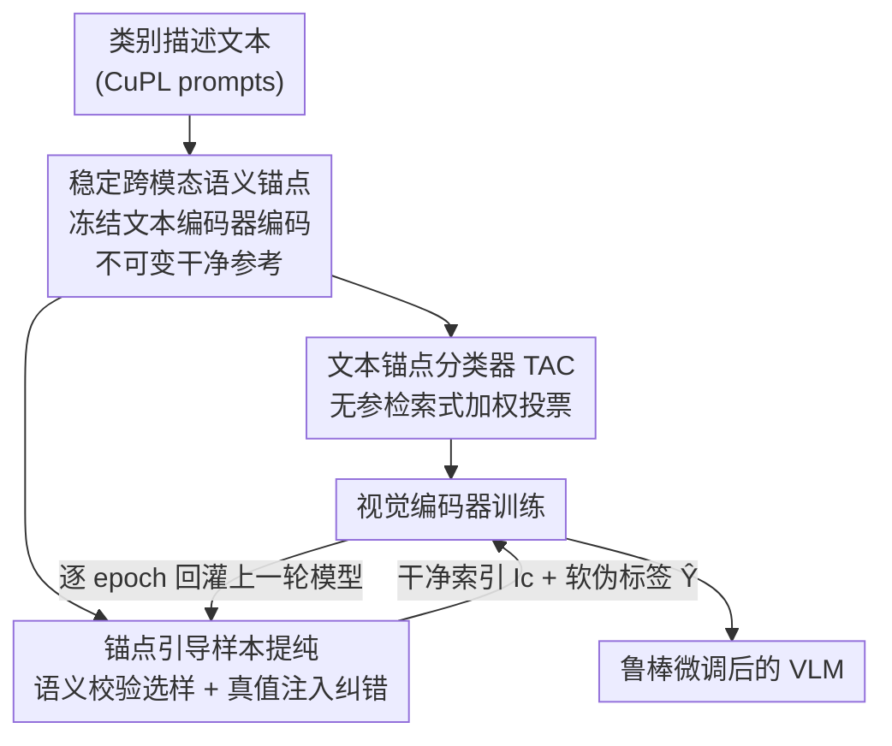

# TANGO: Text-Anchored Guided Optimization for Robust Fine-tuning Vision-Language Models under Label Noise

**会议**: CVPR 2026  
**论文**: [CVF Open Access](https://openaccess.thecvf.com/content/CVPR2026/html/Ma_TANGO_Text-Anchored_Guided_Optimization_for_Robust_Fine-tuning_Vision-Language_Models_under_CVPR_2026_paper.html)  
**代码**: 无  
**领域**: 多模态VLM  
**关键词**: 标签噪声、鲁棒微调、CLIP、语义锚点、跨模态监督

## 一句话总结
TANGO 把 CLIP 文本编码器生成的一组「干净且不可变的语义锚点」当作独立于训练标签的真值参考，既用它取代易被噪声污染的线性分类头（参数化变成检索式投票），又用它去校验/纠正噪声样本，在六个含噪基准上刷新 SOTA（CIFAR-100N 上 83.83%，比强基线 DeFT 高 4.79%）。

## 研究背景与动机

**领域现状**：把 CLIP 这类视觉-语言模型（VLM）迁移到具体下游分类任务，主流做法是监督微调——给视觉编码器接一个可学习的线性分类头，用交叉熵在带标签数据上训练。

**现有痛点**：真实数据集普遍带标签噪声（人工或自动标注出错）。论文实测：在 40% 真实噪声的 CIFAR-100 上微调 CLIP，准确率会暴跌 25% 以上。传统的「带噪学习」（LNL）方法靠 small-loss 选样、预测引导纠错等启发式，本质都是一个**自指循环**——用模型自己（已被噪声污染）的预测去产生监督信号，会不断放大自身错误（confirmation bias）。

**核心矛盾**：即便近期一些 VLM 专用方法开始用跨模态信息「检测」噪声，它们仍把文本知识当成一个外部 oracle，放在多阶段离线清洗/预处理里用一下，并没有把文本真正引入端到端优化回路。监督信号的源头依旧来自可能被污染的视觉邻域。

**本文目标**：让文本模态不止用于「识别噪声」，而是建立一套**完全独立于训练标签**的真值参考系，并把它贯穿分类决策与样本提纯两个环节。

**切入角度**：用冻结文本编码器把多样的类别描述（如 "a deer has brown fur and four legs"）编码成特征，得到的向量天然有两个好性质——标签按定义就是对的（纯净），且因 CLIP 强对齐能力可作为「理想多样图像特征」的代理（代表干净数据流形）。

**核心 idea**：把纠错从「内省式」（用模型自己的预测）转为「语义引导对齐式」（用一组冻结、不可变的文本锚点当外部真值）。

## 方法详解

### 整体框架

TANGO 要解决的是「微调 VLM 时标签有噪声」这件事，整体思路是：先一次性预计算出一组**语义锚点**当作干净参考系，然后在标准 LNL 的「逐 epoch 提纯 + 逐 batch 训练」交替框架里，把锚点同时塞进**分类头**和**样本提纯**两处。具体地，每个 epoch 开始前用上一轮模型对全数据集做一次锚点引导提纯，产出干净样本索引 $I_c$ 和纠正后的软伪标签 $\tilde{Y}$；然后视觉编码器训练一个 epoch，用双分量损失（干净样本上的硬标签交叉熵 + 全 batch 上软伪标签的正则项）。锚点全程冻结，给视觉编码器一个稳定靶子，避免在噪声下把 CLIP 的跨模态对应关系训坏。

### 关键设计

**1. 稳定跨模态语义锚点：用纯文本造一套不可变的外部真值**

针对「自指循环」这个根因——既然模型自己的预测不可信，就需要一个不依赖训练标签的干净参考。做法是一次性预计算：为每个类 $c$ 准备 $K$ 条多样的类相关描述 prompt $\{p_{c,k}\}_{k=1}^K$（实验直接复用 CuPL 的 prompt，并验证 LLM 随机生成的短句也能取得相当性能），用冻结文本编码器 $f_t(\cdot;\theta_t)$ 编码成锚点特征 $A_c = \{t_{c,k} \mid t_{c,k} = f_t(p_{c,k})\}_{k=1}^K$，全体锚点 $A = \bigcup_c A_c$。它有两个对带噪学习关键的性质：**纯净**（类别由无歧义文本定义，标签必对）、**代表性**（靠 CLIP 对齐成为干净数据流形的代理）。关键是锚点全程**不可变**——固定靶子能逼着视觉编码器在适配下游任务时保持与原始语义空间对齐，防止噪声把跨模态对应训歪。

**2. 文本锚点分类器 TAC：把会过拟合噪声的线性头换成无参检索投票**

线性分类头 $W$ 在噪声标签下极易过拟合错误监督、扭曲特征空间。TANGO 直接把它换成**无参数**的 TAC：不再学抽象变换，而是把图像特征当 query、固定锚点集当 key-value memory（key 是锚点特征 $t_j$，value 是它们的干净 one-hot 标签）。给图像特征 $v_i = f_v(x_i)$，先算它对每个锚点的亲和度 $(\alpha_i)_j = \exp(\mathrm{sim}(v_i, t_j))$（$\mathrm{sim}$ 为余弦相似度），再对所有锚点的干净 one-hot 标签矩阵 $Y_A \in \mathbb{R}^{|A|\times C}$ 做加权求和得到 logits：

$$l_i = \alpha_i^{\top} Y_A.$$

因为没有可学习参数，预测无法被噪声「记住」，每个判断都锚定在干净文本真值上，从机制上断掉了分类头被污染的路径。

**3. 锚点引导样本提纯：用语义信号去校正视觉邻域的「回声室」**

很多 LNL 方法靠局部一致性（从视觉邻居取监督），但纯视觉邻域会变成「视觉回声室」，把错误一路传播。TANGO 不丢弃视觉信号，而是用锚点的干净语义去**增广并纠偏**它，分两路且都做视觉/语义融合（融合权重 $\beta\in[0,1]$）：

*语义校验做选样*：算一个纠正后的一致性分 $\tilde{q}_i = (1-\beta)\cdot p_i^{\mathrm{vis}} + \beta\cdot p_i^{\mathrm{sem}}$。其中 $p^{\mathrm{vis}}$ 是 k-NN 投票（实现上一个值得注意的细节是投票按**原始噪声标签**而非伪标签来投）；语义分通过二值「视觉→语义」图 $A^{vs}\in\{0,1\}^{N\times|A|}$ 算 $p^{\mathrm{sem}} = \frac{1}{|A|/C} A^{vs} Y_A$，当锚点 $t_j$ 落在图像 $x_i$ 在锚点集内的 $(|A|/C)$ 近邻里时 $(A^{vs})_{ij}=1$。这等于让样本去问一桌「干净专家委员会」，若给定标签与语义共识一致 $y_i = \arg\max(\tilde{q}_i)_c$ 则判为干净。

*真值注入做纠错*：把视觉传播的软标签 $Y^{\mathrm{vis}}$ 与直接的真值注入融合 $\tilde{Y} = (1-\beta)\cdot Y^{\mathrm{vis}} + \beta\cdot Y^{\mathrm{sem}}$。语义传播矩阵让干净信息从锚点流向样本：先用「语义→视觉」图 $A^{sv}\in\{0,1\}^{|A|\times N}$（图像 $x_i$ 落在锚点 $t_j$ 于训练集的 $(N/C)$ 近邻里则置 1）聚合标签分 $S = (A^{sv})^{\top} Y_A$，再按行归一化得 $Y^{\mathrm{sem}} = D^{-1}(A^{sv})^{\top} Y_A$，$D$ 是对角矩阵、$D_{ii}$ 为选中 $x_i$ 当邻居的锚点数。⚠️ 上述图的方向/转置记号以原文为准。

### 损失函数 / 训练策略
TANGO 嵌入在标准 LNL 的交替框架里（与 SSR/LSL 同款，以便公平归因增益）。每 batch 损失为 $L = L_{\mathrm{clean}} + L_{\mathrm{reg}}$：$L_{\mathrm{clean}}$ 是只在干净样本 $I_c$ 上用**原始硬标签**算的交叉熵；$L_{\mathrm{reg}}$ 在 batch 全体样本上用纠正后软伪标签 $\tilde{Y}$ 算交叉熵，并进一步用 Mixup 增强。关键超参全程固定（$K=40$，$\beta=0.5$）；优化器 SGD（momentum 0.9、weight decay 5e-4），微调 20 epoch、lr 5e-4、batch 64，骨干为 CLIP ViT-B/16。

## 实验关键数据

### 主实验

合成噪声 CIFAR-100（Test Acc %，取 Best）——TANGO 在各噪声类型与比例下全面领先：

| 方法 | Sym.40% | Sym.60% | Ins.40% | Asym.30% |
|------|------|------|------|------|
| DivideMix | 87.50 | 85.09 | 85.82 | 83.74 |
| SSR | 86.34 | 83.86 | 86.85 | 86.63 |
| LSL | 87.66 | 85.36 | 88.27 | 88.01 |
| DeFT | 88.17 | 85.81 | 85.75 | 83.24 |
| **TANGO** | **89.83** | **87.89** | **89.58** | **89.23** |

五个真实噪声数据集（Test Acc %），TANGO 在四个上刷新 SOTA：

| 方法 | CIFAR100N | Animal10N | WebVision | Food101N |
|------|------|------|------|------|
| SSR | 80.15 | 92.18 | 87.24 | 91.28 |
| LSL | 81.00 | 92.56 | 87.64 | 91.10 |
| DeFT | 79.04 | 88.26 | 83.84 | 89.12 |
| **TANGO** | **83.83** | **93.62** | 87.44 | **91.83** |

CIFAR-100N 上较 DeFT 高 4.79%；TANGO 的 Best 与 Last 差距极小，训练稳定性强。

### 消融实验

CIFAR-100（合成）与 CIFAR-100N（真实 R40%）上的组件消融：

| 配置 | S40% | I40% | A30% | R40% | 说明 |
|------|------|------|------|------|------|
| Baseline（线性头+纯视觉提纯） | 88.80 | 88.11 | 88.42 | 81.97 | 起点 |
| **TANGO（完整）** | **89.82** | **89.58** | **89.21** | **83.83** | 完整模型 |
| Visual-Only 提纯 | 89.43 | 89.03 | 88.98 | 83.47 | 只用视觉信号 |
| Semantic-Only 提纯 | 89.79 | 88.97 | 88.80 | 83.58 | 只用语义信号 |
| Trainable 锚点 | 89.71 | 89.14 | 89.42 | 84.01 | 锚点可学习 |
| Simpler Prompts | 89.22 | 89.04 | 88.96 | 83.86 | LLM 简单短句 |

### 关键发现
- **视觉与语义互补**：Visual-Only 与 Semantic-Only 都已超过 Baseline（说明 TAC 本身就是更好的底座），而完整 TANGO 又稳超两者，证明两类邻域信息互补。
- **语义信号本身极强**：Semantic-Only 时常逼近甚至超过 Visual-Only（$\beta=1.0$ 纯语义略胜纯视觉），凸显干净锚点参考的威力。
- **锚点固定更稳健**：Trainable 锚点性能也有竞争力（R40% 上 84.01 甚至略高），但作者认为固定锚点在「保持与原始语义空间对齐」上更有原则性、训练更稳。
- **对超参不敏感**：$K\ge10$ 后性能即稳定（$K$ 从 5→10 涨 +1.54%）；$\beta$ 在大范围内都稳、峰值在 0.5。Prompt 质量有价值但非苛刻依赖。
- **骨干泛化**：换 ViT-B/32 与 SigLIP 仍全面领先（CIFAR-100N 上 82.11%、85.31%）。

## 亮点与洞察
- **把「文本检测噪声」升级为「文本当真值」**：最核心的「啊哈」点是——既然锚点标签按定义就对，那它不只是检测器，而是可以直接进分类决策与纠错回路的干净监督源，从根上跳出自指循环。
- **无参分类头是个漂亮的解耦**：用检索式加权投票替掉线性头，既消除了「可学习参数被噪声记住」的通道，又顺带把视觉编码器钉在 CLIP 原始语义空间上，一举两得。
- **可迁移 trick**：「冻结文本锚点 + 邻域投票按原始噪声标签而非伪标签来投」这套，可迁到其他需要外部干净参考的弱监督/带噪场景（如带噪检索、半监督分类）。

## 局限与展望
- 方法依赖 CLIP 式强跨模态对齐，对齐弱的 VLM 上锚点代表性会打折（作者在 SigLIP 上验证了泛化，但范围有限）。
- 语义锚点是类级的、静态的，对细粒度/长尾或类内多模态分布强的任务，单纯文本描述可能不足以覆盖视觉多样性。
- ⚠️ 论文未充分探讨「真值注入」这一带强 prior 的机制在极高噪声（>60%）或开放集噪声下是否仍稳健，值得进一步验证。
- 改进方向：让锚点随任务自适应扩充（在保持纯净前提下增多样性），或把锚点机制扩展到检测/分割等结构化任务。

## 相关工作与启发
- **vs DeFT / CLIPCleaner（VLM 专用带噪方法）**：它们把 VLM 语义当外部 oracle，用在多阶段离线清洗里；TANGO 把语义锚点直接嵌入端到端优化，每次迭代都在用跨模态对齐当学习目标，因此真实噪声基准上大幅领先（CIFAR-100N +4.79% over DeFT）。
- **vs SSR / LSL（特征空间邻域一致性）**：它们是纯视觉单模态策略（k-NN 选样 / reverse k-NN 重标注），逻辑都在视觉特征空间里转；TANGO 用文本锚点注入干净语义信号去纠偏视觉「回声室」。
- **vs ARF / Cluster-Adapter（基于锚点的微调）**：它们的锚点来自训练数据自身、当作数据相关正则；TANGO 的锚点来自纯文本、是不可变真值，目标是对抗标签噪声而非 OOD/少样本正则。

## 评分
- 新颖性: ⭐⭐⭐⭐ 「文本锚点当独立真值并贯穿分类+提纯」的视角清晰且有说服力，但锚点/检索式思路在 VLM 微调里已有先例。
- 实验充分度: ⭐⭐⭐⭐⭐ 六基准 + 多噪声类型 + 组件/锚点性质/超参/骨干全套消融，归因扎实。
- 写作质量: ⭐⭐⭐⭐ 动机推导与方法叙述清楚，部分图矩阵记号需对照原文。
- 价值: ⭐⭐⭐⭐ 为含噪 VLM 微调提供了一个强且稳的新基线，工程上易复用。

<!-- RELATED:START -->

## 相关论文

- [\[AAAI 2026\] Difference Vector Equalization for Robust Fine-tuning of Vision-Language Models](../../AAAI2026/multimodal_vlm/difference_vector_equalization_for_robust_fine-tuning_of_vis.md)
- [\[CVPR 2026\] FedMPT: Federated Multi-Label Prompt Tuning of Vision-Language Models](fedmpt_federated_multi-label_prompt_tuning_of_vision-language_models.md)
- [\[CVPR 2026\] AGFT: Alignment-Guided Fine-Tuning for Zero-Shot Adversarial Robustness of Vision-Language Models](agft_alignment-guided_fine-tuning_for_zero-shot_adversarial_robustness_of_vision.md)
- [\[CVPR 2026\] Towards Calibrating Prompt Tuning of Vision-Language Models](towards_calibrating_prompt_tuning_of_vision-language_models.md)
- [\[CVPR 2025\] NLPrompt: Noise-Label Prompt Learning for Vision-Language Models](../../CVPR2025/multimodal_vlm/nlprompt_noise-label_prompt_learning_for_vision-language_models.md)

<!-- RELATED:END -->
