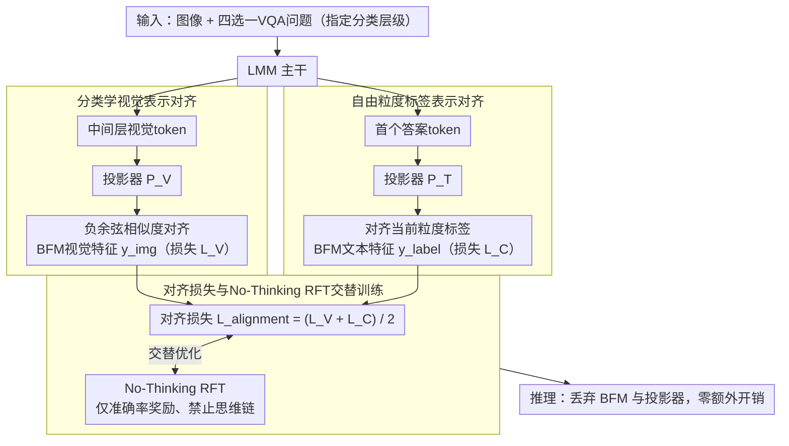

# Taxonomy-Aware Representation Alignment for Hierarchical Visual Recognition with Large Multimodal Models

**会议**: CVPR 2026  
**arXiv**: [2603.00431](https://arxiv.org/abs/2603.00431)  
**代码**: [https://github.com/PKU-ICST-MIPL/TARA_CVPR2026](https://github.com/PKU-ICST-MIPL/TARA_CVPR2026)  
**领域**: 多模态VLM  
**关键词**: 层次化视觉识别, 生物分类学, 表示对齐, 生物基础模型, 强化学习微调

## 一句话总结
提出TARA框架，通过将LMM的中间表示与生物基础模型(BFM)的分类学感知特征对齐，为大型多模态模型注入分类层次知识，显著提升已知和新颖类别的层次化视觉识别性能。

## 研究背景与动机
**领域现状**：大型多模态模型在细粒度视觉识别(FGVR)上表现优秀，但层次化视觉识别(HVR)要求模型预测从粗到细的一致标签路径，这一能力尚不足。

**现有痛点**：LMM经常违反分类层次——例如在"界→门→纲→目→科→属→种"路径中产生不一致的预测。对于训练集中未出现的新颖类别，问题更为严重。

**核心矛盾**：LMM的视觉特征编码缺乏层次化的生物学先验，导致其无法在不同粒度层级间保持一致的识别结果。

**本文目标**：如何将分类学层次知识注入LMM，使其在已知和新颖类别上都能产生层次一致的识别结果。

**切入角度**：生物基础模型(如BioCLIP2)通过层次化对比学习编码了丰富的生物学关系，可以作为分类学知识的来源。

**核心 idea**：将LMM的中间视觉表示和首个答案token表示分别与BFM的视觉特征和文本标签特征对齐，实现分类学知识的注入。

## 方法详解

### 整体框架
输入为图像和指定分类层级的四选一VQA问题。TARA在不改变推理流程的前提下，于训练时把生物基础模型（BFM）的分类学知识注入LMM：一路做**分类学视觉表示对齐**，把LMM中间层的视觉token对齐到BFM的视觉特征；一路做**自由粒度标签表示对齐**，把首个答案token对齐到BFM的标签文本特征；两个对齐损失合成 $\mathcal{L}_{\text{alignment}}$ 后，再与**No-Thinking RFT交替训练**，让知识注入和强化探索互不挤占。推理时丢弃BFM和投影器，无额外开销。

### 关键设计

**1. 分类学视觉表示对齐：让LMM的视觉特征里"长出"生物学层次结构**

LMM违反分类层次的根源在于它的视觉编码缺乏生物学先验，看不出"哈士奇"和"狼"在分类树上挨得很近。TARA的做法是把LMM第 $\ell$ 层抽出的视觉token表示 $\mathbf{e}^{\text{img}}_{\ell,i}$ 过一个可学习投影器 $P_V$ 映射到BFM的特征空间，再去贴近BFM对同一张图给出的视觉特征 $\mathbf{y}_i^{\text{img}}$，用负余弦相似度作损失：

$$\mathcal{L}_V = -\frac{1}{N}\sum_{i=1}^{N}\text{sim}\big(P_V(\mathbf{e}^{\text{img}}_{\ell,i}),\ \mathbf{y}_i^{\text{img}}\big)$$

之所以拿BFM当锚点，是因为BFM（如BioCLIP2）是用层次化对比学习在海量物种上训出来的，它的特征空间天然把"界→门→纲→目→科→属→种"的远近关系编码进了几何距离。对齐之后，这种层次结构就被蒸馏进LMM的中间表示，模型在不同粒度上的判断自然更连贯。

**2. 自由粒度标签表示对齐：对齐"第一个答案token"，而不是逼模型在每一层都对**

同一张鸟的照片，专家想要的是种名，普通用户只要听到"鸟"就够了——硬把所有层级标签都塞进去对齐反而会打架。TARA只取模型生成的第一个答案token的隐藏状态 $\mathbf{e}^{\text{answer}}_m[0]$，过投影器 $P_T$ 映射到BFM的文本空间，去对齐当前问题所问那个粒度的标签特征 $\mathbf{y}^{\text{label}}$：

$$\mathcal{L}_C = \text{sim}\big(P_T(\mathbf{e}^{\text{answer}}_m[0]),\ \mathbf{y}^{\text{label}}\big)$$

首token承载了模型"准备回答什么"的决策信息，只对齐它就等于告诉模型：按用户问的层级灵活映射到对应粒度。这样同一套权重既能答"种"也能答"纲"，不会被多层级标签互相牵制。

**3. 对齐损失与No-Thinking RFT交替训练：分类任务里，少想一点反而更准**

注入了知识还得让模型真的用起来，TARA把上面两个对齐损失和一个No-Thinking RFT交替优化。No-Thinking RFT砍掉思维链，不让模型展开冗长推理，只用一个准确率奖励，直接产出简短答案。作者的判断是分类这类任务并不需要显式推理，过度"想"甚至会引入噪声把答案带偏；让强化学习专注于在答案空间里探索，再和表示对齐轮流走，既把分类学知识压进表示、又保留了RL的探索能力，两边互不挤占。

### 损失函数 / 训练策略
总损失为 $\mathcal{L}_{\text{alignment}} = (\mathcal{L}_V + \mathcal{L}_C)/2$，与No-Thinking RFT交替训练。投影器 $P_V$ 和 $P_T$ 为三层MLP+SiLU激活。推理时移除BFM和投影器，无额外开销。

## 实验关键数据

### 主实验

| 基础模型 | RL | TARA | HCA (Plant) | Acc_leaf (Plant) | HCA (Animal) | Acc_leaf (Animal) |
|---------|-----|------|-------------|-----------------|--------------|-------------------|
| Qwen3-VL-2B | ✗ | ✗ | 6.46 | 30.16 | 7.18 | 27.86 |
| Qwen3-VL-2B | ✓ | ✗ | 9.23 | 31.96 | 8.57 | 29.32 |
| Qwen3-VL-2B | ✓ | ✓ | **12.78** | **32.66** | **10.26** | **30.77** |
| Qwen2.5-VL-3B | ✗ | ✗ | 10.89 | 39.73 | 16.70 | 40.26 |
| Qwen2.5-VL-3B | ✓ | ✗ | 17.91 | 44.35 | 21.99 | 46.25 |
| Qwen2.5-VL-3B | ✓ | ✓ | **19.53** | **45.66** | **24.02** | **49.16** |

### TerraIncognita新颖类别

| 物种类型 | RL | TARA | Order F1 | Family F1 |
|---------|-----|------|----------|-----------|
| Known | ✗ | ✗ | 17.16 | 10.83 |
| Known | ✓ | ✓ | **41.56** | **25.47** |
| Novel | ✗ | ✗ | 17.16 | 10.83 |
| Novel | ✓ | ✓ | **33.45** | **12.67** |

### 关键发现
- TARA在所有基础模型上均带来一致且显著的提升，HCA指标提升最为明显（如Qwen3-VL-2B上+3.55%）
- 在TerraIncognita的新颖类别上，TARA在Order级别F1提升超过10个点，证明其有效的泛化能力
- RL+TARA组合效果优于单独使用任何一种，说明二者具有互补性
- 推理时无需BFM，不增加推理开销

## 亮点与洞察
- **推理时零开销**：BFM和投影器仅在训练时使用，推理时完全移除。这意味着可以"免费"获得分类学知识增益，非常实用。
- **No-Thinking RFT的洞见**：在分类任务中，显式推理反而可能有害，直接输出答案配合探索性RL效果更好。这个洞察可迁移到其他非推理密集型的VLM任务。
- **自由粒度对齐**：通过对齐首token表示而非强制所有层级，模型可以根据用户提问灵活调整识别粒度。

## 局限与展望
- 实验仅在生物分类学领域验证，其他层次化分类场景（如商品类目、文档分类）未探索
- 依赖BioCLIP2作为教师模型，对非生物领域需要找到相应的分领域基础模型
- 仅使用1-shot设置，few-shot数量对性能的影响未充分探讨
- 四选一VQA设置比开放集层次分类简单得多，混淆项设计的影响值得进一步分析

## 相关工作与启发
- **vs Fine-R1**：Fine-R1用两阶段框架学习少样本FGVR推理过程；TARA则通过表示对齐直接注入分类学知识，更轻量
- **vs HCPT**：HCPT在CLIP上做层次一致的prompt tuning；TARA在LMM上通过BFM对齐实现类似目标，且适用于新颖类别

## 评分
- 新颖性: ⭐⭐⭐⭐ 将BFM知识注入LMM的思路新颖，推理零开销设计实用
- 实验充分度: ⭐⭐⭐⭐ 多模型、多数据集验证，消融充分
- 写作质量: ⭐⭐⭐⭐ 结构清晰，数学描述规范
- 价值: ⭐⭐⭐⭐ 开辟了LMM层次化识别的新方向

<!-- RELATED:START -->

## 相关论文

- [\[CVPR 2026\] Predictive Regularization Against Visual Representation Degradation in Multimodal Large Language Models](predictive_regularization_against_visual_representation_degradation_in_multimoda.md)
- [\[CVPR 2026\] CoVFT: Context-aware Visual Fine-tuning for Multimodal Large Language Models](covft_context-aware_visual_fine-tuning_for_multimodal_large_language_models.md)
- [\[CVPR 2026\] The LLM Bottleneck: Why Open-Source Vision LLMs Struggle with Hierarchical Visual Recognition](the_llm_bottleneck_why_open-source_vision_llms_struggle_with_hierarchical_visual.md)
- [\[CVPR 2026\] HAWK: Head Importance-Aware Visual Token Pruning in Multimodal Models](hawk_head_importance-aware_visual_token_pruning_in_multimodal_models.md)
- [\[CVPR 2026\] MASQuant: Modality-Aware Smoothing Quantization for Multimodal Large Language Models](masquant_modality-aware_smoothing_quantization_for_multimodal_large_language_mod.md)

<!-- RELATED:END -->
