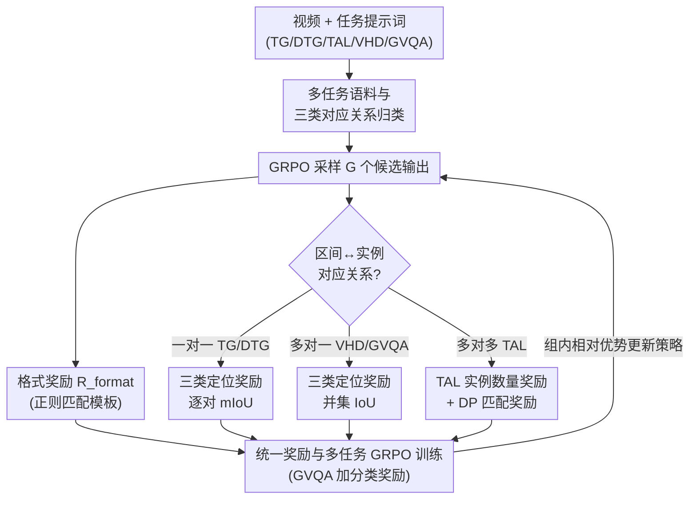

# TempR1: Improving Temporal Understanding of MLLMs via Temporal-Aware Multi-Task Reinforcement Learning

**会议**: CVPR 2026  
**论文**: [CVF Open Access](https://openaccess.thecvf.com/content/CVPR2026/html/Wu_TempR1_Improving_Temporal_Understanding_of_MLLMs_via_Temporal-Aware_Multi-Task_Reinforcement_CVPR_2026_paper.html)  
**代码**: 无  
**领域**: 多模态VLM  
**关键词**: 视频时序理解, 多模态大模型, 强化学习, GRPO, 多任务奖励设计  

## 一句话总结
TempR1 把五种视频时序任务（时序定位 TG、稠密定位 DTG、动作定位 TAL、亮点检测 VHD、有依据视频问答 GVQA）统一进一个基于 GRPO 的多任务强化学习框架，关键在于按"预测区间 ↔ 真值实例"的三种对应关系（一对一/多对一/多对多）分别设计定位奖励，在五个 benchmark 上全面刷新 SOTA，且多任务联合训练对单任务也产生正向协同。

## 研究背景与动机
**领域现状**：让 MLLM 理解视频里"事件何时发生、如何演变"是长视频分析的基础能力。这条线目前有两条主流路线：监督微调（SFT）用大规模指令数据强化时序理解；强化学习（RL）直接优化任务目标、奖励所有合理预测。RL 因数据效率和泛化性更好而逐渐成为主流。

**现有痛点**：SFT 的 token 级硬监督容易在有限时序数据上过拟合，还会削弱模型原有的通用推理能力。而现有 RL 方法几乎都把范围窄化到**时序定位（temporal grounding）单一任务**上——它们没见过多样的时序结构，无法捕捉时序依赖的层次性与组合性，泛化到稠密定位、动作定位、时间敏感问答等更广场景时就力不从心。

**核心矛盾**：不同时序任务的查询语义和预测目标差别很大——TG 关注事件描述、TAL 关注动作类别、VHD 关注重要性/情感线索；TG 只需定位单个片段，TAL 要预测多个实例，GVQA 还要把定位和推理答题结合起来。但它们又共享"准确建模时序概念、精确预测时间戳、保持视频-文本对齐"这些底层能力。**单任务 RL 既没利用任务多样性带来的泛化，也没利用共享结构带来的基础能力增强**。

**本文目标**：构建一个能同时吃下这五种异构时序任务的统一 RL 框架，让它们既各自学好、又彼此增益。

**切入角度**：作者注意到，这些任务表面千差万别，但本质上都是"输出若干时间区间、去对齐若干真值实例"。区别只在于**区间与实例的对应关系不同**——这正是设计统一却又任务自适应的奖励的突破口。

**核心 idea**：把所有时序任务按"预测区间 ↔ 真值实例"的对应结构归为三类（一对一、多对一、多对多），为每一类量身定制定位奖励，再用 GRPO 做稳定的跨任务联合优化。

## 方法详解

### 整体框架
TempR1 以 Qwen2.5-VL-7B 为基座，在一个覆盖五种时序任务、约 60K 样本的多任务语料上做强化微调。训练时每个 batch 随机混采各任务样本，按样本所属任务类型选择对应的提示词和奖励函数；模型输出统一用正则解析出 `<answer>ts to te, ...</answer>` 形式的时间区间。整套奖励是规则化、可验证的：先用**格式奖励**保证输出可被机器解析，再按任务的对应关系类型施加**三类定位奖励**，GVQA 额外加一个**答案分类奖励**，最后把这些奖励喂给 GRPO 做组内相对优势的策略更新。

### 关键设计

**1. 多任务语料与三类对应关系归类：把异构任务统一到一套奖励语言**

直接把五种任务硬塞进一个 RL 框架，奖励无从下手——它们的输出结构压根不一样。作者的关键观察是：所有时序任务都可抽象成"输出 $m$ 个预测区间 $\{p_i\}$，对齐 $n$ 个真值实例 $\{g_j\}$"，差异只在 $m$ 与 $n$ 的对应关系上。据此把任务归为三类：**Type 1 一对一**（TG、DTG，每个预测区间对应一个事件，$m=n$）；**Type 2 多对一**（VHD、GVQA，多个预测片段共同表征一个事件/共同支撑一个问题）；**Type 3 多对多**（TAL，要预测某动作类别的全部实例，$m$ 与 $n$ 可不相等且模型事先不知道真实实例数）。这套归类是后面所有奖励设计的骨架——它让"统一框架"和"任务自适应"不再矛盾：框架统一在 GRPO + 区间对齐的抽象上，自适应体现在每类对应关系用不同的 IoU 聚合方式。配套语料约 60K，TG 取自 Charades-STA / DiDeMo / TimeRFT，DTG 取自 ActivityNet-Caption，VHD 取自 QVHighlights，GVQA 取自 NExT-GQA，TAL 取自 ActivityNet-v1.3 / HACS。

**2. 三类定位奖励之 Type 1/Type 2：用 IoU 聚合方式刻画对应结构**

针对前两类对应关系，作者用不同的 IoU 聚合方式给出连续奖励，而不是简单的命中/不命中。**Type 1（一对一）** 直接取所有配对区间的平均时序 IoU：$R_{\text{loc}}^{(\text{TG/DTG})} = \frac{1}{N}\sum_{i=1}^{N} \frac{\mathrm{Intersection}(p_i, g_i)}{\mathrm{Union}(p_i, g_i)}$，逐对对齐、平均到每个事件。**Type 2（多对一）** 的关键是"多个预测片段联合表征一个事件"——VHD 的若干亮点段共同描述同一亮点事件，GVQA 的多个证据段共同支撑一个问题。如果还逐对算 IoU 就会错配，所以作者先把所有预测区间并成一个并集区域、把所有真值区间也并起来，再算两个并集的 IoU：

$$R_{\text{loc}}^{(\text{VHD/GVQA})} = \frac{\mathrm{Intersection}(\cup_i p_i, \cup_j g_j)}{\mathrm{Union}(\cup_i p_i, \cup_j g_j)}$$

这一步把"多段共同覆盖一个事件"的语义直接编码进奖励，避免逐段惩罚反而压制了多段协同。格式上，TG 输出 `<answer>ts to te</answer>`，DTG/VHD 输出多区间序列，并由格式奖励 $R_{\text{format}}$（正则匹配模板，命中得 1 否则 0）保证输出可解析、训练稳定。

**3. Type 3 的实例数量奖励 + DP 匹配奖励：解决"预测多少个、各对哪个"的双重不确定**

TAL 最难：模型要把某类动作的所有实例都找出来，但既不知道有几个、预测出来的区间又该和哪个真值对齐。作者把 Type 3 定位奖励拆成两个互补分量。其一是**实例数量奖励**，惩罚预测数与真值数的偏差：$R_{\text{num}} = \exp\!\left(-\frac{|N_{\text{pred}} - N_{\text{gt}}|}{\min(N_{\text{gt}}, 3)\cdot\sigma}\right)$，差越大奖励指数衰减，$\min(N_{\text{gt}},3)$ 让不同实例数量级下的惩罚更鲁棒，$\sigma{=}1.0$ 调节惩罚强度。其二是**匹配奖励**：先把预测和真值区间各自按时间排序，假设"靠前的预测对应靠前的真值"，用动态规划（Algorithm 1，最大化匹配对总 IoU）求最优匹配，得到 sIoU $=\sum_{(p_i,g_j)\in\mathcal{M}}\frac{\mathrm{Intersection}(p_i,g_j)}{\mathrm{Union}(p_i,g_j)}$，再算精度 $P=\frac{s\text{IoU}}{\text{num}_{\text{pred}}}$、召回 $R=\frac{s\text{IoU}}{\text{num}_{\text{gt}}}$、$\text{F1}=\frac{2PR}{P+R}$，以 F1 作为 $R_{\text{match}}$。最终 $R_{\text{loc}}^{(\text{TAL})} = R_{\text{num}} + R_{\text{match}}$。这个 DP 匹配是 Type 3 的灵魂——朴素的顺序匹配在多实例场景下会乱配，导致优化目标本身就不可靠。

**4. 统一奖励与多任务 GRPO 训练：把三类奖励熔进一个目标**

所有奖励熔进统一目标后交给 GRPO。GRPO 用组内相对比较替代 PPO 的 critic：给定提示 $p$，策略 $\pi_\theta$ 采样 $G$ 个候选 $\{o_1,\dots,o_G\}$，各自打分后在组内归一化得到相对优势 $A_i$，再带 clip 和 KL 正则更新策略，省掉了独立 critic 网络、降低开销。对每个样本，按任务类型 $t$ 选对应的格式奖励与定位奖励；GVQA 额外加分类奖励 $R_{\text{cls}}$（答案选项正确得 1 否则 0）。总奖励为

$$R = R_{\text{format}} + R_{\text{loc}}^{(t)} + \mathbf{1}_{\{t=\text{GVQA}\}}\, R_{\text{cls}}$$

训练时五任务数据混采、每步随机抽 batch，按样本任务类型动态切换提示词与奖励函数，在 60K 语料上只训一个 epoch。这种"统一目标 + 任务条件分支"的写法，让多任务共享时序基础能力（时间戳预测、视频-文本对齐）的同时，又保留各任务的特异性奖励信号。

### 损失函数 / 训练策略
基座 Qwen2.5-VL-7B；视频按 2 FPS 抽帧，超过 448 帧时均匀采 448 帧；空间分辨率动态缩放使视觉 token 不超过 3584。GRPO 超参沿用 VideoChat-R1，整套 60K 多任务语料训练 1 个 epoch。推理时复用相同抽帧策略与任务提示词，输出用正则解析出时间区间。

## 实验关键数据

### 主实验
五个时序任务全面对比 VLP 专家模型与开源 MLLM（多任务联合训练、仅训 1 epoch）：

| 任务 / 数据集 | 指标 | 之前最好 | TempR1 | 提升 |
|------|------|------|------|------|
| TG / Charades-STA | mIoU | 60.8 (VideoChat-R1) | **61.4** | +0.6 |
| VHD / QVHighlights | mIoU | 65.9 (TAR-TVG) | **71.1** | +5.2 |
| DTG / ActivityNet | mIoU | — | **59.8** | 持平最强 VLP 专家 HSCNet |
| GVQA / NExT-GQA | Acc / 证据 mIoU | 70.6 / 36.1 (VideoChat-R1) | 70.1 / **39.2** | 定位 +3.1 |
| TAL / ActivityNet-v1.3 | mF1 | 58.0 (MUSEG) | **71.0** | +13.0 |

VHD 这种多片段检索任务上提升最大（+5.2），TAL 多实例任务上提升最猛（+13.0），印证了"按对应关系定制奖励"对复杂结构任务尤其关键。若再做单数据集微调，Charades-STA 可进一步到 62.5 mIoU。

### 消融实验

Type-3 定位奖励的两个分量（TAL，ActivityNet-v1.3）：

| 实例数量奖励 | 匹配策略 | mF1 | 说明 |
|------|------|------|------|
| ✓ | DP 匹配 | **70.6** | 完整 Type-3 奖励 |
| ✗ | DP 匹配 | 69.8 | 去掉实例数量奖励 |
| ✓ | 顺序匹配 | 45.4 | 把 DP 换成朴素顺序匹配，崩盘 |

多任务协同（逐步加任务，五任务上整体评测，节选 TAL mF1 与 GVQA 证据 mIoU）：

| 训练任务组合 | Charades mIoU | NExT-GQA mIoU | TAL mF1 |
|------|------|------|------|
| 仅 TG | 60.2 | 21.0 | 19.9 |
| TG+DTG+GVQA | 60.8 | 38.3 | 66.6 |
| TG+DTG+VHD+GVQA | 60.3 | 37.4 | 68.2 |
| 全部五任务 | 61.4 | 39.2 | **71.0** |

### 关键发现
- **DP 匹配是 Type-3 的命门**：把 DP 匹配换成朴素顺序匹配，TAL mF1 从 70.6 暴跌到 45.4——多实例场景下错配会让优化目标本身失真。⚠️ 正文称"去掉实例数量奖励 mF1 从 70.6 掉到 60.8"，但 Table 3 对应行为 69.8，此处数值与表格不一致，以原文 Table 3 为准。
- **多任务正协同**：随着加入更多互补任务，各 benchmark 持续涨点，TAL mF1 从仅 TG 时的 19.9 一路升到全任务的 71.0，说明模型从多样任务里学到了可共享的时间戳预测、视频-文本对齐、时序推理能力。
- **RL 不损通用能力**：在 VideoMME / Perception Test / TempCompass / MVBench 上，SFT 会削弱基座的通用推理，而 TempR1 的强化微调反而增强了它——与 VideoChat-R1、Time-R1 的观察一致。
- **算法选择**：DAPO 因 token 级策略梯度偏向多输出实例样本，在 TAL 上偏弱；GSPO 的序列级优化在 VHD/TAL 多段任务上更好；为对齐前作仍默认用 GRPO。

## 亮点与洞察
- **"区间↔实例对应关系"这个抽象很漂亮**：它把五种表面迥异的任务统一到同一套奖励语言下，又允许每类有自己的 IoU 聚合方式——统一与自适应不再对立。这个抽象可迁移到任何"输出若干区间/框/集合去对齐若干真值"的结构化预测 RL（如时空定位、多目标检测的 RL 微调）。
- **多对一用并集 IoU 而非逐对 IoU**：一个小而准的设计——当多段共同表征一个事件时，逐对惩罚会压制协同，并集 IoU 直接编码了"联合覆盖"的语义。
- **DP 匹配把"预测该对哪个真值"变成可优化的最优对齐**：避免了朴素顺序匹配在多实例下的错配，给 RL 提供了可靠的奖励信号，这是 TAL 涨 13 个点的主因。
- **RL 微调不牺牲通用能力**：相比 SFT 的过拟合退化，这点对"既要专项强、又要保通用"的 MLLM 落地很有吸引力。

## 局限与展望
- 五类任务、三种对应关系是作者手工归类的，遇到新的时序任务（如跨视频时序检索、流式在线定位）能否套进这三类、要不要新增类型，文中未讨论。
- 奖励仍是规则化、基于 IoU 的，对"时序边界本身就模糊/标注噪声大"的数据可能放大标注偏差；DP 匹配假设"靠前预测对应靠前真值"，对动作时序高度重叠或交错的场景这个单调假设可能失效（自己发现的局限）。
- 仅在 7B 基座、单 epoch 上验证，scale 到更大模型、更多 epoch 或更大语料后协同是否仍成立、会不会出现任务间负迁移，缺乏分析。
- 改进思路：把对应关系归类做成可学习/可扩展的（而非固定三类），或为 DP 匹配引入对重叠实例更鲁棒的代价函数。

## 相关工作与启发
- **vs 传统 VLP 时序方法（M-DETR / UniVTG / FlashVTG 等）**：它们靠 VLP 抽特征 + 任务专用预测头，每个数据集/任务要训一个专家模型，存在特征错位与误差累积，跨任务跨域泛化差；TempR1 用单一 MLLM 端到端统一处理，天然支持跨任务知识迁移。
- **vs 单任务 RL 方法（Time-R1 / TAR-TVG / VideoChat-R1 / MUSEG）**：它们大多只做时序定位、奖励也针对单任务，缺乏统一框架；TempR1 把 RL 扩到五任务，并提出可适配三类对应结构的奖励，多任务联合既提泛化又增单任务（如 TAL 上 +13.0 mF1）。
- **vs SFT 类时序增强（VTimeLLM / TimeSuite / TRACE）**：SFT 的 token 级硬监督易过拟合、削弱通用推理；TempR1 的 RL 微调在专项涨点的同时保住甚至增强了通用视频理解。

## 评分
- 新颖性: ⭐⭐⭐⭐ "区间↔实例对应关系"三类归类 + 类型化定位奖励是个干净有效的抽象，但单个组件（GRPO、IoU 奖励、DP 匹配）多为已有技术的组合。
- 实验充分度: ⭐⭐⭐⭐⭐ 五任务全覆盖、对比 VLP 与 MLLM 两路 baseline，奖励组件/RL 算法/多任务协同三组消融齐全，还测了通用 benchmark。
- 写作质量: ⭐⭐⭐⭐ 动机与方法逻辑清晰、公式完整；但 Table 3 与正文存在数值不一致（70.6→60.8 vs 69.8）。
- 价值: ⭐⭐⭐⭐ 为视频时序理解给出可扩展的多任务 RL 范式，奖励设计思路对结构化预测的 RL 微调有迁移价值。

<!-- RELATED:START -->

## 相关论文

- [\[CVPR 2026\] R-4B: Incentivizing General-Purpose Auto-Thinking in MLLMs via Bi-Mode Annealing and Reinforce Learning](r-4b_incentivizing_general-purpose_auto-thinking_in_mllms_via_bi-mode_annealing_.md)
- [\[CVPR 2026\] SPARROW: Learning Spatial Precision and Temporal Referential Consistency in Pixel-Grounded Video MLLMs](sparrow_learning_spatial_precision_and_temporal_referential_consistency_in_pixel.md)
- [\[CVPR 2026\] ViKey: Enhancing Temporal Understanding in Videos via Visual Prompting](vikey_enhancing_temporal_understanding_in_videos_via_visual_prompting.md)
- [\[CVPR 2026\] Reading or Reasoning? Format Decoupled Reinforcement Learning for Document OCR](reading_or_reasoning_format_decoupled_reinforcement_learning_for_document_ocr.md)
- [\[CVPR 2026\] MoE-GRPO: Optimizing Mixture-of-Experts via Reinforcement Learning in Vision-Language Models](moe-grpo_optimizing_mixture-of-experts_via_reinforcement_learning_in_vision-lang.md)

<!-- RELATED:END -->
