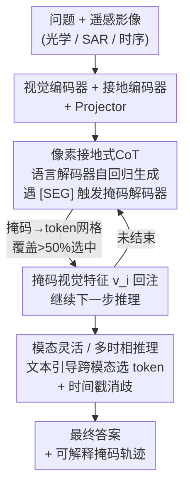

# TerraScope: Pixel-Grounded Visual Reasoning for Earth Observation

**会议**: CVPR 2026  
**论文**: [CVF Open Access](https://openaccess.thecvf.com/content/CVPR2026/html/Shu_TerraScope_Pixel-Grounded_Visual_Reasoning_for_Earth_Observation_CVPR_2026_paper.html)  
**代码**: https://shuyansy.github.io/terrascope/  
**领域**: 多模态VLM  
**关键词**: 遥感VLM, 像素级推理, 交错式CoT, 多模态融合, 分割接地

## 一句话总结
TerraScope 让遥感 VLM 在推理的每一步都生成分割掩码、并把被掩码区域的视觉特征回注到推理链里（"用像素思考"），配套 100 万条带像素掩码的 CoT 数据集 Terra-CoT 和首个评估"答案+掩码质量"双指标的 TerraScope-Bench，在地表覆盖率估计、面积排序、变化检测等细粒度地理空间任务上大幅超过现有 VLM。

## 研究背景与动机

**领域现状**：遥感（EO）领域正从"任务专用模型"转向统一的视觉语言模型（VLM），近年 RSGPT、GeoChat、EarthDial 等通过大规模遥感指令微调，在影像描述、VQA、视觉接地等标准任务上已有不错表现。

**现有痛点**：但这些模型在**需要像素级精度的细粒度空间推理**上集体失灵。论文 Fig.1 给的例子很直观——问"水体占图像多大比例"，GPT-4o、Qwen3-VL（带推理）、EarthDial（遥感专用）给出的答案在 30%~50% 之间乱猜，而真值是 13%。它们要么直接输出错误数字，要么只在语言空间里做文本 CoT，凭"看起来占右边三分之一"这种模糊视觉印象推理，无法落到具体像素。

**核心矛盾**：遥感影像和自然图像有两点本质差异，导致自然图像里的"先框选再推理"范式无法直接搬过来。其一，遥感影像是**连续的空间分布**（地表类型渐变过渡），不像自然图像里有离散物体，用粗粒度的框/裁剪去接地会引入大量噪声；其二，遥感分析天然涉及**多传感器与多时相**数据（光学测地表反射、SAR 全天候观测、多时相揭示变化），现有 VLM 没法在单一框架里灵活整合这些模态与时序信息。

**本文目标**：构建一个统一框架，让推理的每一步都接地到**精确的分割掩码**而非粗框，同时支持多时相变化推理与光学/SAR 自适应融合。

**切入角度**：作者把"thinking with images"的范式推进到"thinking with pixels"——不再依赖外部分割工具（增加复杂度、降低可控性），而是用**混合解码器**让语言模型自己决定何时触发掩码生成，并把掩码对应的视觉 token 交错注入推理序列。

**核心 idea**：把分割掩码当作推理链中的"视觉证据"，与文本 token 交错生成（interleaved CoT），用像素级证据约束每一步空间推理。

## 方法详解

### 整体框架

TerraScope 基于 InternVL3 搭建，在视觉-语言架构上增挂一个像素级分割模块，使"视觉接地"与"语言推理"在同一个模型里闭环。形式化地，传统 VLM 是纯语言推理 $[r_1, r_2, \dots, r_k, a] = f(v, q)$（$r_i$ 是第 $i$ 步文本推理，$a$ 是答案）；TerraScope 把它改成把掩码视觉特征交错进来的形式：

$$[r_1, (m_1, v_1), r_2, (m_2, v_2), \dots, r_k, (m_k, v_k), a] = f(v, q)$$

即每一步推理 $r_i$ 之后都生成一个分割掩码 $m_i$，并从掩码区域选出视觉特征 $v_i$ 回注，让下一步推理"看着像素证据"继续。整体管线是：问题+影像 → 视觉编码器/接地编码器编码 → 语言模型自回归生成文本，途中遇到 `[SEG]` 就触发掩码解码器分割、选 token、回注 → 直到给出答案。在此之上再叠两条能力——多模态（光学+SAR）与多时相。训练分两阶段：先用 200 万参照表达分割对做接地预训练，再用 100 万 Terra-CoT 样本激发像素级推理。

### 关键设计

**1. 像素接地式 CoT：让分割掩码与文本推理交错生成**

这一步直接对准"模型只会在语言空间里凭模糊印象猜数字"的痛点。核心是**双解码器协同**：TerraScope 监听语言解码器的自回归输出，一旦检测到 `[SEG]` 标记（通常出现在提到关键地物之后），就触发掩码解码器预测该地物的分割掩码，然后从掩码覆盖的区域选出视觉 token 注入推理序列，引导后续生成。比如回答"水和路谁更大"，模型会生成"我先识别水体 `[SEG]`……再识别道路 `[SEG]`"，然后通过比较两块掩码区域的视觉特征得出答案。

技术上要解决掩码（像素级）和视觉 token（网格级）对不齐的问题：先把掩码 $m_i$ resize 到 token 网格分辨率 $(n\cdot s)\times(m\cdot s)$（影像被切成 $n\times m$ 个 patch，每 patch 出 $s\times s$ 个 token，InternVL 取 $s=16$）；对部分重叠，**只有当掩码覆盖某 token 对应空间区域超过 50% 时才选中该 token**，得到 token 级掩码 $m_i^{tok}$，再抽取被选特征 $v_i = \{v_j \mid m_i^{tok}[j]=1,\ j\in[1,N]\}$。这些特征经 projector 投影展平成 1D 序列后，与文本 embedding 对齐喂回 LLM，基于已生成 token 的 KV cache 继续生成。这样推理的每一步都被真实像素证据约束，而不是文本幻觉。消融里 Random-Mask CoT（随机选 token）反而比纯文本 CoT 更差，说明"选对区域"才是关键。

**2. 模态灵活与多时相推理：文本引导的逐 token 模态选择 + 时间戳消歧**

遥感数据常是光学-SAR 配对或时序序列，这一设计让同一框架自适应处理。对**光学-SAR 配对**，目标是清晰区域用光学的光谱信息、云遮挡区域靠 SAR 的全天候观测。做法是文本引导的逐 token 模态选择：光学、SAR 各自过视觉编码器得到 $v_{opt}$、$v_{SAR}$，与长度为 $L$ 的问题 embedding 算跨注意力并在文本维度聚合，得到每个视觉 token 对问题的相关度分数

$$\beta^{\mu}_j = \frac{1}{L}\sum_{\ell=1}^{L}\mathrm{Softmax}\!\left(\frac{v^{\mu}q^{\top}}{\sqrt{D}}\right)_{j\ell},\quad \mu\in\{opt, SAR\}$$

选 token 时，每个位置取相关度更高的那个模态：$v_j = v^{opt}_j$ 若 $\beta^{opt}_j > \beta^{SAR}_j$，否则取 $v^{SAR}_j$（仅对 $m_i^{tok}[j]=1$ 的位置）。这是一种**空间自适应**的融合——不同位置可来自不同模态。对**多时相序列**，难点是时间消歧：每个 `[SEG]` 必须说清楚"从哪张时相图分割""从哪张图取视觉 token"。作者在 `[SEG]` 前显式插入时间指示符 `Image: ti`，语言解码器生成该信号时掩码解码器就从影像 $t_i$ 分割、特征模块从 $v(t_i)$ 采样，模型通过 Terra-CoT 里带帧级掩码的时序推理轨迹学会自己生成时间戳。

**3. Terra-CoT：两阶段自动管线，造出 100 万条带像素掩码的 CoT 数据**

像素级视觉 CoT 数据的稀缺是规模化的瓶颈——现有遥感数据要么只有分割标签、要么只有 VQA 对，没有"两者+推理轨迹"。作者用两阶段自动管线解决。**第一阶段（带 CoT 的接地式描述）**：拿有语义标注的数据集，把各地表类别用彩色掩码高亮并标注，提示大模型生成在推理中显式引用这些掩码区域的详细描述（Cap-CoT），产出 25 万条，既用来训练 TerraScope，也训出一个中间标注器 TerraScope-Cap，能给无标注影像生成像素级接地描述。**第二阶段（层次化合成）**：用 TerraScope-Cap 给光学/SAR/时序多源、覆盖全球的影像打多类别像素标签，再做两级合成——L1 是模板化的基础空间任务（存在性、计数、定位、面积量化、边界检测），用分割标签合成像素接地推理轨迹；L2 让 LLM 把多个 L1 组合成复杂多步推理，分 L2-Spatial（跨实体空间关系，如"水是否与作物相邻"）和 L2-Semantic（需领域知识，如"该区域是否适合耕种"）。最终得到 100 万条多能力 Terra-CoT。

**4. TerraScope-Bench：首个像素接地地理空间推理基准，答案+掩码双指标**

现有遥感基准（BigEarthNet、ChatEarthNet 等）偏重场景分类、描述这类靠全局视觉线索的粗粒度任务，模型不需真正理解空间就能刷高分。TerraScope-Bench 针对 10m 以上分辨率影像的难点（单个物体只占几像素、地类边界模糊）设计，含 3,837 条专家校验样本、六个子任务：覆盖率分析(855)、绝对面积量化(855)、距离测量(129)、面积比较排序(855)、边界关系检测(855)、建筑变化估计(288)，支持光学/SAR/联合输入与单时相/多时相场景。问答对由分割掩码自动算出空间属性（覆盖比、绝对面积、物体间距离、边界关系）生成真值，再用 LLM 改写出自然措辞和合理干扰项，最后人工过滤错误掩码。关键创新是**双评估指标**：不只看最终答案准确率，还用 IoU 衡量推理过程中分割掩码的质量，验证模型是否真的在推理时关注了正确区域——这堵死了"答案蒙对但根本没看对地方"的虚假接地。

### 损失函数 / 训练策略

两阶段监督微调。第一阶段接地预训练：冻结视觉编码器、projector、LLM，只训掩码解码器（lr=2e-5，batch=8）。第二阶段：解冻 projector 和掩码解码器全量训练、LLM 用 LoRA 微调（lr=1e-5，batch=2），视觉编码器始终冻结。训练时从真值掩码抽取被掩码视觉特征、交错插到 `[SEG]` 之后。总损失为语言建模损失（对文本和 `[SEG]` token 的交叉熵，**不含**注入的视觉特征）加分割损失（Dice + 像素级交叉熵）：

$$L = L_{LM} + \lambda L_{seg},\quad \lambda = 0.5$$

## 实验关键数据

### 主实验

在 TerraScope-Bench（光学）、LandSat30-AU、DisasterM3 上对比 11 个 VLM（节选关键行，TerraScope-Bench 为六子任务平均 Avg）：

| 模型 | 规模 | TerraScope-Bench Avg | LandSat30-AU Avg | DisasterM3 Avg |
|------|------|------|------|------|
| GPT-4o（专有） | - | 38.7 | - | 22.8 |
| Qwen3-VL-Think（推理） | 8B | 43.3 | 65.0 | 32.5 |
| EarthMind（遥感专用） | 4B | 42.1 | - | - |
| InternVL3（Terra-CoT 微调） | 8B | 54.9 | 67.6 | 36.1 |
| GLM-4.1V-Think（Terra-CoT 微调） | 9B | 59.6 | 68.0 | 38.8 |
| **TerraScope** | 8B | **68.9** | **73.9** | **46.5** |

关键看点：未经微调的通用/遥感专用模型在覆盖率、面积估计这类细粒度任务上接近随机（30%~40%）；仅用 Terra-CoT 微调 InternVL3/GLM 就能大涨（如 InternVL3 Avg 36.0→54.9），但距离测量(DM)、建筑变化估计(BCE)仍难——说明数据之外还需专门的像素接地架构。TerraScope 在三个基准全部最佳，在 BCE 上达到 52.1（次优 GLM 微调版 34.7）。

### 消融实验

不同 CoT 策略的对比（Tab.2，"Original"为预训练后基座，在其上用不同 CoT 变体 SFT）：

| 配置 | TerraScope-Bench | LandSat | Disaster | 说明 |
|------|------|------|------|------|
| Original | 33.8 | 45.7 | 23.6 | 仅预训练基座 |
| Textual CoT w/o Seg. | 58.7 | 56.5 | 32.9 | 纯文本 CoT，冻结掩码解码器 |
| Textual CoT with Seg. | 60.6 | 58.9 | 35.8 | 加掩码作辅助监督 |
| Random-Mask CoT | 43.2 | 53.8 | 32.6 | 随机选 token 注入 |
| Box CoT | 62.8 | 70.5 | 43.9 | 用掩码最小外接框选 token |
| **TerraScope** | **68.9** | **73.9** | **46.5** | 完整像素接地 |

多模态融合消融（Tab.3，TerraScope-Bench 各子任务）：

| 配置 | CA | AQ | CR | BRD | DM |
|------|------|------|------|------|------|
| No Fusion | 73.2 | 70.2 | 71.8 | 80.0 | 65.9 |
| Concat. | 74.5 | 71.6 | 73.0 | 81.2 | 67.4 |
| Text-guided (test only) | 72.3 | 69.0 | 66.7 | 78.8 | 63.6 |
| Text-guided (train+test) | 74.3 | 70.9 | 72.7 | 80.7 | 68.2 |

### 关键发现
- **"选对区域"比"有掩码"更重要**：Random-Mask CoT（43.2）甚至低于纯文本 CoT（58.7），说明注入无关视觉信息反而干扰推理；而把粗框（Box CoT，62.8）换成精确像素掩码（68.9）再涨一截，印证遥感连续分布需要像素级而非框级接地。
- **辅助分割监督即使不注入 token 也有用**：Textual CoT with Seg.（60.6）高于 w/o Seg.（58.7），说明联合训练分割本身就隐式改善了推理。
- **文本引导融合需训练+测试一致**：只在测试时启用文本引导选择（72.3）反而掉点，训练测试都用（74.3）才接近 Concat. 水平——融合机制要从训练就一致学习。
- **正确预测对应更高 IoU**：论文用 IoU 分布显示答对的样本掩码 IoU 显著高于答错的，证明答案正确性确实建立在空间接地质量上。

## 亮点与洞察
- **"thinking with pixels" 把 CoT 的视觉证据从框/裁剪细化到掩码**：自然图像 CoT 工作（GRIT 用框、DeepEyes/Chain-of-Focus 用裁剪缩放）在连续地表分布上会引入噪声，本文用分割掩码做接地单元，是针对遥感数据特性的对症设计。
- **`[SEG]` 触发 + 50% 覆盖选 token 的工程细节很实用**：让语言模型自主决定何时分割、再用简单的覆盖阈值把像素掩码对齐到 token 网格，这套"掩码→token 选择→回注 KV cache"的流程可迁移到任何需要细粒度视觉接地的多模态推理任务。
- **双评估指标堵死虚假接地**：只看答案准确率会让"蒙对答案但没看对地方"的模型混过去，加 IoU 评估推理过程是这个 benchmark 最有价值的设计，对评估"可解释推理"有普适意义。
- **时间戳消歧 `Image: ti` 是个轻量但关键的 trick**：多时相场景下用一个显式文本标记就解决了"从哪张图分割/取特征"的歧义，无需改架构。

## 局限与展望
- 作者承认距离测量(DM)、建筑变化估计(BCE)仍是难点，单靠数据扩充不够，需要更专门的架构设计。
- ⚠️ 训练成本不低：200 万分割对预训练 + 100 万 Terra-CoT 微调，且 Terra-CoT 由自动管线+LLM 合成，合成标注（尤其 L2-Semantic 的领域知识判断）的质量上限受标注器 TerraScope-Cap 和提示工程影响，论文主要靠人工过滤错误掩码兜底。
- 模态融合仅覆盖光学+SAR 两模态，高光谱、红外等其它遥感模态未涉及；时序也主要在双时相变化检测上验证。
- 基座绑定 InternVL3，像素接地式 CoT 在其它架构上的可移植性未充分验证。

## 相关工作与启发
- **vs 自然图像视觉 CoT（GRIT / DeepEyes / Chain-of-Focus）**: 它们用边界框坐标或迭代裁剪缩放做接地，本文指出这些粗粒度表示无法刻画遥感的连续空间分布，改用像素级分割掩码，区别在接地粒度从"框/裁剪"细化到"掩码"。
- **vs 遥感专用 VLM（EarthDial / GeoChat / GeoPixel）**: 它们靠大规模遥感指令微调做描述/VQA/视觉接地，但缺乏把分割掩码嵌进推理链的"像素接地推理"能力；本文实验还发现这些遥感专用模型在 TerraScope-Bench 上并不明显优于通用 VLM，疑因其训练数据多为高分辨率(<5m)影像，难迁移到低分辨率场景。
- **vs 依赖外部工具的 EO 推理**: 先前工作调用外部分割工具做推理会增加复杂度、降低可控性；TerraScope 用混合解码器在单一模型内同时生成掩码与推理轨迹，实现内在的像素级推理。

## 评分
- 新颖性: ⭐⭐⭐⭐⭐ 首次把像素级分割掩码交错进遥感 VLM 的推理链，"thinking with pixels"对症遥感连续分布特性
- 实验充分度: ⭐⭐⭐⭐⭐ 11 个模型对比 + 三基准 + 多组消融（CoT 策略/模态融合）+ IoU 过程评估，证据链完整
- 写作质量: ⭐⭐⭐⭐ 框架、数据、基准三块叙述清晰，公式与图示到位，部分附录细节需查原文
- 价值: ⭐⭐⭐⭐⭐ 同时贡献统一框架、100 万 CoT 数据集、首个像素接地基准+双指标，对遥感细粒度推理是完整的基础设施

<!-- RELATED:START -->

## 相关论文

- [\[CVPR 2026\] SPARROW: Learning Spatial Precision and Temporal Referential Consistency in Pixel-Grounded Video MLLMs](sparrow_learning_spatial_precision_and_temporal_referential_consistency_in_pixel.md)
- [\[CVPR 2026\] CodePercept: Code-Grounded Visual STEM Perception for MLLMs](codepercept_code-grounded_visual_stem_perception_for_mllms.md)
- [\[CVPR 2026\] Granulon: Awakening Pixel-Level Visual Encoders with Adaptive Multi-Granularity Semantics for MLLM](granulon_awakening_pixel-level_visual_encoders_with_adaptive_multi-granularity_s.md)
- [\[CVPR 2026\] Think with 3D: Geometric Imagination Grounded Spatial Reasoning from Limited Views](think_with_3d_geometric_imagination_grounded_spatial_reasoning_from_limited_view.md)
- [\[CVPR 2026\] Thinking Diffusion: Penalize and Guide Visual-Grounded Reasoning in Diffusion Multimodal Language Models](thinking_diffusion_penalize_and_guide_visual-grounded_reasoning_in_diffusion_mul.md)

<!-- RELATED:END -->
