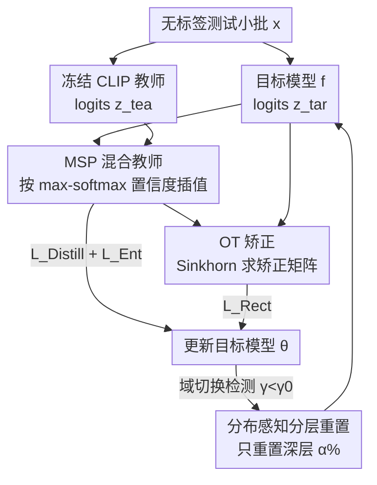

# Test-Time Distillation for Continual Model Adaptation

**会议**: CVPR 2026  
**arXiv**: [2506.02671](https://arxiv.org/abs/2506.02671)  
**代码**: https://github.com/walawalagoose/TTD (有)  
**领域**: 多模态VLM / 测试时自适应  
**关键词**: 持续测试时自适应, 视觉语言模型, 知识蒸馏, 最优传输, MSP置信度

## 一句话总结
针对持续测试时自适应（CTTA）中"模型用自己预测当监督、错误越滚越大"的痛点，本文提出用一个冻结的 CLIP 当外部教师来打破这个自指反馈环（称为 Test-Time Distillation, TTD），并设计 CoDiRe 框架——用基于 MSP 置信度的混合教师 + 最优传输矫正——在 ImageNet-C 上比 CoTTA 高 10.55% 且只花它 48% 的时间。

## 研究背景与动机
**领域现状**：深度网络部署时常因分布偏移（噪声、模糊、风格变化）掉点。测试时自适应（TTA）让模型在推理阶段无标签地在线对齐目标分布；其中持续测试时自适应（CTTA）处理的是分布**连续演变**的场景。从 CoTTA 到后续各种变体，主流做法都根植于**自监督**：用模型自己的预测（熵最小化或自蒸馏，以源模型为教师）来生成学习目标。

**现有痛点**：自监督信号是一个**自指（self-referential）反馈环**。在显著域偏移下，模型最初的预测本就充满噪声、不可靠；把这种输出当监督信号会形成危险回路——初始错误不仅没被纠正，反而被**放大**，导致模型逐渐漂移（model drift）偏离最优点。CTTA 的核心问题不只是"适应"，而是"如何**可靠地**适应而不强化自身偏见"。

**核心矛盾**：监督信号完全来自模型内部，存在天然的性能天花板——内部信号无法提供独立于源训练集、又不受目标域偏移影响的"锚点"。

**切入角度**：作者想引入**外部知识**做稳定锚点。现代视觉语言模型（VLM，以 CLIP 为代表）在网络规模图文对上预训练，语义理解丰富且**与任何单一任务分类器的归纳偏置正交**——它既独立于源训练集，又不受目标域偏移影响，是理想的外部信号源。

**核心 idea**：把适应重新框定为**以冻结 VLM 为教师的蒸馏过程**（TTD 范式），从"自指纠错"转向"外部引导"。但直接蒸馏 CLIP 有两个坑：① **泛化者陷阱（Generalist Trap）**——CLIP 知识广却不专精，在域偏移（尤其 corruption）下甚至打不过同 backbone 的有监督分类器，且单纯堆参数（ViT-L/14 比 RN50 大 10 倍）也补不上这个差距；② **熵偏置（Entropy Bias）**——异构模型因架构/校准/训练差异有各自不同的熵分布，用熵当融合权重会系统性偏向"全局熵更低"的模型，给出扭曲的蒸馏目标。于是真正的目标变成：怎么从有效的融合技术里**构造稳健的监督信号**，再用它引导目标模型稳定适应。

## 方法详解

### 整体框架
CoDiRe（Continual Distillation and Rectification）接收在线到来的无标签测试小批，借一个**冻结的 CLIP ViT-L/14** 当外部教师，在线更新源预训练的目标模型 $f(\cdot)$。它由两大组件串成：**蒸馏（Distillation）** 先把 CLIP 与目标模型的 logits 用 MSP 置信度动态插值，融成一个比任一单模型都更可靠的"混合教师"，作为蒸馏目标绕开泛化者陷阱与熵偏置；**矫正（Rectification）** 再用最优传输（OT）在小批内施加边际约束，把目标模型的预测拉向混合教师投票出的类别分布、防止坍缩。两者加上一个常规熵损失共同更新目标模型，外加一个**分布感知的分层重置**机制对抗持续适应中的灾难性遗忘。CLIP 全程冻结、不需要梯度甚至可走 API，额外开销只是一次 CLIP 前向。

### 关键设计

**1. MSP 混合教师：用最大softmax概率当裁判，绕开泛化者陷阱与熵偏置**

直接拿 CLIP 当教师会踩泛化者陷阱（CLIP 在 corruption 上打不过同 backbone 有监督分类器），而升级教师模型（LLaVA、BLIP-2、GPT-4-Turbo）反而更差、放大 CLIP 也没用，所以作者走"构造更可靠蒸馏目标"这条路——把 CLIP 与目标模型的 logits **线性插值**融成混合教师：$\mathbf{z}^{\text{bt}}_i = \lambda_i \cdot \mathbf{z}^{\text{tea}}_i + (1-\lambda_i)\cdot \mathbf{z}^{\text{tar}}_i$，两路 logits 先各自减去 LogSumExp 归一到对数概率空间以保证尺度一致。

关键在权重 $\lambda_i$ 怎么定。理想权重应正比于"谁在当前样本上更准"（即交叉熵更低），但无标签场景拿不到真值，常规做法用熵当代理——而这正是熵偏置的来源：异构模型熵分布峰值错位，熵权重会被全局低熵的模型带偏。作者改用**最大 softmax 概率（MSP）**当置信度代理：

$$\lambda_i = \frac{\exp(\max(p^{\text{tea}}_i))}{\exp(\max(p^{\text{tea}}_i)) + \exp(\max(p^{\text{tar}}_i))}.$$

文中通过相关性实验证明：在两模型预测冲突的样本上，MSP 置信度与交叉熵的相关性显著高于熵，且跨异构模型的分布一致性更好（既"有效"又"可比"）。蒸馏损失再用混合教师自身的置信度 $\max(p^{\text{bt}}_i)$ 加权（越自信的教师影响越大）：$\mathcal{L}_{\text{Distill}}(x_i) = -\max(p^{\text{bt}}_i)\sum_{c=1}^{K} p^{\text{bt}}_{ic}\log p^{\text{tar}}_{ic}$，并把 $p^{\text{bt}}_i$ 直接当推理输出。

**2. 最优传输矫正：在小批内施加边际约束，防止预测坍缩**

蒸馏是逐样本的，缺乏批级全局约束，容易出现"所有样本都被自信地塞进同一类"的坍缩。作者引入一个 OT 步骤构造**矫正矩阵** $\mathbf{P}^{\text{rm}}$，在保真于目标模型原始预测的同时强加全局边际约束。形式上是求一个传输计划最大化与目标预测的对齐：$\max_{\mathcal{P}} \operatorname{tr}(\mathbf{P}^{\text{rm}\top}\mathbf{P}^{\text{tar}})$，约束为 $\mathbf{P}^{\text{rm}}\mathbf{1}_N = \mathbf{m}$、$\mathbf{P}^{\text{rm}\top}\mathbf{1}_K = \mathbf{u}_N$。其中行边际 $\mathbf{m}$（小批的类别分布先验）由 $p^{\text{bt}}_i$、$p^{\text{tar}}_i$、$p^{\text{tea}}_i$ 三方**伪标签投票**给出，作为真值类别分布的可靠代理。该问题松弛后用 **Sinkhorn 算法**几步迭代求解。得到平滑、分布对齐的软分数 $p^{\text{rm}}_i$ 后，用它与目标预测的**互信息**做矫正损失：$\mathcal{L}_{\text{Rect}}(x_i) = -\text{MI}(p^{\text{tar}}_i; p^{\text{rm}}_i)$。这样在 mini-batch 层面提升了鲁棒性，避免严重类不均衡。

**3. 分布感知的分层重置：只重置深层，针对性对抗灾难性遗忘**

CTTA 长流中模型会灾难性遗忘。CoTTA 用随机重置一部分参数，作者认为太粗糙——既不全重置也不随机重置，而是**先检测域切换再选择性重置**。维护一个锚点 $\theta^{\text{anchor}}$（初始化为 $\theta_0$，每 $s$ 步更新一次），定义两个位移向量 $\delta_t = \theta_t - \theta_{t-1}$ 与 $\delta^{\text{anchor}}_t = \theta_{t-1} - \theta^{\text{anchor}}$，用它们的**余弦相似度** $\gamma = \cos(\delta_t, \delta^{\text{anchor}}_t)$ 衡量更新方向是否发散；当 $\gamma < \gamma_0$ 判定为域切换。

切换时不是全重置，而是基于"深层捕获域特定激活统计、最易被偏移污染，浅层编码域不变的结构线索（形状、边缘）"这一观察，**只重置最后 $\alpha\%$ 的深层**。消融显示：选择性重置深层在很宽的 $\alpha$ 区间都稳定最优，而重置浅层/随机层/最大漂移层往往连"不重置"都不如——因为它们破坏了有益适应或干扰了域不变特征的学习。

### 损失函数 / 训练策略
总损失叠加三项：$\mathcal{L}_{\text{total}} = \mathcal{L}_{\text{Ent}} + \mathcal{L}_{\text{Distill}} + \mathcal{L}_{\text{Rect}}$。其中熵损失沿用 TTA 常规做法、让模型跟随当前数据流分布更新：$\mathcal{L}_{\text{Ent}}(x_i) = \mathcal{E}_i / \exp(\mathcal{E}_i - \tau_{\text{Ent}})$，$\mathcal{E}_i$ 为目标预测的熵，$\tau_{\text{Ent}}$ 控制对熵的敏感度。目标模型用 ViT-B/16（ImageNet-C）或 ResNet-50（其余三数据集），CLIP 教师固定为 ViT-L/14 且全程冻结。

## 实验关键数据

### 主实验
评测两类真实场景：corruption（CIFAR-10-C、ImageNet-C，15 种损坏按 severity 5 顺序到来）与域泛化（OfficeHome、PACS）。

| 数据集 | 指标 | CoDiRe(本文) | 之前最优 | 提升 |
|--------|------|------|----------|------|
| CIFAR-10-C | 平均准确率 | **87.25** | DeYO 80.60 | +6.65 |
| ImageNet-C | 平均准确率 | **60.69** | SANTA 59.62 | +1.07 |
| ImageNet-C | vs CoTTA | **60.69** | CoTTA 54.90 | +10.55（且仅 48% 时间） |
| OfficeHome | 平均准确率 | **80.38** | CLIP zero-shot 78.70 | +1.68 |
| PACS | 平均准确率 | **98.33** | CLIP zero-shot 98.22 | +0.11 |

值得注意：在 corruption 上 CLIP 自身很弱（ImageNet-C 仅 35.89，连 ViT-B/16 源模型 39.05 都不如），但 CoDiRe 融合后远超任一单模型；在域泛化上 CLIP 很强（zero-shot 就压过所有 TTA/CTTA baseline），CoDiRe 仍能再提一点，说明它能平衡目标模型的任务专精与 CLIP 的开放世界知识。

与 VLM-TTA 及自造 TTD baseline 对比（四数据集平均，Table 4）：

| 方法 | CIFAR-10-C | ImageNet-C | OfficeHome | PACS | Avg. |
|------|-----------|-----------|-----------|------|------|
| CLIP zero-shot | 74.39 | 35.89 | 78.70 | 98.22 | 71.80 |
| BoostAdapter (VLM-TTA) | 75.80 | 38.14 | 80.25 | 98.18 | 73.09 |
| Naive Ensemble | 76.90 | 47.95 | 79.89 | 96.29 | 75.26 |
| Distill. CLIP（直接蒸 CLIP） | 77.52 | 48.29 | 61.02 | 78.34 | 66.29 |
| **CoDiRe (本文)** | **87.25** | **60.69** | **80.38** | **98.33** | **81.66** |

"Distill. CLIP"在 OfficeHome/PACS 上崩到 61/78，反向验证了泛化者陷阱——直接拿 CLIP 当蒸馏目标会把目标模型带坏。

### 消融实验
逐项加回四个组件（CIFAR-10-C / ImageNet-C 平均）：

| 配置 | CIFAR-10-C | ImageNet-C | 平均 | 说明 |
|------|-----------|-----------|------|------|
| (1) 仅混合教师 BT（无梯度） | 84.46 | 48.05 | 66.26 | 不回传梯度就已超过单模型 |
| (2) w/o $\mathcal{L}_{\text{Distill}}$ | 86.71 | 59.30 | 73.01 | 去蒸馏掉最多 |
| (3) w/o $\mathcal{L}_{\text{Rect}}$ | 87.02 | 59.82 | 73.42 | 去矫正 |
| (5) w/o $\mathcal{L}_{\text{Ent}}$ | 87.11 | 60.15 | 73.63 | 去熵损失 |
| (6) w/o reset | 86.71 | 60.41 | 73.56 | 去重置 |
| **(7) 完整 CoDiRe** | **87.25** | **60.69** | **73.97** | 全部 |

### 关键发现
- **混合教师是地基**：即使完全不回传梯度，仅靠 MSP 混合教师（配置1）就已超过目标模型和 CLIP 各自的水平，证明融合本身就有效。
- **蒸馏损失贡献最大**：去掉 $\mathcal{L}_{\text{Distill}}$（配置2）平均掉到 73.01，是四项里掉点最多的。
- **融合权重之争**：MSP 动态权重整体比固定平均更稳；熵权重效果有限、有时甚至导致严重退化，与熵偏置结论一致。直接平均其实是个"出乎意料地强"的简单 baseline。
- **重置策略**：选择性重置深层在很宽的 $\alpha$ 区间稳定最优；重置浅层/随机/最大漂移层常不如不重置。对 $\gamma_0$ 和步长 $s$ 都鲁棒。
- **效率**（ImageNet-C，V100）：CoTTA 显存 18.41 GiB、耗时 36.62 min；CoDiRe 因 CLIP 冻结只需 8.18 GiB、17.86 min（≈CoTTA 的 48%），额外开销主要是一次 CLIP 前向（延迟 +约30%）。

## 亮点与洞察
- **把"自指反馈环"问题重新框定为蒸馏问题**：CTTA 长期困在"用自己的预测当监督"的天花板里，本文一句"引入正交的外部锚点"就把问题换了赛道——这是最让人"啊哈"的视角转换，且 CLIP 冻结、可走 API，工程上极友好。
- **两个 pitfall 是诚实且可迁移的负面发现**：泛化者陷阱（VLM 广而不精、堆参数也补不上）和熵偏置（异构模型熵不可直接比）不止适用于 TTD，对任何"拿 VLM 当教师/做模型融合"的工作都是警示——别默认 CLIP 更强、别用熵当跨模型置信度。
- **MSP 当跨模型置信度裁判**：相比熵，MSP 在异构模型间分布更一致、与交叉熵相关性更高，这个"用 max-softmax 而非熵做融合权重"的 trick 可直接搬到模型集成/合并场景。
- **OT + 三方投票边际**：用 CLIP/目标/混合三方伪标签投票估计批级类别分布、再用 Sinkhorn 施加全局约束防坍缩，是个轻量又巧妙的批级正则。

## 局限性 / 可改进方向
- **依赖 CLIP 的预训练覆盖**：当目标任务的类别/分布远离 CLIP 的网络规模先验时（如细粒度专业领域、CLIP 没见过的概念），外部锚点本身可能不可靠，混合教师的上限会被 CLIP 拖累。
- **额外推理开销**：虽比 CoTTA 省，但每个 batch 多一次 ViT-L/14 前向，显存与延迟仍高于纯 entropy-min 类方法（如 Tent），资源受限的端侧部署需权衡。
- **重置机制超参偏经验**：$\gamma_0$、$s$、$\alpha$、锚点更新策略依赖在目标数据上调；虽报告了鲁棒性，但"深层=域特定/浅层=域不变"的假设在非 CNN/ViT 或更复杂架构上是否成立未充分验证。
- **任务局限**：实验集中在图像分类的 corruption 与域泛化，未涉及检测/分割等密集预测任务，TTD 范式在这些任务上能否同样奏效待验证。

## 相关工作与启发
- **vs CoTTA / 自蒸馏式 CTTA**：它们以源模型为教师做自蒸馏对抗遗忘，监督信号本质是内部的、有性能天花板；本文用**外部冻结 CLIP** 当教师打破自指环，在 ImageNet-C 上高 10.55% 且省一半时间。
- **vs VLM-TTA（TPT/TDA/BoostAdapter/ZERO）**：那条线是"在测试时改进 CLIP 自身"以提升 OOD 泛化，但在 corruption 上表现差（ZERO 在 ImageNet-C 仅 17.43）；本文反过来用 CLIP 去增强**目标模型**，两类知识互补，在 corruption 与域泛化上都拿 SOTA。
- **vs 离线知识蒸馏（CLIP-KD / CLIPPING 等）**：传统蒸馏是离线训练紧凑学生网络、最小化师生特征差异；本文是**在线测试流中**让目标模型在 CLIP 引导下自演化，同时吸收世界知识又保留自身的分布敏感性。
- **vs 基于熵的融合/集成/合并**：本文用相关性实验指出熵在异构模型间有系统偏置，改用 MSP——这对所有"拿置信度当模型专长权重"的融合工作都是直接可借鉴的方法论修正。

## 评分
- 新颖性: ⭐⭐⭐⭐⭐ 首次把 VLM 引入 CTTA 当蒸馏教师，并诚实地揭示并解决两个非平凡的 pitfall（泛化者陷阱、熵偏置）。
- 实验充分度: ⭐⭐⭐⭐⭐ 4 数据集、两类场景、覆盖 TTA/CTTA/VLM-TTA/自造 TTD 四类 baseline，含逐组件消融、融合权重/重置策略/效率分析。
- 写作质量: ⭐⭐⭐⭐⭐ 动机→pitfall→方法的逻辑链清晰，pitfall 的 motivating experiment 充分，公式与图表自洽。
- 价值: ⭐⭐⭐⭐⭐ TTD 是高效且实用的新范式（CLIP 冻结、可 API），MSP 融合与外部锚点思路可迁移到更广的 OOD 适应与模型融合场景。

<!-- RELATED:START -->

## 相关论文

- [\[CVPR 2026\] Condensed Test-Time Adaptation of VLMs for Action Recognition](condensed_test-time_adaptation_of_vlms_for_action_recognition.md)
- [\[CVPR 2026\] Decoupling Stability and Plasticity for Multi-Modal Test-Time Adaptation](decoupling_stability_and_plasticity_for_multi-modal_test-time_adaptation.md)
- [\[CVPR 2026\] Multi-modal Test-time Adaptation via Adaptive Probabilistic Gaussian Calibration](multi-modal_test-time_adaptation_via_adaptive_probabilistic_gaussian_calibration.md)
- [\[CVPR 2026\] Dynamic Logits Adjustment and Exploration for Test-Time Adaptation in Vision Language Models](dynamic_logits_adjustment_and_exploration_for_test-time_adaptation_in_vision_lan.md)
- [\[CVPR 2026\] Ramen: Robust Test-Time Adaptation of Vision-Language Models with Active Sample Selection](ramen_robust_test-time_adaptation_of_vision-language_models_with_active_sample_s.md)

<!-- RELATED:END -->
