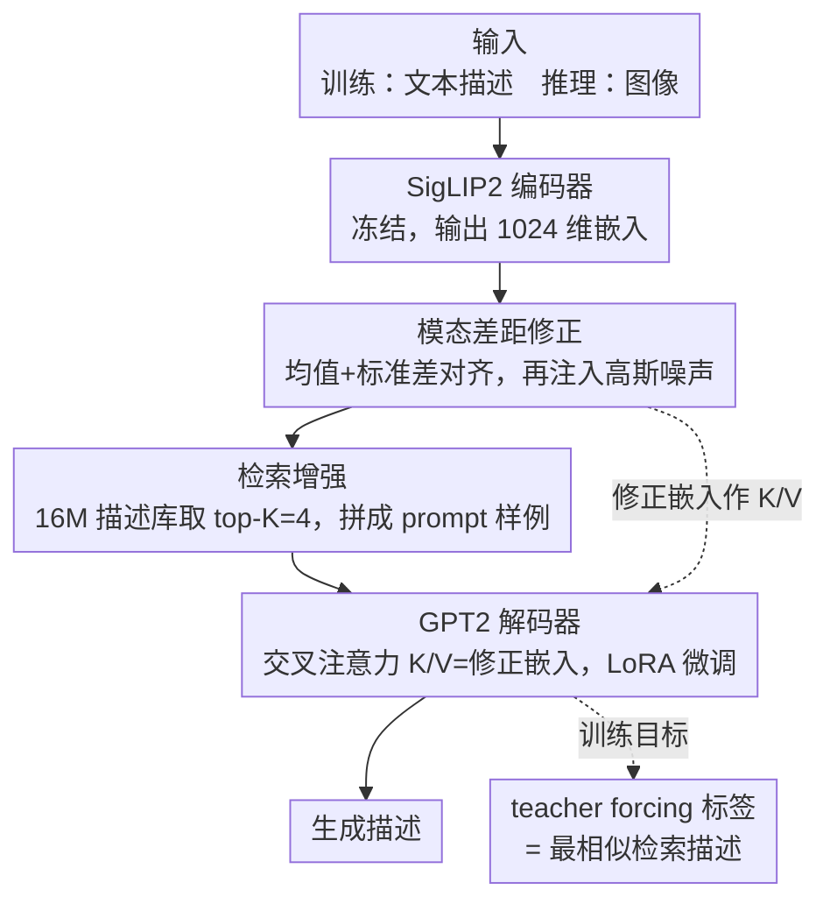

# Text-Only Training for Image Captioning with Retrieval Augmentation and Modality Gap Correction

**会议**: CVPR 2026  
**arXiv**: [2512.04309](https://arxiv.org/abs/2512.04309)  
**代码**: 待确认  
**领域**: 多模态VLM  
**关键词**: 图像描述, 纯文本训练, 检索增强, 模态差距修正, CLIP

## 一句话总结
提出TOMCap——一种纯文本训练的图像描述方法，通过检索增强+模态差距修正+LoRA微调，在训练时只用文本而推理时处理图像，超越了已有的无训练和纯文本方法。

## 研究背景与动机
**领域现状**：图像描述通常依赖大规模人工标注的图像-文本对进行监督训练。近年来出现了两类低资源方法：无训练方法（如ZeroCap）利用预训练模型零样本推理；纯文本方法仅用文本语料训练后在推理时切换到图像输入。

**现有痛点**：无训练方法容易产生幻觉，纯文本方法受限于CLIP模态差距——图像嵌入和文本嵌入在同一空间中的分布不完全对齐，导致训练时用文本特征、推理时用图像特征会产生偏差。

**核心矛盾**：纯文本训练的核心假设是文本嵌入可以替代图像嵌入，但CLIP的模态差距使这一假设不完全成立。现有方法只用高斯噪声注入来弥补差距，效果有限。

**本文目标**：整合检索增强、模态差距修正和latent表示解码三种策略，构建更强的纯文本训练框架。

**切入角度**：不仅修正均值，还对齐标准差来缩小模态差距；同时结合检索相似描述作为prompt来引导生成。

**核心 idea**：联合使用检索增强prompt构建、均值-标准差对齐的模态差距修正、和交叉注意力latent引导，实现高质量纯文本训练的图像描述。

## 方法详解

### 整体框架
TOMCap 想解决的是「训练时手里只有文本、推理时却要描述图像」这个错位问题。它的做法是让文本和图像在 CLIP 空间里尽量站到同一个位置上，再用检索来的相似描述当参考、用一个轻量解码器把这些信息组织成句子。

整条 pipeline 在训练和推理两条路上是镜像的，只是入口不同。训练时拿一句文本描述喂进 SigLIP2 编码器（充当 CLIP 式的图文共享编码器）得到嵌入，先做模态差距修正把它"挪"到图像嵌入的分布上，再拿这个嵌入去 16M 描述库里检索若干条相似描述拼成 prompt，最后让带交叉注意力和 LoRA 的 GPT2 解码出句子；teacher forcing 的目标不是这句文本自己，而是检索回来最相似的那条描述。推理时唯一的区别是入口换成图像：图像经同一个 SigLIP2 编码器得到嵌入，后面修正、检索、prompt 构建、交叉注意力解码完全走同一套。正因为训练阶段已经把文本嵌入对齐到了图像分布，推理时直接喂图像嵌入才不会"水土不服"。

### 关键设计

**1. 模态差距修正：不止对齐均值，还要对齐方差**

纯文本训练的命门在于一个隐含假设——文本嵌入能替图像嵌入上场。但在 SigLIP2 这类 CLIP 式编码器里，图像和文本嵌入虽然在同一空间，分布却没完全重合，这道缝就是所谓的 CLIP 模态差距。已有工作（如 CapDec）只把两类嵌入的均值对齐，等于只修了分布的位置、没修分布的形状。TOMCap 在每一维上做一次标准化重缩放：

$$e_d^{T'_n} = (e_d^{T_n} - \mu_d^T) \times \frac{\sigma_d^I}{\sigma_d^T} + \mu_d^I$$

先减去文本侧均值 $\mu_d^T$、按图文标准差之比 $\sigma_d^I/\sigma_d^T$ 缩放、再加回图像侧均值 $\mu_d^I$。这样修正后的文本嵌入不光中心点挪到了图像分布上，连每一维的离散程度（方差）也对齐了。一阶矩管位置、二阶矩管形状，两个都对齐才能把模态差距的"半径"真正压下去——消融里这一步比单纯对齐均值多拿约 2 个 CIDEr。在重缩放之后，TOMCap 还沿用 CapDec 的思路往每一维注入高斯噪声进一步抹平残余差距，而且给交叉注意力输入和检索结果分别用两套独立的噪声幅度（缩放系数 $B$ 与 $L$），因为这两路对噪声的敏感度不同。

**2. 检索增强：让相似描述当 prompt 里的样例**

光把嵌入对齐还不够，模型还需要知道"这类内容大家一般怎么描述"。TOMCap 用 SigLIP2 把一个约 16M 条描述的数据库全部编码好，拿当前输入嵌入做最近邻检索取 top-K，把检索回来的描述直接拼进文本 prompt：`"Similar images have the following captions: {c1}...{ck}. Write a caption:"`。这些相似描述等于给模型提供了风格和语义上的现成参考，把"该说什么、怎么措辞"的负担从解码器身上卸下来一部分。消融显示检索是贡献最大的组件，去掉它 CIDEr 掉得最狠；而 K 取 4 最好，再多反而把不相关的描述也检索进来引入噪声。

**3. 交叉注意力 + LoRA：在 latent 层面注入视觉线索，又不动主干**

prompt 是文字层面的引导，但修正后的 CLIP 嵌入本身也带着丰富的视觉信息，不该只当个被丢弃的检索 key。TOMCap 在 GPT2 各层插入交叉注意力层：以修正后的 CLIP 嵌入（输入嵌入 + K 个检索结果嵌入）作为 key/value，GPT2 的隐藏状态作为 query，让解码每一步都能回看这组视觉/语义向量。同时只用 LoRA（rank=32）去微调注意力的投影矩阵，CLIP 和 GPT2 主干全程冻结。这么做一方面让视觉引导发生在 latent 级别而不只是 prompt 文本级别，另一方面避免全参数微调把 GPT2 的语言能力冲掉（灾难性遗忘）。

**4. 训练目标：拿"最相似的检索描述"当标签，而不是原始标注**

最后一个设计点很反直觉：teacher forcing 的目标不用这句文本自己的 ground truth，而是从数据库里挑出与输入嵌入最相似的那条描述来当标签。这等于在逼模型学一条映射——"相似的嵌入应该解码出相似的描述"。因为推理时图像嵌入检索到的也是这批相似描述，训练时就让模型习惯"看着相似嵌入、产出对应描述"的模式，图文换轨时行为更一致，泛化也更稳。这一步把检索从单纯的"输入辅助"顺势升级成了"目标构建"。

### 损失函数 / 训练策略
标准交叉熵损失，预测检索出的最相似描述的 token 序列。CLIP 和 GPT2 主干参数全部冻结，只训练新插入的交叉注意力层和 LoRA 参数，因此可训练参数量很小。在单张 NVIDIA RTX 6000 上训练约 6 小时即可，配合纯文本数据，整体成本很低。

## 实验关键数据

### 主实验 (MSCOCO Karpathy test)

| 方法类别 | 方法名 | B@4 | METEOR | CIDEr |
|---------|--------|-----|--------|-------|
| Training-free | LMCap | 19.9 | 22.0 | 75.9 |
| Text-only | CapDec | 26.4 | 25.1 | 91.8 |
| Text-only | ViECap | 27.2 | 24.8 | 92.9 |
| Text-only | EntroCap | 27.6 | 25.3 | 94.3 |
| **Text-only** | **TOMCap (ours)** | **28.8** | **25.5** | **97.8** |

### NoCaps验证集 (CIDEr)

| 方法 | In-domain | Near-domain | Out-domain | Overall |
|------|-----------|-------------|------------|---------|
| ViECap | 61.1 | 64.3 | 65.0 | 66.2 |
| EntroCap | 62.5 | - | - | - |
| **TOMCap** | **71.2** | **70.8** | **68.5** | **70.4** |

### 关键发现
- TOMCap在MSCOCO和NoCaps上均超越所有纯文本和无训练方法
- 检索增强是最重要的组件，移除后CIDEr下降最多
- 均值+标准差对齐比仅均值对齐带来约2点CIDEr提升
- 检索数量K=4效果最佳，过多检索引入噪声
- 在NoCaps的Out-domain上优势明显，说明泛化能力强

## 亮点与洞察
- **模态差距修正的改进**：从一阶矩（均值）扩展到二阶矩（标准差）的对齐，虽然简单但有效。这一思路可迁移到其他跨模态对齐场景。
- **检索作为训练目标**：用最相似检索结果而非原始标注作为训练目标，巧妙地将检索从输入辅助升级为目标构建，提升泛化性。
- **极低训练成本**：仅需文本数据和单GPU 6小时训练，非常适合资源受限场景。

## 局限与展望
- 仍然无法达到全监督方法的性能水平，差距约10-15个CIDEr点
- 依赖外部数据库（16M描述），数据库质量和覆盖度直接影响性能
- CLIP模态差距在不同域的偏移可能不同，均匀修正可能不是最优
- 仅使用GPT2-base作为解码器，更大的LLM可能带来更好效果但需要更多计算

## 相关工作与启发
- **vs SmallCap**：SmallCap也用检索增强+交叉注意力，但需要图像-文本对训练；TOMCap去除了图像训练数据的依赖
- **vs CapDec**：CapDec用高斯噪声弥补模态差距；TOMCap用统计矩对齐更精确地修正

## 评分
- 新颖性: ⭐⭐⭐ 方法是已有技术的组合优化，无根本性创新
- 实验充分度: ⭐⭐⭐⭐ 覆盖MSCOCO和NoCaps，消融详尽
- 写作质量: ⭐⭐⭐⭐ 方法描述清晰，实验部分组织良好
- 价值: ⭐⭐⭐ 纯文本训练图像描述是一个有意义但相对小众的方向

<!-- RELATED:START -->

## 相关论文

- [\[CVPR 2026\] Is the Modality Gap a Bug or a Feature? A Robustness Perspective](is_the_modality_gap_a_bug_or_a_feature_a_robustness_perspective.md)
- [\[CVPR 2026\] Training-Only Heterogeneous Image-Patch-Text Graph Supervision for Advancing Few-Shot Learning Adapters](training-only_heterogeneous_image-patch-text_graph_supervision_for_advancing_few.md)
- [\[CVPR 2026\] Camouflage-aware Image-Text Retrieval via Expert Collaboration](camouflage-aware_image-text_retrieval_via_expert_collaboration.md)
- [\[CVPR 2026\] Bridging the Modality Gap in Compositional Zero-Shot Learning via Sparse Alignment and Unimodal Memory Bank](bridging_the_modality_gap_in_compositional_zero-shot_learning_via_sparse_alignme.md)
- [\[ICCV 2025\] SC-Captioner: Improving Image Captioning with Self-Correction by Reinforcement Learning](../../ICCV2025/multimodal_vlm/sc-captioner_improving_image_captioning_with_self-correction_by_reinforcement_le.md)

<!-- RELATED:END -->
