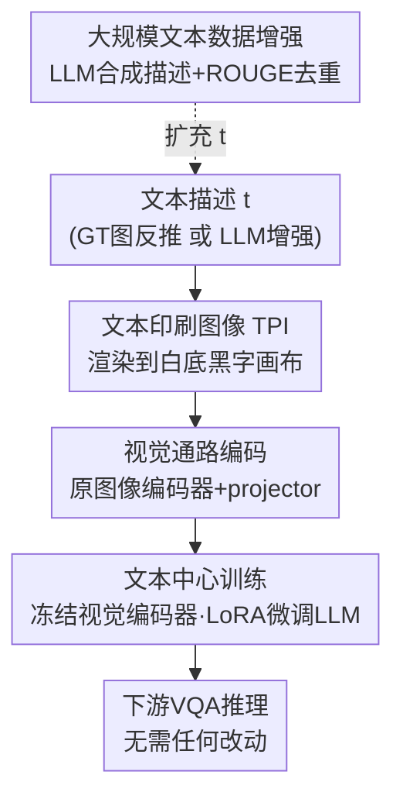

# Text-Printed Image：把文本「印」成图片来弥合图文模态鸿沟

**会议**: CVPR 2026  
**论文**: [CVF Open Access](https://openaccess.thecvf.com/content/CVPR2026/html/Yamabe_Text-Printed_Image_Bridging_the_Image-Text_Modality_Gap_for_Text-centric_Training_CVPR_2026_paper.html)  
**代码**: 无  
**领域**: 多模态VLM  
**关键词**: 文本中心训练, 图文模态鸿沟, 文本渲染图像, 视觉语言模型微调, 低成本数据合成

## 一句话总结
为了在没有真实图片、只有文本描述的情况下微调大视觉语言模型（LVLM），本文提出 Text-Printed Image（TPI）——把文本描述直接渲染到一张纯白画布上当作图像输入，让文本经过视觉编码器进入模型，从而既弥合图文模态鸿沟、又完整保留文本语义，在 4 个模型、7 个 benchmark 上一致优于「纯文本」和「扩散模型生成图像（T2I）」两类基线。

## 研究背景与动机

**领域现状**：LVLM 在各类 VQA 任务上要达到实用性能，通常得用大量「图像–文本」配对数据做任务特定的 SFT。但相比 LLM 能吃海量纯文本语料，LVLM 需要的是「以图像为条件」的指令数据，采集成本高得多，在小众/专业领域更难自动爬取配对。

**现有痛点**：文本天然便宜、好编辑、可以用 LLM 自动扩写出大量多样变体，于是「文本中心训练」（text-centric training，只给文本描述、不给真实图像）成了一个诱人的低成本数据扩展范式。但**直接拿原始文本训练 LVLM 几乎没用**——存在**图文模态鸿沟**（image-text modality gap）：视觉编码器投影出的图像特征和文本特征系统性地落在表示空间的不同区域，模型把同一语义的图和文当成两种信号，纯文本学到的表示在推理时根本迁移不到图像输入上。

**核心矛盾**：要弥合模态鸿沟，最直接的想法是用文生图模型（T2I，如扩散模型）把文本变成图像再训练。但 T2I **保真度差**——生成图像经常偏离原描述语义，和配对的问答对不上；想要高质量还得反复采样+人工筛查，成本飙升，反而丢掉了「文本中心」的低成本优势。已有的 CLIP 系减鸿沟方法又依赖「图文特征维度一一对齐」的假设，而 LVLM 的文本特征是 token 级、维度随输入长度变化，**直接搬不过来**。

**本文目标**：在不改架构、不增加推理开销、广泛兼容现有 LVLM 的前提下，找到一个变换 $T$，让从文本 $t$ 合成的特征 $s=T(t)$ 尽量对齐「该描述对应的假想图像」的视觉特征 $v_t$。

**切入角度**：作者抓住一个关键观察——模态鸿沟的根源是**图像编码器自身的偏置**，所以解决它必须**借用图像编码器产出的表示**，而不能绕过它。

**核心 idea**：与其费力生成「逼真」图像，不如**直接把文本渲染（打印）成图片**——纯白底+黑字。这样文本既被强行送进视觉通路（经过图像编码器），又因为图里明明白白就是原文而**100% 保留语义**，一举两得。

## 方法详解

### 整体框架

TPI 的设定是「文本中心训练」：训练时拿不到真实图像 $i$，只有三元组 $(t, q, r)$——文本描述、问题、回答。标准训练目标是

$$\mathcal{L}(\theta,\phi)=\mathbb{E}_{(t,q,r)\sim D_{\text{txt}}}\big[-\log f_\phi(r\mid T(t),\,q)\big]$$

其中 $p_\theta(\cdot)$ 是「视觉编码器 + projector」组成的图像处理器，$f_\phi(\cdot)$ 是 LLM，关键就在于怎么定义把文本变成视觉输入的变换 $T$。纯文本训练等价于 $T$ 取文本编码器；T2I 基线是 $T(t)=p_\theta(G(t))$（先用生成器 $G$ 造图再编码）。本文的做法是用一个确定性渲染器 $R(\cdot;\psi)$ 把文本打印成 RGB 图，再走正常视觉通路：

$$T_{\text{print}}(t)=p_\theta\big(R(t;\psi)\big)$$

整条管线非常轻：拿到文本描述 → 用 Pillow 把文本渲染成 336×336 白底黑字图（字号上限 32pt，超框自动缩小）→ 送进**和真实图像完全相同**的视觉编码器+projector → LLM 用 LoRA 微调（冻结视觉编码器，只更新 LLM）。推理时不需要任何改动。

### 关键设计

**1. 文本印刷图像 (TPI)：把文本渲染成图，强行走视觉通路**

这是全文的核心。痛点是纯文本训练绕过了图像编码器、学到的表示对不上视觉输入。TPI 的做法极简——用确定性渲染器 $R(t;\psi)$（布局参数 $\psi$ 含字号、画布尺寸）把整段描述打印到一张纯白画布上，得到一张「全是字的图」，再用模型**原本处理真实图像的那条通路**（同一个视觉编码器+同一个 projector）去编码。关键洞察是「路由」：既然模态鸿沟来自图像编码器的偏置，那就必须让信号流经图像编码器，TPI 正好满足这点；同时因为渲染图里**显式包含原文**，语义零损失。t-SNE 可视化（ScienceQA）显示 TPI 的中间特征和真实图像特征落在同一区域，而纯文本特征单独聚成一簇，直观印证了「文本被投影进了图像模态」。注意 TPI 能否生效依赖视觉编码器**认得渲染出来的字**（OCR 能力），这点在关键设计 3 之后的实验里专门分析。

**2. 三条设计准则 (R1–R3)：为什么 TPI 同时打败 CLIP 系和 T2I**

作者把「好的文本中心训练变换」拆成三条硬指标，用它解释 TPI 的优越不是偶然。**(R1) 兼容预训练 LVLM**：$T$ 不能依赖特定架构假设；CLIP 系方法假设图文特征维度对齐，而 LVLM 文本特征是 token 级、维度随长度变，所以搬不过去——TPI 走的是现成视觉通路，是真正的「drop-in」，对任意 LVLM 通用。**(R2) 保留文本语义**：$s=T(t)$ 必须忠实保留 $t$ 的语义；T2I 经常生成偏离原文的图，和问答冲突，而 TPI 因为图里就是原文，语义保真度天然最高（实验里用 Relevance Score 量化验证）。**(R3) 高效可扩展**：$T$ 不应额外训练或依赖昂贵的 T2I 流水线；TPI 只是一个免训练的确定性渲染，吞吐比 T2I 高约**三个数量级**（见实验 Table 5）。三条全满足，正是 TPI 区别于纯文本（缺 R1 减鸿沟能力）、CLIP 系（缺 R1 兼容性）、T2I（缺 R2/R3）的根本原因。

**3. 文本中心训练流程：描述生成 + 冻结视觉编码器的 LoRA 微调**

为了和「真实图像训练」公平对比，作者先用 Qwen2.5-VL-32B 给每张真实图像配合问题**反推出文本描述**（注意：真实图仅用于离线造描述，实际部署不需要），再把描述渲染成 TPI 喂给被训模型。训练只用 LoRA、**冻结视觉编码器、只更新 LLM**，保持视觉表示几何结构不被破坏。这条流程的价值在于：它把「采图」彻底替换成了「造文本 + 免费渲染」，既保留低成本，又因为走视觉通路而拿到了接近真图训练的效果（CKA 分析显示纯文本训练会让中间表示剧烈漂移，TPI 则显著抑制漂移、更贴近真图训练的几何结构）。

**4. 大规模文本数据增强：LLM 合成描述 + TPI**

作为应用，作者展示 TPI 让「纯靠文本扩数据」成为可能。从一个初始数据池随机取 8 个示例（query/response/description），喂给 GPT-4o-mini 生成新样本加回池中、反复迭代，先生成 1 万条，再用 ROUGE-L≥0.8 过滤掉与已有数据过于相似的项，最后把合成描述渲染成 TPI 训练。即便只用原数据集 **1%** 作种子，性能也能稳定超过预训练模型；在全量数据上再叠加合成 TPI，ScienceQA 还能再涨约 2 点。这条路径的意义不在分数本身，而在勾勒出「LVLM 全自动数据生成」的低成本方向。

### 损失函数 / 训练策略

训练目标就是上面的条件语言建模负对数似然 $-\log f_\phi(r\mid T_{\text{print}}(t),q)$。所有实验统一用 LoRA 微调、冻结视觉编码器只更新 LLM。TPI 渲染参数：336×336 RGB、白底黑字、字号上限 32pt 自适应缩放。T2I 基线用 SDXL 1.0、25 步去噪、guidance scale 5.0，且对 TPI/T2I 用同一批原始描述、不做任务特定 prompt 优化以保证公平。

## 实验关键数据

### 主实验

4 个模型 × 7 个 benchmark（General VQA：ScienceQA/OK-VQA/VizWiz；Text VQA：ChartQA/InfoVQA/DocVQA；领域 VQA：DriveLM）的平均分（节选）：

| 模型 | 训练方式 | ScienceQA | ChartQA | DocVQA | 7任务Avg. |
|------|----------|-----------|---------|--------|-----------|
| LLaVA 7B | Text-only | 72.63 | 19.24 | 28.61 | 47.12 |
| LLaVA 7B | T2I | 75.01 | 18.88 | 25.18 | 48.43 |
| LLaVA 7B | **TPI (本文)** | 75.11 | 23.28 | 33.80 | **49.97** |
| LLaVA 7B | GT-Image (Oracle) | 78.78 | 36.68 | 39.93 | 55.58 |
| LLaMA Vision | Text-only | 66.91 | 46.68 | 83.38 | 58.50 |
| LLaMA Vision | T2I | 86.81 | 39.04 | 66.78 | 60.36 |
| LLaMA Vision | **TPI (本文)** | 90.93 | 73.28 | 90.84 | **72.27** |
| LLaMA Vision | GT-Image (Oracle) | 93.65 | 76.48 | 92.47 | 74.43 |

TPI 在全部 4 个模型上平均分都高于 Text-only 和 T2I，尤其在 Text VQA（图里本身含文字的任务）上对 T2I 优势巨大——T2I 在 ChartQA/DocVQA 上反而掉点。LLaMA Vision 的 TPI 平均分 72.27 已逼近真图 Oracle 的 74.43。

### 语义保真与效率分析

| 分析 | 指标 | T2I | TPI (本文) | 说明 |
|------|------|-----|-----------|------|
| Relevance Score 平均 | 越高越保真 | 32.45 (46.3%) | **63.61 (90.8%)** | TPI 保真度接近真图(70.07)，T2I 仅恢复46% |
| 生成 6218 张图耗时 | 总时间 | 39347 s (1×H100) | **40 s (纯CPU)** | TPI 不用 GPU，吞吐约高 3 个数量级 |
| 输出分布相似度 | JS散度(对真图) | 较大 | **最小** | TPI 行为最接近真图训练 |
| 中间表示相似度 | 逐层CKA(对真图) | 中等 | **最高** | 纯文本漂移最大，TPI 最贴近真图几何 |

### 关键发现

- **OCR 能力决定 TPI 上限**：用 Gap Ratio（$\frac{\text{TPI}-\text{Pretrained}}{\text{GT-Img.}-\text{Pretrained}}$，即 TPI 恢复了多少真图带来的增益）衡量，OCR 越强 GR 越高——LLaMA Vision（OCRBench 75.2）GR 达 92%，LLaVA 7B（OCRBench 20.3）也有 64%。说明只要有中等 OCR 能力就能从 TPI 受益，且即便 OCR 弱也仍优于纯文本。
- **纯文本的「假象」**：Qwen VL 上纯文本的下游分数看似接近真图，但 CKA 显示其中间表示已严重漂移——分数掩盖了行为退化，TPI 则保住了表示几何。
- **低资源增强有效**：仅用 1% 原数据做种子 + LLM 增强 + TPI，多数设置下 TPI 涨幅最大；OK-VQA（依赖外部知识）提升尤其明显，说明 LLM 合成了原子集没有的新知识。

## 亮点与洞察
- **「把字印成图」这个想法极其反直觉又极其合理**：大家都在追求 T2I 生成更逼真的图，作者反其道而行——根本不需要逼真，只要走视觉编码器+保住语义即可，一张白底黑字图同时满足两者，是典型的「换个问题定义就解开了」。
- **抓住模态鸿沟的根因来设计路由**：明确指出鸿沟来自图像编码器偏置，所以解法必须经过图像编码器，这个因果判断直接决定了「渲染成图」而非「加常量向量/对齐特征」的技术路线。
- **零训练、零推理改动、纯 CPU**：TPI 是确定性渲染，可无缝塞进任何现有 LVLM 训练管线，工程落地成本几乎为零，这种「简单到能马上用」的方法很适合迁移到任何缺配对图像的专业领域。
- **可迁移 trick**：在其它「缺某一模态真实数据」的场景，可以借鉴「把可得模态强行投影进目标模态通路、同时保语义」的思路，而不是费力生成目标模态的逼真样本。

## 局限与展望
- **强依赖视觉编码器的 OCR 能力**：编码器认不出渲染文字时 TPI 收益会下降，对 OCR 极弱的模型可能失效（作者自己用 Gap Ratio 证实了这点）。
- **只适合能被「文字描述清楚」的任务**：对图表、版式这类强视觉结构信息，文字描述本身就有信息损失，TPI 的天花板受限于描述质量；DriveLM 上 TPI 提升也相对有限。
- **描述质量依赖外部强模型**：实验里用 Qwen2.5-VL-32B 反推描述、GPT-4o-mini 做增强，描述若有噪声会直接传导到训练；⚠️ 论文未充分探讨低质量描述下的鲁棒性。
- **增强方法只是 LLM 方法的最小改造**：作者明说数据增强部分只是把现成 LLM 增强法直接搬来，针对 LVLM 文本中心训练专门设计的增强策略仍有很大空间。

## 相关工作与启发
- **vs CLIP 系减鸿沟方法**（Yu et al. 等）：它们给文本特征加常量向量等手段对齐图文，但假设图文特征同维、且推理时也要加常量；TPI 不依赖维度对齐假设、推理零改动，兼容性（R1）和效率（R3）完胜。
- **vs T2I 合成图像**（SDXL 等）：T2I 追求逼真但保真度差（Relevance 仅恢复 46%）、还要 GPU 反复采样；TPI 放弃逼真换取语义 100% 保真 + 纯 CPU 三个数量级提速，在含文字任务上优势尤其大。
- **vs 纯文本训练**：纯文本因模态鸿沟收益有限、且暗中破坏中间表示几何；TPI 走视觉通路把文本投影进图像模态，逼近真图训练效果。

## 评分
- 新颖性: ⭐⭐⭐⭐⭐ 「把文本渲染成图绕过模态鸿沟」是简单却反直觉的强 idea，重新定义了文本中心训练的实现方式。
- 实验充分度: ⭐⭐⭐⭐⭐ 4 模型 × 7 benchmark 主对比 + Relevance/CKA/t-SNE/OCR/效率多角度分析 + 数据增强应用，覆盖很全。
- 写作质量: ⭐⭐⭐⭐ 动机—准则—方法—验证逻辑链清晰，R1–R3 准则把「为什么有效」讲得很透。
- 价值: ⭐⭐⭐⭐⭐ 零训练、零推理改动、纯 CPU、通用兼容，对缺配对图像的专业领域极具实用落地价值。

<!-- RELATED:START -->

## 相关论文

- [\[CVPR 2026\] Camouflage-aware Image-Text Retrieval via Expert Collaboration](camouflage-aware_image-text_retrieval_via_expert_collaboration.md)
- [\[CVPR 2026\] Multimodal RewardBench 2: Evaluating Omni Reward Models for Interleaved Text and Image](multimodal_rewardbench_2_evaluating_omni_reward_models_for_interleaved_text_and_.md)
- [\[CVPR 2026\] Text-Only Training for Image Captioning with Retrieval Augmentation and Modality Gap Correction](text-only_training_for_image_captioning_with_retrieval_augmentation_and_modality.md)
- [\[CVPR 2026\] Training-Only Heterogeneous Image-Patch-Text Graph Supervision for Advancing Few-Shot Learning Adapters](training-only_heterogeneous_image-patch-text_graph_supervision_for_advancing_few.md)
- [\[ACL 2026\] TEMA: Anchor the Image, Follow the Text for Multi-Modification Composed Image Retrieval](../../ACL2026/multimodal_vlm/tema_anchor_the_image_follow_the_text_for_multi-modification_composed_image_retr.md)

<!-- RELATED:END -->
