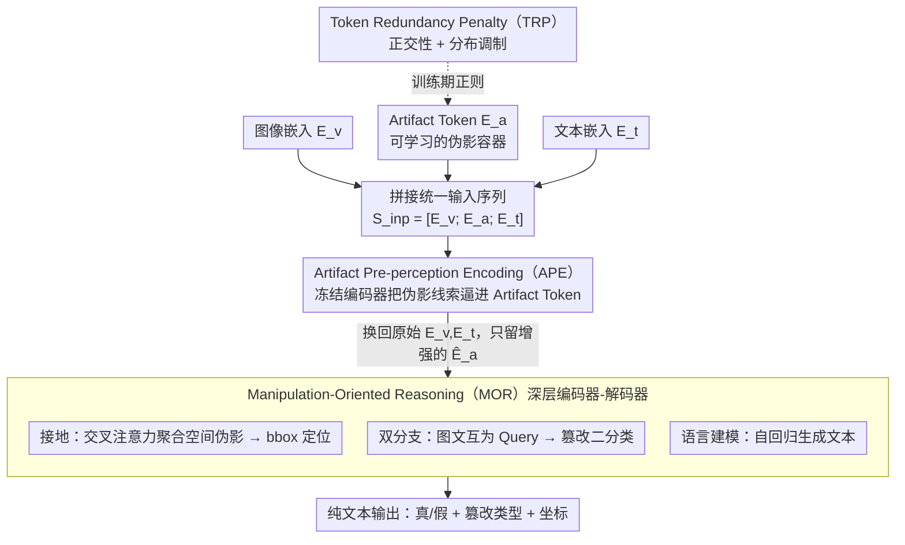

# The Coherence Trap: When MLLM-Crafted Narratives Exploit Manipulated Visual Contexts

**会议**: CVPR 2026  
**arXiv**: [2505.17476](https://arxiv.org/abs/2505.17476)  
**代码**: [https://github.com/YcZhangSing/AMD](https://github.com/YcZhangSing/AMD)  
**领域**: AI安全 / 多模态虚假信息检测  
**关键词**: multimodal manipulation detection, MLLM-driven disinformation, semantic-aligned forgery, deepfake grounding, artifact token

## 一句话总结

揭示现有多模态篡改检测忽视了MLLM能生成语义一致的欺骗性叙事这一核心威胁，构建441k样本的MDSM语义对齐篡改数据集，并提出基于Artifact Token和操纵导向推理的AMD框架，在跨域检测中以仅0.27B参数达到88.18 ACC / 60.25 mAP / 61.02 mIoU的最优泛化性能。

---

## 研究背景与动机

### 现实威胁

生成式AI的发展使得图像篡改（换脸、属性编辑）愈发逼真，但更大的风险在于：攻击者不再仅仅修改图像，而是利用MLLM（如Qwen2-VL）根据篡改后的图像**动态生成语义一致、上下文合理但内容虚假的文字叙事**。这种"语义一致性陷阱"（Coherence Trap）使得传统依赖图文不一致性来检测篡改的方法完全失效。

### 现有方法的两个根本缺陷

**低估MLLM驱动的欺骗风险**：DGM⁴、HAMMER等主流方法针对的是规则化文本篡改（如简单替换人名/实体），面对MLLM生成的流畅、上下文适配的虚假叙事毫无抵抗力。这些方法的核心假设——图文之间存在可检测的语义不一致——在语义对齐篡改场景下不再成立。

**不切实际的不对齐伪影**：现有数据集（如DGM⁴）中图像篡改和文本篡改是独立进行的，生成的样本语义不连贯，容易被公众直接识别——根本不需要检测模型。真实世界的攻击者会精心维护视觉-文本一致性以最大化误导效果。

### 对比学习失效的核心原因

在MDSM场景中，由于篡改后的图像和MLLM生成的文本本身就是完全匹配的，基于对比学习（contrastive learning）的检测范式——如ASAP、HAMMER所采用的——无法从图文对齐度中提取有效线索。模型必须依赖**外部知识**和**伪影痕迹**（如换脸后的纹理不自然、MLLM生成文本的统计模式）来进行判断。

---

## 方法详解

### 整体框架

AMD（Artifact-aware Manipulation Diagnosis）针对的是「语义对齐篡改」这个新场景——篡改图和 MLLM 生成的文本本就完全匹配，传统靠图文不一致来抓篡改的信号彻底失效。它的破局思路是在 Florence-2 的 seq2seq 骨架里挂一组可学习的 Artifact Token 当「伪影容器」，把检测（真/假）、分类（篡改类型）、定位（坐标）统一成一个文本生成问题。整条流水线是：图像、文本、Artifact Token 先拼成统一输入序列，经一个冻结的预感知编码器（APE）把篡改伪影线索灌进 Artifact Token，再送进深层编码器-解码器做操纵导向推理（MOR），其中并挂三个头（接地定位、双分支判定、语言建模）共同把伪影信息引向篡改判断，最后以纯文本吐出判定结果和 bbox 坐标；训练时另用 Token Redundancy Penalty（TRP）正则约束 Artifact Token 别学成冗余。

### 关键设计

**1. Artifact Token 嵌入：给缺失的不一致信号造一个替身**

语义对齐场景下图文之间已经没有可供对比学习抓取的破绽，模型只能转而依赖伪影痕迹（换脸纹理、MLLM 文本的统计模式）。AMD 为此引入一组可学习的 Artifact Token $E_a \in \mathbb{R}^{n_a \times d}$，和图像嵌入 $E_v$、文本嵌入 $E_t$ 拼成输入序列 $S_{inp} = [E_v; E_a; E_t]$。这组 token 本身不携带具体语义，而是在训练中逐步把篡改相关的模式「沉淀」进去，等于给原本缺席的不一致信号造了一个可学习的替身。

**2. Artifact Pre-perception Encoding：冻结编码器，把伪影线索逼进 token**

光有空容器还不够，得想办法让伪影线索真正流进 Artifact Token 而不是被 MLLM 的世界知识稀释掉。输入序列先过预感知编码器 $\mathcal{E}_m^p$ 得到 $\hat{E}_a$，再加权池化成全局伪影表示 $\bar{E}_a$（$\mathcal{W} = m^\top \text{ReLU}(\mathcal{M}\hat{E}_a^\top + b)$），用一个二分类器判断有没有篡改痕迹。关键在两个动作：优化分类损失 $\mathcal{L}_{APE}$ 时**冻结** $\mathcal{E}_m^p$，逼着更多伪影线索积累到 Artifact Token 上、同时保住 MLLM 的原始世界知识不被破坏；池化后再把序列里的图像和文本嵌入**换回**原始 $E_v, E_t$，只保留增强过的 $\hat{E}_a$，形成 $S_a = [E_v; \hat{E}_a; E_t]$ 进入下一阶段。消融里 APE 把 ACC 从 76.92 拉到 82.93，是单项贡献最大的模块。

**3. Manipulation-Oriented Reasoning：用两个辅助任务把伪影引向篡改判定**

伪影 token 攒到了信息，还得把它「用」在检测和定位上。MOR 挂了两个辅助任务。一是接地任务 Visual Artifact Capture via Grounding，由 VAA（Visual Artifact Aggregation）模块把 Artifact Token $\hat{E}_a^m$ 注意力池化成查询向量 $q_a$，再用交叉注意力从图像特征 $\hat{E}_v^m$ 里聚合空间篡改线索送进 bbox 检测器，定位损失 $\mathcal{L}_{IMG} = \mathcal{L}_1 + \mathcal{L}_{IoU}$；二是 Dual-Branch Manipulation Guidance（DBM），让图像+Artifact 特征和文本特征互为 Query 做交叉注意力，

$$u_v = \text{Attention}(\hat{E}_{v+a}^m, \hat{E}_t^m, \hat{E}_t^m), \quad u_t = \text{Attention}(\hat{E}_t^m, \hat{E}_{v+a}^m, \hat{E}_{v+a}^m)$$

两路各自分类判定篡改与否。DBM 对 mAP 提升最猛（47.18→66.47），说明双分支的交叉引导显著强化了对篡改类型的判别力。

**4. Token Redundancy Penalty：让多个 token 别互相重复**

一组 Artifact Token 若都学成同一个模式，等于白白浪费容量。TRP 用两个正则项把它们撑开：正交性约束 $\mathcal{L}_{orth}$ 基于 Gram 矩阵惩罚 $E_a$ 列向量间的非正交性，鼓励不同 token 各编各的信息；分布调制 $\mathcal{L}_{mod}$ 用 KL 散度把每个 token 的能量分布推向均匀，避免棋盘格式的能量集中导致信息损失。这一项在各指标上提供小而一致的稳定增益。

### 损失函数与训练策略

总损失为五项之和：

$$\mathcal{L} = \mathcal{L}_{APE} + \mathcal{L}_{DBM} + \mathcal{L}_{IMG} + \mathcal{L}_{TRP} + \mathcal{L}_{LM}$$

训练时各辅助头一起优化；推理时把 APE、DBM、IMG、TRP 全部丢掉、只留语言建模输出，模型用启发式 QA prompt 将真/假判定、篡改类型、坐标以纯文本一并吐出——这既避免了训练-推理不一致，也让推理保持高效（13.38 pairs/s）。

---

## 实验关键数据

### MDSM数据集统计

- **总规模**：441,423个样本，5大新闻域（NYT、Guardian、USA Today、Washington Post、BBC）
- **篡改类型**：Face Swap (FS)、Face Attribute (FA)、Text Fabrication (TF)、FS&TF、FA&TF
- **对比DGM⁴**：MDSM是首个同时具备MLLM参与、语义对齐、大规模、多源域的多模态篡改检测benchmark

### 主实验：MDSM跨域检测 (Table 2)

| 方法 | 训练域 | Params | AVG ACC | AVG mAP | AVG mIoU |
|------|--------|--------|---------|---------|----------|
| Qwen2.5-VL-72B (zero-shot) | — | 72B | 33.72 | 33.47 | 0.06 |
| GPT-4o (zero-shot) | — | — | 33.92 | 33.33 | 1.17 |
| Gemini-2.0 (zero-shot) | — | — | 38.83 | 32.03 | 1.72 |
| ViLT | Guardian | 121M | 76.61 | 49.90 | 35.67 |
| HAMMER | Guardian | 441M | 74.32 | 48.33 | 43.23 |
| HAMMER++ | Guardian | 441M | 75.10 | 49.01 | 48.49 |
| FKA-Owl | Guardian | 6,771M | 84.12 | 58.13 | 52.20 |
| **AMD (Ours)** | **Guardian** | **277M** | **88.18** | **60.25** | **61.02** |

关键发现：AMD以仅277M参数超越6.8B的FKA-Owl（ACC +4.06，mAP +2.12，mIoU +8.82），零样本大模型在该任务上几乎完全失败（mIoU接近0）。

### DGM⁴跨域检测 (Table 3)

| 方法 | AVG ACC | AVG mAP | AVG P_tok | AVG mIoU |
|------|---------|---------|-----------|----------|
| HAMMER | 65.45 | 47.10 | 77.41 | 45.97 |
| HAMMER++ | 65.61 | 47.36 | 77.34 | 46.19 |
| FKA-Owl | 71.96 | 42.68 | 83.31 | 44.15 |
| **AMD (Ours)** | **74.47** | **52.91** | 80.01 | **51.87** |

AMD在传统DGM⁴数据集上同样取得最优综合表现，证明其框架不仅适用于MDSM新场景，也具备对传统篡改设定的泛化能力。

### 消融实验 (Table 4a)

| LM | APE | IMG | DBM | TRP | NYT ACC | NYT mAP | NYT mIoU |
|----|-----|-----|-----|-----|---------|---------|----------|
| ✓ | | | | | 76.92 | 46.38 | 58.77 |
| ✓ | ✓ | | | | 82.93 | 47.12 | 60.13 |
| ✓ | ✓ | ✓ | | | 82.97 | 47.18 | 61.78 |
| ✓ | ✓ | ✓ | ✓ | | 83.42 | 66.47 | 62.14 |
| ✓ | ✓ | ✓ | ✓ | ✓ | **83.96** | **69.39** | **63.56** |

- **APE贡献最大**：ACC从76.92→82.93（+6.01），证明伪影预感知对于MLLM适配至关重要
- **DBM提升mAP最显著**：47.18→66.47（+19.29），双分支引导大幅增强篡改类型判别能力
- **TRP提供稳定增益**：在各指标上均有小幅但一致的提升，验证了token去冗余的有效性

### 关键发现

- **文本模态篡改更难检测**：FA域内AP为88.45，而TF仅79.84；跨域时FA为71.37，TF仅57.53。这说明MLLM生成的叙事具有更强的欺骗性，也体现了MDSM数据集的挑战性。
- **跨MLLM泛化**：在NYT上训练的AMD测试由Qwen-VL、X-InstructBLIP、LLaVA、mPLUG-Owl生成的叙事，域内AP均>76，跨域AP>53，表明AMD不依赖特定MLLM的生成模式。
- **效率优势**：AMD仅277M参数，推理吞吐量13.38 pairs/s，远优于FKA-Owl的6,771M / 1.33 pairs/s。

---

## 亮点与洞察

1. **问题定义的前瞻性**：首次将"MLLM驱动的语义对齐多模态篡改"明确定义为新威胁场景。传统方法假设图文不一致可被对比学习捕获，但在攻击者刻意维护一致性时完全失效——这是一个被长期忽视但极具现实意义的gap。

2. **Artifact Token设计精巧**：不直接修改MLLM的预训练参数，而是通过可学习的外挂token来积累伪影信息，既保留了世界知识又注入了领域能力。冻结编码器+替换嵌入的策略是一种优雅的知识保护方案。

3. **统一文本输出的优势**：将检测（真/假）、分类（篡改类型）、定位（bbox坐标）全部以文本形式输出，比HAMMER等多头架构更简洁、更通用、更易扩展。推理时丢弃辅助头也避免了训练-推理不一致问题。

4. **数据集构建思路值得借鉴**：先篡改图像，再将篡改元信息（如换入的人名）喂给MLLM生成对齐文本——这种pipeline可以被视为一种**对抗性数据增强**的通用范式，适用于任何需要语义一致性攻击的场景。

---

## 局限性与可改进方向

1. **仅聚焦于人脸篡改**：当前MDSM数据集只涉及换脸和面部属性编辑，未覆盖场景编辑（如背景替换、物体移除）、全图生成等更广泛的篡改类型。扩展至非人脸中心的篡改场景是重要的未来方向。

2. **文本检测粒度较粗**：虽然标注了文本是否被篡改，但没有提供word-level或sentence-level的细粒度标注（不像DGM⁴有fake token grounding）。这限制了对MLLM生成文本中具体虚假部分的定位。

3. **评估局限于新闻域**：所有实验均在新闻数据上进行，社交媒体、论坛、即时通讯等非正式文本场景的泛化能力未被验证。

4. **基座模型选择**：AMD基于Florence-2（0.27B），如果换用更大的MLLM基座，性能可能进一步提升但也需重新验证效率-效果的trade-off。

5. **对抗鲁棒性未探讨**：攻击者可能针对AMD的Artifact Token机制设计自适应攻击，这方面的鲁棒性分析缺失。

---

## 相关工作与启发

- **DGM⁴ / HAMMER**：多模态篡改检测的代表工作，但假设图文不一致——MDSM场景下性能大幅下降。
- **FKA-Owl**：基于MLLM的检测方法（6.8B参数），在部分指标上接近AMD但参数量大24倍，表明轻量化设计的重要性。
- **Florence-2**：AMD的基座模型，提供了强大的视觉-语言预训练知识和统一的seq2seq架构。
- **启发意义**：对于任何需要"用MLLM检测MLLM生成内容"的场景（如AI生成文本检测、合成图像检测），本文的Artifact Token + 知识保留策略提供了可借鉴的设计范式。可学习外挂token + 冻结预训练参数的思路也值得在其他domain adaptation场景中探索。

---

## 评分

| 维度 | 分数 (1-10) | 说明 |
|------|-------------|------|
| 问题重要性 | 9 | MLLM驱动的语义一致性篡改是真实且被忽视的威胁 |
| 方法新颖性 | 8 | Artifact Token + APE + MOR + TRP组合设计精巧 |
| 实验充分性 | 8 | 跨域、跨MLLM、消融、效率对比齐全 |
| 数据集贡献 | 9 | 441k大规模语义对齐多模态篡改benchmark，填补空白 |
| 写作质量 | 8 | 动机阐述清晰，图表专业 |
| **总分** | **8.4** | 问题定义精准、数据集+方法双贡献，是该领域的重要推进 |

<!-- RELATED:START -->

## 相关论文

- [\[CVPR 2026\] When to Think and When to Look: Uncertainty-Guided Lookback](when_to_think_and_when_to_look_uncertainty-guided_lookback.md)
- [\[CVPR 2026\] When Token Pruning is Worse than Random: Understanding Visual Token Information in VLLMs](when_token_pruning_is_worse_than_random_understanding_visual_token_information_i.md)
- [\[ICML 2026\] TRAP: 用对抗 patch 劫持 VLA 的 CoT 推理实现目标行为攻击](../../ICML2026/multimodal_vlm/trap_hijacking_vla_cot-reasoning_via_adversarial_patches.md)
- [\[CVPR 2026\] CodeDance: A Dynamic Tool-integrated MLLM for Executable Visual Reasoning](codedance_a_dynamic_tool-integrated_mllm_for_executable_visual_reasoning.md)
- [\[CVPR 2026\] UNICBench: UNIfied Counting Benchmark for MLLM](unicbench_unified_counting_benchmark_for_mllm.md)

<!-- RELATED:END -->
