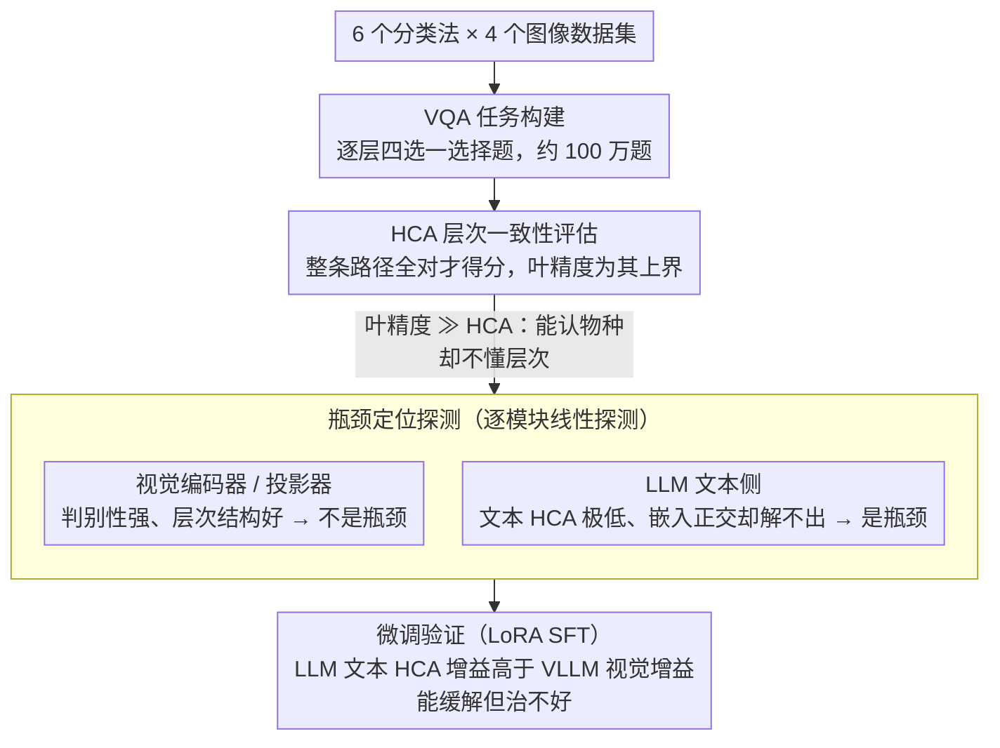

# The LLM Bottleneck: Why Open-Source Vision LLMs Struggle with Hierarchical Visual Recognition

**会议**: CVPR2026  
**arXiv**: [2505.24840](https://arxiv.org/abs/2505.24840)  
**代码**: [yuanqing-ai.github.io/llm-hierarchy](https://yuanqing-ai.github.io/llm-hierarchy/)  
**领域**: 多模态VLM  
**关键词**: 层次视觉识别, 分类一致性, LLM瓶颈, 分类法知识, 视觉问答

## 一句话总结
揭示开源LLM缺乏关于视觉世界的层次分类知识（甚至不知道基本的生物分类体系），这使得LLM成为Vision LLM层次视觉识别的瓶颈。

## 研究背景与动机

**核心矛盾**：分类法是视觉识别的核心，如波士顿梗犬→梗犬→狗→哺乳动物→动物形成一条语义路径，理想的通用视觉识别系统应能同时映射到分类法的叶节点和内部节点并保持层次一致性。Vision LLM (VLLM)统一了多种视觉任务、具备构建这种系统的潜力，但现有评测主要盯着叶节点分类精度，忽略了层次一致性。

**领域现状**：开源和商业VLLM在层次识别上严重缺乏一致性，如Qwen2.5-VL-72B在iNaturalist分类法上67%+的路径都会出错。

**现有痛点**：问题的根源不在视觉编码器和投影器（它们保留了高度判别性、结构良好的特征），而在LLM——开源LLM缺乏分类法知识。

**解决思路**：微调VLLM能帮上忙但无法根治，且微调对LLM文本层次一致性的提升大于对VLLM视觉层次一致性的提升，再次确认了LLM的瓶颈效应。

## 方法详解

### 整体框架

这是一篇分析性论文而非方法论文，目标是定位"为什么开源 VLLM 做不好层次视觉识别"。整条研究像一条侦查链，分四步推进：先从 6 个分类法、4 个图像数据集构建约 100 万道逐层四选一 VQA 题作为统一题库；再用更严格的层次一致性指标 HCA 量出问题规模；接着对视觉编码器、投影器、LLM 逐模块做线性探测，把瓶颈从视觉侧排除、精确钉到 LLM 身上；最后用 LoRA 微调实验从反方向验证这一结论。

### 关键设计

**1. VQA 任务构建：把层次知识拆成逐层四选一选择题**

要系统比较不同模型在各粒度上的表现，得先有覆盖完整层次的题库。作者在 iNat21-Animal、iNat21-Plant、ImgNet-Artifact、ImgNet-Animal、CUB-200、Oxford-Pets 这 6 个分类法（共 4 个图像数据集）上，为每个层级生成四选一选择题，且四个选项都来自同一层级，覆盖从粗粒度（脊椎/无脊椎）到细粒度（具体物种）的所有层次，最终约 100 万题。每道题只考一个粒度，能干净地切出模型从哪一层开始崩——这是后续所有分析的统一标尺。

**2. 层次一致性指标 HCA：用整条路径而非单点来打分**

叶精度只看最细粒度对不对，根本测不出模型懂不懂层次。作者改用 HCA（Hierarchical Consistent Accuracy，层次一致准确率）：一张图在分类法路径上的每一层都答对才算对，

$$HCA = \frac{1}{N}\sum_{i=1}^N \prod_{j=1}^{L^i} \mathbb{1}[f_\theta(x^i; Y_j) = y_j^i]$$

连乘项里只要有一层错整条路径就判 0。叶精度 $Acc_{leaf}$ 只关注最细粒度预测，是 HCA 的上界——两者的巨大落差（如 Qwen2.5-VL-72B 的 54.20 叶精度 vs 35.73 HCA）正是"能认出物种却不知道它属于哪个大类"的量化证据，也是触发后续瓶颈排查的起点。

**3. 瓶颈定位探测：逐模块线性探测，排除视觉侧、钉死 LLM**

知道模型答错还不够，得查清错在视觉还是语言。VLLM 的三大件是视觉编码器、投影器、LLM。作者为每个分类法层级训练独立的线性分类器，分别探测视觉编码器、投影器、以及 LLM 最后一层的视觉 token 表示：结果这些线性探测在叶精度和 HCA 上全面反超 VLLM 本身，且在前向传播各阶段几乎不衰减——说明视觉特征一路保留了判别性和层次结构，视觉侧不是瓶颈。再把矛头转向 LLM 文本侧：LLM 的文本 HCA 极低，但对其各层文本嵌入做线性探测又能近乎完美地恢复层次（哪怕输入里抹掉层次标签也行），且层次语义以正交结构编码在表示空间里。结论很反直觉——LLM 内部其实已经编码了足够的层次线索，却无法自己解码出来，瓶颈正是 LLM。（作者强调此结论只针对可探测内部表示的开源 VLLM，不外推到 GPT-4o——其文本 HCA 高达 98.81。）

**4. 微调验证：LoRA 微调能缓解但治不好，从反方向坐实瓶颈**

既然定位到 LLM，能不能靠微调补上？作者用 LoRA 在 iNat21-Plant 训练集构建的 VQA 上轻量微调表现最好的 Qwen2.5-VL-7B。微调确实带来提升（iNat21-Plant 的 HCA 从 17.67 升到 29.34，并能泛化到其他数据集），但更关键的发现是：同一次微调里，LLM 的文本 HCA 增益（如 iNat21-Plant 上 +20.66）明显高于 VLLM 的视觉 HCA 增益（+11.67）——LLM 的增益给 VLLM 的增益封了顶。这从相反方向再次坐实"LLM 是瓶颈"，也说明这种"打补丁式"微调治标不治本，分类法知识的缺口更可能要在预训练阶段才填得上。

### 损失函数 / 训练策略

微调采用 LoRA（而非全参数 SFT），训练数据为 iNat21-Plant 训练集上构建的 VQA 任务；评估时同时考察其在该数据集的提升、对其他数据集的泛化、以及通用视觉-语言能力是否保持。

## 实验关键数据

### 主实验

| 模型 | iNat21-Animal HCA | iNat21-Plant HCA | CUB-200 HCA | ImgNet-Animal HCA |
|------|------------------|-----------------|-------------|-------------------|
| Qwen2.5-VL-72B | 35.73 | 32.82 | 66.36 | 64.08 |
| GPT-4o | 42.95 | 35.53 | 81.96 | 67.69 |
| BioCLIP2 | 41.84 | 37.91 | 55.80 | 8.34 |
| LLaVA-OV-7B | 4.53 | 4.46 | 11.51 | 34.36 |

### 消融实验

| 配置 | 关键指标 | 说明 |
|------|---------|------|
| 叶精度vs HCA差距 | 巨大 | 如Qwen2.5-VL-72B: 54.20叶精度 vs 35.73 HCA |
| BioCLIP2叶精度 | 95.94 | 领域专家模型叶精度极高但HCA仍只有41.84 |
| 视觉编码器探测 | 高判别性 | 瓶颈不在视觉侧 |

### 关键发现
- 叶精度与HCA之间存在巨大差距：模型能识别具体物种但不知道它属于哪个更高层次类别
- 领域专用CLIP模型（BioCLIP2）在叶精度上表现优于VLLM，但HCA同样不高
- 开源VLLM与GPT-4o之间仍有显著差距
- ImgNet-Artifact相比生物分类法，VLLM表现更好（工具/日用品的层次知识更普遍）

## 亮点与洞察
- 提出了一个被忽视且重要的研究问题：VLLM的层次视觉识别能力
- "LLM是瓶颈"这一结论对VLLM研发方向有指导意义——光提升视觉编码器不够，还需增强LLM的分类法知识
- HCA作为评估指标比叶精度更严格也更反映真实需求
- 发现LLM嵌入中已编码了层次信息但无法解码，暗示可能通过特定训练策略激活

## 局限与展望
- 作者明确指出结论主要针对开源LLM，不应外推到商业LLM（因无法探测其内部表示）
- 四选一VQA评估方式可能低估了开放生成场景下的层次一致性问题
- 未深入探索如何有效注入分类法知识到LLM中
- 微调虽有帮助但不能根治问题，需要更根本的解决方案

## 相关工作与启发
- CLIP系列模型也存在层次一致性问题，但领域专用BioCLIP2在叶精度上极强
- 与Zhang et al.、Liu et al.等VR-FGVC工作互补，本文关注层次而非单纯细粒度
- 对于Agent系统设计有启示：如果LLM不理解层次，则难以在需要多粒度理解的任务中表现良好

## 评分
- 新颖性: ⭐⭐⭐⭐ 首次系统评估VLLM的层次视觉识别
- 实验充分度: ⭐⭐⭐⭐⭐ 100万VQA任务、10+模型、6个分类法、深入探测分析
- 写作质量: ⭐⭐⭐⭐⭐ 论文结构清晰，结论有力且谨慎
- 价值: ⭐⭐⭐⭐⭐ 指出了VLLM一个根本性弱点，对社区有重要启发

## 补充说明
- 评估了包括LLaVA-OV、InternVL、Qwen2.5-VL、Qwen3-VL等10个开源VLLM和GPT-4o
- 4个CLIP模型（OpenCLIP、SigLIP、BioCLIP、BioCLIP2）作为非LLM基线
- 6个分类法涵盖生物学和人工制品两大类，层次深度2-7层不等
- iNaturalist分类法HCA普遍极低（最好的GPT-4o仅42.95%），说明这是一个困难且被忽视的问题
- Oxford-Pets数据集上BioCLIP2的HCA达58%+，说明领域专用训练有帮助

<!-- RELATED:START -->

## 相关论文

- [\[CVPR 2026\] WikiCLIP: An Efficient Contrastive Baseline for Open-domain Visual Entity Recognition](wikiclip_an_efficient_contrastive_baseline_for_open-domain_visual_entity_recogni.md)
- [\[CVPR 2026\] Taxonomy-Aware Representation Alignment for Hierarchical Visual Recognition with Large Multimodal Models](taxonomy-aware_representation_alignment_for_hierarchical_visual_recognition_with.md)
- [\[CVPR 2026\] Enhancing Part-Level Point Grounding for Any Open-Source MLLMs](enhancing_part-level_point_grounding_for_any_open-source_mllms.md)
- [\[CVPR 2026\] SeD-UD: An Influence-Driven and Hierarchically-Decoupled Information Bottleneck for Multimodal Intent Recognition](sed-ud_an_influence-driven_and_hierarchically-decoupled_information_bottleneck_f.md)
- [\[CVPR 2026\] DialogueVPR: Towards Conversational Visual Place Recognition](dialoguevpr_towards_conversational_visual_place_recognition.md)

<!-- RELATED:END -->
