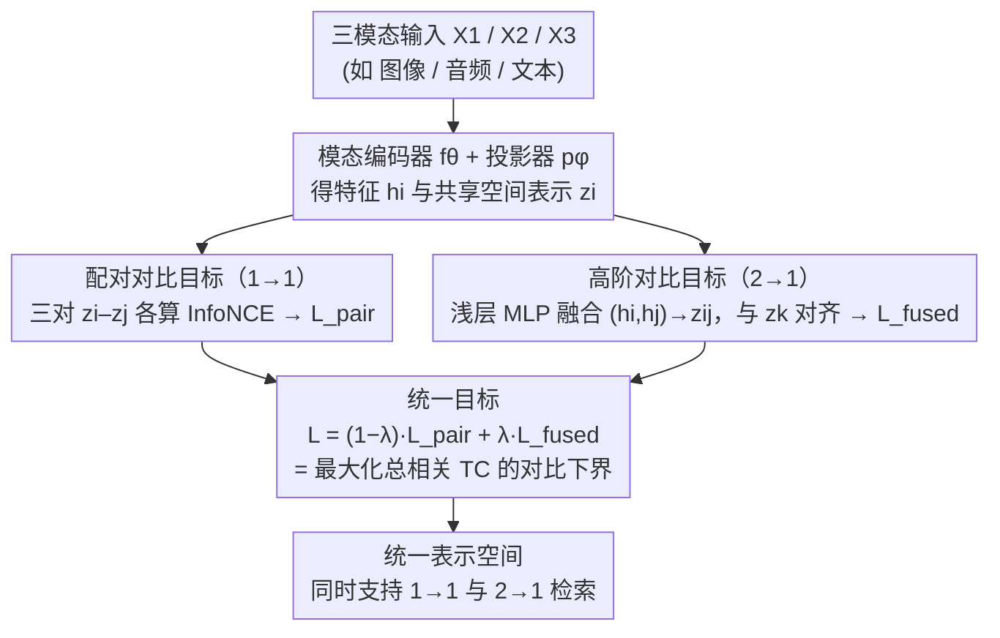

# The More, the Merrier: Contrastive Fusion for Higher-Order Multimodal Alignment

**会议**: CVPR2026  
**arXiv**: [2511.21331](https://arxiv.org/abs/2511.21331)  
**代码**: [github.com/estafons/confu](https://github.com/estafons/confu)  
**领域**: 多模态VLM  
**关键词**: 多模态对齐, 高阶依赖, 对比学习, 总相关, 三模态融合

## 一句话总结
提出Contrastive Fusion (ConFu)框架，将CLIP式的双模态对比学习推广到三模态高阶对齐，在统一目标中同时学习配对和融合表示，支持1→1和2→1检索。

## 研究背景与动机
多模态表示学习的核心挑战是学习跨模态的联合表示。CLIP等方法本质上是配对式的，只能捕捉两个模态之间的相关性：
- **配对方法**（AudioCLIP, VALOR等）：将配对对比扩展到三模态，但目标仍限于两两对齐
- **枢纽方法**（ImageBind, LanguageBind等）：以一个模态为参考空间，可扩展但无法建模非枢纽模态间的直接依赖
- **高阶方法**（Symile, TRIANGLE, GRAM）：尝试建模高阶依赖，但Symile和TRIANGLE要求推理时所有模态都存在，不兼容标准1→1检索

核心矛盾：现实世界中很多信息是互补的（歌曲=旋律+歌词, 3D设计=草图+文本），仅靠配对对比无法捕捉XOR类型的协同信息。

## 方法详解

### 整体框架

ConFu 要解决的是配对式对比学习（CLIP 那套）只能抓两两相关、抓不住三模态间协同信息的问题。对 M=3 个模态，它在一个统一目标里同时学两件事：所有模态两两之间的配对对齐（1→1），以及把两个模态融合后再去对齐第三个模态的高阶对齐（2→1）。每个模态有独立的编码器 $f_\theta$ 和投影器 $p_\phi$，把输入映进共享潜空间 $\mathcal{Z}$；融合则交给一个轻量 MLP。整个流程是一个**分支再汇合**结构：共享表示分别走配对对比（得 $\mathcal{L}_{pair}$）和高阶对比（得 $\mathcal{L}_{fused}$）两路，最后用一个权重 $\lambda$ 拧成单一损失。因此推理时既能做标准的 1→1 检索，也能做 2→1 检索；而这套"配对 + 高阶"的拆法之所以成立，背后是总相关（TC）可分解为配对互信息与高阶互信息之和的理论保证。

### 关键设计

**1. 配对对比目标（1→1）：先把两两相关性学扎实**

高阶对齐不能凭空建立，底座仍是所有模态对的标准 InfoNCE，三对模态各算一份对比损失再相加：

$$\mathcal{L}_{pair} = \hat{\mathcal{L}}_{InfoNCE}^{(1,2)} + \hat{\mathcal{L}}_{InfoNCE}^{(1,3)} + \hat{\mathcal{L}}_{InfoNCE}^{(2,3)}$$

这一项保证了任意单模态查单模态的检索能力，是 ConFu 兼容 1→1 检索的来源。

**2. 高阶对比目标（2→1）：让两个模态融合后去对齐第三个**

像"旋律+歌词=歌曲"这类 XOR 式协同信息，单看任意两模态都抓不到，必须把两路融合起来。ConFu 用一个浅层 MLP 把两模态表示融合成 $z_{ij} = g_{\psi_{ij}}(h_i, h_j)$，再让它与第三个模态做 InfoNCE：

$$\mathcal{L}_{fused} = \hat{\mathcal{L}}_{InfoNCE}^{(3,\{1,2\})} + \hat{\mathcal{L}}_{InfoNCE}^{(2,\{1,3\})} + \hat{\mathcal{L}}_{InfoNCE}^{(1,\{2,3\})}$$

正是这一项让 ConFu 在纯配对方法全军覆没的 XOR 合成任务上（CLIP 仅 3%、GRAM/TRIANGLE<15%）做对了题。

**3. 统一目标：用一个权重平衡配对与高阶**

两类目标不该割裂训练。ConFu 用 $\lambda$ 把它们拧成一个损失 $\mathcal{L} = (1-\lambda)\mathcal{L}_{pair} + \lambda\mathcal{L}_{fused}$：$\lambda=0$ 时退化成纯配对 CLIP，中间值最优——这给了"要多少高阶建模"一个可调旋钮。

**4. 理论基础：把总相关分解成配对 MI + 高阶 MI**

为什么这两项加起来就够？作者证明三模态的总相关（TC）能对称地分解为配对互信息与高阶互信息之和：

$$TC(X_1,X_2,X_3) = \frac{1}{3}\sum_{perm}[I(X_i;X_j) + I(X_k;X_i,X_j)]$$

而最小化 InfoNCE 损失等价于最大化 TC 的对比下界。于是 $\mathcal{L}_{pair}$ 对应配对项、$\mathcal{L}_{fused}$ 对应高阶项，整个设计不是拼凑而是 TC 分解的直接落地，这也是它区别于 Symile（用单一 critic 隐式建模）的关键。

### 损失函数 / 训练策略

相似度用温度缩放的点积作为密度比估计器，融合网络只是浅层 MLP，额外计算开销仅来自这几层 MLP，几乎不增加训练成本。

## 实验关键数据

### 主实验

| 数据集 | 指标 | ConFu | 之前SOTA | 说明 |
|--------|------|-------|----------|------|
| AV-MNIST | A+V分类 | 71.2% | 70.9% (Symile) | 融合输入比最强单模态+8% |
| AV-MNIST | V单模态 | 64.6% | 63.0% (CLIP) | 多模态训练提升单模态+1.5% |
| SSW60/VB100 | 检索 | 竞争性表现 | 各基线 | 在1→1和2→1检索中统一支持 |

### 消融实验

| 配置 | 关键指标 | 说明 |
|------|---------|------|
| XOR合成任务 | ConFu解决 | CLIP失败(3%), GRAM/TRIANGLE<15% |
| 噪声鲁棒性 | 更稳定 | 面对干扰模态表现更好 |
| λ分析 | 平衡配对/高阶 | λ=0退化为纯配对 |

### 关键发现
- ConFu在XOR任务上成功解决了纯配对方法无法解决的协同依赖问题
- 即使单模态评估，多模态训练也能提升单模态表示质量
- 比Symile优势：不要求推理时所有模态存在，支持灵活的1→1检索
- 面对干扰模态和噪声分布偏移时展现更强鲁棒性

## 亮点与洞察
- 理论动机清晰：TC分解为配对+高阶，每个对应一个InfoNCE目标
- 与Symile等方法的关键区别：在损失层面分解依赖关系，而非用单一critic隐式建模
- Bird-MML数据集的构建填补了三模态（图像-音频-文本）评测的空白
- 架构无关设计，唯一额外开销是轻量MLP融合网络

## 局限与展望
- 目前仅处理M=3模态，更多模态时融合组合数指数增长
- 融合网络为简单MLP，可能限制了对复杂跨模态交互的建模
- Bird-MML为合成数据集，生成的caption可能包含噪声
- 在某些真实世界数据上优势不如在合成任务上明显

## 相关工作与启发
- ImageBind等枢纽方法在可扩展性上有优势，但本质上限于配对关系
- Symile的TC最大化思路与ConFu理论基础相同，但ConFu将其分解为更可控的组件
- 可能对多传感器融合（自动驾驶等）有应用价值：需要在某传感器故障时仍能工作

## 评分
- 新颖性: ⭐⭐⭐⭐ TC分解和统一对比框架理论优雅
- 实验充分度: ⭐⭐⭐ 合成任务验证充分但真实数据规模偏小
- 写作质量: ⭐⭐⭐⭐ 理论推导清晰，与prior work对比透彻
- 价值: ⭐⭐⭐ 主要在三模态学习领域，当前应用场景较窄

## 补充说明
- Bird-MML数据集包含150个鸟类物种的149,681个三元组（图像-音频-文本）
- 图像来源iNaturalist开放数据集，音频来源Xeno-Canto，文本由Gemma-2生成
- 约43%物种存在音频数据不足需要复用的情况
- 在MultiBench情感分析数据集（MOSI、UR-FUNNY、MUStARD）上也有评估
- ConFu的融合网络仅为浅层MLP，参数量极小，几乎不增加训练开销
- λ参数控制配对vs融合目标的权重，分析显示λ=0退化为纯配对CLIP，中间值最优

<!-- RELATED:START -->

## 相关论文

- [\[CVPR 2026\] FALCON: False-Negative Aware Learning of Contrastive Negatives in Vision-Language Alignment](falcon_false-negative_aware_learning_of_contrastive_negatives_in_vision-language.md)
- [\[CVPR 2026\] PowerCLIP: Powerset Alignment for Contrastive Pre-Training](powerclip_powerset_alignment_for_contrastive_pre-training.md)
- [\[CVPR 2026\] β-CLIP: Text-Conditioned Contrastive Learning for Multi-Granular Vision-Language Alignment](b-clip_text-conditioned_contrastive_learning_for_multi-granular_vision-language_.md)
- [\[CVPR 2026\] Where Does Vision Meet Language? Understanding and Refining Visual Fusion in MLLMs via Contrastive Attention](where_does_vision_meet_language_understanding_and_refining_visual_fusion_in_mllm.md)
- [\[CVPR 2026\] Unbiased Dynamic Multimodal Fusion](unbiased_dynamic_multimodal_fusion.md)

<!-- RELATED:END -->
