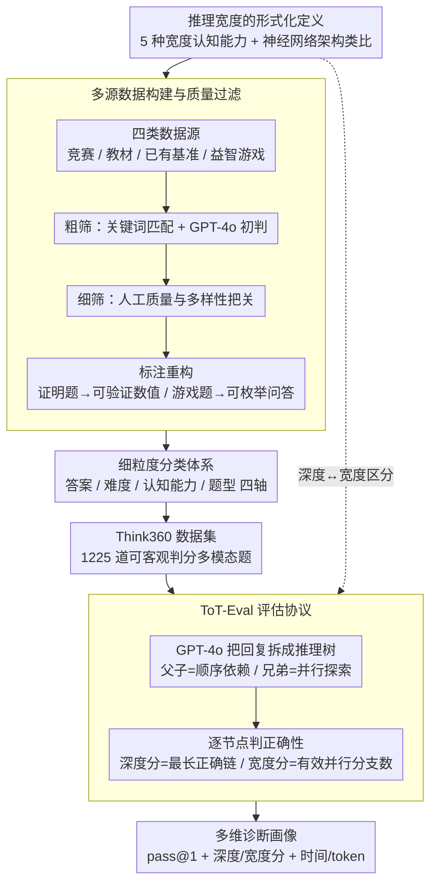

# Think360: Evaluating the Width-centric Reasoning Capability of MLLMs Beyond Depth

**会议**: CVPR 2026  
**arXiv**: [2603.22689](https://arxiv.org/abs/2603.22689)  
**代码**: [Think360](https://github.com/Think360-Benchmark/Think360)  
**领域**: 多模态VLM / LLM推理  
**关键词**: 多模态推理, 推理宽度, 思维树评估, 基准测试, 大语言模型

## 一句话总结

本文提出 Think360，一个聚焦于"推理宽度"（即模型在多路径搜索、多约束剪枝、回溯试错等方面的能力）的多模态基准，包含 1200+ 高质量样本，并设计细粒度 Tree-of-Thought 评估协议，揭示当前 MLLM 在宽度方向推理上的显著短板。

## 研究背景与动机

1. **领域现状**：近年来大型推理模型（LRM）在 test-time scaling 和长链推理方面取得显著进展。现有基准如 MathVista、MathVerse、OlympiadBench 等不断推高难度和任务覆盖面，从 K-12 到研究生级别、从文本到多模态输入。

2. **现有痛点**：几乎所有已有评测基准都隐含地只衡量"推理深度"（reasoning depth），即模型沿单一推理链条逐步推导的能力。然而，人类解决问题时很少仅靠线性推演，更多是在解空间中多方向搜索、分支回溯、试错剪枝，最终整合部分发现形成答案。

3. **核心矛盾**：推理深度和推理宽度是两个正交维度。现有基准将二者混为一谈，导致无法区分模型到底是"想得深"还是"搜得广"。缺乏对宽度维度的系统评测，使得模型的真实推理能力被片面评估。

4. **本文目标** 构建一个专门评估推理宽度的多模态基准，包括：(a) 系统化地定义推理宽度的认知能力维度，(b) 设计合理的评测协议来同时量化深度和宽度，(c) 全面评测主流 MLLM 的宽度推理能力。

5. **切入角度**：作者类比神经网络架构中的"宽度"设计（shortcut connection、dropout、金字塔特征、梯度反传）与推理过程中的策略（剪枝、分而治之、试错、回溯），建立了深度/宽度在架构与推理之间的对应关系。

6. **核心 idea**：通过构建聚焦宽度推理的 1200+ 多模态基准 Think360 和 Tree-of-Thought 评估协议，系统揭示 MLLM 在探索式推理方面的不足。

## 方法详解

### 整体框架

Think360 想回答一个被现有基准忽略的问题：MLLM 到底是"想得深"还是"搜得广"？为此它不去训练新模型，而是把"宽度推理"做成一个可量化的评测对象。整篇工作分两条线落地：一条是**数据线**，从竞赛题、教材、已有基准、益智游戏四类来源收集原始题目，经过粗到细的质量过滤和重写，最终沉淀成 1225 道答案可客观验证的多模态题；另一条是**评测线**，在传统 pass@1 准确率之外，额外用一套 Tree-of-Thought 协议把模型的整段回复拆成推理树，分别量出"深度"和"宽度"两个分数，再叠加推理时间、token 消耗等效率指标，构成多维度的诊断画像。这两条线由最上游的"推理宽度形式化定义"统一统领：定义决定了数据线该专门去搜哪类题、也决定了评测线为什么要把深度和宽度分开打分。

### 关键设计

**1. 推理宽度的形式化定义：把"搜得广"从"想得深"里拆出来**

现有基准的隐含假设是推理能力等同于沿单一链条往下推的深度，但人解题时更多是在解空间里横向搜索、分支回溯、试错剪枝。Think360 把这种横向能力命名为推理宽度，并进一步拆成五种认知子能力：试错搜索（trial-and-error）、多约束剪枝（branch-and-bound）、分治（divide-and-conquer）、假设检验（hypothesize-and-test）、感知理解（perceive-and-comprehend）。论文给这五种能力配了一个贴切的类比——它们恰好对应神经网络架构里的"宽度"设计：dropout 之于剪枝、shortcut 之于回溯、金字塔特征之于分治。这层对应让"宽度"从一个模糊的直觉变成了可以逐项考察的维度，也直接解释了为什么旧基准会把"只会沿固定路径走得远"的模型误判为"会推理"。

**2. 多源数据构建与质量过滤：专门把稀缺的宽度题筛出来并改造成可验证形式**

宽度推理题在现有基准里是绝对的少数派——MathVista 里只占 2.7%，OlympiadBench 只占 1.7%，靠抽取根本攒不够量，必须主动收集和改造。Think360 从数学/逻辑竞赛题、教材例题、已有基准（MathVision、DynaMath、MME-Reasoning 等）、在线益智游戏与 IQ 测试四类来源取材，再用两阶段过滤去芜存菁：粗筛先用关键词（如 maximum/minimum、possible ways 这类暗示搜索/枚举的词）做匹配，配合 GPT-4o 当评判初步打分；细筛交由人工做二次质量和多样性把关。来源格式参差不齐是个绕不开的麻烦，所以证明题被改写成答案可验证的形式，游戏题被设计成可枚举的问答格式，最终所有题目都落到能客观判分的统一接口上。

**3. 细粒度分类体系：用非互斥标签如实反映一题多能力的本质**

宽度推理题往往需要同时调用好几种能力，如果套用互斥分类会把这种共现关系抹平。Think360 因此沿四个轴给题目打标签：答案类型（选择题 16.9%、自由作答 83.1%）、难度（Easy/Basic/Medium/Hard/Olympiad 五级，分布近似正态）、认知能力（前述 5 种）、题型（6 种）。其中认知能力和题型两轴都是**非互斥**的，一道题可以同时挂多个标签。这样设计的回报是：通过频率统计和弦图可视化，能直接看出哪些能力经常被一起调用，为后面分维度的失败分析提供了抓手。

**4. Tree-of-Thought 评估协议（ToT-Eval）：把整段回复拆成推理树，分别量出深度和宽度**

只看最终答案对错的 outcome-based 评测，分不清模型是"一步到位"还是真的做了充分探索，这恰恰是宽度评测最需要的信息。ToT-Eval 分两步补上这个缺口。第一步是树构建：把问题和模型的完整回复喂给 GPT-4o，让它抽出关键推理步骤并组织成层次树——父子关系表示顺序的推理依赖（这是深度方向），同层兄弟节点表示并行探索的替代方案（这是宽度方向）。第二步是评分：仍由 GPT-4o 逐节点判定正确性（逻辑是否成立、事实是否准确），在此基础上，深度得分取最长一条全部正确的推理链的深度，宽度得分取有效的并行分支数。两个分数一起，才把"探索得够不够广"和"推得够不够深"这两件事分开量了出来。

### 损失函数 / 训练策略

本文为 benchmark 评测工作，不涉及模型训练。评估方面设定温度 0.7，每题重复 3 次取均值以减少方差。所有模型配置为支持的最大输出长度。同时测试了有/无 Chain-of-Thought 提示的影响。

## 实验关键数据

### 主实验

评测涵盖 12 个主要模型系列（GPT、Gemini、Claude、Grok、Doubao、QwenVL、InternVL、LLaVA、Llama、GLM-V、MiMo、Kimi），共 30+ 模型。

| 模型 | 总体准确率 | 推理时间(s) | Token消耗 | Trial-and-Error | Branch-and-Bound |
|------|-----------|------------|----------|-----------------|------------------|
| Gemini-2.5-pro | **46.0%** | 160.19 | 17270 | 38.5% | 51.8% |
| o3 | 42.3% | 261.59 | 6326 | 35.5% | 48.0% |
| o4-mini | 42.1% | 84.61 | 6736 | 34.3% | 48.0% |
| Gemini-2.5-flash-thinking | 38.3% | 107.33 | 21273 | 31.1% | 43.4% |
| o1 | 36.8% | 186.81 | 6537 | 29.6% | 40.6% |
| Claude-3.7-Sonnet-Thinking | 35.5% | 295.94 | 13819 | 29.4% | 38.8% |
| MiMo-VL-RL (7B) | 28.3% | 334.21 | 7381 | 24.9% | 27.9% |
| GPT-4o | 16.0% | 13.28 | 309 | 15.3% | 16.8% |
| LLaVA-Onevision (7B) | 8.3% | 36.58 | 648 | 5.8% | 10.0% |

### 消融实验

| 配置 | 关键指标 | 说明 |
|------|---------|------|
| CoT prompting (GPT-4o) | +0.4% 准确率 | CoT 提示带来微小提升，推理时间翻倍 |
| Perceive-and-Comprehend 子集 | 高于总体均值 | 感知理解型任务模型表现相对好 |
| Trial-and-Error 子集 | 低于总体均值 | 试错搜索型任务是模型短板 |
| Divide-and-Conquer 子集 | 低于总体均值 | 分而治之任务同样困难 |
| Text-Only vs Image+Text | 详见附录 | 多模态输入的影响分析 |

### 关键发现

- **Gemini-2.5-pro 以 46.0% 准确率排名第一**，其 thinking token 平均 17270 个，约为 o3/o4-mini 的 3 倍，但推理时间反而更短（160s vs o3 的 262s），说明该模型的推理效率更高。
- **综合性价比最优为 o4-mini**：准确率 42.1% 与 o3 相当，但推理时间仅 85s（o3 的 1/3）。
- **所有模型在 40% 以下挣扎**：仅 3 个模型突破 40% 门槛，说明宽度推理对当前 MLLM 仍是严峻挑战。
- **感知理解 vs. 试错搜索的分化**：各模型在 Perceive-and-Comprehend 子集上表现普遍高于平均，但在 Trial-and-Error 和 Divide-and-Conquer 子集上显著低于平均，表明当前 MLLM 更擅长结构化感知而非探索式推理。
- **开源模型差距明显**：最佳开源模型 MiMo-VL-RL (7B) 准确率 28.3%，与闭源领先者差距约 18 个百分点。

## 亮点与洞察

- **推理宽度的概念化**：将推理宽度与深度明确分离，并建立了与神经网络架构设计的精彩类比（dropout↔剪枝、shortcut↔回溯、金字塔↔分治等），概念清晰且有启发性。
- **ToT-Eval 评估协议**：不仅评最终答案，还分析推理过程的树结构，量化深度和宽度两个维度，比传统 pass@1 提供了更丰富的诊断信息。这一评估方式可以迁移到任何需要评价推理质量的场景。
- **1200+ 题目的精细构建流程**：从竞赛题到益智游戏，多源数据经过关键词匹配 + LLM-as-Judge + 人工审核的三级过滤，保证了题目质量和宽度推理的针对性。证明题和游戏题的改造方法值得借鉴。

## 局限与展望

- **评估依赖 GPT-4o/GPT-4o-mini**：树构建和节点正确性判断都依赖 GPT-4o，引入了评估器自身的偏差，且评估成本较高。
- **数据集规模有限**：1225 道题相对主流推理基准（如 MathVista 5000+ 题）偏少，各认知能力子集的样本量可能不足以支持稳健的统计结论。
- **缺乏过程奖励/过程监督的评估**：虽然提出了 ToT-Eval，但未将其应用于训练（如 process-based reward），未能验证对模型改进的指导作用。
- **可扩展性**：如何自动化生成更多高质量宽度推理题目，避免人工标注瓶颈，是实际推广的关键问题。

## 相关工作与启发

- **vs MathVista/MathVerse**: 这些基准覆盖多模态数学推理，但宽度推理题目占比极低（<3%）。Think360 专注宽度维度，二者互补。
- **vs CLEVR/GQA**: 早期组合视觉推理基准着重语义理解，Think360 强调更高层次的搜索和规划策略。
- **vs OlympiadBench**: 竞赛级别难度基准侧重长链推理（深度），Think360 在同等难度下聚焦多路径搜索（宽度）。
- **启发**：该 benchmark 暴露了当前 MLLM 的一个系统性不足——缺乏有效的探索和回溯能力。这提示 RL-based 训练（如 o1/o3）可能需要更多地鼓励模型在推理过程中进行多分支搜索，而非仅仅拉长链条。

## 评分

- 新颖性: ⭐⭐⭐⭐ 推理宽度作为独立维度的系统化评测是新颖视角，但 benchmark 类工作本身创新有限
- 实验充分度: ⭐⭐⭐⭐⭐ 30+ 模型全面评测，分维度分难度分析详尽
- 写作质量: ⭐⭐⭐⭐ 概念阐述清晰，类比贴切，但部分表格过于密集影响阅读
- 价值: ⭐⭐⭐⭐ 揭示了 MLLM 推理能力的盲区，对后续模型设计和训练策略有指导意义

<!-- RELATED:START -->

## 相关论文

- [\[CVPR 2026\] TableMix: Enhancing Multimodal Table Reasoning in MLLMs from a Data-Centric Perspective](tablemix_enhancing_multimodal_table_reasoning_in_mllms_from_a_data-centric_persp.md)
- [\[ACL 2026\] Can MLLMs Reason Beyond Language? VisReason: A Comprehensive Benchmark for Vision-Centric Reasoning](../../ACL2026/multimodal_vlm/can_mllms_reason_beyond_language_visreason_a_comprehensive_benchmark_for_vision-.md)
- [\[CVPR 2026\] EgoProx: Evaluating MLLMs on Egocentric 3D Proximity Reasoning Across a Cognitive Hierarchy](egoprox_evaluating_mllms_on_egocentric_3d_proximity_reasoning_across_a_cognitive.md)
- [\[CVPR 2026\] Beyond Perceptual Shortcuts: Causal-Inspired Debiasing Optimization for Generalizable Video Reasoning in Lightweight MLLMs](beyond_perceptual_shortcuts_causal-inspired_debiasing_optimization_for_generaliz.md)
- [\[CVPR 2026\] HumanVBench: Probing Human-Centric Video Understanding in MLLMs with Automatically Synthesized Benchmarks](humanvbench_probing_human_centric_video_understanding_in_mllms_with_automatica.md)

<!-- RELATED:END -->
