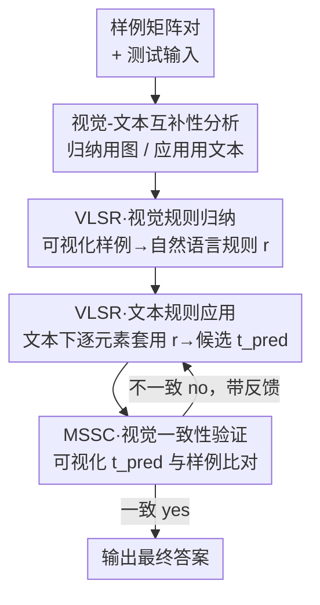

# Think Visually, Reason Textually: Vision-Language Synergy in Abstract Reasoning

**会议**: CVPR 2026  
**论文**: [CVF Open Access](https://openaccess.thecvf.com/content/CVPR2026/html/Zhang_Think_Visually_Reason_Textually_Vision-Language_Synergy_in_Abstract_Reasoning_CVPR_2026_paper.html)  
**代码**: 无  
**领域**: 多模态VLM / LLM推理  
**关键词**: ARC-AGI, 抽象推理, 视觉-语言协同, 模态切换, 自我纠错

## 一句话总结
针对 ARC-AGI 抽象推理，作者发现"视觉擅长归纳规则、文本擅长精确执行"这一互补性，提出训练无关的 VLSR（在规则归纳阶段用图、在规则应用阶段用文本）和 MSSC（用视觉验证文本答案做跨模态自纠错），在 GPT-4o / Gemini-2.5-Pro / o4-mini / Qwen3-VL 上平均比纯文本基线提升最高 4.33%。

## 研究背景与动机

**领域现状**：ARC-AGI 是衡量"从极少样例归纳变换规则并迁移到新任务"这一通用智能能力的标杆 benchmark——人类准确率超过 97%，而即便 GPT-5、Grok 4 这类前沿模型仍频频失败。当前几乎所有方法都把 ARC-AGI 当成**纯文本任务**：把输入输出矩阵编码成嵌套列表（如 `[[0,1,2],[3,4,5]]`）喂给模型，无论训练还是推理。

**现有痛点**：这种纯文本处理方式和人类直觉完全相反。人解这类题时会自然地把矩阵想象成彩色 2D 网格，一眼就能看出对称、旋转、形状变换等空间关系；而把这些关系从一串坐标文本里推断出来既费力又容易丢信息。文本表示会把二维结构拍平成一维 token 序列——同一列上下相邻的两个格子，在文本里可能隔着几十个 token。

**核心矛盾**：但作者的预实验揭示了一个反直觉的悖论：**简单地把网格渲染成图片喂给模型，性能反而比纯文本基线更差**。原因是视觉表示虽然擅长捕捉全局 2D 结构，却在精确的逐元素操作上力不从心——把 20×20 的网格当图片时，模型经常分不清位置 (5,7) 的值，会和邻近格子混淆。这暴露出根本张力：**视觉擅长识别整体空间模式，文本天然提供精确执行所需的离散精度**。

**本文目标**：与其纠结"该用视觉还是文本"，不如搞清楚"在哪个阶段、怎么把两者组合起来"。作者把 ARC-AGI 拆成两个子任务——规则归纳（rule summarization，从样例中提取变换模式）和规则应用（rule application，把规则套用到新输入）——并系统测量每种模态在两个子任务上的表现。

**切入角度**：在 o4-mini 上的分析给出了清晰证据：视觉在规则归纳上带来 +3.0% 提升（受益于对 2D 空间结构的整体感知），文本在规则应用上明显更强（用视觉做应用会暴跌 20.5%，因为逐元素操作不精确）。

**核心 idea**：让每个子任务走它最擅长的模态——**归纳用图、应用用文本**；并进一步用"换个模态来验证"破解自我纠错难题。两个策略都是训练无关（training-free）的纯推理时方法。

## 方法详解

### 整体框架

整个方法建立在一个实证发现之上：视觉和文本在抽象推理的不同阶段有**互补优势**。作者据此把推理流水线拆成两条互补路线。第一条是 **VLSR（Vision-Language Synergy Reasoning）**：先把样例矩阵对可视化成彩色网格，让模型靠全局视觉感知归纳出自然语言形式的变换规则；再切回文本模态，让同一个模型在文本下精确地逐元素套用规则、生成测试输出。第二条是 **MSSC（Modality-Switch Self-Correction）**：把文本生成的候选答案重新可视化成图片，用视觉模态去判断"它和样例展示的模式一致吗"，若不一致就带着反馈回到文本模态再推一轮，形成跨模态的自我纠错闭环。

关键在于：归纳、应用、验证三个环节用的是**同一个基座模型**，只是切换输入模态和提示词。形式化记号上，矩阵 $m$ 的文本表示记为 $t = \mathcal{T}(m)$，视觉表示记为 $i = \mathcal{V}(m)$（把每个 0–9 的格值映射成网格里一种独特颜色），两者都可逆：$\mathcal{T}^{-1}(t)=m$、$\mathcal{V}^{-1}(i)=m$，从而能在模态间无缝转换。

### 关键设计

**1. 视觉-文本互补性分析：用受控实验定位"谁该在哪一步上场"**

这是全套方法的实证地基，也是论文的核心贡献之一。作者没有拍脑袋决定何时用图、何时用文本，而是把 ARC-AGI 拆成规则归纳和规则应用两步，在保持其他因素不变的前提下，单独替换某一步的模态做受控对照（见 Tab. 1）：归纳阶段分别用文本/视觉提取规则、再统一用文本应用以公平比较规则质量；应用阶段则固定用视觉归纳出的高质量规则、只比较把矩阵表示成图还是文本来执行。结论非常干净——视觉做归纳平均 +3.2%（如 Gemini-2.5 从 37.25% 升到 40.75%），而视觉做应用平均暴跌 15.0%（Gemini 从 40.75% 跌到 23.75%）。

作者进一步从定性上总结出四条解释这种互补性的特征：① **整体 vs 独立处理**——视觉天然锚定连通空间结构（中心块、棋盘格、连通分量），文本则更依赖类型级统计（如频次计数）、把元素当独立个体看待；② **2D 结构保持**——文本会把二维拍平，对跨行/对角规律捕捉差，矩阵转置后文本规则会因 token 顺序改变而失真、视觉规则则基本不变；③ **大矩阵编码效率**——30×30 矩阵的文本表示要数千 token，视觉只需几百 vision token；④ **逐元素精度缺失**——图片把矩阵当整体，做不到可靠定位单个格值（会把 (5,7) 和邻格混淆）。前三条让视觉适合归纳，第四条迫使应用必须回到文本。这套分析直接决定了 VLSR 的模态路由。

**2. VLSR：把每个子任务路由到它的最优模态**

VLSR 直击纯文本基线的两个缺陷——丢掉 2D 结构信息、把归纳和应用混在一步从而无法发挥各模态长处。它把推理拆成两个串行阶段。**阶段一·视觉规则归纳**：把所有样例矩阵对转成图片，让模型用整体空间感知归纳出**显式的自然语言规则**（如"每个连通分量顺时针旋转 90 度"）：

$$r_{pred} = f^{vision}_{sum}(i^{input}_1, i^{output}_1, \dots, i^{input}_K, i^{output}_K)$$

**阶段二·文本规则应用**：拿到规则 $r_{pred}$ 后，把所有矩阵转回文本，让**同一个模型**在文本模态下逐元素套用：

$$t_{pred} = f^{text}_{app}(r_{pred}, t^{input}_1, t^{output}_1, \dots, t^{input}_K, t^{output}_K, t^{input}_{test})$$

相比纯文本基线一步直接预测输出矩阵（$t_{pred} = f(\dots)$），VLSR 的增益来自两个互相独立的机制：分治式的任务分解降低了单个子任务的复杂度，模态匹配让每步都吃到对应模态的红利——归纳吃全局感知、应用吃精确操作。这也解释了"naive 渲染图片反而变差"的悖论：错不在用图，而在把图用错了阶段。

**3. MSSC：用"换个模态"破解内在自我纠错的确认偏误**

内在自我纠错（不依赖外部 ground truth）一直很难，根本悖论是"如果模型能发现并改正自己的错，为什么一开始不直接给对答案"。已有工作指出症结在于：**模型用同一种模态验证自己的推理时，分不清对错**——也就是确认偏误。MSSC 的破解办法是让**前向推理和后向验证用不同模态**。具体三步：先把文本候选 $t_{pred}$ 解析回矩阵再可视化，得到 $i^{input}_{test} = \mathcal{V}(t^{input}_{test})$、$i_{pred} = \mathcal{V}(t_{pred})$；然后把可视化后的测试对连同样例一起交给模型当 critic，判断是否遵循同一变换模式：

$$s_{consistent} = f^{vision}_{critic}(i^{input}_1, i^{output}_1, \dots, i^{input}_{test}, i_{pred}), \quad s_{consistent} \in \{yes, no\}$$

若 $s_{consistent} = no$，模型带着上一轮的反馈 $feedback_{prev}$ 回到文本模态再推一轮，直到一致或达到迭代上限 $N_{max}=3$。它的价值在于：切到视觉验证给了模型一个"新视角"，能看出文本推理时漏掉的空间不一致（缺失对称、空间关系错误）；且全程不需要任何外部信息或真值，靠的是模型自身的多模态能力。实验显示纯文本自纠错（TOSC）常常停滞甚至倒退，而 MSSC 能逐轮单调提升。

## 实验关键数据

### 主实验

四个基座模型（GPT-4o / Gemini-2.5-Pro / o4-mini / Qwen3-VL-235B）× 三个 benchmark（ARC-AGI-400 / BARC-100 / Re-ARC），报告 Pass@1（temperature 0.7）。VLSR 与 MSSC 各自有效，组合最佳：

| 模型 | 配置 | ARC-AGI | BARC-100 | Re-ARC |
|------|------|---------|----------|--------|
| GPT-4o | 基线 | 8.25 | 28.0 | 10.0 |
| GPT-4o | +both (Ours) | **14.5** | **33.0** | **16.0** |
| Gemini-2.5-Pro | 基线 | 35.0 | 56.0 | 30.0 |
| Gemini-2.5-Pro | +both (Ours) | **42.25** | **60.0** | **33.0** |
| o4-mini | 基线 | 42.25 | 59.0 | 36.0 |
| o4-mini | +both (Ours) | **46.75** | **65.0** | **39.0** |

组合策略在 ARC-AGI 上给 GPT-4o 带来 +6.25%、给 Gemini-2.5-Pro 带来 +7.25%。平均而言 VLSR 单独贡献 +3.02%、MSSC 再叠加 +1.82%。

与训练无关推理方法对比（均以 o4-mini 为基座），优于基于文本记忆检索的 Cheatsheet 和 ArcMemo-PS：

| 方法 | ARC-AGI | ARC-AGI-100 | Re-ARC |
|------|---------|-------------|--------|
| Direct Reason | 40.5 | 41.0 | 36.0 |
| Cheatsheet | 38.5 | 41.0 | 34.0 |
| ArcMemo-PS | 45.25 | 45.0 | 39.0 |
| Ours | **46.75** | **46.0** | **39.0** |

### 消融实验

模态选择的受控分析（Tab. 1，以归纳/应用阶段分别换模态）证实互补性，是方法设计的依据：

| 阶段 | 模态 | GPT-4o | Gemini-2.5 | o4-mini |
|------|------|--------|------------|---------|
| Baseline（纯文本直出） | text | 8.25 | 35.0 | 42.25 |
| 规则归纳 Rule-Sum. | text | 10.5 | 35.25 | 42.5 |
| 规则归纳 Rule-Sum. | **vision** | **13.5** | **38.75** | **45.5** |
| 规则应用 Rule-App. | text | 13.5 | 38.75 | 45.5 |
| 规则应用 Rule-App. | vision | 6.25 | 23.75 | 25.0 |

自纠错对比（Tab. 4，无外部反馈跑三轮 R1–R3）——TOSC 停滞甚至倒退，MSSC 逐轮单调上升：

| 模型 | Base | TOSC R3 | MSSC R1 | MSSC R2 | MSSC R3 |
|------|------|---------|---------|---------|---------|
| GPT-4o | 8.25 | 8.75 | 10.25 | 11.5 | **12.0** |
| Gemini | 35.0 | 36.0 | 35.75 | 36.25 | **36.5** |
| o4-mini | 42.25 | 42.0 | 43.5 | 44.25 | **44.75** |

### 关键发现

- **模态用错阶段比不用更糟**：视觉做规则应用会让 o4-mini 从 45.5 暴跌到 25.0，这正是"naive 渲染图片反而变差"悖论的根源——问题不在视觉本身，而在用错了环节。
- **MSSC 的增益来自模态切换而非多推几轮**：同样跑三轮，纯文本 TOSC 因确认偏误几乎原地踏步（GPT-4o 三轮仅 +0.5、中途还退回 8.0），而 MSSC 靠视觉验证能稳定单调提升（GPT-4o 三轮累计 +3.75）。
- **原理可迁移到微调**：把 VLSR 的任务分解搬到训练侧——用 Qwen3-VL-8B 专做视觉归纳、Qwen3-8B 专做文本应用，在 ARC-Heavy-200k（约 20 万合成任务）上微调，ARC-AGI 达 13.25%，比同数据纯文本微调（9.75%）高 3.5%，并让 8B 开源小模型反超闭源的 GPT-4o（8.25%）。

## 亮点与洞察
- **"何时用视觉"比"是否用视觉"更关键**：论文最 aha 的地方是用一组受控实验把模态优势精确定位到推理子阶段（归纳 vs 应用），而非笼统地"加视觉"，从而既解释了前人加图变差的悖论、又给出了可操作的路由准则。
- **跨模态验证是破解内在自纠错的巧招**：用不同模态做生成和验证，绕过了"同模态自检会确认偏误"的死结，且零外部信息——这个思路可迁移到任何有多模态表示的推理任务（如代码可同时有文本和 AST/可视化表示）。
- **训练无关 + 可微调双形态**：VLSR/MSSC 既能即插即用提升闭源大模型，又能作为训练范式让开源小模型超越大模型，证明这是一条原理级而非 trick 级的改进。

## 局限与展望
- **增益绝对值偏小**：平均最高 4.33%、单模型最高 7.25%，ARC-AGI 整体准确率仍远低于人类 97%，说明视觉协同只是缓解而非解决抽象推理难题。
- **依赖模型本身的多模态能力**：MSSC 的视觉一致性判断质量取决于基座的视觉感知；对视觉能力弱的模型，验证环节可能引入噪声。⚠️ 论文未给出 critic 判断本身的准确率。
- **可视化函数 $\mathcal{V}$ 的设计细节在正文中略过**（放在补充材料），颜色映射、网格渲染分辨率等对大矩阵的定位精度可能敏感，复现时需留意。
- **改进方向**：可探索更细粒度的模态路由（如在单个规则里混合空间归纳与局部精修），或让模型自适应决定迭代轮数而非固定 $N_{max}=3$。

## 相关工作与启发
- **vs 纯文本 ARC-AGI 方法（合成数据微调 / test-time training / 记忆检索如 ArcMemo-PS、Cheatsheet）**：它们全程在文本模态、无法触及全局 2D 结构与空间模式；本文证明视觉信息提供的是文本记忆检索补不上的互补红利，在相同基座上超过最强文本基线 1.5%。
- **vs 以图辅助推理的工作（Visual Sketchpad、ViLaSR）**：它们主要在几何/空间推理里画辅助图；本文的差异在于不是"加一张图"，而是按子任务在视觉与文本间**来回切换**，并把这种切换同时用于推理和自我纠错。

## 评分
- 新颖性: ⭐⭐⭐⭐⭐ 把模态优势精确定位到推理子阶段、并用跨模态切换破解自纠错，视角新颖
- 实验充分度: ⭐⭐⭐⭐ 覆盖 4 模型 × 3 benchmark + 受控分析 + 微调扩展，但增益绝对值偏小、缺验证器误判分析
- 写作质量: ⭐⭐⭐⭐⭐ 从悖论到实证再到方法的逻辑链清晰，图表自洽
- 价值: ⭐⭐⭐⭐ 提供了可迁移的"模态路由 + 跨模态验证"原理，对多模态推理有启发，但 ARC-AGI 绝对准确率仍低

<!-- RELATED:START -->

## 相关论文

- [\[CVPR 2026\] Abstract 3D Perception for Spatial Intelligence in Vision-Language Models](abstract_3d_perception_for_spatial_intelligence_in_vision-language_models.md)
- [\[CVPR 2026\] Modeling Cross-vision Synergy for Unified Large Vision Model](modeling_cross-vision_synergy_for_unified_large_vision_model.md)
- [\[CVPR 2025\] Seeing the Abstract: Translating the Abstract Language for Vision Language Models](../../CVPR2025/multimodal_vlm/seeing_the_abstract_translating_the_abstract_language_for_vision_language_models.md)
- [\[CVPR 2026\] Think with 3D: Geometric Imagination Grounded Spatial Reasoning from Limited Views](think_with_3d_geometric_imagination_grounded_spatial_reasoning_from_limited_view.md)
- [\[CVPR 2026\] Select Less, Reason More: Prioritizing Evidence Purity for Video Reasoning](select_less_reason_more_prioritizing_evidence_purity_for_video_reasoning.md)

<!-- RELATED:END -->
