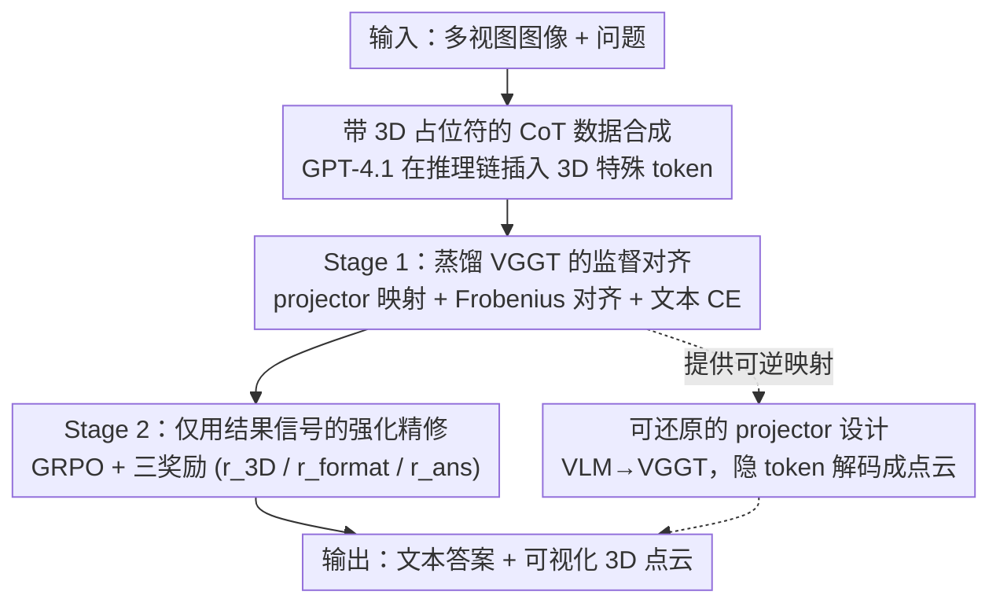

# Think with 3D: Geometric Imagination Grounded Spatial Reasoning from Limited Views

**会议**: CVPR 2026  
**论文**: [CVF Open Access](https://openaccess.thecvf.com/content/CVPR2026/html/Chen_Think_with_3D_Geometric_Imagination_Grounded_Spatial_Reasoning_from_Limited_CVPR_2026_paper.html)  
**代码**: https://github.com/zhangquanchen/3DThinker  
**领域**: 多模态VLM  
**关键词**: 空间推理, 3D心智表征, VGGT蒸馏, 隐空间推理, GRPO

## 一句话总结
3DThinker 让 VLM 在推理链里直接吐出一段「3D 隐 token」、并把它对齐到 3D 基础模型 VGGT 的几何特征，从而在不输入任何 3D 先验、不依赖稠密标注的前提下，仅凭有限的几张 2D 视图就能「在脑子里想象 3D 场景」做空间推理；在 8 个空间理解 benchmark 上稳定超越强基线，最大模型甚至压过 o3。

## 研究背景与动机
**领域现状**：具身智能、自动驾驶等系统要和真实 3D 世界交互，但拿到的往往只是几台相机同时拍下的、互相不可替换的有限视角图。让 VLM「脑补出完整场景再推理」是空间智能的核心问题。为提升 VLM 的空间推理，社区目前主要走两条路：一条是**纯文本 / 2D 视觉线索推理**——比如 MindCube 训练模型生成 3D 布局的认知地图（cognitive map），Ego3D 用 GroundingDINO + DepthAnythingV2 等外部模型自动构造认知地图；另一条是**把辅助模态当额外输入**——直接喂点云、相机参数、深度图，或调用外部编码器拿预先算好的 3D token。

**现有痛点**：第一条路的表示能力天然有限，纯文本/2D 装不下复杂的 3D 空间布局；而且认知地图依赖鸟瞰图（BEV）标注或外部模型，碰到低分辨率/未筛选的图就崩。第二条路把模型限死在「必须有点云/深度」的场景，单目图片下根本用不了；调外部工具还引入额外推理开销，更关键的是——这些 3D 能力是「外挂」的，**不属于模型自身的内在能力**。

**核心矛盾**：要么用表达力不够的文本/2D 凑合，要么靠外部标注和工具硬撑——两者都没让 VLM 在推理过程里**内生地**长出 3D 几何理解。最接近的工作 Mirage 用真值图像 embedding 做监督，让多模态轨迹得以延续而无需逐像素生成图像，但它重度依赖真值图像监督、且困在「think with image」（2D）范式里，满足不了「直接从 2D 图学 3D」和「免标注」。

**本文目标**：作者把需求拆成三条硬指标——**G1 可想象 3D**：直接从有限 2D 图学几何，不靠 3D 输入；**G2 免标注**：不依赖稠密标注数据；**G3 内生**：推理时不调任何外部先验或辅助模型。

**切入角度**：人类做空间推理时是先在脑中「想象」出 3D 场景再推理（mental imagery）。作者据此假设：与其让 VLM 显式生成点云（要标注、要生成能力，太难），不如让它在推理链里生成一段**紧凑的隐式 3D token**，再把这段隐表征**对齐**到一个现成 3D 基础模型（VGGT）的特征空间，借蒸馏间接获得几何感知。

**核心 idea**：在 CoT 里插入「3D 特殊 token」作为心智 3D 场景的占位符，用 VGGT 特征蒸馏（监督）+ 仅靠结果信号的强化（RL）两阶段训练，让 VLM 学会「think with 3D」——既能内生想象 3D，又因为 projector 可逆而能把隐 token 还原成点云，顺带解决隐空间推理不可解释的老问题。

## 方法详解

### 整体框架
3DThinker 的输入是一组多视图图像 $\mathcal{I}=\{I_1,\dots,I_n\}$ 和一个问题 $Q$，输出是文本答案，同时在推理链中间生成一段可被还原成点云的 3D 隐表征。整条流水线分三步：先用强模型（GPT-4.1）**合成带 3D 占位符的 CoT 数据**给模型「打样」，再用**监督训练**把 VLM 生成的 3D 隐 token 对齐到 VGGT 的几何特征（同时用交叉熵保住文本连贯），最后用**仅看结果的强化训练**在保持 3D 对齐的前提下端到端精修整条推理轨迹。一句话概括转换关系：2D 多视图 → VLM 推理时吐出 3D 隐 token → 该 token 经 projector 映射对齐 VGGT 几何 → 结合文本得出答案，且隐 token 可逆向解码出场景点云。

### 关键设计

**1. 带 3D 占位符的 CoT 数据合成：给「只会吐文字」的 VLM 喂出 3D 推理范式**

VLM 天生只生成文本 token，根本不知道该在哪一步「想象 3D」。作者的解法是先合成训练语料：给定多视图图像集 $\mathcal{I}$、问题 $Q$ 和真值答案 $R$，用高水平模型 GPT-4.1 补全推理链 $o = M(Q,\mathcal{I},R)$，并在链中**插入 3D 特殊 token 作为占位符**——这些占位符代表「心里想象的 3D 场景」。最终拿到的每条轨迹 $o^{(i)}$ 都是文本与 3D 占位符交错的形式，整批构成数据集 $\mathcal{D}=\{(Q^{(i)},\mathcal{I}^{(i)},R^{(i)},o^{(i)})\}$。这一步只是确定 3D token 该出现在推理链的什么位置、长什么样的「骨架」，至于占位符的隐状态该是什么几何含义，留给 Stage 1 去监督。

**2. Stage 1 蒸馏 VGGT 的监督对齐：不标 3D，也能让隐 token 学到几何**

显式让模型生成点云既要标注又要生成能力，太重。作者改成把现成 3D 基础模型 VGGT 的特征**蒸馏**进 VLM 推理时生成的 3D token。具体地，把轨迹拆成三段 $o = o_{\text{pre}} \oplus t_{\text{3D}} \oplus o_{\text{post}}$，其中 $t_{\text{3D}}=\{t_1,\dots,t_k\}$ 是心智 3D token 序列；从 VLM 最后一层隐状态递归地取出对应的「显著向量」 $F_{\text{latent}}=\{h_1,\dots,h_k\}$（$h_i$ 条件于前文与已生成的 $t_{1:i-1}$）。同时用图像编码器取 patch 级特征 $F_{\text{images}}=f_{\text{enc}}(\mathcal{I})$、用 VGGT aggregator 末层取几何特征 $F_{\text{3D}}=f_{\text{vggt}}(\mathcal{I})$。经 projector 把隐表征映射到与 VGGT 兼容的空间 $F_{\text{proj}}=\mathrm{Projector}(F_{\text{latent}},F_{\text{images}})$，再用 Frobenius 损失对齐：

$$\mathcal{L}_{3D} = \| F_{\text{proj}} - F_{\text{3D}} \|_F^2.$$

光对齐 3D 会破坏语言连贯，所以对 $t_{\text{3D}}$ 前后的文本 token 各加一份交叉熵 $\mathcal{L}_{\text{text}}=\mathcal{L}_{\text{text}}^{\text{pre}}+\mathcal{L}_{\text{text}}^{\text{post}}$，总目标为 $\mathcal{L}_{\text{total}}=\lambda_{3D}\mathcal{L}_{3D}+\lambda_{\text{text}}\mathcal{L}_{\text{text}}$（论文取 $\lambda_{3D}=0.1$、$\lambda_{\text{text}}=1$）。这样模型既学会了把 3D token 的隐状态对齐到真几何，又没丢掉正常说话的能力——满足 G2（不用造原始 3D 数据）和 G3（推理时不挂外部几何编码器）。

**3. Stage 2 仅用结果信号的强化精修：用对/错一个信号端到端打磨整条 3D 想象**

监督只是「热身」，让模型会生成格式正确的 3D token；但静态对齐管不到「这段想象到底有没有帮到最终答案」。Stage 2 用 outcome-based GRPO 优化整条采样轨迹，此时 **projector 冻结**。对每个 $(Q,\mathcal{I})$ 采 $N$ 条候选 $\{o_1,\dots,o_N\}$，按组归一化优势 $\hat{A}_{i,t}=\frac{r_{i,t}-\mathrm{mean}\{r\}}{\mathrm{std}\{r\}+\delta}$ 更新策略。奖励是三项之和：**$r_{3D}$**——把 RL 阶段重算的 $F_{\text{proj}}^{RL}$ 与 VGGT 特征的余弦相似度映射到 $[0,1]$，$r_{3D}=\frac{1}{2}\big(1+\frac{F_{\text{proj}}^{RL}\cdot F_{3D}}{\|F_{\text{proj}}^{RL}\|\,\|F_{3D}\|}\big)$，在 RL 时继续把 3D token 钉在几何上不让它漂走；**$r_{\text{format}}$**——输出严格符合 `<|latent start|>...<|latent end|>...<think>...</think><answer>...</answer>` 才给 1.0；**$r_{\text{ans}}$**——答案与真值选项匹配给 0/1，并把这个结果奖励**均摊到轨迹每个 token（含 3D token）**。也就是说，3D 想象不再只被「像不像 VGGT」约束，还被「最后答没答对」反向打磨，把静态几何对齐升级成服务于推理结果的动态心智。

**4. 可还原的 projector 设计：让隐空间推理第一次「看得见」**

隐空间推理的老毛病是不可解释。作者在两种 projector 方案里特意选了**可逆的那个**：方案一把 VLM 最后一层隐状态映射到 VGGT 空间（即上面的 $F_{\text{proj}}$），于是隐 token 可以再经 VGGT 的 DPT 头解码成点云；方案二反过来把 VGGT 特征压进 VLM 空间（如自适应平均池化），但这条路**还原不回 3D 表征**。作者选方案一不仅因为它性能更好（75.2 vs 74.1），更因为它让 3D 心智「看得见」——可视化显示重建点云能大致勾出场景，且 prompt 相关物体区域更清晰，说明隐 token 确实在按问题意图编码 3D 场景，而非乱码。

> ⚠️ 论文 PDF 抽取的部分公式（如 $h_i$ 递归式、CE 损失下标）OCR 有断字，上文按语义还原，**以原文为准**。

## 实验关键数据

### 主实验
在 MindCube-Tiny 与 Ego3D-Bench 上跨多个底座 VLM 验证。S1=只做 Stage 1，S1+S2=完整两阶段。3DThinker 对所有底座都稳定涨点：MindCube-Tiny 整体提升 51.8%~108.8%，Ego3D-Bench 提升 18.1%~36.9%。最强的 3DThinker-72B 在两榜均超过所有开闭源模型（含 o3）。

| 底座 / 方法 | MindCube-Tiny Overall ↑ | Ego3D-Bench Avg. ↑ |
|------|------|------|
| Qwen2.5-VL-3B（基线） | 33.2 | 39.1 |
| 　+3DThinker-S1 | 62.7 | 46.7 |
| 　+3DThinker-S1+S2 | **75.2** | **50.8** |
| Qwen2.5-VL-7B（基线） | 34.7 | 41.1 |
| 　+3DThinker-S1+S2 | **76.0** | **54.9** |
| InternVL3-78B（基线） | 49.9 | 59.9 |
| 　+3DThinker-S1+S2 | **78.9** | **73.3** |
| o3-2025-04-16（闭源最强对照） | 56.6 | 73.0 |

跨 6 个空间 benchmark（VSI/SP/CV/SPAR/ViewSpatial/MMSI）对比同底座的专门空间模型，3DThinker 在单图与多视图任务上都占优，且不像 Video-R1 那样在单图任务（CV-Bench）掉到底座以下：

| 方法（Qwen2.5-VL-7B 系） | 6-bench Avg. ↑ |
|------|------|
| Qwen2.5-VL-7B（基线） | 41.1 |
| SpaceR-7B | 47.5 |
| VILASR-7B（此前 SOTA） | 48.4 |
| Video-R1 | 40.5 |
| **3DThinker-S1+S2** | **64.7** |

### 消融实验
**3D 隐 token 尺寸**（MindCube-Tiny, S1）：尺寸 12 最优；过小表达力不足，过大反而压住模型自然表达、退化成反复输出 `<|latent start|>` 而吐不出答案。

| Latent Size | 4 | 8 | 12 | 16 | 32 | 64 |
|------|------|------|------|------|------|------|
| Accuracy | 60.2 | 60.6 | **62.7** | 59.9 | 25.1 | 15.5 |

**各组件设计**（MindCube-Tiny, S1+S2, Qwen2.5-3B）：

| 配置 | Accuracy | 说明 |
|------|------|------|
| Full | **75.2** | 完整模型（3D token 置于开头/末尾 + 可逆 projector + 三奖励） |
| 3D token 放中间 | 42.0 | 插在 `<think>` 内部，扰乱语言连贯、乱码早停，暴跌 |
| projector 改 VGGT→VLM | 74.1 | 不可还原点云，性能也略低 |
| w/o $r_{\text{format}}$ | 74.8 | 格式奖励影响最小 |
| w/o $r_{3D}$ | 68.3 | 失去对 3D 隐 token 的稳定约束，明显掉点 |
| w/o $r_{\text{ans}}$ | 64.2 | 唯一真值监督信号，去掉掉最多 |

### 关键发现
- **Stage 2 的增益主要来自动态空间能力**：S1 主攻静态空间理解，旋转（rotation）这类需动态想象的子类涨幅偏小；接上 outcome-based RL 后通过逐 rollout 精修 3D 隐表征，在 zero-RL 与 SFT→RL 两种设置下都进一步涨点（如 3B 上 62.7→75.2）。
- **三奖励里 $r_{\text{ans}}$ 最关键、$r_{3D}$ 次之、$r_{\text{format}}$ 最弱**：去掉答案奖励掉到 64.2、去掉 3D 对齐掉到 68.3、去掉格式仅 74.8，印证「结果信号 + 几何约束」是双支柱。
- **3D token 位置极敏感**：放推理链中间会和文字纠缠成乱码（75.2→42.0），必须隔离在开头或末尾。
- **强跨数据集泛化**：模型未用任何 Ego3D 专属数据训练，却在 Ego3D-Bench 上拿到好成绩；在单图任务上也不退化，说明「think with 3D」是通用增益而非过拟合某榜。

## 亮点与洞察
- **把「生成 3D」换成「对齐 3D」是全文最巧的一手**：直接让 VLM 生成点云要标注要生成能力，作者改成蒸馏 VGGT 特征——既绕开稠密 3D 标注（G2），推理时也不挂外部几何模型（G3），用最小代价拿到几何感知。
- **可逆 projector 顺手解决了隐空间推理不可解释的痛点**：选「VLM→VGGT」而非「VGGT→VLM」，隐 token 能经 DPT 解码成点云，让「模型脑子里在想什么 3D」第一次可视化，这种「为可解释性而设计方向」的思路可迁移到任何隐 token 推理工作。
- **结果奖励均摊到 3D token**：把 0/1 答案对错平摊到包括 3D token 在内的整条轨迹，等于用最终结果反向监督中间的「想象」，是「想象服务于结论」而非「为想象而想象」的关键。

## 局限与展望
- **依赖 VGGT 的几何质量**：3D 监督完全来自 VGGT 蒸馏，VGGT 在某些场景的几何误差会直接传导进模型的「心智 3D」，作者未深入讨论这一上界。
- **动态/时序任务偏弱**：旋转类、Travel Time 等需要动态空间想象或更丰富上下文对齐真实尺度的子任务涨幅明显偏小，归一化 3D 表征与真实世界尺度的对齐仍是短板。
- **数据合成依赖 GPT-4.1**：CoT 与 3D 占位符靠强教师模型生成，质量与成本受限于教师；占位符位置由启发式规则放置（开头/末尾），是否最优缺更系统的搜索。
- **改进方向**：引入时序/视频几何基础模型替代单帧 VGGT 以补动态短板；探索免教师的自举式 3D-CoT 合成。

## 相关工作与启发
- **vs Mirage（think with image）**：Mirage 用真值图像 embedding 监督，让多模态轨迹延续而不必逐像素生成图像，但困在 2D「想象图像」范式、且重度依赖真值图像监督，满足不了「直接学 3D」和「免标注」；3DThinker 把想象升到 3D mental 层级、用 VGGT 蒸馏免去真值监督。
- **vs MindCube / Ego3D-VLM（认知地图派）**：它们靠 BEV 标注或 GroundingDINO+DepthAnythingV2 等外部模型构造文本认知地图，受外部模型性能拖累、低分辨率图易崩；3DThinker 推理时零外部先验，在 Ego3D-Bench 上反超 Ego3D-VLM（如 3B 上 50.8 vs 44.4）。
- **vs VLM-3R / 3DRS（输入增强派）**：前者用预训练模型的隐式 3D token 注入先验、需跑庞大 3D 基础模型推理，后者要求输入含每像素 3D 坐标；3DThinker 的 3D 感知是内生的，单目有限视图即可，无额外推理开销。

## 评分
- 新颖性: ⭐⭐⭐⭐⭐ 首个让 VLM 在推理链内生成并对齐 3D 隐 token、无 3D 先验/无稠密标注的「think with 3D」框架
- 实验充分度: ⭐⭐⭐⭐⭐ 8 个 benchmark、4 个底座家族、多参数规模 + 完整消融（尺寸/位置/projector/奖励），并与闭源 o3 正面对比
- 写作质量: ⭐⭐⭐⭐ 目标 G1/G2/G3 拆得清、方法层次分明；部分公式 OCR 断字、动态任务弱点讨论略浅
- 价值: ⭐⭐⭐⭐⭐ 为「把 3D 表征统一进多模态推理」提供了可落地、可解释、可泛化的新范式

<!-- RELATED:START -->

## 相关论文

- [\[CVPR 2026\] Beyond 3D VQAs: Injecting 3D Spatial Priors into Vision-Language Models for Enhanced Geometric Reasoning](beyond_3d_vqas_injecting_3d_spatial_priors_into_vision-language_models_for_enhan.md)
- [\[CVPR 2026\] G$^2$VLM: Geometry Grounded Vision Language Model with Unified 3D Reconstruction and Spatial Reasoning](g2vlm_geometry_grounded_vision_language_model_with_unified_3d_reconstruction_and.md)
- [\[CVPR 2026\] Grounded 3D-Aware Spatial Vision-Language Modeling](grounded_3d-aware_spatial_vision-language_modeling.md)
- [\[ICML 2026\] 3ViewSense: Spatial and Mental Perspective Reasoning from Orthographic Views in Vision-Language Models](../../ICML2026/multimodal_vlm/3viewsense_spatial_and_mental_perspective_reasoning_from_orthographic_views_in_v.md)
- [\[CVPR 2026\] SpaceTools: Tool-Augmented Spatial Reasoning via Double Interactive RL](spacetools_tool-augmented_spatial_reasoning_via_double_interactive_rl.md)

<!-- RELATED:END -->
