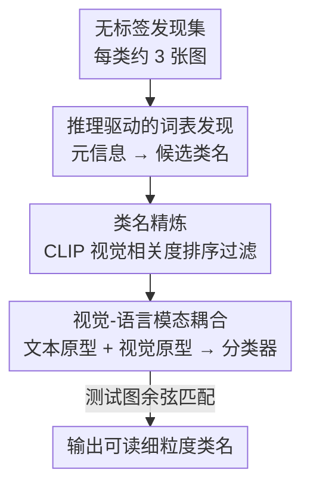

# Thinking Beyond Labels: Vocabulary-Free Fine-Grained Recognition using Reasoning-Augmented LMMs

**会议**: CVPR 2026  
**论文**: [CVF Open Access](https://openaccess.thecvf.com/content/CVPR2026/html/Demidov_Thinking_Beyond_Labels_Vocabulary-Free_Fine-Grained_Recognition_using_Reasoning-Augmented_LMMs_CVPR_2026_paper.html)  
**代码**: https://github.com/demidovd98/FiNDR  
**领域**: 多模态VLM  
**关键词**: 无词表细粒度识别、推理增强 LMM、动态类名发现、开放世界识别、CLIP 模态耦合

## 一句话总结
FiNDR 用一个带推理能力的大型多模态模型（LMM）直接为无标签图像"想出"细粒度类名，再用 CLIP 做视觉过滤和模态耦合构造分类器，在 5 个细粒度数据集上把无词表识别推到 SOTA（平均 cACC +9.5%），甚至反超了"用真实类名"的零样本上界。

## 研究背景与动机
**领域现状**：细粒度识别要区分同一大类下视觉极相似的子类（200 种鸟、196 款车）。传统做法依赖领域专家预先写好的庞大词表，但在开放世界里这种词表往往残缺甚至完全没有，于是催生了"无词表细粒度识别"——不给任何预定义类名，模型要自己既造出类名表、又把测试图分到这些名字上。

**现有痛点**：现有无词表方法分三类，各有硬伤。① 聚类法（KMeans、Sinkhorn）只用视觉特征，输出的是没有语义的簇编号，要"叫出名字"时无能为力；② 带预定义词表的零样本法（CLIP + WordNet、CaSED）仍然需要一个大而僵硬的候选词表，标签缺失/有噪声时就崩；③ 动态词表发现（FineR、E-FineR）用 VLM 描述图像、再用纯文本 LLM 推理出标签，但把识别拆成多个独立模型串联的长流水线，**误差会逐级传播**，而且 LLM 生成的属性往往不针对具体图像，遇到类内差异就不可靠。

**核心矛盾**：要么被词表绑死（零样本法），要么被脆弱的多阶段启发式流水线绑死（动态发现法），且这些动态方法至今**没能超过**"已知真实类名的零样本分类器"这个被视为不可逾越的上界。根因在于：纯文本 LLM 看不到图像、知识库有限，会自信地给出错误命名（把白毛狗叫成 Golden Retriever、给出 "Possible Cat Breeds" 这种占位标签）。

**本文目标**：构造一个**全自动、无任何先验类名**的系统，既能造出语义精确的细粒度类名，又能稳健地分类，且避免误差传播。

**切入角度**：最新的推理增强 LMM（带显式/隐式思维链）能同时看图看文、分解问题、检索潜在知识、自我纠错——这恰好契合"既要细粒度视觉判别、又要上下文知识"的无词表任务。作者赌的是：把命名这件事交给一个能看图、会推理的统一 LMM，比"VLM 描述 + 文本 LLM 推理"的拼接流水线更可靠。

**核心 idea**：让推理 LMM 直接为每张图生成描述性候选类名（取代脆弱流水线），再让 VLM 充当"语义验证器"过滤排序、并用模态耦合把文本原型和视觉原型混合成最终分类器——整条链零监督、零训练、零预定义词表。

## 方法详解

### 整体框架
给定一个极小的"发现集" $D_\text{disc}=\{x_i\}_{i=1}^N$（默认每类只采 3 张无标签图），FiNDR（Fine-grained Name Discovery via Reasoning）分两大阶段把它变成一个可推理的细粒度分类器，全程不碰任何真实类名或属性元数据：

- **词表发现阶段**：先用推理 LMM 从随机抽样的几张图里推断出数据集级"元信息"（大类是什么、粒度单位、需要哪种领域专家），把它当作冻结上下文；再带着这份上下文逐张图问 LMM 要一个细粒度候选名 $\tilde c_i$，经规范化清洗后汇成初始候选词表 $\tilde C$。
- **分类器准备阶段**：用 CLIP 计算每个候选名与发现集图像的视觉相关度，过滤掉跟视觉证据对不上的名字，得到精炼词表 $\tilde C^*$；再把每个类名的文本原型和它伪标注样本的视觉原型耦合成统一的视觉-语言分类器 $W_{VL}$。推理时直接拿测试图的视觉特征和 $W_{VL}$ 做余弦匹配，输出的是**人类可读的语义名字**而非数字索引。

### 关键设计

**1. 推理驱动的词表发现：用一个会看图会推理的 LMM 取代"VLM 描述 + 文本 LLM"流水线**

这一步直击"多阶段流水线误差传播 + 文本 LLM 看不到图像"的痛点。作者不再让 VLM 先写描述、再交给纯文本 LLM 瞎猜，而是用同一个推理 LMM（实现里用 Qwen2.5-VL-72B-Instruct）分两轮采集命名。第一轮做**数据集级元信息推断**：从发现集随机取 3 张图组成上下文 $S=\{x_a,x_b,x_c\}$，让 LMM 输出 $m^\star = M_\text{meta}(S) = (c_\text{meta}, u_\text{type}, e_\text{expert})$，即广义分类大类、该大类内的粒度单位、以及做细分需要的领域专家名（如"鸟类学家"）。第二轮带着这份冻结的 $m^\star$ 逐张图问细粒度标签：$\tilde c_i = M_\text{main}(x_i, m^\star)$，其中 $M_\text{meta}$ 与 $M_\text{main}$ 是同一个模型、只差提示词。这种 step-by-step 提示让推理 LMM 先建立"我在分什么"的全局上下文，再做单图判别，比逐图独立猜测稳得多。最后每条原始预测会做规范化（统一大小写、单复数、空白），剔除语法损坏串和规范化后仍过于宽泛的名字，得到干净的初始词表 $\tilde C$。消融显示元信息和专家前缀都实打实涨分（见下文 Table 2）。

**2. 类名精炼：让 CLIP 当语义验证器，把和视觉证据对不上的名字筛掉**

LMM 给出的名字里总有些并不真正代表集合里的图像（幻觉或过度泛化）。作者用 CLIP 文本-图像对齐做一道视觉验证：对每个候选名 $c\in\tilde C$，算它的文本嵌入 $t_c$ 与发现集每张图视觉特征 $v_j$ 的平均余弦相似度作为视觉相关度分数

$$\text{score}(c) = \frac{1}{N}\sum_{j=1}^{N}\cos(t_c, v_j) = \frac{1}{N}\sum_{j=1}^{N}\frac{t_c^\top v_j}{\lVert t_c\rVert\cdot\lVert v_j\rVert}.$$

按分数排序、只保留高分项，得到精炼词表 $\tilde C^*\subseteq\tilde C$。这一步把文本标签的语义空间收缩到"最贴合数据集真实视觉证据"的那部分，相当于用图像来给 LMM 的命名投票，过滤掉看着像但其实不在这批图里的类名。

**3. 视觉-语言模态耦合：把文本原型和视觉原型混合，对冲猜错类名带来的噪声**

光有文本原型仍然脆弱——名字本身可能有歧义，且 LMM 猜的名字带域偏移。作者为每个 $c\in\tilde C^*$ 同时构建文本和视觉两套原型再融合。文本原型 $t_c$ 直接由 CLIP 文本分支编码类名得到；视觉原型则先给发现集每张图按文本相似度伪标注（选 $\tilde C^*$ 里相似度最高的类），得到每类的伪标注样本集 $U_c$。由于每类样本极少、视觉特征易偏且缺乏多样性，对每张图做 $K=10$ 次随机裁剪+水平翻转增强，再把增强特征平均：

$$v_c = \frac{1}{K\cdot|U_c|}\sum_{i=1}^{|U_c|}\sum_{k=1}^{K}\frac{f_V(\text{Aug}_k(x_i^c))}{\lVert f_V(\text{Aug}_k(x_i^c))\rVert}.$$

最后线性混合两路得到该类的视觉-语言分类器原型：$W_{VL}^{(c)} = \alpha\cdot t_c + (1-\alpha)\cdot v_c$，耦合系数固定 $\alpha=0.7$。这样在类名可能猜错、有噪声时，互补的视觉证据能拉回来；用与 CLIP 训练一致的两种增强也让原型分布对齐测试时的特征。推理时对测试图 $x$ 取 $\tilde y = \arg\max_{c\in\tilde C^*}\cos(f_V(x), W_{VL}^{(c)})$，注意这里编码用的是更轻的 ViT-B/16 以省算力，输出直接是可读类名。

> ⚠️ 框架↔关键设计一致性：上图四个贡献节点（词表发现、类名精炼、模态耦合）与三个关键设计一一对应，"推理 LMM" 同时承担元信息与单图命名两轮、合并在设计 1 里讲；CLIP 既做精炼（设计 2）又做耦合（设计 3）的编码骨干。

### 一个完整示例（Oxford Pets）
以一张英国可卡犬的图为例走一遍：① 元信息阶段 LMM 从 3 张样本图推断出大类="宠物/犬猫"、粒度单位="品种"、专家="兽医/犬种学家"；② 带着这份上下文，LMM 对该图判别出 "English Cocker Spaniel"——而老方法 FineR 在多阶段流水线里容易误传成 "American Cocker Spaniel"；③ CLIP 计算 "English Cocker Spaniel" 与发现集图的平均相似度，确认它视觉相关、保留进 $\tilde C^*$；④ 用伪标注+增强构造该品种的视觉原型，和文本原型按 0.7:0.3 耦合；⑤ 测试图与所有耦合原型比余弦，命中该品种。论文定性显示，即便 FiNDR 的低置信预测也仍落在正确大类内（不会把猫叫成 "Possible Cat Breeds" 这种占位词），靠的就是 LMM 集成的视觉+分类学推理。

## 实验关键数据

### 主实验
五个细粒度基准（CUB-200 鸟、Cars-196 车、Dogs-120 狗、Flowers-102 花、Pets-37 宠物），无词表设定，每类只给 3 张无标签发现图，结果跑 10 次取平均。指标用聚类准确率 cACC（不管名字对不对，看同类图是否聚到一起）和语义准确率 sACC（用冻结语言模型评预测名与真值名的语义相关度）。

| 方法 | 词表来源 | 平均 cACC | 平均 sACC |
|------|---------|-----------|-----------|
| KMeans | 无（纯视觉聚类） | 36.7 | — |
| CaSED | 预定义词表 | 43.7 | 52.6 |
| BLIP-2 | 自动发现 | 47.2 | 58.6 |
| FineR | 自动发现 | 57.0 | 64.3 |
| E-FineR（前 SOTA） | 自动发现 | 58.4 | 66.3 |
| **FiNDR（本文）** | 自动发现 | **67.9** | **70.6** |
| CLIP 零样本（用真实类名，参考上界） | 真实词表 | 65.8 | 77.6 |

平均比前 SOTA E-FineR 提升 cACC +9.5%、sACC +4.3%；最关键的是平均 cACC 67.9% **反超**了"用真实类名"的 CLIP 零样本上界 65.8%，挑战了"人工词表是细粒度识别上界"的传统假设。单数据集上 Pets-37 拿到 86.5/83.7（相对 +18.7%/+9.9%），Flowers-102 cACC 79.8（比 E-FineR 涨 15.0%）。

### 消融实验：提示词设计（Table 2，CUB/Cars/Pets）
| 配置 | Pets cACC | Pets sACC | 说明 |
|------|-----------|-----------|------|
| Base（"图里主物体是什么？"） | 76.61 | 74.02 | 最朴素提示 |
| Base + Meta | 81.82 | 82.96 | 加元类信息，cACC +5.2、sACC +8.9 |
| Base + Meta + Expert（完整） | 84.13 | 84.46 | 再加专家前缀，sACC 继续 +1.5 |

元信息对所有数据集都稳定涨分（尤其语义准确率），专家前缀进一步提升语义精度（Cars 的 cACC 有 0.8% 轻微波动，但语义增益足以抵消）。相对 Base，完整提示在 Pets 上 cACC +9.9%、sACC +14.2%（相对值）。

### 关键发现
- **反超上界是最大亮点**：自动发现的词表平均聚类准确率竟超过用真实类名的零样本分类器，说明僵硬的人工标签未必最优——FiNDR 常给出比官方名更精确的标签（如把向日葵标成学名 "Helianthus Annuus"、把车标成欧洲版名 "Mercedes Sprinter"），反而被只认单一标准名的 sACC 指标低估。
- **cACC 涨得比 sACC 多**：在 Flowers、Cars 上聚类准确率大涨但语义准确率涨幅温和，根因正是上面那条——视觉聚类对了，但描述性名字和数据集"有偏的"唯一真值名对不上，暴露了现有语义评测协议只信一个标准名的局限。
- **开源可追平闭源**：靠精心设计的提示，开源 Qwen2.5-VL 在 CUB-200 上拿到 76.65% sACC，逼近 Gemini2.5-Flash（显式+内部推理）的 78.04%，说明高质量无词表识别不必依赖付费闭源服务。
- **显式 vs 内部推理**：内部推理目前仍是闭源 LMM 专属，但显式 step-by-step 提示能把开源模型的表现拉到接近闭源水平。

## 亮点与洞察
- **用统一推理 LMM 取代脆弱长流水线**：把"VLM 描述 → 文本 LLM 命名"的多模型串联压成"一个会看图的推理 LMM 两轮提问"，从根上掐断误差传播，这个简化是涨分主因。
- **元信息当冻结上下文**：先推断大类/粒度/专家，再逐图命名，相当于给 LMM 先建立任务画像，是低成本却高收益的提示工程——可迁移到任何"先定范围再判别"的开放识别任务。
- **VLM 当语义验证器 + 模态耦合**：让 CLIP 既筛掉幻觉名字、又用视觉原型对冲猜错的文本标签，是"文本不可靠就拿图像兜底"的实用范式，思路可迁移到弱标签/伪标签场景。
- **挑战评测假设**："超过真实类名上界"这个结果，加上对 sACC 只认单一标准名的批评，提示社区需要能容纳多个合法细粒度名字的评测协议。

## 局限与展望
- 作者承认：sACC 指标本身有缺陷，只给一个标准名计分，会系统性低估那些"更精确但非官方名"的预测——这既是评测局限也间接是方法的"被冤枉"点。
- 依赖一个很强的推理 LMM（72B 级）做发现阶段，算力/可得性是门槛；虽然推理时换成轻量 ViT-B/16，但发现阶段成本仍高。⚠️ 论文未给出发现阶段的具体延迟/算力数字。
- 模态耦合系数 $\alpha=0.7$、增强次数 $K=10$ 全程固定，跨数据集是否最优只在附录消融，正文未展开；每类仅 3 张发现图的低资源设定下，伪标注质量对结果影响多大值得进一步分析。
- 改进方向：把"多合法名字"纳入评测、用更小的开源推理模型做发现阶段、让模态耦合系数自适应每个数据集的命名可靠度。

## 相关工作与启发
- **vs FineR / E-FineR（动态词表发现）**：它们用"视觉模型描述 + 文本 LLM 推理"的多阶段流水线，误差逐级传播、文本模型看不到图像易幻觉；本文用单个会看图的推理 LMM 直接命名，并用 CLIP 视觉验证 + 模态耦合兜底，因此首次反超了零样本上界。
- **vs 带预定义词表的零样本（CaSED / WordNet + CLIP）**：它们必须事先有一个大词表、开放世界下覆盖不全；本文完全无预定义词表，靠 LMM 现场推理生成，且平均聚类准确率还更高。
- **vs 聚类法（KMeans / Sinkhorn）**：纯视觉聚类只给无语义的簇编号，叫不出名字；本文输出人类可读的细粒度类名，兼顾聚类与可解释命名。

## 评分
- 新颖性: ⭐⭐⭐⭐⭐ 首个把推理增强 LMM 用于无词表细粒度识别，并实证反超真实类名上界，挑战了长期假设
- 实验充分度: ⭐⭐⭐⭐ 5 个基准 + 提示词/推理策略/开源闭源多组消融，10 次平均；但算力成本与超参跨集敏感性论证略薄
- 写作质量: ⭐⭐⭐⭐ 动机和方法链路清晰，对 cACC/sACC 背离的解释很到位
- 价值: ⭐⭐⭐⭐⭐ 全自动、无词表、开源可追平闭源，对开放世界细粒度识别落地很实用

<!-- RELATED:START -->

## 相关论文

- [\[CVPR 2026\] Thinking With Videos: Multimodal Tool-Augmented Reinforcement Learning for Long Video Reasoning](thinking_with_videos_multimodal_tool-augmented_reinforcement_learning_for_long_v.md)
- [\[CVPR 2026\] Chart-FR1: Visual Focus-Driven Fine-Grained Reasoning on Dense Charts](chart-fr1_visual_focus-driven_fine-grained_reasoning_on_dense_charts.md)
- [\[CVPR 2026\] ReasonMap: Towards Fine-Grained Visual Reasoning from Transit Maps](reasonmap_towards_fine-grained_visual_reasoning_from_transit_maps.md)
- [\[CVPR 2026\] MA-Bench: Towards Fine-grained Micro-Action Understanding](ma-bench_towards_fine-grained_micro-action_understanding.md)
- [\[CVPR 2026\] HandVQA: Diagnosing and Improving Fine-Grained Spatial Reasoning about Hands in Vision-Language Models](handvqa_diagnosing_and_improving_fine-grained_spatial_reasoning_about_hands_in_v.md)

<!-- RELATED:END -->
