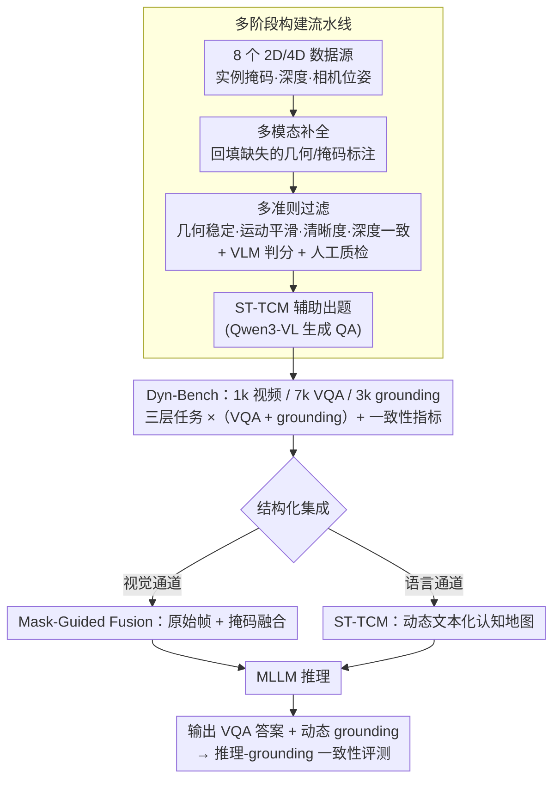

# Thinking in Dynamics: How Multimodal Large Language Models Perceive, Track, and Reason Dynamics in Physical 4D World

**会议**: CVPR 2026  
**arXiv**: [2603.12746](https://arxiv.org/abs/2603.12746)  
**代码**: [https://dyn-bench.github.io/](https://dyn-bench.github.io/)  
**领域**: 多模态VLM / 视频时空推理  
**关键词**: 4D dynamics, Dyn-Bench benchmark, spatio-temporal reasoning, dynamic grounding, MLLM evaluation

## 一句话总结
提出 Dyn-Bench——一个面向 4D 物理世界动态理解的大规模基准（1k 视频、7k VQA 对、3k 动态 grounding 对），系统评估了通用/空间/区域级 MLLM 的时空推理能力，发现现有模型无法同时维持推理和 grounding 的一致性，并提出 Mask-Guided Fusion 和 ST-TCM 两种结构化集成方法显著提升动态感知。

## 研究背景与动机

### 领域现状
人类生活在一个几何结构和语义内容随时间演化的物理 4D 世界中。当前 MLLM 在静态图像理解上表现出色，但对视频中的动态理解——即感知、跟踪和推理时空动态——的能力尚未被系统评估。

### 现有痛点
1. 缺乏专门评估 MLLM 在**动态 4D 场景**中时空推理能力的基准——现有视频 QA 数据集主要关注事件描述而非空间动态
2. 现有模型在时空推理和动态物体 grounding 之间存在**不一致性**——即使能正确回答"球往左移了"，也无法在视频中准确框出运动轨迹
3. 传统的 prompting 策略（如 CoT、caption-based hints）对动态推理的提升有限

### 核心矛盾
静态图像理解的成功不能直接迁移到动态场景——时空动态涉及运动轨迹、物体交互、物理因果等复杂推理，需要专门的建模。

### 核心 idea
构建 Dyn-Bench 基准从多个维度（语言推理 + 视觉 grounding）评估 MLLM 的动态理解能力，并提出结构化集成方法（Mask-Guided Fusion + ST-TCM）来增强动态感知。

## 方法详解

### 整体框架
这篇工作想回答一个被静态图像理解掩盖的问题：MLLM 到底能不能感知、跟踪并推理 4D 物理世界里随时间演化的动态？为此它做了两件事——先搭出 Dyn-Bench 这把"尺子"，再针对量出来的短板提出两种结构化集成（structured integration）方法。Dyn-Bench 从 8 个 2D 视频分割 / 4D 动态场景数据源出发，经"多模态补全 → 多准则过滤 → 结构化认知地图辅助出题"的流水线沉淀出高质量动态场景，并把评测拆成三个互补层级（动态物体间感知、动态物体-场景跟踪、动态相机-物体推理），每一层都成对地考一道 Spatio-Temporal VQA（共 7k 对，考"说得对不对"）和一道 Dynamic Object Grounding（共 3k 对，考"指得准不准"），并新引入"推理-grounding 一致性"把两者绑到同一把尺子上。量出短板后，论文从两个通道注入动态线索：Mask-Guided Fusion（MGF）在视觉端把掩码与原帧融合、ST-TCM 在语言端把动态文本化，二者一图一文互补，喂给 MLLM 后显著拉升时空推理与定位。

### 关键设计

**1. Dyn-Bench 的三层 × 双任务评测体系与一致性指标：把"说得对"和"指得准"绑到一把尺子上**

现有视频 QA 基准多停在场景级的事件描述，缺少以"动态物体"为中心的细粒度评测。Dyn-Bench 把动态理解拆成三个互补层级——动态物体间感知（多个运动物体的空间关系与交互，如接近、遮挡、超越）、动态物体-场景跟踪（物体在场景里的运动与时序演化）、动态相机-物体推理（相机运动下的物体行为）。每一层都成对出题：一道 Spatio-Temporal VQA 用自然语言考时空推理，一道 Dynamic Object Grounding 要求模型把被问及的物体用实例掩码真正框出来。关键的评测创新是"推理-grounding 一致性"：当模型 VQA 答对、grounding 却框错时即判为不一致，从而第一次把"能描述动态、却定位不了动态"的割裂量化出来——这也是论文跑遍通用 / 空间感知 / 区域级 MLLM 后发现的核心短板。

**2. 多阶段构建流水线：从 8 个数据源筛出真动态、并自动出题**

时空推理基准最怕数据假——"摄像头在动、场景其实静止"这类伪动态会让模型靠背景线索刷分。Dyn-Bench 用一条多阶段流水线保证数据质量：先从 4 个 2D 视频分割数据集（DAVIS、SA-V、DynPose-100K、YouTube-VIS）和 4 个 4D 动态场景数据集（DynamicReplica、PointOdyssey、Spring、Total-Recon）汇集原始视频，它们自带实例掩码、深度图与相机位姿；再做多模态补全，用现成管线回填缺失的几何 / 掩码标注以保证跨模态一致；接着用一套多准则过滤策略——综合几何稳定性、运动平滑度、图像清晰度、深度一致性，辅以 VLM 自动判分和人工校验——剔除低质量片段；最后用下面的 ST-TCM 配合 Qwen3-VL 自动生成 VQA 与 grounding 配对题。这样筛出的场景考的才是"理解动态"而非"读背景"。

**3. Mask-Guided Fusion（MGF）：从视觉通道把注意力按到动态物体上**

第一类短板出在视觉端——画面一复杂，模型就分不清谁在动、该盯哪。MGF 把目标物体的分割掩码与原始帧融合后一起喂给 MLLM：相比只贴掩码、丢掉外观信息的"Masked Frames Only"变体，MGF 同时保留外观线索和运动定位线索，等于在像素层面替模型先"圈了重点"，让视觉编码偏向动态区域。论文在 Qwen3-VL-8B 上验证：单纯贴掩码收益有限，而 MGF 在所有任务类别上都有提升，尤以需要细粒度运动与关系理解的"物体间"和"相机-物体"推理增益最大——印证 grounding 的瓶颈主要卡在"看哪里"。

**4. Spatio-Temporal Textual Cognitive Map（ST-TCM）：把视觉动态翻成 LLM 最擅长的文本**

第二类短板出在跨模态：动态藏在帧序列里，以语言推理见长的 LLM 主干很难直接从原始视觉特征里抽时空关系。ST-TCM 为每段视频显式构建一张结构化文本认知地图：以逐帧 RGB-D 与分割掩码为输入，重建 3D 物体轨迹，组织成 JSON——每帧记录相机位姿、深度统计、各物体的位置与运动（速度、方向）、物体间关系（如"接近"及其距离），并附一段总结性 reasoning 文本。把这张地图拼进 prompt，相当于把"某物体从左前方移动、与另一物体逐渐接近"这种隐式视觉事实预先翻成 LLM 能直接读的符号，把跨模态推理的难度卸到输入端。消融显示其中"运动 + 空间几何"线索带来的增益最大，与偏视觉的 MGF 一文一图、互为补充。值得注意的是 ST-TCM 既用于构建阶段自动出题（设计 2），也作为推理期的语言通道增强，是贯穿全流程的核心组件。

## 实验关键数据

### 主实验：MLLM 动态理解能力对比

| 模型 | VQA Acc (%) | Grounding IoU (%) | 一致性 (%) |
|------|-------------|-------------------|-----------|
| GPT-4o | 62.3 | 28.5 | 31.2 |
| Gemini-2.0 | 58.7 | 25.1 | 28.9 |
| LLaVA-Video | 51.2 | 32.4 | 35.6 |
| + Mask-Guided Fusion | 55.8 | 41.7 | 43.2 |
| + ST-TCM | 59.1 | 38.5 | 44.8 |
| + MGF + ST-TCM | **61.3** | **44.2** | **48.5** |

### Prompting 策略对比

| Prompting 策略 | VQA Acc (%) | Grounding IoU (%) |
|---------------|-------------|-------------------|
| Direct | 51.2 | 32.4 |
| Chain-of-Thought | 52.8 | 33.1 |
| Caption-based Hints | 53.1 | 34.0 |
| **Mask-Guided Fusion** | **55.8** | **41.7** |
| **ST-TCM** | **59.1** | **38.5** |

### 关键发现
- **现有 MLLM 无法同时做好推理和 grounding**——GPT-4o 的 VQA 准确率虽高（62.3%），但 grounding IoU 极低（28.5%），说明模型在"说"和"指"之间严重不一致
- **传统 prompting 几乎无效**——CoT 和 caption hints 的提升不到 2%，说明动态理解不是"多想一步"能解决的
- **结构化集成方法有效**——MGF 和 ST-TCM 分别从视觉和文本两个通道注入动态信息，效果显著
- **空间感知型模型不保证动态理解**——SpatialVLM 在静态空间推理上强，但动态场景下表现不稳定

## 亮点与洞察
- **"Thinking in Dynamics"的深刻命题**——从 4D 物理世界角度审视 MLLM，超越了传统视频 QA 的框架
- **推理-grounding 一致性评估**——首次系统量化 MLLM 在"理解"和"定位"之间的 gap
- **结构化信息注入比 prompting 有效得多**——说明动态理解的瓶颈在于"信息获取"而非"推理能力"
- **Dyn-Bench 的多源构建策略**——结合 2D 视频和 4D 点云数据，确保动态场景的真实性和多样性

## 局限与展望
- Dyn-Bench 规模相对较小（1k 视频），可能不足以训练专用模型
- ST-TCM 依赖预先提取的物体位置和轨迹信息——需要外部跟踪器/检测器支持
- 未评估闭环场景（如机器人操作中的动态推理）
- Grounding 评估仅用 bbox IoU，未考虑更精细的像素级或 3D 空间定位

## 相关工作与启发
- **vs VideoChat/Video-LLaMA**：这些工作聚焦视频对话，但不评估结构化的时空推理
- **vs EgoPlan-Bench**：EgoPlan 关注第一人称视角的规划，Dyn-Bench 更广泛地覆盖第三人称动态场景
- **启发**：MVG 和 ST-TCM 的思路可以推广到自动驾驶场景理解——将传感器信息文本化作为 MLLM 的辅助输入

## 评分
- 新颖性: ⭐⭐⭐⭐⭐ 首次从 4D 物理世界动态的角度系统评估 MLLM，命题和方法论都有开创性
- 实验充分度: ⭐⭐⭐⭐ 多模型、多策略对比全面，但数据集规模偏小
- 写作质量: ⭐⭐⭐⭐ 问题定义深刻，实验分析细致
- 价值: ⭐⭐⭐⭐⭐ Dyn-Bench 填补了 MLLM 动态评估的空白，推理-grounding 一致性分析极具参考价值

<!-- RELATED:START -->

## 相关论文

- [\[CVPR 2026\] Dynamics-Aware Preference Optimization for Vision-Language Models](dynamics-aware_preference_optimization_for_vision-language_models.md)
- [\[CVPR 2026\] Mixture of States (MoS): Routing Token-Level Dynamics for Multimodal Generation](mos_mixture_of_states_multimodal_generation.md)
- [\[CVPR 2026\] FlowHijack: A Dynamics-Aware Backdoor Attack on Flow-Matching VLA Models](flowhijack_dynamics_aware_backdoor_attack_on_flow_matching_vla_models.md)
- [\[CVPR 2026\] HanDyVQA: A Video QA Benchmark for Fine-Grained Hand-Object Interaction Dynamics](handyvqa_a_video_qa_benchmark_for_fine-grained_hand-object_interaction_dynamics.md)
- [\[CVPR 2026\] PhyCritic: Multimodal Critic Models for Physical AI](phycritic_multimodal_critic_models_for_physical_ai.md)

<!-- RELATED:END -->
