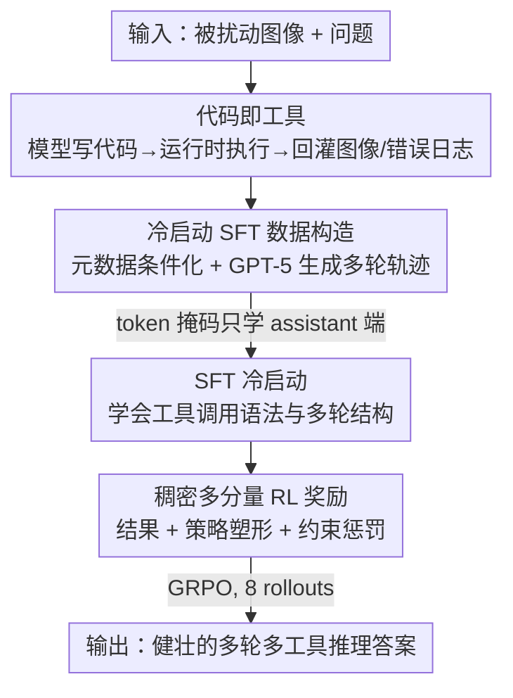

# Thinking with Programming Vision: Towards a Unified View for Thinking with Images

**会议**: CVPR 2026  
**论文**: [CVF Open Access](https://openaccess.thecvf.com/content/CVPR2026/html/Guo_Thinking_with_Programming_Vision_Towards_a_Unified_View_for_Thinking_CVPR_2026_paper.html)  
**代码**: https://github.com/ByteDance-BandAI/CodeVision  
**领域**: 多模态VLM  
**关键词**: 以图思考, 代码即工具, 工具调用, 强化学习, 稠密过程奖励

## 一句话总结
本文提出 CodeVision，让 MLLM 直接"写代码"作为统一工具接口去操纵图像（旋转、翻转、裁剪、增强……），并用「SFT 冷启动 + 稠密过程奖励 RL」两阶段训练，使模型在被旋转/翻转污染的图像上恢复出健壮的多轮多工具推理能力——在自建的方向变换基准上比基座模型平均提升十几个点，在多工具基准 MVToolBench 上几乎把次优模型的分数翻倍。

## 研究背景与动机
**领域现状**：「以图思考（thinking with images）」是 o3 之后兴起的范式——MLLM 不再被动地描述图像，而是主动调用工具（zoom in、OCR 等）操纵图像、获取证据后再推理。目前主流做法几乎都聚焦在 **crop（裁剪/放大）这一个工具**上，并在 V\*、HRBench 这类「找小目标」的基准上评测。

**现有痛点**：作者指出三个被忽视的问题。其一，**工具的必要性存疑**——在现有基准上用工具往往只带来 2–5% 的准确率提升，不用工具的纯 RL 也能打平，说明任务本身没把工具的潜力逼出来。其二，**灵活性与可扩展性差**——很多方法要手工指定工具名和参数，连把 `crop` 改名成 `zoomin` 都可能要重训，无法泛化到新工具。其三，**多轮多工具能力弱**——多数系统单轮只能用一个工具，少数支持多轮的也只是「反复裁剪」，而非跨轮组合不同工具。

**核心矛盾**：固定的工具注册表（fixed tool registry）与现实任务所需的「开放、可组合的工具空间」之间存在根本冲突；同时现有评测任务太简单，让工具显得可有可无，掩盖了真问题。

**切入角度**：作者做了一个诊断实验——取 200 张图，各自施加旋转 90/180/270 度或水平/垂直翻转之一，让模型做五选一判断「图被怎么变换了」。结果连 GPT-5、Gemini2.5-Pro 都表现很差（人类 100%），简单旋转/翻转最多能让模型性能掉 **80%**。这说明：方向变换是一类「真正非用工具不可」的现实扰动（要先把图转正才能识别），正好可以拿来逼出工具的必要性。

**核心 idea**：受 o3 启发，**把"写代码"本身当成唯一工具**——模型生成代码去调用任意图像操作，摆脱手工工具注册表；再配上面向「多轮多工具组合」的数据与稠密过程奖励，把模型训成会规划、会纠错、会发现新工具的智能体。

## 方法详解

### 整体框架
CodeVision 的输入是一张（可能被方向扰动过的）图 + 一个问题，输出是经过多轮工具调用后的最终答案。核心载体是「**代码即工具（code-as-tool）**」：模型在每一轮里写一段代码，由受控运行时执行（调用任意图像库），把返回的新图像/错误日志喂回上下文，循环直到给出答案。训练分两阶段串行：先用 SFT **冷启动**教会模型工具调用的基本语法和多轮模式，再用 **GRPO + 稠密多分量奖励**的 RL 教会模型「何时用、用哪个、用几次」的策略。为支撑这套训练与评测，作者还造了 SFT/RL 数据集和三个新基准（方向变换版 OCRBench/ChartQAPro + 多工具 MVToolBench）。

### 关键设计

**1. 代码即工具：用代码当唯一接口取代固定工具注册表**

针对「手工指定工具名/参数太脆、改个名字就要重训、无法扩展到新工具」这个痛点，本文不再维护一张工具表，而是让模型**直接写代码**——需要什么图像操作就在代码里调用对应函数/库。这一步把工具空间从「有限注册表」放开成「代码能表达的几乎无界的操作集合」，并带来三个可观察的好处：(1) **涌现新工具**——模型会调用训练数据里从没出现过的工具（如调亮度、模糊、边缘检测）来解决新问题；(2) **效率**——可以在一轮代码里链式调用多个操作（如先 contrast 再 grayscale）；(3) **健壮性**——不依赖工具的固定参数，能读运行时报错和输出来修改代码、从失败中恢复，提升 OOD 泛化。本质上，作者把「视觉交互」重新表述为「编程任务」，让工具组合的表达力交给编程语言本身。

**2. 冷启动 SFT：用元数据条件化 + GPT-5 造多轮轨迹，并用 token 掩码只学决策**

针对「代码生成的动作空间巨大、纯 RL 探索几乎学不到有用策略」的痛点，作者先用 SFT 冷启动把模型「点亮」。数据构造（Figure 3）很讲究：从手写、野外 OCR/QA、表格图表、数学推理等多域采样后，给每个样本打上**元数据**——含 ground-truth 答案和一个目标类型，类型取自五类 `single-tool / multi-tool / multi-crop / error-handling / no-tool`，按预设比例采样，再据类型采工具。关键在于**元数据条件化的图像变换**：若要求工具是 `rotate-180`，就把原图真的旋转 180 度作为模型的初始观察，从而让「转回正图」这步工具调用变得**必需**。对 crop 类，专门挑面积 ≤ 0.01% 的极小文字区域，保证非裁剪不可；对 multi-crop，强制裁剪窗口跨步「单调收缩且空间连续」来训练由粗到细的定位；对 error-handling，故意制造用错工具或代码/运行时报错，要求模型读日志、改代码、重试。随后用 **GPT-5** 在「问题 + 变换后图 + 元数据」上逐轮生成推理轨迹和动作，工具调用在受控运行时执行、与原始未变换图对比来判对错，不对就丢弃或定向纠正，迭代构造出约 **6000 条**高质量多轮轨迹。训练时把对话排成交错格式，并用 token 级掩码 $m_t \in \{0,1\}$ **只对 assistant 端（推理/工具调用 token）算损失**，屏蔽掉 user 输入和工具返回 token：

$$\mathcal{L}_{\text{SFT}}(\theta) = -\sum_{t=1}^{T} m_t \log p_\theta(y_t \mid x, y_{<t})$$

SFT 阶段**不在线执行工具**，上下文里的工具输出全用造数据时缓存的结果，于是训练退化成标准的「带掩码的多轮自回归」，既保留多轮结构又避免外部执行的运行时方差。

**3. 稠密多分量 RL 奖励：用过程信号稳住训练并堵住 reward hacking**

针对「纯结果奖励太稀疏、容易训崩、工具调用率异常」的痛点，RL 阶段（GRPO）采用一套稠密、多分量的奖励。一条轨迹 $\tau=(s_1,a_1,\dots,s_T,a_T)$ 的总奖励分解为：

$$R_{\text{total}}(\tau) = R_{\text{outcome}}(\tau) + \beta_1\sum_{t=1}^{T} R_{\text{strategy}}(a_t) - \beta_2 P_{\text{cost}}(\tau)$$

三块各司其职。**结果奖励** $R_{\text{outcome}}$ = 终端答案正确性 $r_{acc}\in\{0,+1\}$ + 格式奖励 $r_{fmt}\in\{0,+1\}$（`<think>`/`<answer>` 标签正确）。**策略塑形** $R_{\text{strategy}}$ 给出稠密过程信号，又分两部分：(a) **必用工具集 $S_{req}$**——任务前置工具（如方向错的图必须先转正），令 $N=|S_{req}|$，每个必用工具分到 $1/N$ 的预算；离散工具（rotate/flip）首次正确使用一次性给 $1/N$，连续的 crop 则按预测框与目标框的 **IoU** 给奖、且只奖励相对历史最佳 IoU 的**提升**以鼓励多步精修；此外完全按 $S_{req}$ 规定顺序、无冗余步走完整条轨迹还有额外 bonus。(b) **建议工具奖励**——并非所有有用工具都能预定义，这正是 code-as-tool 的威力所在。对一个问题采 $K=8$ 条轨迹，按是否用某可选工具分成 $G_{tool}$ 与 $G_{notool}$ 两组；若用工具组准确率更高、且不用工具组 $K$ 次里至多成功一次，则把经验性能增益算成「推断的工具必要性奖励」：

$$r_{nec} = \max\!\left(0,\; \frac{\sum_{i\in G_{tool}} r^i_{acc}}{|G_{tool}|} - \frac{\sum_{i\in G_{notool}} r^i_{acc}}{|G_{notool}|}\right)$$

$r_{nec}$ 加到所有「用了该有益工具且答对」的轨迹上，鼓励模型主动探索并采纳涌现工具。最后 **约束惩罚** $P_{\text{cost}}$ 由三条 guardrail 组成（每条 $p\in\{0,+1\}$），专门堵 reward hacking：**回合数惩罚**（已 |S_req| 个必用工具，给一回合容错预算，超过 $|S_{req}|+1$ 的工具调用回合就罚，防止模型把 rotate90/180/270 全试一遍刷策略分）；**劣质推理惩罚**（答对了但所依赖的 crop 与真区域 IoU < 0.1，说明推理没扎根在正确视觉证据上）；**不当用工具惩罚**（$S_{req}=\text{None}$ 的无需工具样本里，任何动方向的工具都罚，因为对正常图乱转反而加难度）。三组系数：格式 0.1、策略（must-use 与 suggested 分别 1.0 / 0.2）、惩罚 0.5。

### 损失函数 / 训练策略
两阶段都基于三种基座（Qwen2.5-VL-7B、Qwen3-VL-8B/32B-Thinking）。SFT：2 epoch，batch 128，lr 5e-6，cosine 调度，warmup 0.05。RL：在 SFT checkpoint 上用 GRPO 训 2 epoch，lr 1e-6，batch 64，每样本 8 rollouts，KL 系数 0.001；RL 数据在 SFT 源之上加了更重推理/感知的样本，并做**难度过滤**（剔除全对或全错这类无信号样本），每条标注 must-use 工具字段（crop 类附目标框），共约 **40k** 条。

## 实验关键数据

### 主实验
**方向变换鲁棒性（OCRBench 感知 / ChartQAPro 推理，五种变换平均）**：CodeVision 在被旋转/翻转的图上几乎不掉分，而强基座普遍大幅退化。

| 模型 | OCRBench Avg | ChartQAPro Avg |
|------|------|------|
| GPT-4o | 52.7 | 37.4 |
| Gemini2.5-Pro | 62.6 | 59.3 |
| Qwen3-VL-235B-Thinking | 63.4 | 42.2 |
| Qwen2.5-VL-7B（基座） | 56.0 | 24.4 |
| **CodeVision-7B** | **73.4** (+17.4) | 31.7 |
| Qwen3-VL-8B-Thinking（基座） | 52.2 | 29.5 |
| **CodeVision-8B** | **75.4** | **40.7** |
| Qwen3-VL-32B-Thinking（基座） | 55.7 | 36.2 |
| **CodeVision-32B** | **79.5** | **54.3** |

**单工具 / 多工具基准**：单工具（V\*、HRBench）上有竞争力，多工具 MVToolBench 上确立新 SOTA。

| 模型 | V\* | HRBench4k | HRBench8k | MVToolBench |
|------|-----|-----------|-----------|-------------|
| GPT-4o | 67.9 | 65.0 | 60.1 | 8.5 |
| Gemini2.5-Pro | 83.8 | 85.0 | 85.1 | 32.6 |
| Qwen2.5-VL-7B（基座） | 74.6 | 69.4 | 67.5 | 18.1 |
| **CodeVision-7B** | 83.7 | 75.6 | 72.2 | **60.1** |
| **CodeVision-8B** | 82.4 | 77.1 | 73.4 | **62.7** |
| **CodeVision-32B** | **86.2** | **84.3** | 76.1 | **65.4** |

MVToolBench 上 CodeVision-7B 的 60.1 几乎是次优 Gemini2.5-Pro（32.6）的两倍，凸显「组合多工具」的优势。

### 消融实验
基于 CodeVision-7B 拆掉奖励组件（Table 3，节选两个代表列）：

| 配置 | ChartQAPro-Verti | MVToolBench | 说明 |
|------|------|------|------|
| Qwen2.5-VL-7B | 17.0 | 18.1 | 基座 |
| Qwen2.5-VL-7B-SFT | 35.8 | 26.6 | 仅冷启动 SFT |
| **CodeVision-7B（Full）** | **67.4** | **60.1** | 完整模型 |
| w/o 策略奖励 | 61.5 | 50.7 | 去掉 $R_{\text{strategy}}$，MVToolBench 掉 9.4 |
| w/o 约束惩罚 | 66.3 | 55.9 | 去掉 $P_{\text{cost}}$，V\*/多工具退化 |

### 关键发现
- **策略塑形奖励贡献最大**：去掉后全面下降，MVToolBench 从 60.1 跌到 50.7——纯结果奖励学不会复杂的多工具策略，稠密过程信号才是关键。
- **约束惩罚是必要的护栏**：去掉后 V\*、MVToolBench 退化，模型会 reward hacking（如把已正的图反复旋转、长后裁剪刷 IoU），惩罚让训练更稳、终端成功率更高。
- **冷启动 SFT 不可省**：直接在基座上做 RL（无 SFT）几乎不收敛——代码生成的动作空间又大又乱，纯探索难以发现有用策略；SFT 提供了语法与初始策略的「热启动」。
- **涌现工具真实发生**：词云（Figure 6）显示模型用上了大量训练里没有的工具（调亮度、模糊、边缘检测），且能在单轮里链式组合多操作。

## 亮点与洞察
- **把"工具注册表"换成"编程语言"是范式级简化**：一旦工具空间等于「代码能写出的操作」，扩展性、组合性、纠错性几乎免费获得，还自然涌现训练外工具——这是本文最"啊哈"的地方。
- **用「方向变换」逼出工具必要性的诊断很巧**：旋转/翻转是一类「不先转正就根本识别不了」的扰动，比 crop 更刚需，直接把「工具到底有没有用」这个长期含糊的问题摆到台面上。
- **奖励设计针对具体 hacking 行为下药**：回合数/劣质推理/不当用工具三条惩罚都对应训练中真实观察到的作弊模式，可迁移到任何「带可量化中间信号、易被刷分」的工具型 agent RL。
- **must-use（$1/N$ 预算 + 顺序 bonus）与 suggested（rollout 对比推断 $r_{nec}$）双轨**把「规定动作」和「自由发挥」分开建模，是过程奖励设计的可复用模板。

## 局限与展望
- 在 ChartQAPro 上 7B 版本的绝对分数仍不算高（31.7），方向变换带来的推理难度对小模型仍是硬骨头；增益更多体现在感知型 OCRBench 上。
- 评测的「真正需要工具」场景主要围绕方向变换 + 裁剪，工具必要性结论是否能推广到更广的视觉操作（分割、画线、几何变换组合）仍待验证。⚠️ 多工具基准 MVToolBench 只有约 500 样本，规模偏小，横向比较时需留意方差。
- 依赖 GPT-5 造 SFT 轨迹 + 受控运行时执行，数据构造成本与对教师模型的依赖较高；RL 用 GRPO + 8 rollouts，工具在线执行的算力开销也不小。
- 代码即工具放开了动作空间，但也意味着潜在的安全/沙箱问题（任意代码执行），论文未展开讨论。

## 相关工作与启发
- **vs 以 crop 为中心的 thinking-with-images（如 Thyme 等）**：他们主要反复裁剪、在 V\*/HRBench 上评测、工具增益有限；本文用 code-as-tool 把工具放开到无界集合，并用方向变换基准逼出工具的真必要性，多工具场景（MVToolBench）领先一大截。
- **vs 手工指定工具名/参数的方法**：那类方法改个工具名就要重训、难泛化；本文让模型写代码，天然兼容新工具与新参数 schema，并能读运行时报错自我修正。
- **vs 纯 RL（无 SFT）/纯结果奖励的工具 agent**：消融证明二者都不行——前者动作空间太大不收敛，后者过程太稀疏学不会策略；本文的「SFT 冷启动 + 稠密过程奖励」组合给出了一条稳定可复制的训练范式。

## 评分
- 新颖性: ⭐⭐⭐⭐⭐ 「代码即唯一工具」统一了 thinking-with-images，并用方向变换巧妙逼出工具必要性。
- 实验充分度: ⭐⭐⭐⭐ 三种基座 + 多基准 + 奖励/冷启动消融较完整，但部分新基准规模偏小。
- 写作质量: ⭐⭐⭐⭐⭐ 动机—诊断—方法—奖励设计层层递进，奖励分量讲得很清楚。
- 价值: ⭐⭐⭐⭐⭐ 为工具型多模态 agent 提供了可扩展接口 + 稠密过程奖励的实用范式。

<!-- RELATED:START -->

## 相关论文

- [\[CVPR 2026\] MUPO: All Roads Lead to Rome - Incentivizing Divergent Thinking in Vision-Language Models](mupo_all_roads_lead_to_rome_incentivizing_divergent_thinking_in_vlms.md)
- [\[CVPR 2026\] PointThinker: Point-Incentivized Parallel Thinking for Multimodal Large Language Model](pointthinker_point-incentivized_parallel_thinking_for_multimodal_large_language_.md)
- [\[CVPR 2026\] All Roads Lead to Rome: Incentivizing Divergent Thinking in Vision-Language Models](all_roads_lead_to_rome_incentivizing_divergent_thinking_in_vision-language_model.md)
- [\[CVPR 2026\] R-4B: Incentivizing General-Purpose Auto-Thinking in MLLMs via Bi-Mode Annealing and Reinforce Learning](r-4b_incentivizing_general-purpose_auto-thinking_in_mllms_via_bi-mode_annealing_.md)
- [\[ICML 2026\] Efficient Reasoning with Hidden Thinking](../../ICML2026/multimodal_vlm/efficient_reasoning_with_hidden_thinking.md)

<!-- RELATED:END -->
