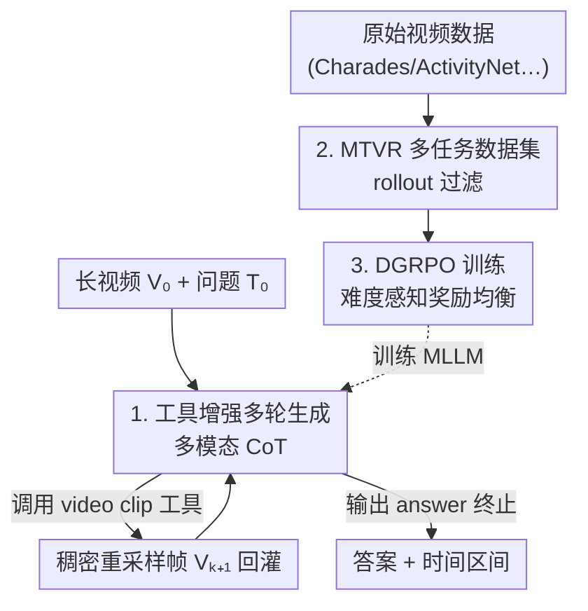

# Thinking With Videos: Multimodal Tool-Augmented Reinforcement Learning for Long Video Reasoning

**会议**: CVPR 2026  
**论文**: [CVF Open Access](https://openaccess.thecvf.com/content/CVPR2026/html/Zhang_Thinking_With_Videos_Multimodal_Tool-Augmented_Reinforcement_Learning_for_Long_Video_CVPR_2026_paper.html)  
**代码**: 项目页（论文称 "Code is available at the project page"，未给出具体 URL ⚠️）  
**领域**: 多模态VLM / 视频理解  
**关键词**: 长视频推理, 多模态 CoT, 工具增强, 时序定位, GRPO

## 一句话总结
VITAL 给多模态大模型（MLLM）配一个「视频裁剪」工具，让它在推理链中按需把可疑时间段稠密重采样成新帧、形成「多模态思维链」，再用难度感知的 DGRPO 强化学习把多任务训练稳住，从而在长视频问答和时序定位上做到 7B 级别的 SOTA。

## 研究背景与动机

**领域现状**：受 DeepSeek-R1 用 GRPO 强化推理能力启发，近期很多工作给 MLLM 做 RL 后训练，让它在回答视频问题前先生成一段文字思维链（text-based CoT），用于视频问答（VQA）和时序定位（temporal grounding）等任务。

**现有痛点**：纯文字 CoT 有两个硬伤。一是**跨模态交互不足**——模型在推理时只能反复咀嚼自己最初看到的那几帧稀疏采样画面，没法回头去「重新看」视频里的关键片段；二是**幻觉加剧**，尤其当视频很长、推理链很长时，模型容易在自我反思里越推越偏。论文图 1 的例子很直观：纯文字 CoT 在一段绘本讲解视频里把「Greg's Microscope 这本书」的讨论区间猜成 260.94–335.93s（IoU 仅 49.9%，失败），而能看图的版本猜成 296.00–336.00s（IoU 90.7%，成功）。

**核心矛盾**：长视频信息密度高，但 MLLM 受限于上下文长度，输入只能稀疏采样（比如全片均匀抽几十帧）。一旦目标事件落在两帧之间，文字推理再怎么「自我反思」也补不回缺失的视觉证据——问题的根本是**视觉证据在推理过程中是静态、一次性的**。

**本文目标**：让 MLLM 在推理过程中能**动态地、主动地获取新视觉证据**，把「想—看—再想」串成一条多模态思维链，同时解决多任务 RL 训练里不同任务难度悬殊导致训练不稳的问题。

**切入角度**：把图像领域「thinking with images」（DeepEyes、OpenThinkImg 那套 zoom-in / 检测 / 分割工具）迁移到视频，但视频的关键工具不是放大而是**时序裁剪 + 稠密重采样**——先定位到可疑区间，再把这段稠密抽帧喂回去。

**核心 idea**：用一个「视频裁剪」工具，让模型在 CoT 中途按需调用、把感兴趣时间段稠密采样成新帧插回推理链（即多模态 CoT），并用难度感知的 GRPO（DGRPO）把多任务 RL 训练稳定下来。

## 方法详解

### 整体框架

VITAL（Video Intelligence via Tool-Augmented Learning）沿用主流 MLLM 的「视觉编码器 + LLM」架构（backbone 是 Qwen2.5-VL-7B），但在推理时挂了一个**视觉工具箱**。给定长视频 $V_0$ 和问题 $T_0$，模型进入**多轮生成**：每一轮它先输出一段 `<think>` 思考，然后自己决定是调用工具还是直接给答案。若调用工具，工具箱执行后返回一段稠密采样的新帧 $V_{k+1}$ 回灌进上下文，开启下一轮；如此往复直到模型输出 `<answer>`，整条轨迹就成了一条交替「文字推理 + 新视觉证据」的多模态 CoT。

要让一个普通 MLLM 学会「该用工具时用、该停时停」，光有架构不够，还需要数据和训练。所以 VITAL 配了一条完整管线：先用 rollout 过滤构造两个多任务数据集（MTVR-CoT-72k 用于 SFT 冷启动，MTVR-RL-110k 用于 RL），再用难度感知的 DGRPO 做强化学习。整体可分为「训练侧（造数据 → SFT → DGRPO）」和「推理侧（工具增强多轮生成）」两条线，三个关键设计分别落在这两条线上。

### 关键设计

**1. 工具增强的多轮多模态 CoT 生成：让模型在推理途中「重新看视频」**

针对「视觉证据一次性、推理时补不回」的痛点，VITAL 把单次前向变成多轮交互。第 $k$ 轮模型基于到目前为止的全部上下文生成输出 $O_k = f_{\text{MLLM}}(\{T_i, C_i, V_i\}_{i=0}^{k})$，其中 $T_i$ 是文字推理步、$C_i$ 是工具调用、$V_i$ 是视觉输入。一个解析器从 $O_k$ 里抽出思考步和工具调用 $(T_{k+1}, C_{k+1}) = p(O_k)$；若是合法工具调用，工具箱执行 $V_{k+1} = g_{\text{tool}}(C_{k+1})$ 返回新帧，否则若 $C_{k+1}$ 已是最终答案则终止 $A_{k+1} := C_{k+1}$。最终得到多模态 CoT 轨迹 $\tau = \{T_1, C_1, V_1, \dots, T_n, A_n\}$。

工具箱里最关键的是**视频裁剪工具** $V_{k+1} = g_{\text{clip}}(V_0, t_{\text{start}}, t_{\text{end}})$：输入一对时间边界，返回该区间内**稠密采样**的帧序列。这一步直接补上了稀疏全局采样丢失的局部细节——模型先在粗采样上猜个大概区间，再把这段放大稠密看一遍，类似人「快进找到大概位置后再逐帧核对」。论文还试过 clip caption、clip QA 等工具（让模型调用同模型的子 agent 去描述/问答片段），但发现这些会引入文字幻觉、且不同 LLM 输出域有偏差，最终默认只用裁剪工具（见消融 Tab.7/8）。

**2. MTVR 多任务数据集 + rollout 过滤：把「学会用工具」需要的轨迹喂够**

模型不会凭空学会工具调用，需要高质量轨迹做 SFT 冷启动和 RL。论文构造了 MTVR-CoT-72k（SFT）和 MTVR-RL-110k（RL），覆盖三类任务：视频时序定位（VTG）、推理 VQA、grounded VQA（同时预测时间区间和答案），原始数据来自 Charades-STA、ActivityNet-MR、VidChapters-7M、Video-R1、LongVideo-Reason、ReXTime、NExT-GQA 等。作者的一个关键观察是**时序定位和问答互相促进**——定位为「按问题裁剪视频」提供依据，问答则评估整体推理，于是把它们放在一起多任务训练。

数据质量靠 **rollout 过滤**保证：① 对每个样本用 MLLM 在高温（temperature=1.0, $k=8$）下生成 8 条 rollout 以鼓励多样性；② 只保留**中等难度**样本，丢掉所有 rollout 全对（PassAll@k，太简单）或全错（PassNone@k，太难）的，得到难度均衡的子集；③ 再用更强的推理模型（Gemini 2.5）补出文字 CoT（长视频则补多模态 CoT）。长视频时序定位时，工具参数由 ground-truth 区间加 20% 噪声扰动预设；长视频 QA 则让标注模型自主选工具参数。最终切成四个子集：MTVR-CoT(54k)/MTVR-RL(94k) 做基础推理，MTVR-CoT-Tool(18k)/MTVR-RL-Tool(16k) 做多轮工具增强长视频推理。

**3. DGRPO（难度感知 GRPO）：治多任务 RL 里的「难度不均衡」**

直接拿多任务跑 GRPO 会遇到两种难度失衡。**任务级失衡**：短视频、选择题这类简单任务奖励涨得飞快，而长视频时序定位（IoU 奖励）涨得很慢——作者归因于连续 IoU 函数缺乏区分度。**样本级失衡**：RL 越训，简单样本占比越高、难样本越少，优化很快撞瓶颈。DGRPO 用两层缩放对症下药（见 Alg.1）。

奖励本身由三部分组成 $\hat{R} = \text{Scale}(R_{\text{acc}}, \alpha_i, \beta_i) + R_{\text{format}} + R_{\text{tool}}$：$R_{\text{acc}}$ 是多任务准确率奖励，$R_{\text{format}}$ 用严格规则强制 `<think>/<tool_call>/<answer>` 格式，$R_{\text{tool}}$ 在 rollout 至少成功调用一次工具时给奖励（鼓励模型主动用工具）。**任务级缩放**：仅对时序定位任务把 IoU 奖励按任务难度参数 $\alpha_i, \beta_i$ 归一化 $S_1 = \text{clamp}(\frac{R_{\text{IoU}} - \alpha_i}{\beta_i - \alpha_i}, 0, 1)$，把原本平缓的 IoU 拉成有区分度的 0–1 信号；其他任务不缩放直接用 $R_{\text{acc}}$。**样本级缩放**：把任务 $i$ 样本 $j$ 的 $G$ 条 rollout 奖励取平均得样本难度 $D_{i,j} = \frac{1}{G}\sum_k \hat{R}(\tau^k_{i,j})$，再软线性映射成权重 $w_{i,j} = \text{clamp}(2 - D_{i,j}, 0, 1) \times 0.5 + 0.5$（范围 0.5–1，越难权重越高），最终奖励 $R = \hat{R} \cdot w_{i,j}$ 再喂进标准 GRPO 目标 $J_{\text{GRPO}}$。这样难任务/难样本得到更大的有效梯度，训练更稳、泛化更好。

### 损失函数 / 训练策略
四阶段训练，每阶段一个 epoch（H100 共 640 GPU 小时）：阶段 ①② 在 MTVR-CoT/MTVR-RL 上做基础推理的 SFT + GRPO；阶段 ③④ 加入工具数据（MTVR-CoT-Tool / MTVR-RL-Tool）做工具增强的 SFT + DGRPO。优化器 AdamW + cosine 调度，weight decay 1e-2；学习率 SFT 1e-5 / RL 1e-6；batch size SFT 256 / RL 64；DGRPO 每样本 8 条 rollout。训练框架在 verl + vLLM 基础上扩展，支持多轮对话上下文的多模态工具训练与评测。

## 实验关键数据

### 主实验

VITAL-7B 在长视频时序定位和长视频 QA 上达到 7B 级 SOTA，且工具箱（∆Toolbox）带来稳定增益。

| 任务 / 基准 | 指标 | VITAL-7B (无工具) | VITAL-7B | ∆工具箱 | 对比 |
|------|------|------|------|------|------|
| VidChapters-7M（长视频定位） | R@0.5 | 25.8 | 34.7 | +8.9 | 前最佳开源 ReVisionLLM 27.4 |
| VUE-TR-Vision（长视频定位） | IoU(AUC) | 31.6 | 35.3 | +3.7 | Vidi-1.5-9B 49.7（更大模型） |
| LongVideo-Reason（长视频 QA） | Acc | 73.2 | 79.3 | +6.1 | LongVILA-R1-7B 72.0 |
| Video-MME（长视频 QA） | Acc | 63.5 | 66.1 | +2.6 | Qwen2.5-VL-7B 65.2 |
| Charades-STA（短视频定位） | mIoU | 57.1 | 59.9 | +2.8 | VideoChat-R1-7B 60.8 |
| ReXTime（grounded VQA） | mIoU | 40.9 | 47.6 | +6.7 | Temporal-RLT-7B 39.0 |

增益在长视频场景尤其明显（LongVideo-Reason 79.3% vs. 此前开源最佳 72.0%），印证工具增强多模态 CoT 主要补的就是「长视频里看不全」这块短板。

### 消融实验

训练阶段消融（Tab.5，∗ 表示带工具训练）显示：思考、DGRPO、工具增强 RL 三者逐级叠加，平均分一路从 37.9 涨到 57.1。

| 配置 | 风格 | LVR Acc | VidCh mIoU | MMMU Acc | Cha mIoU | Avg |
|------|------|------|------|------|------|------|
| ① Qwen2.5-VL（基线） | 无思考 | 60.1 | 0.5 | 47.4 | 43.6 | 37.9 |
| ③ SFT+GRPO | 无思考 | 63.3 | 23.5 | 50.2 | 56.2 | 48.3 |
| ⑤ SFT+GRPO | 思考 | 66.0 | 25.8 | 52.0 | 57.2 | 50.3 |
| ⑥ SFT+DGRPO | 思考 | 70.2 | 28.8 | 52.1 | 57.1 | 52.1 |
| ⑦ ⑥ + SFT∗+DGRPO∗（全工具） | 思考 | 79.3 | 35.0 | 54.2 | 59.9 | 57.1 |

工具选择消融（Tab.7/8）：在 zero-shot 设置下，给 GPT-4.1 / Gemini-2.5-Pro 加 clip caption 或 clip QA 工具反而让定位 mIoU 大跌（如 GPT 在 VidChapters 上掉到 2.0）；在 VITAL 自己训练后，video clip 工具在所有任务上都优于 caption/QA 工具（Avg 57.1 vs. 51.8/53.0），印证裁剪工具不引入文字幻觉、更高效。

### 关键发现
- **工具增强 RL（⑥→⑦）贡献最大**：平均分一次跳 +5.0（52.1→57.1），LongVideo-Reason 从 70.2 飙到 79.3，说明「让模型真的会用工具」比单纯的难度均衡更能解锁长视频能力。
- **DGRPO 相对 GRPO（⑤→⑥）**：平均分 50.3→52.1，主要涨在难任务（LVR 66.0→70.2、VidCh 25.8→28.8），而简单的短视频感知（Cha）基本持平——正好印证它专治「难任务涨得慢」。
- **多任务协同**：TG+RQA+GQA 三类一起训（Tab.6）平均分 53.9，明显高于单任务（TG 45.4 / RQA 42.4），且数据量从 73k 扩到 182k 后进一步到 57.1；时序定位和问答确实互相促进。
- **适度用工具最优**：统计显示模型每个样本通常调用 0–2 次工具，过度调用反而降效（图 6），说明模型学会了「该看才看」的判断力。

## 亮点与洞察
- **把「thinking with images」搬到视频的正确姿势是裁剪而非描述**：作者实测发现让子 agent 给片段写 caption / 做 QA 会引入文字幻觉，反不如直接把稠密帧塞回上下文——这条「工具应该返回原始视觉证据、而非二次加工的文字」的经验对做视觉 agent 很有参考价值。
- **DGRPO 的两层缩放是个可复用的 RL 配方**：任务级用难度参数把平缓的 IoU 拉成有区分度的奖励、样本级按 rollout 平均奖励反向加权难样本，这套思路可以迁移到任何「多任务奖励尺度不一」的 RL 后训练。
- **rollout 过滤造数据**：用 PassAll@k / PassNone@k 砍掉太简单和太难的样本，只留中等难度，本质是在数据层面也做了一次难度均衡，和 DGRPO 形成呼应。

## 局限与展望
- **工具单一**：最终只保留了视频裁剪一个工具，caption/QA 工具因 zero-shot 幻觉被放弃；但若把 caption/QA 工具也纳入训练域优化，理论上能覆盖更多需要语义抽象的任务，论文未深入。
- **依赖强标注模型**：数据管线用 Gemini 2.5 当标注器和工具执行器补 CoT，且长视频定位的工具参数靠 ground-truth 加 20% 噪声预设，真实自由探索的工具调用学习成分有限 ⚠️。
- **代码/工具实现细节未在正文给全**：项目页 URL、工具实现、DGRPO 实现细节都放在补充材料，正文可复现性有限。
- **规模仅到 7B**：方法是否能在更大或更小模型上同样奏效未验证。

## 相关工作与启发
- **vs 纯文字 CoT 的视频 RL（VideoChat-R1、Time-R1、DeepVideo-R1）**：它们都只在文字层面推理，视觉证据一次性输入；VITAL 让视觉证据可在推理途中按需补充，长视频场景优势明显（LVR +6~7 个点）。
- **vs 图像「thinking with images」（DeepEyes、OpenThinkImg）**：同样是工具增强多模态 CoT，但它们用 zoom-in/检测/分割针对静态图，VITAL 针对视频的核心工具是时序裁剪 + 稠密重采样。
- **vs GRPO 稳定性改进（DAPO 样本级重采样、DisCO 判别式目标）**：DGRPO 用样本级重加权 + 任务级 IoU 缩放专门解决多任务难度不均衡，关注点不同。
- **vs 长视频压缩/长上下文（LongVA、LongVILA、FlashVStream）**：它们靠 token 压缩或上下文扩展硬塞更多帧，计算昂贵；VITAL 用「按需稠密重采样」做到稀疏全局 + 局部精看，更高效。

## 评分
- 新颖性: ⭐⭐⭐⭐ 把工具增强多模态 CoT 系统性引入长视频，并配套 DGRPO 解决多任务 RL 失衡，组合扎实但单点创新（裁剪工具、难度缩放）相对直觉。
- 实验充分度: ⭐⭐⭐⭐⭐ 11+ 个基准、多组消融（训练阶段/数据组成/工具选择/工具调用统计），覆盖定位、QA、grounded VQA。
- 写作质量: ⭐⭐⭐⭐ 图 1 对比和 Alg.1 把核心讲清楚，但工具实现、项目页等关键信息散落补充材料。
- 价值: ⭐⭐⭐⭐ 给「视频 agent + RL 后训练」提供了一套可复用的工具设计与难度均衡配方，7B 即达 SOTA，实用性强。

<!-- RELATED:START -->

## 相关论文

- [\[CVPR 2026\] Visual Reasoning through Tool-supervised Reinforcement Learning](visual_reasoning_through_tool-supervised_reinforcement_learning.md)
- [\[CVPR 2026\] SpaceTools: Tool-Augmented Spatial Reasoning via Double Interactive RL](spacetools_tool-augmented_spatial_reasoning_via_double_interactive_rl.md)
- [\[CVPR 2026\] CURVE: A Benchmark for Cultural and Multilingual Long Video Reasoning](curve_a_benchmark_for_cultural_and_multilingual_long_video_reasoning.md)
- [\[CVPR 2026\] Reading or Reasoning? Format Decoupled Reinforcement Learning for Document OCR](reading_or_reasoning_format_decoupled_reinforcement_learning_for_document_ocr.md)
- [\[CVPR 2026\] EMO-R3: Reflective Reinforcement Learning for Emotional Reasoning in Multimodal Large Language Models](emo-r3_reflective_reinforcement_learning_for_emotional_reasoning_in_multimodal_l.md)

<!-- RELATED:END -->
