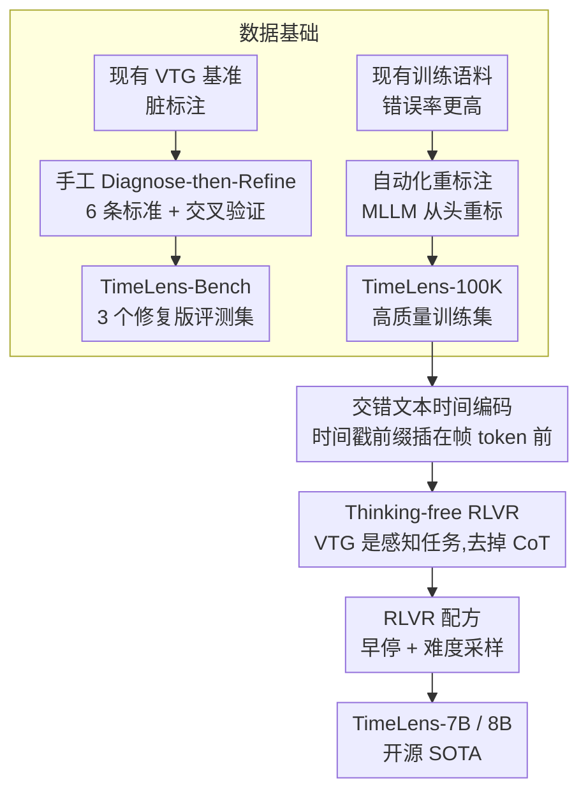

# TimeLens: Rethinking Video Temporal Grounding with Multimodal LLMs

**会议**: CVPR 2026  
**arXiv**: [2512.14698](https://arxiv.org/abs/2512.14698)  
**代码**: [timelens-arc-lab.github.io](https://timelens-arc-lab.github.io/)  
**领域**: 视频时间定位 / 多模态LLM  
**关键词**: video temporal grounding, data quality, RLVR, timestamp encoding, benchmark refinement

## 一句话总结

系统调查构建MLLM视频时间定位（VTG）能力的关键因素，从数据质量和算法设计两个维度出发，发布高质量基准TimeLens-Bench和训练集TimeLens-100K，并通过交错文本时间编码+thinking-free RLVR训练范式构建TimeLens系列模型，在开源模型中达到SOTA并超越GPT-5和Gemini-2.5-Flash。

## 研究背景与动机

**领域现状**：MLLM在"what"理解上表现出色，但"when"能力严重不足。VTG（给定视频和文本查询，定位对应时间段）是建立时间感知的核心任务，但研究方法五花八门且缺乏统一的最佳实践。

**现有痛点**：

1. 现有VTG基准质量堪忧：Charades-STA中20.6%样本违反查询唯一性，34.9%存在标注精度问题；多个数据集存在事件不存在、查询模糊、信息泄漏等错误
2. 不同开源方法使用不同的训练数据和实验设置，无法公平对比时间编码、训练策略等设计选择
3. 训练数据（来自多个源数据集）的错误率甚至比评估基准更高

**核心矛盾**：在修复基准后模型排名发生剧烈变化——原基准上开源模型分数高于GPT-5，修复后完全反转——证明之前的评估标准不可靠。

**本文目标** 建立可靠的VTG数据基础，并系统探索最优的算法设计原则。

**切入角度**：不引入新的复杂方法，而是沿数据质量和算法设计两条线做增量但必要的系统性基线研究。

**核心 idea**：数据质量修复 + 交错文本时间编码 + thinking-free RLVR = 简单且最优的VTG方案。

## 方法详解

### 整体框架

TimeLens 不端出一个新模型，而是回答"要把 MLLM 的视频时间定位（VTG）能力做对，到底哪些因素关键"。它沿两条线推进：数据层面，先诊断并修复三个主流基准、发布高质量评测集 TimeLens-Bench，再自动化重标注训练数据得到 TimeLens-100K；算法层面，系统对比时间戳编码方式、训练范式和 RLVR 配方，最终训出 TimeLens-7B/8B。

### 关键设计

**1. 数据基础：先把评测集和训练数据都修干净**

作者发现现有 VTG 基准错误率惊人（Charades-STA 有 20.6% 样本违反查询唯一性、34.9% 标注精度有问题），用脏基准比出来的模型排名根本不可信。评测侧，TimeLens-Bench 为此定下 6 条严格标注标准（查询清晰性/唯一性、事件存在性、避免信息泄漏、标注精确性/完整性），用 Diagnose-then-Refine 工作流让同一标注员既检错又修错以兼顾效率和质量，再加多轮交叉验证、错误率超阈值整批返工，最终产出 Charades-TimeLens / ActivityNet-TimeLens / QVHighlights-TimeLens 三个修复版评测集。修复后模型排名剧烈反转（开源模型从"高于 GPT-5"翻成低于），正说明这步不可或缺。训练侧，作者抽样核查发现训练语料的错误率比评测基准还高，于是改用一条**自动化重标注**流水线——因为旧标注质量太差，干脆用先进多模态模型对视频**从头重标**而非修补旧标，得到 10 万条高质量训练集 TimeLens-100K；这条流水线和人工评测修复完全独立，保证评估不被自标数据污染。

**2. 交错文本时间编码：用最简单的方式把时间喂给模型**

怎么把时间戳告诉 MLLM 一直没有公认答案。作者把三类方案（位置编码 based 如 MRoPE、视觉叠加即帧上直接渲染时间文本、文本编码即交错/非交错）放在一起公平比较，每种再对比两种时间格式——原始时间戳（"10.2s"）vs 帧索引（"1, 2, 3"）。结论是交错文本前缀 + 原始时间戳最优（mIoU：Charades 48.3、ActivityNet 43.1、QVHighlights 56.7），显著压过位置编码方案（36.6、33.1、49.2），而且不用改任何模型架构。

**3. Thinking-free RLVR：VTG 是感知任务，显式思考反而有害**

主流做法默认 CoT/thinking 能帮推理，但 VTG 到底要不要思考没人验证过。作者把 SFT、thinking-based RLVR、SFT+thinking-free RLVR、纯 thinking-free RLVR 四种范式摆开对比，发现 VTG 本质是感知任务而非推理任务，显式 thinking 过程不仅没用还会拖低成绩（Charades mIoU 42.7 vs 48.3）。纯 thinking-free RLVR 以 1.0× 训练时间（8×H20 上约 4h10m）就达到最佳性能，前置 SFT 阶段（让总时长涨到 2.9×）也带不来额外收益。

**4. RLVR 配方：早停 + 难度采样让训练又快又好**

选对 thinking-free RLVR 之后，作者进一步回答"练多久、怎么采数据"两个工程问题，这两条配方在 Fig.2(b) 的累积增益曲线里各占一档。**早停**——同时监控时间段 IoU 奖励和组内奖励标准差，两者一起进入平台期就停；继续练性能反而下降，即便数据质量已足够高，跑满一个 epoch 也是次优。**基于难度的数据采样**——先用待训练模型对训练数据离线推理、按 IoU 算每条样本的难度，再用高斯分布偏向高难样本采样；性能随平均难度升高而提升、到 mean > 0.75 趋于饱和，约 12K 样本就够。两条配方各贡献约 1-2 mIoU，并节省 50%+ 训练时间。

### 损失函数 / 训练策略

RLVR 用 GRPO 优化、以时间段 IoU 作为可验证奖励、全程不带 Chain-of-Thought（即 thinking-free）。TimeLens-7B 基于 Qwen2.5-VL-7B、TimeLens-8B 基于 Qwen3-VL-8B；1.0× 训练时间在 8×H20 上约 4h10m。RLVR 的早停与难度采样两条配方见关键设计 4。

## 实验关键数据

### 主实验

在TimeLens-Bench上的mIoU对比：

| 模型 | Charades | ActivityNet | QVHighlights | 类型 |
|------|----------|-------------|--------------|------|
| GPT-4o | 41.8 | 40.4 | 52.1 | 商业 |
| GPT-5 | 40.5 | 42.9 | 56.8 | 商业 |
| Gemini-2.5-Flash | 48.6 | 52.5 | 64.3 | 商业 |
| Gemini-2.5-Pro | 52.8 | 58.1 | 70.4 | 商业 |
| Time-R1-7B | 36.6 | 33.1 | 49.2 | 开源 |
| MiMo-VL-7B | 39.6 | 35.5 | 41.5 | 开源 |
| Qwen2.5-VL-7B (基线) | 39.3 | 31.4 | 31.6 | 开源 |
| **TimeLens-7B** | **48.8** | **46.2** | **56.0** | 开源 |
| Qwen3-VL-8B (基线) | 48.3 | 46.8 | 59.4 | 开源 |
| **TimeLens-8B** | **55.2** | **53.2** | **65.5** | 开源 |

### 消融实验

**训练范式对比**（TimeLens-100K训练数据）：

| 训练范式 | Charades mIoU | ActivityNet mIoU | QVHighlights mIoU | 训练时间 |
|----------|---------------|------------------|---------------------|----------|
| SFT (32K) | 47.4 | 39.9 | 52.0 | 1.0× |
| SFT (100K) | 48.6 | 39.7 | 49.0 | 2.4× |
| Thinking-based RLVR | 42.7 | 41.2 | 57.8 | 1.9× |
| SFT + Thinking-free RLVR | 50.1 | 42.7 | 55.9 | 2.9× |
| **Thinking-free RLVR** | **48.3** | **43.1** | **56.7** | **1.0×** |

### 关键发现

- TimeLens-8B在3个基准上mIoU为55.2/53.2/65.5，超越GPT-5（40.5/42.9/56.8）和Gemini-2.5-Flash（48.6/52.5/64.3）
- 原基准上开源模型表面成绩好，修复后排名剧烈反转——证明原基准不可靠
- Thinking-free RLVR用最少训练时间(1.0×)达到最佳或近最佳性能，显式thinking反而降低Charades mIoU（42.7 vs 48.3）
- 交错文本编码在三基准上全面领先视觉叠加和位置编码方案
- 早停和难度采样各贡献约1-2 mIoU提升，且节省50%+训练时间

## 亮点与洞察

- "不是新方法而是必要基线"的定位极其诚实，但数据修复工作量巨大，Impact远超一般方法论文
- 修复基准后的模型排名反转是全文最震撼的发现——意味着之前基于旧基准的对比结论都需重新审视
- "VTG是感知而非推理"的发现反直觉：CoT/thinking在VTG上不仅无用还有害
- RLVR的两条经验（早停+难度采样）具广泛参考价值，适用于其他可验证奖励任务
- 交错文本编码的胜出说明：简单方案+好数据 > 复杂架构修改

## 局限与展望

- 基准修复需大量人工参与（标注员培训、交叉验证），可扩展性有限
- Thinking-free RLVR可能不适用于更复杂的时序推理任务（如需要因果推理的事件定位）
- 仅在Qwen2.5-VL/Qwen3-VL上验证，最佳实践对InternVL、LLaVA等架构的迁移性待考察
- 训练数据TimeLens-100K的自动重标注质量与人工标注的差异未做定量分析
- 未探索多粒度时间定位（如moment retrieval与video summarization联合）

## 相关工作与启发

- **vs Time-R1**：同为RLVR方法，但Time-R1使用thinking-based RLVR，mIoU仅36.6/33.1/49.2，远低于TimeLens的48.8/46.2/56.0，差距来自数据质量和thinking-free设计
- **vs TRACE/TRACE-uni**：专门的VTG模型，mIoU仅27.1-28.1/32.7-33.6/39.0-39.8，远不敌基于强MLLM的方案
- **vs TimeSuite**：另一个VTG系统方案，在ActivityNet上mIoU仅19.8说明数据和训练策略比模型设计更重要
- 启发：数据质量修复→公平评估→最佳实践建立的研究范式值得其他任务（检测、分割）学习

## 评分

- 新颖性: ⭐⭐⭐ 方法本身是增量式的，价值在于系统性而非单点创新
- 实验充分度: ⭐⭐⭐⭐⭐ 三类时间编码×两种格式+四种训练范式+RLVR配方探索，极其彻底
- 写作质量: ⭐⭐⭐⭐⭐ 结构清晰，每个发现都有充分实验支撑，Fig.2(a)排名反转可视化极有说服力
- 价值: ⭐⭐⭐⭐⭐ 基准修复和最佳实践对VTG社区极其有用，TimeLens-Bench将成新标准

<!-- RELATED:START -->

## 相关论文

- [\[CVPR 2026\] PAS: A Training-Free Stabilizer for Temporal Encoding in Video LLMs](pas_a_training-free_stabilizer_for_temporal_encoding_in_video_llms.md)
- [\[CVPR 2026\] GroundVTS: Visual Token Sampling in Multimodal Large Language Models for Video Temporal Grounding](groundvts_visual_token_sampling_in_multimodal_large_language_models_for_video_te.md)
- [\[ICCV 2025\] Enrich and Detect: Video Temporal Grounding with Multimodal LLMs](../../ICCV2025/multimodal_vlm/enrich_and_detect_video_temporal_grounding_with_multimodal_llms.md)
- [\[CVPR 2026\] Pointing at Parts: Training-Free Few-Shot Grounding in Multimodal LLMs](pointing_at_parts_training-free_few-shot_grounding_in_multimodal_llms.md)
- [\[CVPR 2026\] FAVE: A Structured Benchmark for Fine-Grained Audio-Visual Temporal Evaluation in Multimodal LLMs](fave_a_structured_benchmark_for_fine-grained_audio-visual_temporal_evaluation_in.md)

<!-- RELATED:END -->
