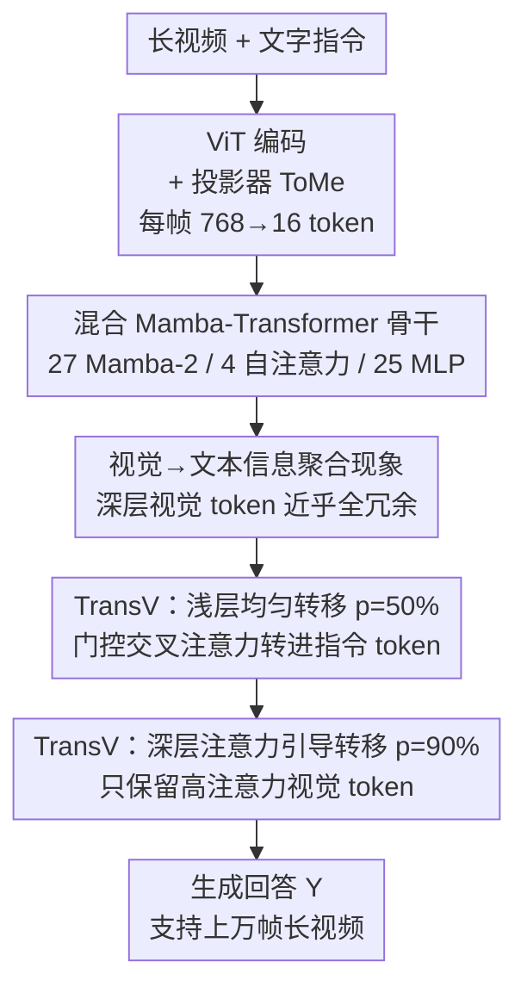

# TimeViper: A Hybrid Mamba-Transformer Vision-Language Model for Efficient Long Video Understanding

**会议**: CVPR 2026  
**论文**: [CVF Open Access](https://openaccess.thecvf.com/content/CVPR2026/html/Xu_TimeViper_A_Hybrid_Mamba-Transformer_Vision-Language_Model_for_Efficient_Long_Video_CVPR_2026_paper.html)  
**代码**: 项目主页 https://xuboshen.github.io/TimeViper/  
**领域**: 多模态VLM / 视频理解  
**关键词**: 长视频理解、Mamba-Transformer 混合架构、视觉 token 压缩、视觉→文本信息聚合、状态空间模型

## 一句话总结
TimeViper 用 Mamba-2 与自注意力混合的 9B 大模型当骨干，借助新发现的"视觉信息会逐层汇聚进指令 token"现象，提出在 LLM 内部用门控交叉注意力把冗余视觉 token 转移压缩进指令 token 的 TransV 模块，从而在单张 GPU 上处理上万帧的小时级长视频，且性能与 Transformer 系 MLLM 相当。

## 研究背景与动机

**领域现状**：长视频理解需要 MLLM 同时兼顾"效率"和"对超长时序上下文的处理能力"。主流做法是拿 Transformer LLM（Qwen2/Vicuna 等）当骨干，靠其强推理与语言能力，再在投影层（projection layer）把每帧的视觉 token 合并压缩后送进 LLM。

**现有痛点**：两个瓶颈互相叠加。① 注意力的计算量随序列长度平方增长，对长上下文天然低效——1 小时视频按 1fps、每帧 768 token 编码会产生约 270 万 token，远超 Gemini 的百万级上下文上限。② 即便在投影层压了 token，**LLM 本身仍是主要算力瓶颈**，因为它要用数十亿参数逐层处理这条序列。已有的 LLM 内部 token 丢弃（PDrop 等）虽高效，但基于注意力分数硬丢会造成不可逆的信息损失；而这些方法全都是为 Transformer 设计的。

**核心矛盾**：线性架构（Mamba 等状态空间模型）有 $O(n)$ 计算、$O(1)$ 缓存的效率优势，但单用时常依赖从 Transformer 蒸馏、或在复杂多模态任务上掉点；纯 Transformer 表达力强却低效。更关键的是——**混合 Mamba-Transformer 架构里 token 信息怎么存、视觉冗余怎么表现，与纯 Transformer 可能根本不同，此前完全没人研究过**，已有的压缩策略无法直接搬过来。

**本文目标**：构建一个真正高效的长视频 MLLM，需同时解决（a）选一个兼具效率与表达力的骨干，（b）在这个骨干内部消除长上下文的视觉冗余。

**切入角度**：作者先用"信息阻断"实验剖析混合模型内部视觉/指令/回答三类 token 的信息交换，发现一个一致的**视觉→文本信息聚合现象**——随着层数加深，视觉 token 的信息会逐步并入指令 token，深层时哪怕删掉所有视觉 token 性能也几乎不掉。这说明深层视觉 token 高度冗余，且压缩有明确的去向（转给指令 token）而非简单丢弃。

**核心 idea**：顺着这个现象，在 LLM 内部用一个轻量模块**把冗余视觉 token 的信息显式"转移"进指令 token**（而不是硬丢），既压缩上下文长度又保住关键视觉信息，从而把混合骨干的帧处理能力推到上万帧。

## 方法详解

### 整体框架
TimeViper 是标准的"视觉编码器 + 投影器 + LLM"三段式多模态模型，但骨干换成混合 Mamba-Transformer LLM（Nanov2-9B：27 个 Mamba-2 层 + 4 个自注意力层 + 25 个 MLP 层），并在 LLM 内部插入 TransV 压缩模块。给定一段长视频和文字指令：ViT 逐帧编码，投影器用 ToMe（Token Merging）把每帧从 768 token 压到 16 token，得到视觉 token 序列 $X_0 \in \mathbb{R}^{T_0 \times D}$；指令被分词成文本 token $X_1 \in \mathbb{R}^{T_1 \times D}$（通常 $T_0 \gg T_1$）。LLM 把拼接后的 $X=[X_0, X_1]$ 送进去逐层处理并生成回答 $Y$。

混合骨干里两类层分工互补：**Mamba-2 层**负责序列位置建模，把历史序列通过遗忘/记忆机制压进固定大小的隐式记忆；**自注意力层**保留完整历史、按 token 重要性做检索与查询。TransV 就插在 LLM 的浅层（第 7 层）与深层（第 39 层）之间，沿层深逐步缩短序列：浅层均匀转移、深层按注意力引导转移。

### 关键设计

**1. 混合 Mamba-Transformer 骨干：用状态空间模型扛长度、用注意力保表达力**

针对"纯 Transformer 平方复杂度低效、纯 Mamba 复杂多模态掉点"的两难，TimeViper 不二选一，而是用混合骨干让两类层各司其职。Mamba-2 层围绕一个状态空间模型（SSM）块，递归维护一个概括历史的紧凑隐状态 $h_t \in \mathbb{R}^{N \times D}$，更新为 $h_t = A_t h_{t-1} + B_t x_t$、$y_t = C_t^T h_t$，其中 $A_t, B_t, C_t$ 是离散化 SSM 参数，靠可学习的衰减与门控动态在长序列上高效传播信息，带来 $O(n)$ 计算、$O(1)$ 缓存。自注意力层则直接建模 token 交互 $y = \mathrm{SoftMax}(L \odot \frac{QK^T}{\sqrt{D}}) \cdot V$（$L$ 为因果掩码），保留全部历史做检索。整套骨干里 Mamba 层占多数（27 vs 4），所以推理时显存与预填充时间随输入长度近似线性增长——这正是它能比 Qwen3 在 32k 输入下多产 40.1% token/s 的根因。

**2. 视觉→文本信息聚合现象：先诊断混合模型里视觉冗余长什么样，再决定怎么压**

这是全文的"观察驱动设计"的核心，也是 TransV 的动机来源。作者用信息阻断法剖析：在第 $l$ 层把注意力掩码 $L$ 对应位置置 0，分别阻断"视觉→指令"（V2I）和"视觉→回答"（V2R）两条信息通路（式 3/4 用 $3\times3$ 的 0/1 矩阵描述三类 token 间允许的信息流），看性能怎么变。结论很一致：**指令中心任务**（多选 QA、时序定位）里，视觉信息先汇聚进指令 token——浅层阻断 V2I 会大幅掉点，深层阻断却几乎无影响，说明指令 token 已把视觉线索"内化"了；**视觉中心任务**（详细描述 VDC）里则是视觉 token 直接参与回答生成，浅层阻断 V2R 才掉得厉害。

作者进一步量化视觉 token 冗余：定义丢弃算子 $\mathrm{TD}(X)$，按丢弃率 $p$、丢弃数 $T_d = pT_0$，用两种策略——均匀丢弃 $\mathrm{Uniform}(X, T_d)$，或注意力引导 $\mathrm{Topk}(X, -\mathrm{Attn}(X_{T_1}, X), T_d)$（保留被最后一个指令 token 最关注的 top-k 视觉 token）。实验发现冗余随层深递增：浅层视觉 token 关键，但深层近乎 100% 冗余——**即便深层丢掉全部视觉 token，模型仅靠指令 token 也能保持高性能**。这直接告诉作者：压缩应该往深层使劲，且应"转移"而非"丢弃"。

**3. TransV：在 LLM 内部把视觉 token 信息显式转移进指令 token**

针对"硬丢造成不可逆信息损失、且混合架构无现成压缩方案"的痛点，TransV 是一个约 100M 参数的轻量 in-LLM 模块，用门控交叉注意力把视觉信息搬进指令 token 而非删掉。在第 $l$ 层，转移公式为 $\tilde{X}_1^l = \mathrm{CrossAttn}_l(X_1^l, \mathrm{TD}_l(X_0^l))$、$X_1^{l+1} = X_1^l + \tanh(\alpha_l)(\tilde{X}_1^l)$——以指令 token 为 query、以（被 $\mathrm{TD}$ 过滤后的）视觉 token 为 key/value 做交叉注意力，再以一个可学习标量 $\alpha_l$ 门控聚合强度，$\tanh$ 把它归一化到 $[-1, 1]$，且 $\alpha_l$ 初始化为 0 以保证训练初期不破坏指令理解。

TransV 的"双位置策略"恰好对齐了上面发现的冗余规律：**浅层（第 7 层）用均匀转移、丢弃率 $p=50\%$**，因为浅层视觉 token 还重要，不能激进删；**深层（第 39 层）用注意力引导转移、$p=90\%$**，因为深层近乎全冗余，可大胆只留高注意力 token。两段串联（记作 "uni 7 0.5-attn 39 0.9"）逐步缩短上下文。正是这个内部压缩让 TimeViper 能在 4096 帧下比不带 TransV 省 54.8% 显存、并稳处理 10K+ 帧。

### 损失函数 / 训练策略
两阶段、全开源数据训练。**阶段一（图文对齐）**：先用从 CC12M、PixelProse 采样的 300 万高质量图文对预训练投影器以对齐 ViT 与 LLM 模态，此阶段关闭 token 压缩。**阶段二（视觉指令微调）**：在约 480 万多模态指令对上微调投影器、LLM 及压缩模块——含 180 万视频指令数据（主要来自 LLaVA-Video）、280 万单图指令数据（来自 LLaVA-OneVision），以及 26K 密集视频描述 + 250K 时序定位等任务专用数据。骨干学习率 1e-5、AdamW（weight decay 0.01）、warmup 0.03、余弦退火；TransV 模块用更高的 5e-5。视频统一 1fps 采样、训练时超 256 帧均匀采到 256 帧、每帧 resize 到 384×384。

## 实验关键数据

### 主实验
在 7 个长视频基准上对比，TimeViper（Nanov2-9B 骨干）未微调 ViT、仅用 7.8M 训练样本，性能与 Transformer 系 SOTA 相当甚至在部分任务超越任务专用模型：

| 任务 / 基准 | 指标 | TimeViper(w/ TransV) | 对比对象 | 结果 |
|--------|------|------|----------|------|
| 多选 QA · VideoMME | avg.acc | 56.9 | Video-XL 55.5 | +1.4 |
| 详细描述 · VDC | avg.acc | 39.7 | AuroraCap 39.0 | +0.7 |
| 时序定位 · Charades-STA | mIoU | 40.5 | VTimeLLM-13B 34.6 | +5.9 |
| 小时级 · LVBench | avg.acc | 48.2 | Gemini-1.5-Pro 33.1 | 大幅领先 |
| 长视频 · MLVU | M-Avg | 63.1 | — | 竞争力 |

> ⚠️ 表中数值以原文 Table 1 为准；TimeViper 不带 TransV 时 VideoMME=58.8、Charades=40.5、VDC=39.7，加 TransV 后略降但换来上万帧处理能力。Charades 的强表现尤其值得注意：TimeViper 只用 SigLIP 位置编码 + Mamba 层的隐式时序建模，没有像 Qwen2.5-VL 那样显式用 MRoPE 做细粒度时间戳建模，却学到了稳健的视频-语言时序对齐。

### 消融实验
TransV 的位置与压缩率消融（Table 2）：

| 配置 | 最大帧数 | VideoMME | VDC | Charades | 说明 |
|------|---------|----------|-----|----------|------|
| none（基线） | 5k | 58.8 | 39.7 | 40.5 | 不压缩 |
| TD uni 7 0.5（硬丢） | 8k | 57.3 | 39.0 | 26.1 | 硬丢令 Charades 暴跌 |
| uni 7 0.5（TransV） | 8k | 56.7 | 38.9 | 38.1 | 转移把 Charades 救回 26.1→38.1 |
| uni 2 0.5 | 9k | 56.1 | 39.7 | 38.2 | 第 2 层 vs 第 7 层结果混杂 |
| uni 7 0.9 | >10k | 53.4 | 37.9 | 34.6 | 浅层压 90% 掉点明显 |
| uni 7 0.5-uni 39 0.9 | >10k | 56.2 | 39.4 | 37.9 | 深层加压几乎不掉 |
| uni 7 0.5-attn 39 0.9 | >10k | 56.9 | 39.1 | 37.9 | 深层注意力引导，MCQ 略优 |

### 关键发现
- **"转移"远胜"硬丢"**：同样在第 7 层压 50%，硬丢（TD uni）让 Charades 从 40.5 暴跌到 26.1，而 TransV 转移只到 38.1——证明把信息搬进指令 token 而非删掉，能避免不可逆的时序信息损失。
- **深层可大胆压、浅层要克制**：在深层（第 39 层）加 90% 注意力引导转移，最大帧数从 5K 推到 10K+，而 VideoMME 仅掉 0.1；但浅层（第 7 层）把压缩率从 50% 提到 90%，VideoMME 就从 56.1 掉到 53.4。这与"冗余随层深递增"的诊断完全吻合。
- **显存近线性增长**：原始模型在 128 帧就 OOM；加 ToMe 投影压缩推到约 5K 帧；再加 TransV 在 4096 帧省 54.8% 显存、稳处理 10K+ 帧——证明投影器压缩与 LLM 内部压缩角色互补。
- **混合骨干并非靠 Transformer 占便宜**：在完全相同配方下训练的纯 Qwen2.5 基线与 TimeViper 打平，说明纯 Transformer 在可比设置下没有明显优势；且 TransV 接到 Qwen2.5 上时 VDC 掉 1.3、接到混合 Nano 上只掉 0.6，混合架构对内部 token 压缩兼容性更好。

## 亮点与洞察
- **"先做可解释性诊断，再据此设计压缩"是很漂亮的方法论闭环**：视觉→文本信息聚合现象不是事后解释，而是直接决定了 TransV 该往哪压（深层）、怎么压（转移而非丢）、压多狠（深层 90%、浅层 50%）。这种"观察驱动设计"比拍脑袋调超参更有说服力。
- **门控初始化 $\alpha_l = 0$ 的小心思**：让 TransV 在训练初期等价于"不干预"，模型先学好指令理解，再逐渐放开压缩强度，避免一上来就破坏多模态能力——这个 zero-init 残差门控的 trick 可迁移到任何"想给预训练模型加新模块又怕扰动"的场景。
- **混合模型注意力行为的新洞察**：Mamba 层呈现从稀疏局部到全局的多样注意力模式（层级专门化），自注意力层则同样出现 attention sink（注意力堆在起始 token）、且对视觉 token 的注意力随层深递减——为混合架构可解释性提供了新证据。
- **靠隐式时序建模做时序定位**：不用显式时间戳编码，仅靠 Mamba 的隐式记忆就在 Charades 上超过专门设计的 VTimeLLM-13B，提示状态空间模型对长时序对齐有被低估的潜力。

## 局限与展望
- **未微调 ViT**：受算力限制，作者没有微调视觉编码器（表中带 * 的对比方法多数微调了 ViT），这可能限制了视觉表征上限；同等条件下的并发工作 Nanov2-VL（用 46.7M 样本）拿到更高分，说明数据规模化潜力还没吃满。
- **基础设施 bug 卡住理论上限**：原文注明 mamba ssm 库存在一个基础设施缺陷，导致超过约 6000 帧的序列无法推理，尽管理论上能处理 10K+ 帧——所以"上万帧"目前部分是理论能力。⚠️ 这是工程约束而非方法本身的天花板。
- **浅层压缩位置结果混杂**：第 2 层 vs 第 7 层压缩在不同基准上表现不一致，说明 TransV 的最优插入位置还缺乏系统性指导，目前靠经验选定。
- **改进思路**：把 TransV 扩展成"按内容自适应选择压缩层与压缩率"（而非固定 7/39 层、50%/90%），或与投影器压缩联合优化，可能进一步提升长度-性能权衡。

## 相关工作与启发
- **vs 投影层压缩（LLaMA-VID / AuroraLong）**：它们在送入 LLM 之前于投影层合并视觉特征（如 LLaMA-VID 每帧压成 2 token），利用 ViT 表征的冗余；但 TimeViper 指出**LLM 本身才是主要算力瓶颈**，故把压缩搬进 LLM 内部，与投影层 ToMe 互补叠加。
- **vs LLM 内部 token 丢弃（PDrop）**：PDrop 沿层逐步按注意力分数硬剪视觉 token，高效但信息不可逆损失；TransV 用门控交叉注意力把信息转移进指令 token，消融里 Charades 26.1→38.1 直接证明转移优于硬丢。
- **vs Transformer 内压缩成新 token（Video-XL / VoCo-LLaMA）**：它们把视觉 token 压成新的特殊 token，但全部基于 Transformer；TimeViper 是**首个在混合 Mamba-Transformer LLM 内部做 token 压缩**的工作，并先诊断清楚混合架构里冗余的独特表现再动手。

## 评分
- 新颖性: ⭐⭐⭐⭐⭐ 首个在混合 Mamba-Transformer MLLM 内部做 token 压缩，且"信息聚合现象诊断→TransV 设计"闭环原创性强
- 实验充分度: ⭐⭐⭐⭐ 7 个基准 + 显存/层位/压缩率多维消融，但未微调 ViT、受 mamba 库 bug 限制实测帧数
- 写作质量: ⭐⭐⭐⭐⭐ 观察驱动设计的叙事清晰，图表把现象与方法的因果关系讲得很透
- 价值: ⭐⭐⭐⭐⭐ 给长视频 MLLM 指出"混合骨干 + 内部转移压缩"的高效路线，可解释性洞察也有迁移价值

<!-- RELATED:START -->

## 相关论文

- [\[CVPR 2026\] ReMoRa: Multimodal Large Language Model based on Refined Motion Representation for Long-Video Understanding](remora_multimodal_large_language_model_based_on_refined_motion_representation_fo.md)
- [\[ICCV 2025\] MaTVLM: Hybrid Mamba-Transformer for Efficient Vision-Language Modeling](../../ICCV2025/multimodal_vlm/matvlm_hybrid_mamba-transformer_for_efficient_vision-language_modeling.md)
- [\[CVPR 2026\] MSJoE: Jointly Evolving MLLM and Sampler for Efficient Long-Form Video Understanding](msjoe_jointly_evolving_mllm_and_sampler_for_efficient_long-form_video_understand.md)
- [\[CVPR 2026\] POINTS-Long: Adaptive Dual-Mode Visual Reasoning in MLLMs](points-long_adaptive_dual-mode_visual_reasoning_in_mllms.md)
- [\[CVPR 2026\] REVISOR: Beyond Textual Reflection, Towards Multimodal Introspective Reasoning in Long-Form Video Understanding](revisor_beyond_textual_reflection_towards_multimodal_introspective_reasoning_in_.md)

<!-- RELATED:END -->
