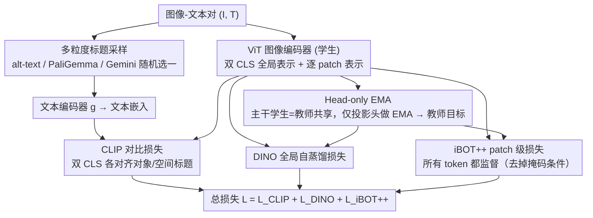

# TIPSv2: Advancing Vision-Language Pretraining with Enhanced Patch-Text Alignment

**会议**: CVPR 2026  
**arXiv**: [2604.12012](https://arxiv.org/abs/2604.12012)  
**代码**: [https://gdm-tipsv2.github.io/](https://gdm-tipsv2.github.io/)  
**领域**: 多模态VLM  
**关键词**: 视觉-语言预训练, patch-text对齐, iBOT++, 蒸馏, 零样本分割

## 一句话总结

提出 TIPSv2，通过发现蒸馏能显著提升 patch-text 对齐能力，并将该洞察转化为新的预训练目标 iBOT++（可见 token 也参与损失计算），结合头部EMA和多粒度文本增强，在 9 个任务 20 个数据集上达到 SOTA。

## 研究背景与动机

**领域现状**：视觉-语言预训练有两大方向：对比/sigmoid 方法（CLIP、SigLIP、PE）提供图文对齐和零样本能力；自监督方法（DINO、iBOT）擅长密集任务的空间理解。

**现有痛点**：实现同时在全局（图像级）和密集（patch级）理解上都出色的统一表示仍是重大挑战。TIPS、SigLIP2 等统一方法仍难以维持精确的 patch 级文本对齐。一个令人惊讶的趋势是：最大的旗舰模型在 patch-text 对齐上反而不如小模型。

**核心矛盾**：最终 Transformer 层往往作为全局对比"解码器"工作，而非保留局部语义，导致 patch 级对齐退化。

**本文目标**：在预训练阶段直接解决 patch-text 对齐问题。

**切入角度**：发现蒸馏过程通过对所有 patch token 施加有效监督，显著提升了空间对齐——蒸馏学生模型的 patch-text 对齐大幅超过教师模型。

**核心 idea**：将蒸馏的洞察转化为预训练目标 iBOT++，使可见 token 也直接参与 MIM 损失。

## 方法详解

### 整体框架

TIPSv2 想在一个模型里同时做好两件历来此消彼长的事：图像级的图文对齐（CLIP 那一套）和 patch 级的空间理解（DINO/iBOT 那一套）。它没有重新设计架构，而是沿用 TIPS 的双 CLS token 编码器，只在训练目标上动三处刀：把自监督的掩码图像建模从「只盯被遮住的 patch」放开成「所有 patch 都监督」（iBOT++），把维持稳定的 EMA 教师从整个模型瘦身成只对投影头做 EMA（Head-only EMA），再把单一来源的网页标题换成多来源、多粒度的合成标题。一张图进来，编码器同时吐出对齐文本的全局表示和对齐文本的逐 patch 表示，总损失把三股监督信号叠在一起：$\mathcal{L} = \mathcal{L}_{CLIP} + \mathcal{L}_{DINO} + \mathcal{L}_{iBOT++}$。下图是这套训练框架的鸟瞰：图像走视觉编码器、文本走多粒度标题，编码器学生与教师靠 Head-only EMA 共享主干，三股损失（其中 iBOT++ 是核心改动）最终汇总成一个目标。

### 关键设计

**1. iBOT++：让可见 token 也参与掩码图像建模损失，从根上修 patch-text 对齐**

这一条针对的是论文最核心的观察——大模型的 patch 级语义会被全局对比损失「稀释」，越大的旗舰模型 patch-text 对齐反而越差。标准 iBOT 只对被掩码的 patch 计算一致性损失，$\mathcal{L}_{iBOT} = -\sum_i m_i \cdot h_t(f_t(I)_i)^\top \log h_s(f_s(I_{mask})_i)$，其中 $m_i$ 是掩码指示位，只有被遮住的 token 才进入求和。iBOT++ 的改动只有一处：去掉 $m_i$ 这个掩码条件，让可见 token 也一起算损失，相当于对图里每一个 patch 都施加教师-学生表示一致性约束。之所以认定这处是关键，是因为作者先在蒸馏里看到了证据——TIPS ViT-L（蒸馏学生）在零样本分割上的 mIoU 比它的教师 TIPS ViT-g 高出 20 多个点，而蒸馏恰恰就是在对所有 patch 而非仅掩码 patch 施加监督。iBOT++ 把这个「靠蒸馏意外得到的好处」直接搬进预训练目标，省掉了额外的蒸馏阶段。

**2. Head-only EMA：只对投影头做 EMA，省掉接近一半的可训练参数**

纯自监督方法需要一份整模型的 EMA 教师来防止表示坍塌，代价是显存和参数翻倍。TIPSv2 注意到自己额外带了图文对比损失，这股来自文本的监督信号本身就能起到锚定作用、阻止坍塌，于是 EMA 教师不必再复制整个视觉编码器——只对投影头（projection head）做 EMA，主干编码器学生和教师共享一份。这样可训练参数减少近一半，大规模训练更省资源，而实验显示在有文本监督时它和全模型 EMA 的下游性能基本持平。

**3. 多粒度标题采样：用三种来源的标题随机喂给模型，覆盖不同粒度的文本监督**

单一的网页 alt-text 标题往往噪声大、粒度单一，不足以教会模型既懂物体又懂空间关系。TIPSv2 把三种标题混在一起按训练步随机采样：原始网页 alt-text（贴近真实分布）、PaliGemma 生成的偏空间关系描述、Gemini 生成的细粒度详细描述。不同粒度的标题各自强调不同的视觉信息，配合双 CLS token（一个对齐对象类标题、一个对齐空间标题），让模型在分类、检索、分割等多种下游任务上都有合适的文本信号可学。

### 损失函数 / 训练策略

总目标由三股监督叠加：CLIP 对比损失（双 CLS token 分别对齐对象标题和空间标题）、DINO 全局自蒸馏损失、以及 iBOT++ 的 patch 级损失（对所有 token 而非仅掩码 token）。EMA 只更新投影头，主干共享，整体训练成本相比全模型 EMA 显著下降。

## 实验关键数据

### 主实验

| 模型 | PC59 mIoU | PC60 mIoU | VOC21 mIoU | ADE150 mIoU |
|------|-----------|-----------|------------|-------------|
| TIPS ViT-g (教师) | 11.4 | 10.8 | 19.7 | 2.6 |
| TIPS ViT-L (蒸馏学生) | 33.5 | 30.4 | 30.5 | 20.8 |
| TIPSv2 ViT-L | **42.1** | **38.2** | **45.3** | **28.7** |
| DINOv2 ViT-L | 35.8 | 32.1 | 38.6 | 23.4 |
| PE-core ViT-L | 28.3 | 25.6 | 32.1 | 18.2 |

### 消融实验

| 配置 | 掩码率 | PC59 | VOC21 | ADE150 |
|------|--------|------|-------|--------|
| 标准预训练 | 0.75 | 6.9 | 6.7 | 0.3 |
| 蒸馏 | 0.75 | 16.0 | 22.5 | 5.9 |
| 蒸馏 | 0.5 | 15.5 | 24.0 | 7.0 |
| 蒸馏 (无掩码=iBOT++) | 0.0 | **31.4** | **30.8** | **20.0** |

### 关键发现

- 去除掩码是关键：蒸馏时掩码率从 0.75 降到 0.0，PC59 mIoU 从 16.0 跃升到 31.4
- Head-only EMA 在有文本监督时与全模型 EMA 性能相当，但内存减少约一半
- 蒸馏学生大幅超过教师的现象说明 patch-text 对齐是可以后天获得的

## 亮点与洞察

- "蒸馏学生超越教师"的发现极具启发性：说明在大模型中 patch 语义被全局对比损失"稀释"，而蒸馏通过对所有 token 施加密集监督恢复了局部语义
- iBOT++ 的改动极其简单（一行代码级别：去掉掩码条件），效果却是颠覆性的，这种 minimal 修改产生大效果的工作非常有价值
- Head-only EMA 的观察指出文本监督可以替代 EMA 防止坍塌的角色

## 局限与展望

- 主要在 Google 内部规模的数据上验证，社区复现难度较高
- iBOT++ 的理论解释仍不够深入
- 未评估在视频理解和 3D 任务上的表现
- 可探索 iBOT++ 在更大模型上的效果

## 相关工作与启发

- **vs TIPS**: TIPSv2 的 iBOT++ 直接在预训练中增强 patch-text 对齐，不需要蒸馏步骤
- **vs DINOv2**: DINOv2 缺乏文本对齐，TIPSv2 同时实现空间理解和文本对齐
- **vs PE**: PE 优化全局对比但牺牲密集任务，TIPSv2 通过 iBOT++ 在两者间取得平衡

## 评分

- 新颖性: ⭐⭐⭐⭐⭐ 蒸馏学生超越教师的发现和 iBOT++ 的提出都很新颖
- 实验充分度: ⭐⭐⭐⭐⭐ 9 任务 20 数据集的全面评估
- 写作质量: ⭐⭐⭐⭐⭐ 从发现到方法的逻辑链非常清晰
- 价值: ⭐⭐⭐⭐⭐ 对视觉基础模型预训练有重要指导意义

<!-- RELATED:START -->

## 相关论文

- [\[CVPR 2026\] Training-Only Heterogeneous Image-Patch-Text Graph Supervision for Advancing Few-Shot Learning Adapters](training-only_heterogeneous_image-patch-text_graph_supervision_for_advancing_few.md)
- [\[CVPR 2026\] β-CLIP: Text-Conditioned Contrastive Learning for Multi-Granular Vision-Language Alignment](b-clip_text-conditioned_contrastive_learning_for_multi-granular_vision-language_.md)
- [\[CVPR 2026\] Concept-Aware Batch Sampling Improves Language-Image Pretraining](concept-aware_batch_sampling_improves_language-image_pretraining.md)
- [\[CVPR 2026\] Gravitation-Driven Semantic Alignment for Text Video Retrieval](gravitation-driven_semantic_alignment_for_text_video_retrieval.md)
- [\[CVPR 2026\] Mostly Text, Smart Visuals: Asymmetric Text-Visual Pruning for Large Vision-Language Models](mostly_text_smart_visuals_asymmetric_text-visual_pruning_for_large_vision-langua.md)

<!-- RELATED:END -->
