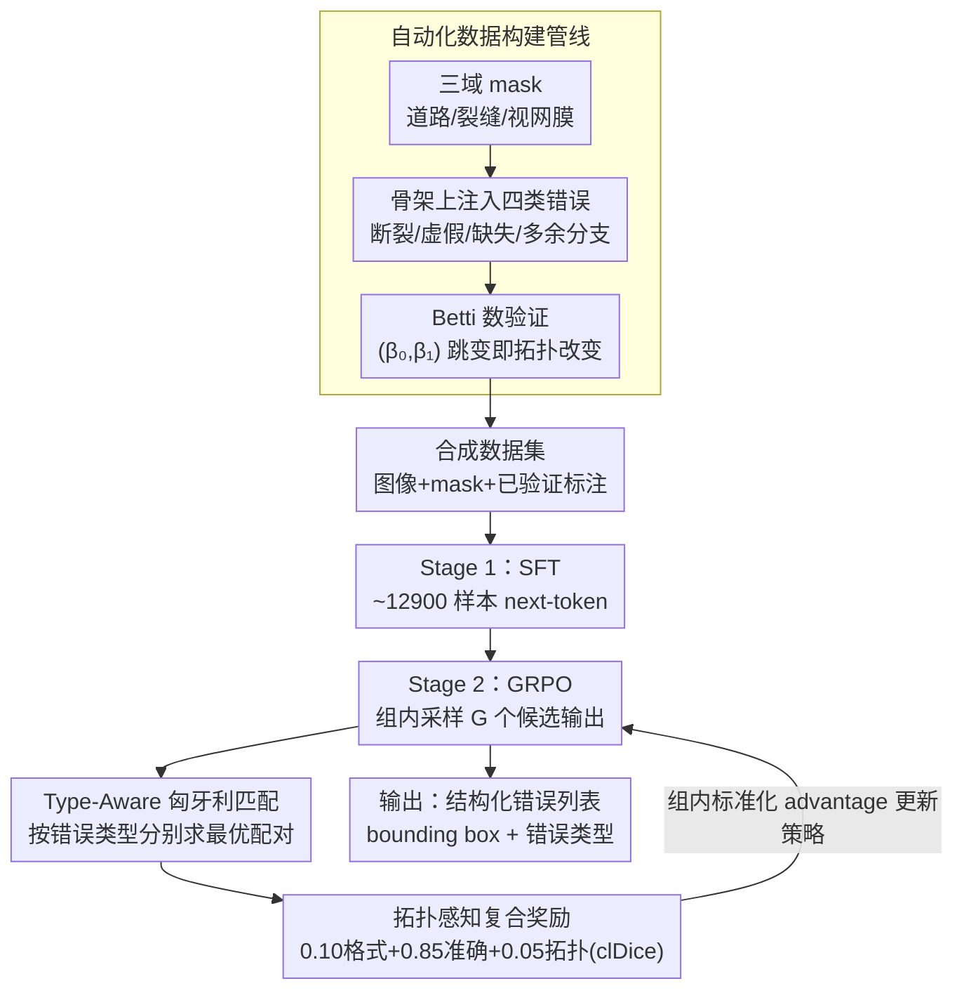

# Topo-R1: Detecting Topological Anomalies via Vision-Language Models

**会议**: CVPR 2026  
**arXiv**: [2603.13054](https://arxiv.org/abs/2603.13054)  
**代码**: 待确认  
**领域**: 多模态VLM  
**关键词**: 拓扑异常检测, 管状结构分割, GRPO强化学习, clDice, VLM细粒度感知

## 一句话总结
提出Topo-R1——首个赋予VLM拓扑感知能力的框架，通过自动化数据构建管线+SFT+GRPO强化学习（含拓扑感知复合奖励），实现无标注的管状结构拓扑异常检测与分类。

## 研究背景与动机
**领域现状**：管状结构（血管、神经纤维、道路网络）的拓扑正确性至关重要，现有拓扑保持分割方法（persistent homology损失、clDice等）依赖像素级标注来约束训练损失。

**现有痛点**：拓扑标注需要专业知识且极耗时；跨域迁移困难（视网膜标注不适用于道路网络）；部署到无标注新域时无法检测拓扑错误。

**核心矛盾**：拓扑异常极其稀疏和局部化——成千上万正确像素中可能仅一个像素缺失就切断血管连接。检测这种"大海捞针"式错误需要全局结构推理和局部细粒度感知的结合，而现有VLM完全缺乏这种能力。

**本文目标**：在无域特定标注的前提下，让VLM能够定位和分类管状结构中的拓扑错误。

**切入角度**：将拓扑异常检测重新定义为结构化视觉推理任务——给定图像+分割mask，模型需输出带类型标签的bounding box。

**核心 idea**：用自动化数据管线合成有验证标注的拓扑异常，再通过包含type-aware匈牙利匹配和clDice奖励的GRPO强化学习训练VLM。

## 方法详解

### 整体框架
Topo-R1 要解决的是一个"大海捞针"式的检测问题：在一张几乎全对的管状结构 mask 里，找出那个切断了血管或道路连通性的局部错误，并说清它属于哪一类。难点在于既没有目标域的拓扑标注可用，又要让本来对拓扑毫无感知的 VLM 学会这种结构推理。论文的整体思路是"先造题、再两段训练"——先用一条自动化管线把可验证的拓扑异常合成出来当训练数据，然后让 VLM 经过两个阶段学会读懂它们。Stage 1 用合成数据做 SFT，把模型从零样本下近乎随机的水平拉到能稳定输出结构化结果；Stage 2 接 GRPO 强化学习，用一个拓扑感知的复合奖励进一步逼模型把异常找准、分对。整条流程的输入是"图像 + 分割 mask + 检测 prompt"，输出是一份结构化的错误列表，每条给出一个 bounding box 和对应的错误类型。

### 关键设计

**1. 自动化数据构建管线：用合成 + Betti 数验证绕开"拓扑标注无人能标"的死结**

人工标注拓扑异常成本极高——要专家逐像素判断哪根分支断了、哪里多接了一条，且跨域几乎无法复用。管线的做法是反过来：先聚合三个域的现成 mask（道路网络 60%、裂缝检测 20%、视网膜血管 20%），再在 mask 的骨架上**主动注入**四类错误——断裂连接、虚假连接、缺失分支、多余分支。这四类不是随手挑的，它们沿"连接性"和"分支"两个轴向把可能的拓扑破坏穷举了一遍。注入之后用 Betti 数的变化 $(\beta_0, \beta_1)$ 自动核验：$\beta_0$ 反映连通分量数、$\beta_1$ 反映环路数，一旦注入操作真的改变了拓扑，这两个数就会跳变，从而保证每条合成样本都带着一个"已验证正确"的标注。这样既省掉了人工标注，又让训练数据天然带有可信的 ground truth。

**2. 拓扑感知复合奖励：把 clDice 从分割损失改造成能教会 VLM "什么叫拓扑错"的奖励信号**

GRPO 阶段的关键是奖励怎么设计。普通检测奖励只看框对不对，但拓扑错误的本质是连通性变了，IoU 这类指标对此完全无感——一个框得很准但漏掉了那个关键缺口的预测，IoU 看着不错却毫无拓扑意义。论文把奖励拆成三块加权：

$$R_{\text{total}} = 0.10\,R_{\text{fmt}} + 0.85\,R_{\text{acc}} + 0.05\,R_{\text{topo}}$$

格式奖励 $R_{\text{fmt}}$ 保证输出能被解析；准确率奖励 $R_{\text{acc}}$ 占大头，内部又含三项——基于 IoU 连续映射 $\phi$ 的 soft F1 检测奖励、定位奖励、以及由下面 type-aware 匈牙利匹配给出的类型奖励；真正注入拓扑先验的是 $R_{\text{topo}}$：对每一对匹配上的预测-标注框，计算 $(1-\text{clDice})$ 来量化它们骨架上的偏离程度，再乘一个面积惩罚压制模型靠画大框骗奖励。clDice 衡量的是两条骨架的重叠度，因此 $R_{\text{topo}}$ 直接把"拓扑错误由连通性变化定义"这条先验编码进了奖励——模型只有真的对上了那段断开/多余的骨架才拿得到分。值得注意的是它权重仅 0.05，但消融显示它的贡献远超这个数字（见实验），说明这里起作用的是奖励的方向而非幅度。

**3. Type-Aware 匈牙利匹配：让"位置对但类型错"的检测拿不到拓扑奖励**

奖励要算，前提是先把模型预测的框和标注的框配上对。直接全局贪心匹配会受预测顺序影响、还可能一对多。论文改成按错误类型分别做最优匹配：对每一类错误 $t$ 单独构建一个 IoU 亲和矩阵，在矩阵上解线性分配问题（匈牙利算法）得到该类内的最优一对一匹配，各类匹配完再合并起来统计 TP/FP/FN。举例来说，模型在一张图上输出了 2 个"断裂连接"框和 1 个"多余分支"框，匹配只在"断裂连接"这一类的预测与标注之间求最优解，"多余分支"的框绝不会被错配到"断裂连接"的标注上去。这样做有三个好处：匹配是全局最优、与预测顺序无关、严格一对一；更关键的是它把"类型正确"作为前提条件焊进了匹配——只有类型也对上的框才进入后续的 clDice 拓扑奖励计算，从而避免模型"框对了位置、报错了类型"还能拿到误导性的正反馈。

### 损失函数 / 训练策略
Stage 1 的 SFT 在约 12900 条合成样本上做全参数训练，目标是标准的 next-token prediction，把模型引导到能输出合规结构化结果的起点。Stage 2 的 GRPO 在约 50300 条样本上训练：对每个 query 采样 $G$ 个候选输出，用组内奖励的标准化值作为 advantage，再配合 PPO 的裁剪和 KL 正则约束策略更新——靠组内多候选的探索去命中那些稀疏的拓扑异常。

## 实验关键数据

### 主实验 (Detection F1@IoU)

| 模型 | 方法 | F1@0.3 | F1@0.5 | F1@0.75 | aF1 |
|------|------|--------|--------|---------|-----|
| GPT-4o | Zero-shot | 0.5 | 0.3 | 0.0 | 0.1 |
| GPT-5.2 | Zero-shot | 0.4 | 0.2 | 0.0 | 0.1 |
| Qwen2.5-VL-3B | Zero-shot | 0.0 | 0.0 | 0.0 | 0.0 |
| Qwen2.5-VL-3B | SFT | ~15 | ~10 | ~3 | ~5 |
| Qwen2.5-VL-3B | **Topo-R1** | **32.5** | **22.8** | **8.1** | **12.4** |
| Qwen3-VL-8B | **Topo-R1** | **38.7** | **28.3** | **11.2** | **16.0** |

> ⚠️ 表中 GPT-5.2 等较新模型名以原文为准。

### 消融实验

| 配置 | F1@0.5 | aF1 | 说明 |
|------|--------|-----|------|
| SFT only | 10.2 | 5.1 | 仅监督微调 |
| SFT + GRPO (无topo reward) | 18.5 | 9.3 | 无拓扑奖励 |
| SFT + GRPO (有topo reward) | **22.8** | **12.4** | 完整Topo-R1 |
| 无format reward | 20.1 | 10.8 | 格式错误增多 |

### 关键发现
- 最强闭源VLM（GPT-5.2, Gemini-2.5-Flash）在拓扑异常检测上几乎随机，证实了现有VLM缺乏拓扑感知能力
- SFT从随机水平启动但增益有限，GRPO的探索能力是发现稀疏异常的关键
- clDice拓扑奖励虽权重仅0.05但贡献显著，说明奖励设计比权重大小更重要
- 跨域训练（道路+裂缝+血管）带来的泛化能力优于单域训练

## 亮点与洞察
- **首创性**：首次将GRPO强化学习应用于拓扑质量评估领域，开辟了VLM拓扑感知的全新研究方向。
- **奖励设计精巧**：将clDice从损失函数改造为RL奖励信号，并通过type-aware匈牙利匹配条件化，确保只有类型正确的检测才获得拓扑奖励，避免"正确位置错误类型"的情况获得误导性反馈。
- **实用价值**：无需目标域标注即可进行拓扑质量评估，可作为现有分割管线的后处理质量保证工具。

## 局限与展望
- 目前仅处理2D管状结构，3D网络（如脑血管、神经元连接组）需要扩展
- 合成异常可能缺乏真实后处理错误的分布特点（如过分割/欠分割的渐变边界）
- 固定的四类错误分类可能不覆盖所有实际场景（如部分遮挡导致的假阳性）
- 256×256的patch大小限制了模型感知更大尺度拓扑关系的能力

## 相关工作与启发
- **vs AnomalyR1**：AnomalyR1针对工业异常检测；Topo-R1专注拓扑异常，奖励设计完全不同（clDice vs IoU）
- **vs clDice损失**：clDice原本作为训练损失优化分割结果；Topo-R1将其作为RL奖励信号用于检测和分类

## 评分
- 新颖性: ⭐⭐⭐⭐⭐ 首个VLM拓扑感知框架，问题定义和方法设计均具开创性
- 实验充分度: ⭐⭐⭐⭐ 多backbone、多域评估，但缺乏真实场景应用验证
- 写作质量: ⭐⭐⭐⭐ 方法部分非常详细，数学推导清晰
- 价值: ⭐⭐⭐⭐⭐ 解决了无标注拓扑质量评估的实际需求，应用前景广阔

<!-- RELATED:START -->

## 相关论文

- [\[CVPR 2026\] Understanding Task Transfer in Vision-Language Models](understanding_task_transfer_in_vision-language_models.md)
- [\[CVPR 2026\] Towards Calibrating Prompt Tuning of Vision-Language Models](towards_calibrating_prompt_tuning_of_vision-language_models.md)
- [\[CVPR 2026\] EvoPrompt: Evolving Prompt Adaptation for Vision-Language Models](evolving_prompt_adaptation_for_vision-language_models.md)
- [\[CVPR 2026\] Parallel In-context Learning for Large Vision Language Models](parallel_in-context_learning_for_large_vision_language_models.md)
- [\[CVPR 2026\] Dynamic Token Reweighting for Robust Vision-Language Models](dynamic_token_reweighting_for_robust_vision-language_models.md)

<!-- RELATED:END -->
