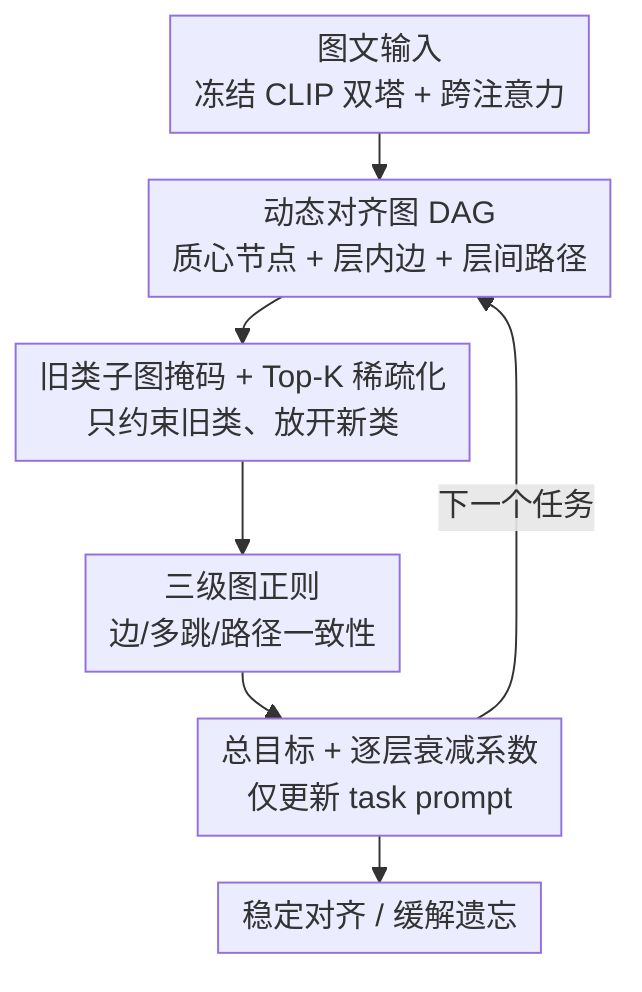

# Towards Dynamic Modality Alignment in Multimodal Continual Learning

**会议**: CVPR 2026  
**论文**: [CVF Open Access](https://openaccess.thecvf.com/content/CVPR2026/html/Tan_Towards_Dynamic_Modality_Alignment_in_Multimodal_Continual_Learning_CVPR_2026_paper.html)  
**代码**: 待确认  
**领域**: 多模态VLM / 持续学习  
**关键词**: 多模态持续学习, 模态对齐, 图正则, 灾难性遗忘, 提示学习

## 一句话总结
这篇论文指出"模态对齐不是一次定型的静态约束、而是随任务和网络层动态演化的过程"，于是为每个任务构建一张「动态对齐图」（节点是跨模态聚类质心、层内边刻画 token 交互、层间边刻画表示传播），再用三级图正则把旧类子图的演化锁住、新类子图放开，从而阻止浅层错位像滚雪球一样传到深层；在 MTIL 11 数据集上以 1.8M 可训练参数把 Avg./Last 推到 79.4%/87.1%，超过此前最强基线 DIKI 约 +3.1%/+2.0%。

## 研究背景与动机
**领域现状**：多模态持续学习（MMCL）要让一个模型在任务序列上不断吸收新知识、又不忘旧知识，比单模态持续学习更难，因为它额外依赖图文两条模态的协同与互补。传统主线是围绕"模态对齐"做文章——权重正则、增量学习里保持对齐等做法，通常在某些特定层或最终表示上强行把图文特征拉到一起。

**现有痛点**：这些方法都把对齐当成一个**静态**目标，默认"对齐一旦建立就固定不变"。可是在持续学习里，任务在变（类增量、分布漂移），网络内部的表示也在变（浅层特征分布先动、随层加深逐渐影响深层）。静态约束只盯住顶层或某几层，根本没管对齐在层与层之间是怎么"流动"和"漂移"的。

**核心矛盾**：作者的关键观察是——任务级变化与模型级变化是**交织且互相放大**的。一次任务切换会先扰动浅层的特征分布造成轻微错位，这点错位顺着层往下传、被逐层放大，最终在学新任务时给出错误的对齐引导，把灾难性遗忘越滚越大（论文 Fig.1 用 ∆Align 逐层升高来展示这条"雪球链"）。已有工作（包括蒸馏）大多只约束最终 logits，两个模型 logits 可以一致、层间动态却南辕北辙，错位传播这条链一直没人管。

**本文目标**：显式建模并约束"跨模态对齐如何随层演化"，让对齐在层与层、任务与任务之间都保持一致，从源头掐断浅层错位向深层的传播。

**核心 idea**：用一张随任务演化的图（Dynamic Alignment Graph）把"对齐的层间动态"结构化地表达出来，再用图正则约束这张图的演化——**约束旧类子图、放开新类子图**，在稳定性与可塑性之间取得平衡。

## 方法详解

### 整体框架
DAGR（Dynamic Alignment Graph Regularization）建在一个冻结的视觉-语言骨干（CLIP 式双塔 + 跨注意力）之上，唯一可学的是每个任务的 task-specific prompt。整条流程分两大步：**先为当前任务构建一张动态对齐图，再用图正则把这张图的演化锁稳**。

构图阶段：把每层跨注意力模块输出的图文融合特征聚类成 $K$ 个质心当作图节点，层内用 head-wise softmax 归一化的注意力当边（刻画 token 之间的局部依赖），层间用"显式余弦相似 + 隐式 attention rollout"组合成边（刻画表示如何从第 $l$ 层传到第 $l{+}1$ 层）。正则阶段：先把跨注意力原型与历史任务原型做相似度匹配、生成只保留旧类节点/边的二值掩码 $M$，再用三个 KL 散度项分别约束**层内边一致性**、**多跳边一致性**、**层间路径一致性**，并和图文匹配损失一起组成总目标。由于骨干冻结，这些约束最终都通过 prompt 来实现，相当于教 prompt 学会"如何掌舵对齐的动态"。

### 关键设计

**1. 动态对齐图 DAG：把"对齐的层间演化"显式画成一张图**

针对"静态对齐管不住层间漂移"这个痛点，作者为每个任务构建一张图 $G=(V,E)$，让对齐从"某层一个标量目标"升级成"贯穿全网络的结构"。节点不是原始 token（太多太碎），而是把每层图文特征按融合比例 $\alpha$ 混合后聚类成 $K$ 个质心：$V^{(l)} = \mathrm{Cluster}\big(\alpha Z^{(l)}_{img} + (1-\alpha) Z^{(l)}_{txt},\, K\big)$，每个质心是一个语义连贯、跨模态对齐的单元。层内边刻画同层 token 的局部依赖，用 head-wise 带温度 $\beta$ 的 softmax 归一化注意力，把强而稳的交互凸显出来：$e^{(l)}_{ij} = \frac{1}{H}\sum_{h} \frac{\exp(\beta A^{(l,h)}_{ij})}{\sum_{j'}\exp(\beta A^{(l,h)}_{ij'})}$。层间边则刻画表示如何往下一层传播，融合显式相似与隐式 rollout：$e^{(l\to l+1)}_{ij} = \gamma\cos\!\big(f(v^{(l)}_i),\,v^{(l+1)}_j\big) + (1-\gamma)R^{(l\to l+1)}_{ij}$，其中 $R$ 是 attention rollout 矩阵，等价于按行归一化的 $\mathrm{RowNorm}(A^{(l)}W^{(l)})$，反映了注意力被 Transformer 内投影矩阵 $W^{(l)}$ 变换后对下一层的累积影响。这样一来，"对齐怎么在层间流动"第一次被显式地表达成可约束的对象。

**2. 旧类子图掩码 + Top-K 稀疏化：只锁旧知识，给新类留余地**

如果对整张图一视同仁地约束，新类就会被旧结构卡死、失去可塑性。作者先把跨注意力输出聚成原型、与历史任务原型做相似度匹配，再构造二值掩码 $M_l[i,j]=1$ 当且仅当边 $(i,j)$ 属于旧类子图、否则为 0（公式 9）。后续所有正则都乘上这个掩码，于是约束只作用在旧类子图上、新类子图保持灵活——这正是稳定性-可塑性权衡的具体落点。同时对图做 Top-K 稀疏化，剪掉弱边、突出最关键的连接，既降复杂度又提升可解释性。

**3. 三级图正则：从单边到多跳到跨层，层层堵住错位传播**

这是方法的核心，用三个 KL 散度项约束图在相邻任务之间的演化。**层内边一致性** $L_{edge}=\sum_l\sum_i\sum_j M_l[i,j]\,\mathrm{KL}(p^{(t-1)}_{l,i}(j)\,\|\,p^{(t)}_{l,i}(j))$，惩罚旧类 token 交互分布在任务间的漂移；用 KL 而非余弦/$\ell_2$，是因为它对交互概率的变化方向更敏感。**多跳边一致性** $L_{multi}$ 把约束推广到 $k$ 步传播，$P^{(t)}_l(k)=\mathrm{RowNorm}((A^{(t)}_l)^k)$，只取 $k\in\{2,3\}$（更高阶幂会让邻接结构趋同、收益递减还更耗算力），约束错位不沿"推理链"累积。**路径一致性** $L_{path}=\sum_l \mathrm{KL}\big(\mathrm{RowNorm}(M_{l\to l+1}\odot T^{(t-1)}_{l\to l+1})\,\|\,\mathrm{RowNorm}(M_{l\to l+1}\odot T^{(t)}_{l\to l+1})\big)$，用 rollout 转移矩阵直接约束相邻层之间的信息传播，确保浅层扰动不会无节制地往深层冲。消融显示这条**层间路径约束最关键**，因为它正对着"浅层错位被前向传播放大"这条主因。

**4. 总目标 + 逐层衰减系数：冻结骨干，把约束全压到 prompt 上**

总损失把图文匹配损失和三个正则项加在一起：$L = L_{match} + \lambda_1 L_{edge} + \lambda_2 L_{multi} + \lambda_3 L_{path}$。一个巧妙的细节是让 $\lambda$ 系数**随层衰减**——浅层约束强、深层约束弱，正好对应"错位起于浅层"的诊断，进一步提升稳定性。由于骨干始终冻结，这些约束没有改动任何主干权重，而是通过唯一可学的 task-specific prompt 来兑现，相当于让 prompt 学会主动调控对齐动态。代价上构图复杂度只有 $O(K^2 L)$，每个任务图约 0.2MB，几乎可忽略。

### 损失函数 / 训练策略
- 总目标见上式（公式 14），$\lambda_1,\lambda_2,\lambda_3$ 控制稳定性-可塑性权衡，并按层衰减。
- 骨干冻结，仅训练 task-specific prompt（1.8M 参数）；每个任务存一张紧凑图（约 0.2MB），无需 rehearsal buffer 或参考数据集。
- 为前向迁移做的小补丁：测试时无任务标签 + prompt 专一化会限制对未见任务的迁移，于是用上一任务 prompt 的部分分量初始化下一任务 prompt，让新 prompt 保留任务无关的模式，改善前向迁移与 zero-shot 泛化。

## 实验关键数据

### 主实验
基准为 MTIL（11 个数据集、1201 类、显著分布漂移），指标 Avg.（训练全程平均准确率，间接反映过程中的退化）与 Last（学完所有任务后的最终准确率，反映知识保留）。

| 方法 | 额外数据 | 可训参数 | Avg.(%) | Last(%) |
|------|---------|---------|---------|---------|
| Zero-shot | - | - | 64.7 | - |
| ZSCL | ✓ | 211M | 75.4 | 83.6 |
| MoEAdapters | × | 84M | 75.4 | 84.2 |
| C-CLIP | × | 2M | 77.8 | 85.9 |
| DIKI（此前最强） | × | 1.8M | 76.3 | 85.1 |
| **DAGR** | × | 1.8M | **79.4** | **87.1** |
| Upper Bound | - | - | 89.3 | - |

DAGR 在几乎所有数据集、两个指标上都最优：Avg. 79.4%、Last 87.1%，比最强基线 DIKI 高 +3.1% / +2.0%，且只用 1.8M 参数、不依赖任何外部数据（而 ZSCL 用了 211M 参数 + memory buffer）。16-shot 的 MTIL-FS 设定下（表 2），DAGR 的 Avg./Last 为 74.2/79.3，平均 76.8，仍稳超 DIKI（74.5）等，说明少监督下图级一致性约束依旧有效。

### 消融实验
| 配置 | Avg.(%) | Last(%) | 说明 |
|------|---------|---------|------|
| w/o Graph Reg. | 71.2 | 79.5 | 去掉全部图正则 |
| 仅 $L_{edge}$ | 73.0 | 81.0 | 层内边一致性 |
| 仅 $L_{multi}$ | 74.1 | 82.3 | 多跳边一致性 |
| 仅 $L_{path}$ | 75.4 | 83.7 | 层间路径一致性（单项最强） |
| $L_{edge}+L_{path}$ | 77.0 | 85.2 | — |
| $L_{multi}+L_{path}$ | 77.6 | 85.8 | — |
| Full（三项） | **79.4** | **87.1** | 完整模型 |

### 关键发现
- **层间路径约束 $L_{path}$ 贡献最大**：单项就能把 Avg. 从 71.2 拉到 75.4，因为它直接拦住"浅层扰动在前向传播中被放大"这条主因；凡是含 $L_{path}$ 的组合都明显更好，印证了"对齐的层间传播才是遗忘的命门"这一核心论点。
- **三项互补**：一项管局部一致、一项稳层内交互、一项控跨层传播，叠加后达到最佳，给出更平衡的稳定性-可塑性权衡。
- **训练高效**：MTIL 全量训练约 2.9 GPU 小时 / 24GB（ZSCL 需 12.9h / 96GB），每任务图仅约 0.2MB；Graph Pruning / Progressive Regularization 还能进一步压到 2.3–2.7h、精度仅微降（78.0–78.8）仍超 ZSCL 与 DIKI。
- **对任务顺序鲁棒**：正序/逆序/随机顺序下 DAGR 波动都很小，而 DualPrompt 在任务切换处掉点明显；前向遗忘（Transfer 指标）上 DAGR 也以 69.3 平均略胜 DIKI（68.7）。

## 亮点与洞察
- **把"对齐是动态过程"这个观念落成可计算结构**：从 Fig.1 的 ∆Align 逐层升高诊断出"雪球式错位传播"，再用一张层间图把它显式表达、用三级 KL 正则逐级堵住——诊断与方法高度对位，不是空泛地"加个正则"。
- **掩码式选择性约束很可复用**：用旧类子图二值掩码把"该锁的锁、该放的放"做成显式开关，是处理稳定性-可塑性权衡的一种干净写法，可迁移到其他持续学习场景。
- **系数逐层衰减的小设计很聪明**：既然错位起于浅层，就让浅层约束强、深层弱，几乎零成本地把先验注进优化，比全局统一系数更贴合机理。
- **rollout 重新被用作"层间传播"的度量**：把原本用于可视化的 attention rollout 拿来当层间边和路径约束的载体，是一个把现成工具用在新地方的巧思。

## 局限与展望
- 作者承认在**大规模数据集与多任务高效管理**上仍有挑战；展望把 DAGR 与 open-set 结合以应对更复杂任务。
- **前向迁移是结构性短板**：测试时无任务标签 + prompt 专一化导致对未见任务的直接适应弱，只能靠"部分继承上一任务 prompt"打补丁，治标未治本。
- 关键超参（$\alpha,\beta,\gamma,K,\lambda$、逐层衰减曲线）的敏感性分析被放进附录，正文未给，复现时这些选择的稳健性需自行验证（⚠️ 以原文附录为准）。
- 方法绑定在"冻结骨干 + 跨注意力 + prompt"这套 CLIP 式范式上，能否迁移到非对称或更多模态（音频/视频）尚未验证。

## 相关工作与启发
- **vs 静态对齐 / 权重正则（如 LwF、ZSCL）**: 他们只在顶层或最终预测上约束对齐，DAGR 显式约束对齐在层间的动态演化；区别在于前者放任浅层错位向深层传播、后者从传播链上逐级拦截，因此在相同甚至更少参数下更稳。
- **vs 提示学习 MMCL（L2P / DualPrompt / S-Prompts / DIKI）**: 他们靠为每任务学/选 prompt 来适配，DAGR 在同样的 prompt 范式上加了一层图正则去稳住层间对齐；实验显示纯 prompt 复用不足以应对 MTIL 的分布漂移，DAGR 一致涨点（超 DIKI +3.1% Avg.）。
- **vs 表示动态研究（层间相似结构、特征漂移累积）**: 这些工作发现了"对齐误差会沿层放大"的现象但多停留在分析，DAGR 把这一洞察转成可优化的图正则，给了 MMCL 一个"层级感知"的动态视角。

## 评分
- 新颖性: ⭐⭐⭐⭐ 把"模态对齐是动态层间过程"这一视角形式化为动态对齐图 + 三级图正则，观点和方法都不落俗套。
- 实验充分度: ⭐⭐⭐⭐ MTIL 11 数据集 + 16-shot + 消融 + 任务顺序 + 前向遗忘 + 训练成本，覆盖较全；但仅 MTIL 一个主基准，部分超参分析挪进附录。
- 写作质量: ⭐⭐⭐⭐ 动机—诊断—方法对位清晰，公式完整；个别段落（4 开头）有重复句、图 2 排版较乱。
- 价值: ⭐⭐⭐⭐ 用 1.8M 参数 / 24GB / 约 3 小时就把 MTIL SOTA 往前推一截，机理诊断对持续学习社区有启发，实用性强。

<!-- RELATED:START -->

## 相关论文

- [\[CVPR 2026\] Multimodal Continual Instruction Tuning with Dynamic Gradient Guidance](multimodal_continual_instruction_tuning_with_dynamic_gradient_guidance.md)
- [\[CVPR 2026\] MOON2.0: Dynamic Modality-balanced Multimodal Representation Learning for E-commerce Product Understanding](moon20_dynamic_modality-balanced_multimodal_representation_learning_for_e-commer.md)
- [\[CVPR 2026\] DeepAlign: Mitigating Modality Conflict through Modality-Specific Alignment](deepalign_mitigating_modality_conflict_through_modality-specific_alignment.md)
- [\[CVPR 2026\] Enhancing Continual Learning of Vision-Language Models via Dynamic Prefix Weighting](enhancing_continual_learning_of_vision-language_models_via_dynamic_prefix_weight.md)
- [\[CVPR 2026\] DSCA: Dynamic Subspace Concept Alignment for Lifelong VLM Editing](dsca_dynamic_subspace_concept_alignment_for_lifelong_vlm_editing.md)

<!-- RELATED:END -->
