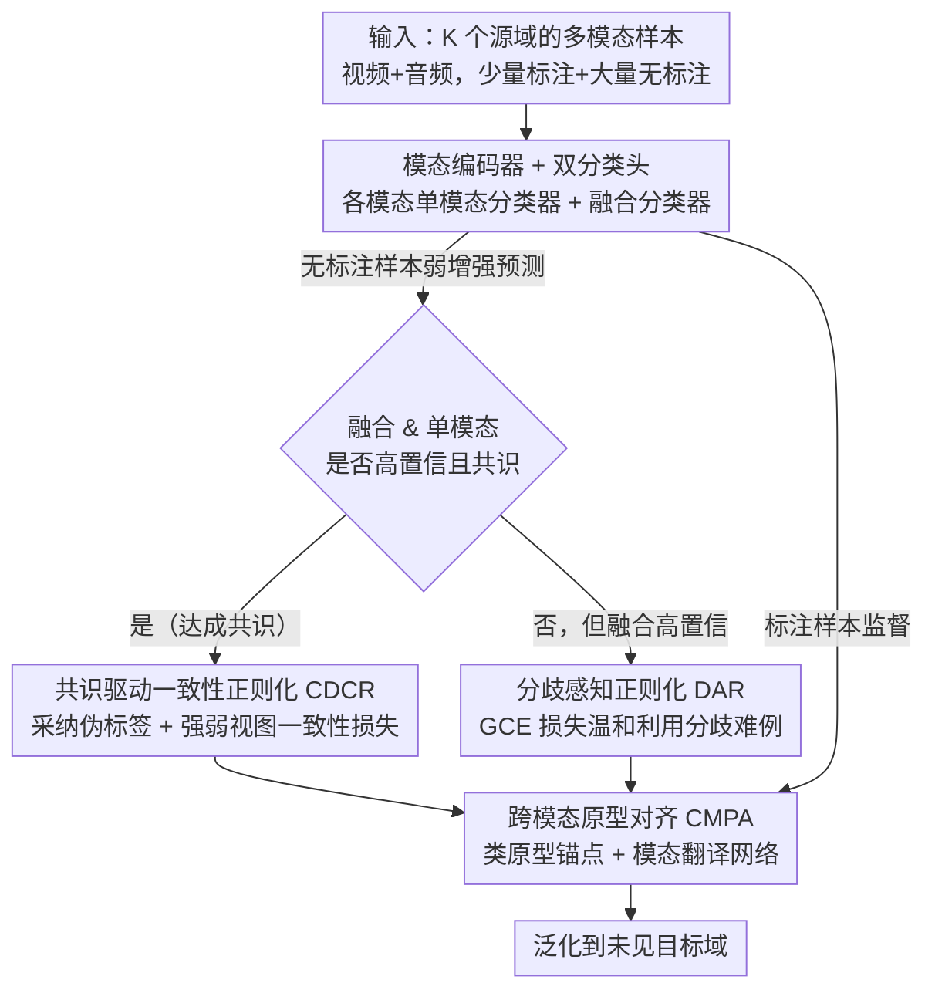

# Towards Multimodal Domain Generalization with Few Labels

**会议**: CVPR 2026  
**arXiv**: [2602.22917](https://arxiv.org/abs/2602.22917)  
**代码**: [https://github.com/lihongzhao99/SSMDG](https://github.com/lihongzhao99/SSMDG)  
**领域**: 多模态VLM  
**关键词**: 半监督学习, 域泛化, 多模态融合, 伪标签, 跨模态原型对齐

## 一句话总结
定义并研究半监督多模态域泛化(SSMDG)新问题，提出融合一致性驱动伪标签、分歧感知正则化和跨模态原型对齐的统一框架，在少量标注下实现多模态模型的跨域泛化。

## 研究背景与动机
**领域现状**：多模态域泛化(MMDG)假设所有源域数据都有标注；半监督多模态学习(SSML)利用无标注数据但忽略域偏移；半监督域泛化(SSDG)处理域偏移但仅限单模态输入。三个方向各解决部分问题。

**现有痛点**：实际场景中三个挑战同时存在——多模态数据+少量标注+域偏移。MMDG方法无法利用大量无标注数据；SSML方法假设训练和测试分布相同；SSDG方法无法利用跨模态互补性。

**核心矛盾**：(a) 在低置信度和模态间分歧的条件下如何获得可靠伪标签；(b) 在有限监督下如何学习同时对模态和域不变的表示。

**本文目标**：构建SSMDG基准并设计统一框架，同时解决伪标签可靠性和域-模态不变表示学习。

**切入角度**：利用融合预测与单模态预测的共识来筛选可靠伪标签，利用类原型作为跨域跨模态的语义锚点。

**核心 idea**：通过共识驱动的伪标签筛选和跨模态原型对齐，在少标注多模态多域数据上实现鲁棒泛化。

## 方法详解

### 整体框架
SSMDG 要同时啃下三块硬骨头：多模态、少量标注、跨域偏移。这篇论文把问题拆成两半——先想办法把海量无标注样本变成能用的监督信号，再让学到的表示既跨模态又跨域稳定。为此它给每个模态配一个编码器，再接两套分类头：各模态各自的单模态分类器，以及把所有模态特征拼起来的融合分类器。训练时从标注池和无标注池混采一个 batch，让数据依次流过三个互补组件：先用共识驱动一致性正则化(CDCR)从无标注样本里挑出可信的伪标签，再用分歧感知正则化(DAR)把 CDCR 漏掉但仍有价值的样本捞回来，最后用跨模态原型对齐(CMPA)把不同域、不同模态的特征拉到同一套类原型上。三者共享同一组编码器，端到端联合训练。无标注样本在这里走的是一条**按共识分流**的路径：满足共识的进 CDCR，落选但融合高置信的进 DAR，两路产出的伪标注特征再一起汇入 CMPA 做原型对齐。

### 关键设计

**1. 共识驱动一致性正则化（CDCR）：让多个视角互相背书，而不是只信融合预测**

半监督方法常见的做法是给融合预测卡一个置信度阈值，过了就当伪标签。但在跨域设置下融合预测本身就可能因为域偏移而过度自信，单看一个数容易被带偏。CDCR 的想法是要求"多视角共识"：对一个无标注样本，先做弱增强得到伪标签，只有当融合预测和至少一个单模态预测都越过高置信阈值 $\tau$、且它们指向同一个类别时，这个伪标签才被采纳。通过这道筛子的样本进入 batch $\mathcal{B}_{\text{cdcr}}^u$，再用 FixMatch 式的强弱一致性损失把强增强视图拉向伪标签：

$$\mathcal{L}_{\text{cdcr}} = \frac{1}{|\mathcal{B}_{\text{cdcr}}^u|}\sum\sum_{n\in\{v,a,f\}}\mathcal{H}(\hat{y}, \hat{p}_n^s)$$

其中 $n$ 遍历视频、音频和融合三个分支，$\hat{p}_n^s$ 是强增强下各分支的预测。共识本质上是一个免费的质量过滤器——多个独立视角同时认同的决策，比任何单一预测都更可能正确，低质量伪标签自然被挡在外面。消融里它也是贡献最大的单个组件。

**2. 分歧感知正则化（DAR）：把"模态吵架"的样本捞回来用，而不是直接扔**

CDCR 的严苛筛选会刷掉一类样本：融合预测很自信，但各模态彼此不一致。直接丢弃它们其实很可惜，因为这些样本往往正好卡在决策边界附近，是最能提供信息的难例。DAR 选择温和地利用它们——对这批"非共识但融合高置信"的样本，不用标准交叉熵（它对错误标签惩罚太狠、容易被噪声拽偏），而换成广义交叉熵(GCE)：

$$\mathcal{L}_{\text{GCE}} = (1-p_{\hat{y}}^q)/q$$

参数 $q\in(0,1]$ 是个调噪声容忍度的旋钮：$q\to 0$ 时 GCE 退化成普通交叉熵，$q\to 1$ 时接近对噪声更钝感的 MAE 损失。这样即便伪标签有错，梯度也不会被个别噪声样本主导。整体哲学是"宁可部分利用也不浪费"，消融里它在 CDCR 之上又稳定加了约 3%。

**3. 跨模态原型对齐（CMPA）：用类原型当锚点，把跨域跨模态的对齐问题转成"向中心靠拢"**

光有可靠伪标签还不够，表示空间本身得对域和模态都不变。传统做法是直接做域对齐或模态对齐，但前者通常需要域标签、后者要枚举模态配对，都不够灵活。CMPA 换了个支点：为每个「模态×类别×域」维护一个类原型（用标注特征的 EMA 滑动平均更新，不是可学习参数），当作跨域、跨模态共享的语义锚点，然后把各个域、各个模态产出的同类特征同时往**本域原型**和**其他源域同类原型的均值**上拉。这样无论特征来自哪个域哪个模态，只要是同一类就收敛到同一个中心，不变性是"对齐到锚点"的副产品，既不需要域标签也不用穷举模态对。为应对推理时可能缺模态的情况，CMPA 还配套训练一对跨模态翻译网络 $t_{v\to a}$、$t_{a\to v}$，从在场的模态补出缺失模态的特征——实验显示这让模态缺失下的性能降级明显更平缓。

### 损失函数 / 训练策略
总损失把监督项和三个组件加权合并：

$$\mathcal{L} = \mathcal{L}_{\text{sup}} + \lambda_1\mathcal{L}_{\text{cdcr}} + \lambda_2\mathcal{L}_{\text{dar}} + \lambda_3\mathcal{L}_{\text{cmpa}}$$

其中监督损失 $\mathcal{L}_{\text{sup}}$ 在标注数据上对融合分类器和各单模态分类器同时计算。一致性训练沿用弱-强增强范式：弱增强用标准变换得到伪标签，强增强对视频用 RandAugment、对音频用 SpecAugment，逼模型在更剧烈的扰动下仍保持预测一致。

## 实验关键数据

### 主实验 (5 labels per class)

| 方法 | 类型 | HAC Mean | EPIC Mean |
|------|------|----------|-----------|
| Source-only | Baseline | 42.39 | 29.46 |
| SimMMDG | MMDG | 44.39 | 31.11 |
| MDJA | MMDG | 44.28 | 31.51 |
| FixMatch (Video) | SSL | 48.74 | 32.54 |
| CGMatch (Video) | SSL | 49.10 | 33.42 |
| **Ours** | **SSMDG** | **55.82** | **38.15** |

### 消融实验

| 配置 | HAC Mean | EPIC Mean |
|------|----------|-----------|
| Baseline | 42.39 | 29.46 |
| + CDCR | 49.15 | 33.80 |
| + CDCR + DAR | 52.30 | 35.90 |
| + CDCR + DAR + CMPA | **55.82** | **38.15** |
| w/o 共识筛选 | 47.20 | 31.50 |

### 关键发现
- SSMDG方法大幅超越所有MMDG方法（+11%），因为后者无法利用无标注数据
- 单模态SSL方法（FixMatch on video）已经超过MMDG方法，凸显利用无标注数据的价值
- CDCR贡献最大（+7%），DAR在此基础上额外贡献3%，CMPA再贡献3%
- 不做共识筛选直接用所有高置信伪标签会降低5%，验证了筛选策略的必要性
- 在模态缺失场景下（只有视频或只有音频），跨模态翻译使性能降级更平缓

## 亮点与洞察
- **问题定义的前瞻性**：将三个独立研究的挑战统一为SSMDG，建立了首个基准。三线汇合的交叉点确实是未被探索但实际需要的设置。
- **共识驱动伪标签**：不同于单纯依赖融合预测的阈值筛选，加入模态间一致性验证进一步提升可靠性，是多模态半监督学习的自然且有效创新。
- **GCE对非共识样本的使用**：没有简单丢弃不确定样本，而是用噪声鲁棒损失温和利用，体现了"宁可部分利用也不浪费"的设计哲学。

## 局限与展望
- 仅在视频-音频双模态上验证，视觉-语言或三模态场景有待探索
- 阈值 $\tau$ 在所有域上统一，域自适应阈值可能更好
- 类原型用 EMA 滑动平均更新，注意力加权或更自适应的原型估计可能进一步改善
- 未在large-scale数据集（如大规模视频分类）上验证可扩展性

## 相关工作与启发
- **vs SimMMDG**：SimMMDG用全标注数据做跨模态对齐；本文在少标注下通过伪标签+原型对齐实现同样目标，更实用
- **vs FixMatch**：FixMatch是单模态SSL的标准方法；本文的CDCR利用多模态共识产生更可靠伪标签

## 评分
- 新颖性: ⭐⭐⭐⭐ 新问题定义+合理的统一框架
- 实验充分度: ⭐⭐⭐⭐ 两个基准、多种baseline对比，模态缺失实验增添了价值
- 写作质量: ⭐⭐⭐⭐ 问题定义和方法描述清晰
- 价值: ⭐⭐⭐⭐ 填补了三线交叉未被探索的空白，基准有社区价值

<!-- RELATED:START -->

## 相关论文

- [\[CVPR 2025\] Single Domain Generalization for Few-Shot Counting via Universal Representation Matching](../../CVPR2025/multimodal_vlm/single_domain_generalization_for_few-shot_counting_via_universal_representation_.md)
- [\[ICLR 2026\] Reasoning-Driven Multimodal LLM for Domain Generalization](../../ICLR2026/multimodal_vlm/reasoning-driven_multimodal_llm_for_domain_generalization.md)
- [\[CVPR 2026\] Mind the Discriminability Trap in Source-Free Cross-domain Few-shot Learning](mind_the_discriminability_trap_in_source-free_cross-domain_few-shot_learning.md)
- [\[CVPR 2026\] Addressing Exacerbated Attention Sink for Source-Free Cross-Domain Few-Shot Learning](addressing_exacerbated_attention_sink_for_source-free_cross-domain_few-shot_lear.md)
- [\[CVPR 2026\] Pointing at Parts: Training-Free Few-Shot Grounding in Multimodal LLMs](pointing_at_parts_training-free_few-shot_grounding_in_multimodal_llms.md)

<!-- RELATED:END -->
