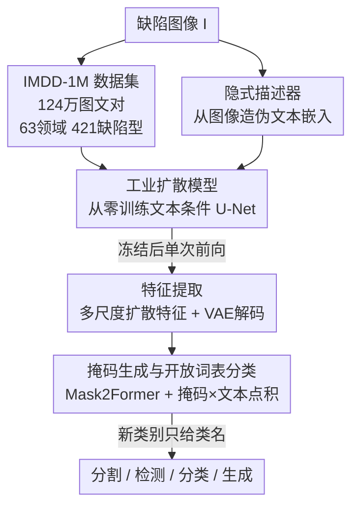

# Towards Open-Vocabulary Industrial Defect Understanding with a Large-Scale Multimodal Dataset

**会议**: CVPR 2026  
**论文**: [CVF Open Access](https://openaccess.thecvf.com/content/CVPR2026/html/Ni_Towards_Open-Vocabulary_Industrial_Defect_Understanding_with_a_Large-Scale_Multimodal_Dataset_CVPR_2026_paper.html)  
**代码**: 待确认  
**领域**: 多模态VLM / 工业缺陷检测 / 数据集  
**关键词**: 工业缺陷, 图文对数据集, 扩散基础模型, 开放词表分类, 数据高效

## 一句话总结
本文构建了首个百万级工业缺陷"图像-文本对"数据集 IMDD-1M（124 万张图、63 个制造领域、421 种缺陷类型），并在其上从零训练了一个文本条件扩散基础模型，把分割、检测、分类、生成统一进一套框架；下游任务每类仅用约 200 张样本微调（不到专家模型 5% 的标注量）即可逼近专用模型性能。

## 研究背景与动机

**领域现状**：工业质检长期依赖自动光学检测（AOI）和以 YOLO 为代表的专用检测器。这些方法在单一任务上很强，但每个任务都要单独训练、需要大量像素级标注，且是"黑盒判别器"——只给出"有/无缺陷"，不给语义解释。

**现有痛点**：一方面，AOI/YOLO 路线误报率高、对没见过的新缺陷模式适应差、跨产线无法泛化；另一方面，CLIP、ALIGN、Flamingo 这类视觉-语言模型（VLM）虽然在自然图像上把视觉和文本语义对齐得很好，但它们几乎全在自然图像上训练，缺乏工业领域的专业知识。工业缺陷"细小、局部、需要专业术语"（如 delamination 分层、solder void 焊点空洞），通用 VLM 根本不认识这些概念。

**核心矛盾**：要让 VLM 理解工业缺陷，需要大规模"图像配上专业文本描述"的训练语料；但现有工业缺陷数据集（MVTec AD、VisA、Real-IAD 等）规模最多几万张、且**全部没有文本标注**，比多模态学习所需的体量小约两个数量级。没有图文对，就训不出懂工业语义的基础模型。

**本文目标**：(1) 造出一个百万级、带专家核验图文标注的工业缺陷数据集；(2) 在其上训一个既能判别（分割/检测/分类）又能生成（合成/增广）的统一多模态基础模型；(3) 让它在新缺陷类别上以极少标注就能迁移。

**切入角度**：作者押注"扩散模型的中间特征本身就是强语义表征"。与其训练一个判别式骨干，不如从零训练一个**文本条件扩散模型**，把它学到的多尺度特征当作通用表征喂给下游头。这样一套权重既能生成缺陷图、又能抽特征做判别。

**核心 idea**：先用百万图文对从零训练工业扩散模型，再冻结它、把扩散特征转给一个 Mask2Former 风格的掩码生成器，通过"掩码嵌入 × 文本嵌入点积"实现开放词表的缺陷分割与分类。

## 方法详解

### 整体框架
整个系统分两阶段。**阶段一**在 IMDD-1M 上从零训练一个 860M 参数的文本条件扩散 U-Net，同时联合训练一个极小的"隐式描述器"（implicit captioner，0.3M 参数），让模型在没有真实文本时也能自己造出伪文本嵌入。**阶段二**冻结整个扩散模型，只在下游数据集上训练一个 45M 参数的 Mask2Former 掩码生成器：先用一次前向把图像编码进扩散特征，VAE 解码器把特征还原成像素对齐的多尺度表征，掩码生成器据此预测二值掩码和对应嵌入，最后通过掩码嵌入与类别文本嵌入做点积完成开放词表分类。测试时给定全新类别 $C_{test}$（只给类别名），无需重训即可分割并分类。

问题形式化为：给定图像 $I \in \mathbb{R}^{H \times W \times 3}$ 和可选文本 $t$，预测带语义标签的掩码 $M \in \{0,1\}^{H \times W}$；训练在基类 $C_{train}$ 上，测试在不相交的 $C_{test}$ 上，测试时只提供类别名。

### 关键设计

**1. IMDD-1M：补上工业领域"图文对"这块拼图**

工业缺陷理解之所以训不出基础模型，根因是没有大规模带文本的数据。作者整合了 BTAD、MVTec AD、VisA、NEU-DET、WM-811K、ICCAD 等 26 个公开/企业数据集，构成 124 万张图（285,451 张正常 + 954,928 张异常），覆盖 63 个制造领域、421 种缺陷类型，比此前最大的 Real-IAD（67K 张）大约两个数量级。所有图统一到 $512 \times 512$ 分辨率；关键在于每张图都配有"专家核验 + LLM 辅助生成"的文本描述，平均 42 个词，写清缺陷的位置、严重度和上下文属性（如"metal plate with scratches"）。混合标注流水线让 LLM 负责语言一致性、专家负责术语准确性，解决了工业术语既要规模又要专业的两难。这份语料是后面所有能力的地基——没有它，扩散模型学不到工业视觉-语义关联。

**2. 从零训练的工业扩散模型：把扩散特征当通用表征**

通用 VLM 不懂工业缺陷，微调又会被自然图像的先验带偏，所以作者干脆**随机初始化、从零训**。骨干采用 Stable Diffusion v1.5 的 U-Net（编码器四个块，通道 320/640/1280/1280，对应步长 1/2/4/8），每个 ResNet 块后用交叉注意力注入文本条件。图像先经冻结的 VAE 做 8 倍压缩 $z_0 = E_{VAE}(I) \in \mathbb{R}^{4 \times h \times w}$，再按 DDPM 加噪 $z_t = \sqrt{\bar\alpha_t} z_0 + \sqrt{1-\bar\alpha_t}\,\epsilon$（线性 schedule，$\beta_1=10^{-4}$，$\beta_T=0.02$，$T=1000$）；文本经冻结 CLIP 编成 $e_T \in \mathbb{R}^{768}$ 后注入。训练目标是标准扩散去噪损失：

$$L_{diff} = \mathbb{E}_{z_0,\epsilon,t}\big[\|\epsilon - \epsilon_\theta(z_t, t, e_T)\|_2^2\big]$$

860M 参数全部从随机初始化训起，在 124 万张图上跑 100 epoch、batch 256、8 张 H100 用时 72 小时。之所以有效，是因为扩散模型为了在工业语料上学会"按文本生成对应缺陷"，必须把缺陷的纹理、位置、语义都编码进中间特征——这些特征正好可以转给判别任务。

**3. 隐式描述器：让没有文本的下游数据也能用扩散特征**

抽扩散特征必须有文本条件，但下游数据集大多只有类别标签或"正常/缺陷"二值标注，没有 caption，这会卡死特征提取。作者引入一个隐式描述器：冻结 CLIP 图像编码器后接一个可训练两层 MLP，把 512 维 CLIP 图像嵌入投到 768 维文本嵌入空间，$t_{imp} = W_2 \cdot \text{GELU}(W_1 \cdot V(I) + b_1) + b_2$，直接从图像造出"伪文本嵌入"，训练和推理都不再需要真实文本。训练时用**随机条件**策略：每个样本以各 0.5 的概率用真实文本 $e_T$ 或伪嵌入 $t_{imp}$ 做条件，逼着伪嵌入成为真文本的合格替身；再加余弦相似度对齐损失 $L_{imp} = 1 - \frac{t_{imp}^T e_T}{\|t_{imp}\|\|e_T\|}$ 拉近两者。消融显示去掉它分类掉 4.8%、去掉扩散条件本身掉 7.0%，说明文本条件这条线是性能命脉。

**4. 掩码生成 + 开放词表分类：用点积把视觉和文本接起来**

要做开放词表（测试见新类别），分类就不能用固定 softmax 头，得让视觉嵌入和任意类别文本嵌入对齐。冻结扩散模型后，在 $t=50$ 处对 latent 加噪、单次前向得到多尺度特征 $\{h_\ell\}_{\ell=1}^4$，经冻结 VAE 解码成像素对齐特征。掩码生成器用 Mask2Former：像素解码器走 FPN 产出 $F \in \mathbb{R}^{256 \times h \times w}$，Transformer 解码器用 100 个可学习 query 产出 100 个掩码 $\{m_i\}$ 和嵌入 $\{z_i\}$，掩码用二值交叉熵 $L_{mask}$ 监督。分类时把训练类别名经 CLIP 编成 $T = [\text{CLIP}_{text}(c_1), \dots, \text{CLIP}_{text}(c_K)]$，对掩码嵌入 $z_i$ 算 $L_{cls} = \frac{1}{N}\sum_i \text{CE}(\text{Softmax}(z_i \cdot T^T / \tau), y_i)$。只有 caption 没有标签时，抽名词当伪标签，再用双向对比的 grounding 损失 $L_{ground}$ 把图像-句子配对拉齐。测试时新类别 $\hat y_i = \arg\max_c p(z_i, C_{test})_c$，单图 A100 推理 0.35s。

### 损失函数 / 训练策略
两阶段的总损失分别为：阶段一 $L_{Stage1} = L_{diff} + 0.3 L_{imp}$（U-Net 860M + 隐式描述器 0.3M 全训，AdamW，lr $1\times10^{-4}$，batch 256，72 小时/8×H100）；阶段二 $L_{Stage2} = L_{mask} + 0.5 L_{cls/ground}$（冻结扩散，只训掩码生成器 45M，AdamW，lr $5\times10^{-5}$，batch 16，4 小时/8×H100，50 epoch）。

## 实验关键数据

### 主实验

数据集规模对比——IMDD-1M 在图像量和"是否带文本"两个维度上碾压前作：

| 数据集 | 年份 | 图像数 | 领域数 | 文本标注 |
|--------|------|--------|--------|----------|
| MVTec AD | 2019 | 5.4K | 15 | 无 |
| VisA | 2022 | 10.8K | 12 | 无 |
| Real-IAD | 2024 | 67K | 30 | 无 |
| **IMDD-1M (本文)** | 2025 | **1.24M** | **63** | **有（图文对）** |

下游任务统一框架的表现（分类、检测、分割同一套权重）：

| 任务 | 数据集/指标 | 本文 | 对照 | 说明 |
|------|-------------|------|------|------|
| 分类 | 四数据集平均 Acc | 96.7% | — | 无任务专属改动 |
| 检测 | MVTec AD mAP@0.5 | 74.6% | YOLOv8-m 78.3% | 仅 200 样本/类，掩码导框 |
| 检测 | MVTec AD mAP@0.75 | 58.9% | YOLOv8-m 62.1% | 不需框标注 |
| 分割异常 | MVTec AD P-AUC-ROC | 96.1% | 全量 SOTA ~98.2% | 仅 200 样本/类 |
| 分割异常 | MVTec AD AUC-PRO | 90.2% | 全量 SOTA ~94.0% | 约低 2% |
| 生成 | Magnetic Tile FID | 5.5–13.6 | 优于 SDXL | IS 100.29，更真实多样 |

### 消融实验
在 VisA 上逐个拆掉组件（完整模型 Acc 91.0% / IoU 52.9%）：

| 配置 | Acc (%) | IoU (%) | 说明 |
|------|---------|---------|------|
| Full Model | 91.0 | 52.9 | 完整模型 |
| w/o 隐式文本嵌入 | 86.2 | 49.2 | 分类掉 4.8% |
| w/o grounding 损失 | 88.3 | 49.8 | IoU 掉 3.1% |
| w/o 扩散条件 | 84.0 | 46.7 | 分类掉 7.0%，掉点最多 |

### 关键发现
- **扩散文本条件是命脉**：去掉扩散条件准确率掉 7.0%，是所有组件里掉点最多的，印证了"文本条件扩散特征"是整套方法有效的根本，而非锦上添花。
- **数据高效非常显著**：每类约 200 样本微调就达 96.1% 准确率，而传统监督方法需约 4000 样本（含增广）才到同等水平，标注量降到不足 5%；性能在 25–200 样本区间快速上升、200 之后饱和，说明基础模型已学到可泛化的缺陷表征。
- **生成与判别共享一套权重**：同一扩散骨干既能合成高保真缺陷图（金属面保留反射、织物保留纤维结构）做增广，又能转特征做检测分割，验证了"扩散特征即通用表征"的核心假设。

## 亮点与洞察
- **把"造数据"当成一等公民**：工业缺陷领域真正的瓶颈不是模型而是带语义标注的数据，本文用混合标注流水线（专家核验术语 + LLM 保证语言一致）把规模和专业性同时拿下，IMDD-1M 本身就是最大贡献。
- **隐式描述器解决了"扩散特征需要文本、但下游没文本"的死结**：用随机条件 + 余弦对齐让伪嵌入替代真文本，这个 trick 可迁移到任何"想用文本条件扩散特征、但目标域缺 caption"的场景（如医学影像、遥感）。
- **统一框架的工程价值**：一套权重覆盖分类/检测/分割/生成，对产线意味着不必为每种缺陷、每条产线单独训模型，运维成本大幅下降。

## 局限与展望
- **检测仍略逊专用模型**：mAP@0.5 74.6% vs YOLOv8 78.3%，分割 AUC-PRO 也比全量 SOTA 低约 2%。作者的卖点是"用不到 5% 标注换来接近的性能"，但在对精度极度敏感的质检场景，这 2–4% 差距可能仍需补齐。
- **跨任务比较需谨慎**：检测框由分割掩码导出，与原生框检测器不完全可比；不同数据集难度差异大，平均准确率 96.7% 的可比性有限。
- **caption 评测被推迟**：论文声称支持 captioning 任务，但生成描述的质量评测留到 future work，这块能力暂未验证。
- **作者展望**：扩展到时序/多视角信息支持视频级缺陷跟踪与 3D 推理，探索跨制造领域泛化，并把多模态推理与物理仿真结合。

## 相关工作与启发
- **vs 传统数据集（MVTec AD / VisA / Real-IAD）**：它们做"纯图像 + 像素级标注"，本文做"图像 + 专业文本描述"，区别在于引入了多模态对齐能力；本文规模大两个数量级且首次带文本，劣势是部分图来自整合而非全新采集。
- **vs 通用 VLM（CLIP / ALIGN / Flamingo）**：它们在自然图像上对齐视觉-文本，本文在工业缺陷域从零训练扩散模型；本文懂工业术语、能做细粒度缺陷定位，代价是需要专门造百万级领域数据。
- **vs 专用检测器（YOLOv8）**：YOLO 单任务强但需大量框标注、黑盒无语义，本文用统一框架 + 开放词表分类，以极少标注覆盖多任务并给出可解释分割，精度略低但泛化和标注效率更优。

## 评分
- 新颖性: ⭐⭐⭐⭐ 首个百万级工业缺陷图文对数据集 + 从零训练的工业扩散基础模型，方向上是明确的填空白
- 实验充分度: ⭐⭐⭐⭐ 覆盖生成/分类/检测/分割四类任务 + 数据高效消融，但部分对比（掩码导框 vs 原生检测）可比性有限
- 写作质量: ⭐⭐⭐⭐ 公式与流程清晰，两阶段训练交代完整；captioning 能力只提不评略有遗憾
- 价值: ⭐⭐⭐⭐⭐ 数据集本身极有价值，"5% 标注逼近专用模型"对工业落地意义重大

<!-- RELATED:START -->

## 相关论文

- [\[CVPR 2026\] Vocabulary Scaling Law: Tuning Open-vocabulary Predictors for Their Openness](vocabulary_scaling_law_tuning_open-vocabulary_predictors_for_their_openness.md)
- [\[CVPR 2026\] Reconstructing CLIP for Open-Vocabulary Dense Perception](reconstructing_clip_for_open-vocabulary_dense_perception.md)
- [\[CVPR 2026\] SldprtNet: A Large-Scale Multimodal Dataset for CAD Generation in Language-Driven 3D Design](sldprtnet_a_large-scale_multimodal_dataset_for_cad_generation_in_language-driven.md)
- [\[CVPR 2026\] SynCLIP: Synonym-Coherent Language-Image Pretraining for Robust Open-Vocabulary Dense Perception](synclip_synonym-coherent_language-image_pretraining_for_robust_open-vocabulary_d.md)
- [\[AAAI 2026\] O3SLM: Open Weight, Open Data, and Open Vocabulary Sketch-Language Model](../../AAAI2026/multimodal_vlm/o3slm_open_weight_open_data_and_open_vocabulary_sketch-language_model.md)

<!-- RELATED:END -->
