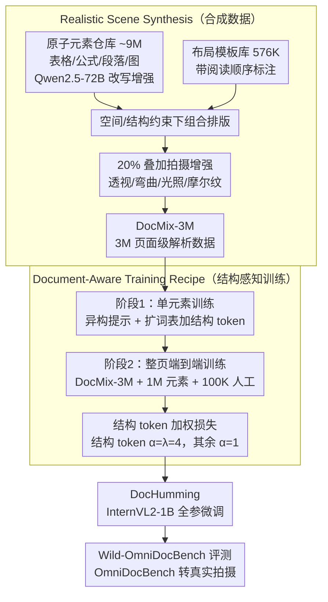

# Towards Real-World Document Parsing via Realistic Scene Synthesis and Document-Aware Training

**会议**: CVPR 2026  
**arXiv**: [2603.23885](https://arxiv.org/abs/2603.23885)  
**代码**: 待开源  
**领域**: 文档理解 / 端到端文档解析  
**关键词**: 文档解析, 合成数据, 渐进式训练, 结构token加权, 真实场景鲁棒性

## 一句话总结

提出数据-训练协同设计框架 DocHumming：通过 Realistic Scene Synthesis 构建 DocMix-3M 大规模合成数据集，结合渐进学习和结构 token 加权的 Document-Aware Training Recipe，在仅 1B 参数的 MLLM 上实现 OmniDocBench Overall 93.75（超越 Qwen3-VL-235B 的 89.15），且在真实拍摄场景下仅退化 6.72 分（模块化方法退化 18-20 分）。

## 研究背景与动机

**领域现状**：文档解析已从传统模块化管线（布局分析→OCR→元素解析）发展到端到端 MLLM 直接映射图像到结构化输出。模块化方法在数字/扫描文档上表现优秀（如 MinerU2.5 OmniDocBench 90.67），但端到端方法在真实场景下仍面临严重挑战。

**现有痛点**：(1) 模块化方法依赖精确布局分析，在随意拍摄条件下布局错误向下游传播（退化 18-20 分）；(2) 端到端方法在真实拍摄场景下产生重复内容、幻觉和结构不一致；(3) 缺乏大规模高质量的页面级端到端解析训练数据（SynthDog 布局简单，GOT 的 PDF-to-LaTeX 缺乏视觉多样性）。

**核心矛盾**：端到端范式无需显式布局分割、天然更鲁棒，但受限于数据稀缺和缺乏结构感知训练策略，潜力未被释放。

**本文目标** 通过数据-训练协同设计释放端到端文档解析在真实场景下的潜力。

**切入角度**：同时解决数据瓶颈（大规模合成）和训练瓶颈（结构感知优化），而非只攻其一。

**核心 idea**：576K 布局模板 + 9M 原子元素合成 3M 页面级数据，配合短到长渐进训练和结构 token 加权损失，让 1B 模型达到 235B 模型水平。

## 方法详解

### 整体框架

这篇论文想让一个只有 1B 参数的端到端 MLLM，在随手拍出来的文档照片上也能稳定解析出结构化文本——而现有端到端方法之所以做不到，卡点是两条：训练数据太单调（PDF-to-LaTeX 转出来的页面布局千篇一律），训练目标又没把结构当回事（长输出里表格、公式动不动就重复、串行）。DocHumming 的答案是数据和训练一起改：数据侧用 Realistic Scene Synthesis（RSS）从原子元素和布局模板「拼」出 300 万张视觉多样的页面级解析数据（DocMix-3M），训练侧用 Document-Aware Training Recipe（DATR）把「先认元素再读整页」的课程和「结构 token 多扣分」的损失加进去。整条链路落在 InternVL2-1B 基座上微调，得到的模型就叫 DocHumming；另外为了能测真实场景，作者还手工搭了一套 Wild-OmniDocBench。

### 关键设计

**1. Realistic Scene Synthesis：不转换 PDF，而是从零拼出多样的页面**

数据瓶颈的根子在于现有合成路线——SynthDog 布局太简单，GOT 那套 PDF-to-LaTeX 又只能继承原 PDF 的版式，视觉多样性上不去。RSS 干脆走「底层合成」：先建一个原子元素仓库，把表格识别、公式解析、段落理解等多源数据集格式归一，再用 Qwen2.5-72B 做改写增强（重组表格、扰动公式符号、拼出混合元素、生成多语言段落组），最后经 LaTeX 管线渲成「图像+标注」对，攒到约 9M 个原子元素；同时从公开数据集、网页挖掘加上补录欠表示风格，建出 576K+ 带阅读顺序标注的布局模板。合成时在空间和结构约束下把采样到的元素摆进模板，再对约 20% 的样本叠加拍摄增强——透视、弯曲、褶皱、光照变化、相机旋转、环境背景。举个具体的：从仓库里抽一张被改写过的三列表格、几段日语正文和一个被扰动符号的公式，塞进一个「双栏带页眉」的模板里排好版，再随机给它加上揉皱和侧光拍摄的效果，就得到一张带完整结构标注的训练页。这样攒出来的 DocMix-3M，布局多样性和视觉条件都能由作者主动控制，而不是被原始 PDF 锁死。

**2. Document-Aware Training Recipe：先学单元素再学整页，并让结构 token 多扣分**

文档解析的输出又长又强结构，直接拿整页长上下文硬训既不容易收敛、表格里又总冒重复，所以 DATR 拆成两件互补的事。一是渐进学习课程：阶段 1 只训单个元素（表格、公式、段落），用异构提示让模型先拿到类型特定能力，同时扩词表把布局结构 token 加进去；阶段 2 才以 DocMix-3M 为主体，再混入 1M 阶段 1 样本和 100K 人工标注，统一提示格式做整页端到端训练——这条「元素→整页」的路径正对应 LLM 里「短→长上下文」的课程式做法，绕开了上来就训长序列的收敛不稳。二是结构 token 加权：对落在结构标记内（如 `<table>`…`</table>`）的 token 在损失里乘一个更大的权重。损失写成

$$L = -\sum_t \alpha_t\, y_t \log P(x_t \mid x_{<t}),$$

其中结构 token 取 $\alpha_t = \lambda = 4$，其余 token $\alpha_t = 1$。把表格、公式这些容易塌成重复模式的位置「加重处罚」，正是后面消融里重复率从 4.6% 压回 2.1% 的直接来源。

**3. Wild-OmniDocBench：把基准本身搬到真实拍摄场景**

现有基准只覆盖数字版和扫描版文档，根本测不出真实拍摄下的脆弱性，于是作者手工把整个 OmniDocBench 转成了「拍出来的」形态：一路是把页面打印出来，做物理变形（折叠、弯曲、揉皱）后在多种光照下拍照；另一路是把内容显示在屏幕上再拍，自然引入摩尔纹、反射和亮度变化。有了这套基准，「模块化范式在真实场景下到底退化多少」才第一次有了可量化的答案——也正是它撑起了后面退化 18-20 分 vs 6.72 分的对比。

### 损失函数 / 训练策略

结构 token 加权交叉熵损失（见上式，$\lambda=4$）。阶段 1：batch=512、lr=4e-5、2 epochs；阶段 2：batch=256、lr=2e-5、2 epochs。余弦学习率衰减，最大输出长度 8192 tokens。基座 InternVL2-1B 全参数微调，16× NVIDIA H20 GPU。

## 实验关键数据

### 主实验：OmniDocBench 文档解析

| 类型 | 方法 | 参数量 | Overall↑ | TextEdit↓ | FormulaCDM↑ | TableTEDS↑ | ReadOrder↓ |
|------|------|-------|---------|-----------|-------------|------------|------------|
| Pipeline | PP-StructureV3 | - | 86.73 | 0.073 | 85.79 | 81.68 | 0.073 |
| 通用MLLM | Qwen2.5-VL-72B | 72B | 87.02 | 0.094 | 88.27 | 82.15 | 0.102 |
| 通用MLLM | Qwen3-VL-235B | 235B | 89.15 | 0.069 | 88.14 | 86.21 | 0.068 |
| E2E专用 | dots.ocr | 3B | 88.41 | 0.048 | 83.22 | 86.78 | 0.053 |
| 模块化专用 | MinerU2.5 | 1.2B | 90.67 | 0.047 | 88.46 | 88.22 | 0.044 |
| 模块化专用 | PaddleOCR-VL | 0.9B | 91.93 | 0.039 | 88.67 | 91.01 | 0.043 |
| **E2E专用** | **DocHumming** | **1B** | **93.75** | **0.035** | **93.27** | **91.49** | **0.041** |

### Wild-OmniDocBench 真实场景鲁棒性

| 类型 | 方法 | Origin | Wild | 退化↓ | 说明 |
|------|------|--------|------|-------|------|
| 通用MLLM | Qwen3-VL-235B | 89.15 | 79.69 | -9.46 | 大模型也退化 |
| 模块化 | MonkeyOCR-3B | 88.85 | 70.00 | -18.85 | 布局错误传播 |
| 模块化 | MinerU2.5 | 90.67 | 70.91 | -19.76 | 模块化退化最严重 |
| 模块化 | PaddleOCR-VL | 91.93 | 72.19 | -19.74 | 退化约20分 |
| E2E | DeepSeek-OCR | 87.01 | 74.23 | -12.78 | E2E退化较小 |
| E2E | dots.ocr | 88.41 | 78.01 | -10.40 | E2E退化较小 |
| **E2E** | **DocHumming** | **93.75** | **87.03** | **-6.72** | **退化最小** |

### 消融实验

| # | RSS | 渐进(PTP) | 结构加权(ST) | OmniDoc↑ | Repeat↓ | Wild↑ | Wild Repeat↓ |
|---|-----|----------|------------|---------|---------|------|-------------|
| 1 | X | Y | Y | 89.96 | 4.7% | 78.82 | 8.6% |
| 2 | Y | Y | X | 88.74 | 4.6% | 84.90 | 5.4% |
| 3 | Y | X | Y | 91.24 | 4.2% | 85.39 | 4.9% |
| 4 | Y | Y | Y | **93.75** | **2.1%** | **87.03** | **4.3%** |

数据规模曲线：DocMix-1M(85.41) -> 2M(88.14) -> 3M(89.96) -> 4M(89.31, 趋于饱和)。3M 超越 100K 人工标注数据（89.96 vs 89.26）。

### 关键发现

- 端到端 vs 模块化在真实场景下分化显著：模块化退化 18-20 分 vs DocHumming 仅退化 6.72 分
- 1B 超越 235B：通过正确的数据+训练策略，1B 模型（93.75）超越 Qwen3-VL-235B（89.15）
- 合成数据 3M 超越 100K 人工标注（89.96 vs 89.26），但 4M 时趋于饱和——元素仓库和模板池多样性是瓶颈
- 结构 token 加权是减少重复的关键：移除后重复率从 2.1% 升至 4.6%
- XFUND 多语言测试全面领先（德语 85.15、日语 87.99、西语 84.39）

## 亮点与洞察

- 数据-训练协同设计的框架思路值得推广：不只做数据或只做训练，联合优化效果显著
- 渐进训练借鉴 LLM 短到长上下文课程——文档解析的元素->页面与 LLM 的短->长上下文高度对应
- 定义重复率指标（连续结构模式重复>10次 + 达到最大长度）是量化解码稳定性的实用工具
- 数据规模效应的饱和点（~3M）为合成数据投入产出比提供了实用指导

## 局限与展望

- 不规则交错布局（报纸、海报）仍表现不佳，文本块嵌套/交错时阅读顺序和结构边界模糊
- 超高分辨率页面需下采样/切片，可导致长表格/密集公式重复或丢失
- 3M 后数据规模效应饱和，根本原因是元素仓库和模板池有限
- 推理效率：文本密集页面约需 ~3s，限制交互式使用
- 结构 token 加权 lambda=4 较为启发式，未探索自适应策略

## 相关工作与启发

- **vs GOT/SmolDocling**：这些 E2E 方法使用 PDF-to-LaTeX 数据，布局单一；DocHumming 通过底层合成实现布局多样性
- **vs MinerU2.5/PaddleOCR-VL**：标准文档上接近，但 Wild 场景退化 3 倍以上，模块化范式在真实场景下本质脆弱
- **训练策略启发**：结构 token 加权可推广到任何结构化生成任务（代码生成、HTML/JSON 生成）
- **数据合成方法论**：原子元素仓库 + 布局模板 + 组合合成的范式可迁移到其他多模态数据生成

## 评分

⭐⭐⭐⭐ (4/5)

- **新颖性** ⭐⭐⭐⭐：数据-训练协同设计思路系统性强，结构 token 加权简单但有效
- **实验充分度** ⭐⭐⭐⭐⭐：OmniDocBench + Wild + XFUND 三基准，完整消融（RSS/ST/PTP），数据规模曲线
- **写作质量** ⭐⭐⭐⭐：框架图清晰，数据构建流程详尽，消融设计严谨
- **价值** ⭐⭐⭐⭐：1B 超越 235B 的结论令人信服，Wild 基准填补评估空白

<!-- RELATED:START -->

## 相关论文

- [\[CVPR 2026\] Boosting Document Parsing Efficiency and Performance with Coarse-to-Fine Visual Processing](boosting_document_parsing_efficiency_and_performance_with_coarse-to-fine_visual_.md)
- [\[CVPR 2026\] Efficient Document Parsing via Parallel Token Prediction](efficient_document_parsing_via_parallel_token_prediction.md)
- [\[CVPR 2026\] PaddleOCR-VL: Boosting Document Parsing Efficiency and Performance with Coarse-to-Fine Visual Processing](paddleocr_vl_coarse_to_fine_document_parsing.md)
- [\[CVPR 2026\] VinQA: Visual Elements Interleaved Long-form Answer Generation for Real-World Multimodal Document QA](vinqa_visual_elements_interleaved_long-form_answer_generation_for_real-world_mul.md)
- [\[CVPR 2026\] DocPrune: Efficient Document Question Answering via Background, Question, and Comprehension-aware Token Pruning](docpruneefficient_document_question_answering_via_background_question_and_compre.md)

<!-- RELATED:END -->
