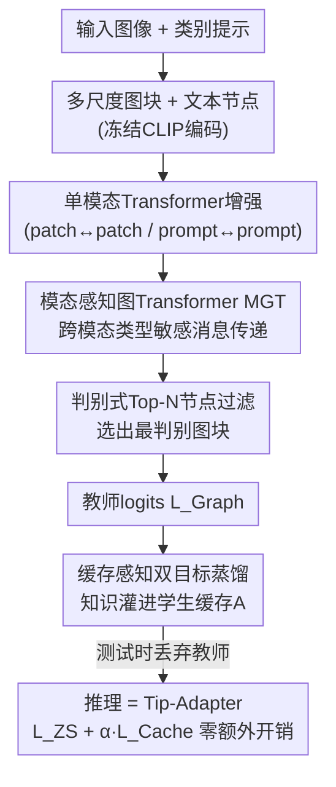

# Training-Only Heterogeneous Image-Patch-Text Graph Supervision for Advancing Few-Shot Learning Adapters

**会议**: CVPR 2026  
**论文**: [CVF Open Access](https://openaccess.thecvf.com/content/CVPR2026/html/Mohammad_Training-Only_Heterogeneous_Image-Patch-Text_Graph_Supervision_for_Advancing_Few-Shot_Learning_Adapters_CVPR_2026_paper.html)  
**代码**: https://github.com/MR-Sherif/TOGA.git  
**领域**: 多模态VLM  
**关键词**: 少样本学习, CLIP适配器, 异构图, 跨模态蒸馏, 训练期监督

## 一句话总结
TOGA 在训练阶段额外挂一个「图像-图块-文本」异构图教师做细粒度跨模态推理，并把这些关系知识蒸馏进 Tip-Adapter 的键值缓存里，测试时把整个图教师丢掉、推理路径和 Tip-Adapter 完全一样（零额外延迟/显存），在 11 个 1–16 shot 基准上刷新 SOTA。

## 研究背景与动机

**领域现状**：把 CLIP 这类视觉-语言大模型适配到少样本下游任务，主流是参数高效微调（PEFT）。其中 Tip-Adapter 这一支特别受欢迎——它把少量 support 样本的全局特征缓存成键值（key-value cache），测试时只做一次原型匹配，参数极少、推理极快。

**现有痛点**：这些轻量适配器都只在「全局单模态特征向量」上做文章。CLIP 把一张图空间平均成一个全局描述子，细粒度的局部线索（鸟喙形状、羽毛纹理这种区分「黄腹莺」和「灰莺」的关键证据）被平均糊掉了。于是细粒度视觉分类（FGVC）上，全局特征适配器天然吃亏。

**核心矛盾**：现有 PEFT 卡在一个 trade-off 上——要么**快但糙**（Tip-Adapter/CLIP-Adapter 这类全局适配器，推理零开销但只会在一个全局向量上推理），要么**强但慢**（GraphAdapter/VPT 这类图块级适配器，能在 patch token 上推理，但测试时永久背着 GNN/额外 token 的计算开销，而且常常只做单模态的 patch↔patch 推理，没用上文本语义）。理想的少样本适配器需要同时满足两个互相打架的目标：① 表达力够强，能对细粒度图块证据及其与类别文本的对齐做推理；② 保住轻量基线的零开销推理。

**本文目标**：让适配器既拿到「图块级 + 跨模态」的关系推理能力，又**完全不改变测试时的推理路径**（延迟、显存、参数量都和 Tip-Adapter 一模一样）。

**切入角度**：作者的关键观察是——既然关系推理只是为了「教会」适配器把细粒度知识编码进去，那它**只需要在训练时存在**就行。测试时真正参与计算的只有适配器和它的键值缓存，那就只在训练时注入跨模态关系推理、并把它定向蒸馏到「部署时还留着的那部分」（缓存）里。

**核心 idea**：用一个**只在训练期存在的高容量异构图教师**，把细粒度跨模态关系知识直接蒸馏进 Tip-Adapter 的键值缓存（学生），测试时丢掉教师——「用图训练，按 Tip-Adapter 测试」。

## 方法详解

### 整体框架
TOGA（Training-Only Graph Adapter）是一个**非对称蒸馏框架**，训练时同时跑三条分支组成的集成：①一条冻结的 CLIP 零样本分支 $L_{ZS}$；②一个轻量学生——也就是 Tip-Adapter-F 的键值缓存适配器 $A$，产出 $L_{Cache}$；③一个强力的、**只在训练期存在**的异构图教师，产出 $L_{Graph}$。

教师这条分支的内部流程是：先从输入图像切出多尺度图块、连同类别文本提示一起过冻结 CLIP 编码器拿到节点特征 → 各自过一个单模态 Transformer 做「模态内」上下文增强 → 把图块节点和文本节点拼成一张异构图，用 Modality-aware Graph Transformer（MGT）做类型敏感的跨模态消息传递 → 用判别式 Top-N 节点过滤选出最有判别力的图块、聚合成教师视觉特征、算出教师 logits。最后用一个「缓存感知双目标」把这些关系知识灌进学生适配器 $A$。测试时整条教师分支被整体丢弃，预测退化成 $L_{test}=L_{ZS}+\alpha\cdot L_{Cache}$，和原版 Tip-Adapter-F 字字相同。

### 关键设计

**1. 非对称「训练期教师 / 永久学生」蒸馏：把关系推理的成本留在训练侧**

痛点很直接——图块级跨模态推理强，但谁都不想把 GNN 永久背到部署里。TOGA 的破法是让强弱两条分支**结构不对称**：永久学生就是 Tip-Adapter-F 的键值缓存（一个把 query 特征 $z$ 映射后做余弦原型匹配的轻量适配器 $A$，缓存 logits $L_{Cache}(x)=\exp(-\beta(1-s))^{\top}V$，$s_j=\cos(A(z),K_j)$）；训练时再额外挂一个高容量图教师。训练分类用三者混合的 logits $L_{train}(x)=L_{ZS}(x)+\alpha\cdot L_{Cache}(x)+\delta\cdot L_{Graph}(x)$，梯度同时更新学生和教师。它和经典 KD 不一样的地方在于：教师不是离线预训练好再蒸软标签，而是**在线、非对称**地和学生一起训，且监督目标直接打到缓存的 key/value 上——也就是直接升级那块决定测试行为的「原型记忆」。因为测试时 $L_{Graph}$ 整项消失、推理路径不变，所以「图推理的表达力」被搬进了学生，但「图推理的开销」一点没带到部署。

**2. 异构图像-图块-文本图 + 模态感知图 Transformer（MGT）：把细粒度视觉证据和类别语义在一张图里推理**

全局向量看不见图块级证据，更看不见「哪块图块对应哪个类名」。TOGA 先做**多尺度图块抽取**：把图像切成 5 种视图的并集——全局、3×3 局部网格（9 块）、2×2 中尺度（4 块）、上下两半、左右两半，共 $M=18$ 块，统一 resize 到 224×224 过冻结 CLIP 拿到归一化特征 $V_{vis}^{(0)}$；文本侧拿类别提示嵌入 $V_{text}^{(0)}$。两种模态各自先过一个单模态 Transformer 做模态内增强（patch↔patch 共现、prompt↔prompt 语义），在跨模态交互前先收集本模态上下文。

随后把所有图块节点和文本节点拼成异构图 $G=(N,E)$，节点类型 $\phi(v)\in\{\text{patch},\text{text}\}$，边类型 $r\in\{pp,pt,tp\}$（pp 含 patch↔patch、image↔patch；pt/tp 把图块/图像与文本提示绑起来）。MGT 是异构图 Transformer：对目标节点 $t$ 及其邻居 $s$，先做**节点类型投影**得到类型相关的 $Q,K,V$，再做**关系特定变换**得到关系感知的键值 $\tilde K^{(h)}_{s\to t}=W^{(h)}_{K,r}K^{(h)}_s$、关系偏置 $b^{(h)}_r$，注意力为

$$e^{(h)}_{s\to t}=\frac{Q_t^{(h)\top}\tilde K^{(h)}_{s\to t}}{\sqrt{d_k^G}}+b^{(h)}_r,\quad m_t^{(h)}=\sum_{s\in\mathcal N(t)}\mu_r^{(h)}\,\alpha^{(h)}_{s\to t}\,\tilde V^{(h)}_{s\to t}$$

其中 $\mu_r^{(h)}\in\mathbb R^+$ 是**学到的关系级缩放系数**，用来给「patch-patch」和「patch-text」这类不同关系赋予不同重要性。之所以有效：类型敏感参数保住了视觉/文本各自的模态特性，关系敏感参数让模型能区别对待单模态 patch 交互和跨模态 patch-text 交互——后者正是把视觉证据「拉向正确文本提示、压住噪声」的来源，消融里去掉 MGT（即 M）是掉点最狠的一项。

**3. 判别式 Top-N 节点过滤：只保留最判别的图块，避免背景把细粒度信号稀释**

MGT 推理完得到一堆精炼后的图块节点 $V'_{vis}=\{h_i\}$，要聚合成教师的最终视觉特征。直接全局池化会一视同仁地把所有图块（含大量背景）平均进去，把小目标的细粒度证据稀释掉——对 EuroSAT 这种小前景目标的数据集尤其致命。TOGA 学一个投影向量 $p$，给每个节点打判别分 $s_i=\langle h_i\cdot p\rangle/\|p\|_2\|h_i\|_2$，按分排序取 Top-N，只聚合这些节点得到 $f_{graph}$，教师 logits 按 CLIP 一致的方式算 $L_{Graph}(x)_c=\cos(f_{graph},\hat t_c)$。可视化显示它确实学会保留高分前景图块（蚂蚁头、花蕊、猫眼）、压掉背景节点。消融里 $N$ 取全部图块的 50% 最好，太松（75%）留噪声、太紧（25%）丢掉有用证据。

**4. 缓存感知双目标协同训练：用 Focal Loss 逼教师当好专家、再把信号灌进缓存**

只用一个联合交叉熵会出问题——教师容易「搭便车」，跟着 ZS+学生的混合预测走，自己不出力，给出的监督信号很弱。TOGA 的总损失拆成两项：

$$\mathcal L_{Total}=\underbrace{\mathcal L_{CE}(L_{train},y)}_{\text{联合集成损失}}+\lambda\cdot\underbrace{\mathcal L_{Focal}(L_{Graph},y)}_{\text{teacher forcing}}$$

第一项是打在混合 logits 上的标准交叉熵，梯度同时更新学生和教师；第二项是**单独打在教师 logits 上的 Focal Loss**：$p_t=\mathrm{softmax}(L_{Graph})_y$，$L_{Focal}=-(1-p_t)^{\gamma}\log(p_t)$。Focal 会把已经分对的简单样本（$p_t\to1$）降权，逼教师把容量分配给困难的细粒度样本。这样教师就不会「躺在 ZS/学生预测上偷懒」，而是被强制成为一个稳健专家，给出的关系监督信号更稳更有区分度，进而通过 $L_{Cache}$ 把这份知识刻进缓存的 key/value 里。消融显示：只有 $L_{CE}$ 时低 shot 增益有限；加普通的教师端交叉熵 $L^{Graph}_{CE}$ 在高 shot 会因教师过拟合简单样本产生梯度冲突；换成教师端 Focal 损失 $L^{Graph}_{Focal}$ 才在所有 shot 上都稳定提升。

## 实验关键数据

### 主实验
11 个标准基准（FGVC-Aircraft、Flowers102、SUN397、Food101、Caltech101、UCF101、StanfordCars、DTD、ImageNet、OxfordPets、EuroSAT），backbone 为冻结的 CLIP ViT-B/16，1/2/4/8/16-shot 各跑 3 次取平均。TOGA 在**所有 shot、所有数据集**上刷新 SOTA，同时保持和 Tip-Adapter-F 完全相同的推理路径/延迟/参数量。

| Shot | 指标(11数据集平均%) | TOGA | CCA(最强竞品) | Tip-Adapter-F | GraphAdapter | 较CCA提升 |
|------|------|------|------|------|------|------|
| 1 | Avg Acc | **72.2** | 66.3 | 64.6 | 64.8 | +5.9 |
| 2 | Avg Acc | **75.0** | 68.9 | 66.6 | 67.7 | +6.1 |
| 4 | Avg Acc | **77.9** | 72.2 | 69.7 | 70.3 | +5.7 |
| 8 | Avg Acc | **80.0** | 75.0 | 72.4 | 73.4 | +5.0 |
| 16 | Avg Acc | **82.3** | 77.6 | 75.7 | 76.2 | +4.7 |

细粒度场景放大优势：FGVC-Aircraft 上 1/2/4-shot 分别比 CCA 高 +8.5/+9.8/+9.3（如 2-shot 34.8% vs 25.0%）；EuroSAT（卫星图）16-shot 达 89.4%，而 Tip-Adapter-F 卡在 84.5%、GraphAdapter/CCA 卡在 85.3%；Flowers102 16-shot 达 98.3% 接近饱和。直接对比 GraphAdapter，16-shot 平均 82.3% vs 76.2%，且**测试时不需要任何显式图计算**。

OOD 鲁棒性（ImageNet 及 4 个分布偏移变体）：TOGA 平均 63.1，比零样本 CLIP 的 59.1 高 +4.0，且超过 CoOp/CoCoOp/MaPLe/KgCoOp 等强 prompt 基线——说明少样本适配没有过拟合 support 集、也没侵蚀 CLIP 的鲁棒性（因为 backbone 冻结、测试时保留零样本先验）。

### 消融实验
| 配置(以EuroSAT为例) | 1-shot | 16-shot | 说明 |
|------|------|------|------|
| Full（T+M+F+P, Focal） | 67.4 | 89.4 | 完整模型 |
| 仅 $L_{CE}$ | 65.1 | 88.1 | 教师无图监督，信号弱 |
| $L_{CE}+L^{Graph}_{CE}$ | 67.1 | 87.5 | 普通CE，高shot梯度冲突 |
| w/o MGT（去M） | 61.9 | 85.7 | 掉点最狠，跨模态推理是主驱动 |
| w/o patch-text边（去P） | 64.1 | 86.7 | 单模态patch交互不够 |
| 全局池化(去Top-N) | 63.4 | 88.7(N=All) | 背景稀释细粒度信号 |
| MultiScale → 单尺度3×3 | 61.7 | 88.8 | 固定尺度顾此失彼 |

### 关键发现
- **MGT（跨模态关系推理）贡献最大**：Table 7 内部消融里去掉 M 的掉幅在所有数据集都是最大的（Aircraft 1-shot 31.0→25.6，UCF101 74.5→69.9），patch-text 边（P）次之，证明「单模态 patch↔patch 推理远远不够，文本语义不可或缺」。
- **Top-N 过滤存在最优点**：N=50% 最好，体现「保留判别前景 / 抑制背景噪声」的平衡，过滤太多太少都掉点，对小前景的 EuroSAT 影响尤其明显。
- **数据越稀缺优势越大**：1-shot 平均增益（+5.9）大于 16-shot（+4.7），印证全局单向量原型在少样本下对采样偏差极敏感，而关系监督能从一个样本里也抽出类定义性的局部证据。
- **多尺度优于任何固定网格**：固定 3×3 或 4×4 都顾此失彼，18 块多尺度并集让教师同时看局部纹理和全局结构。

## 亮点与洞察
- **「训练期教师 / 永久学生」的非对称设计很优雅**：它把「表达力」和「推理成本」解耦——表达力来自训练期图教师，成本由测试期决定，而测试期教师整项消失，等于把关系知识「编译」进了缓存。这个范式可迁移到任何「想要强推理但又卡部署预算」的场景。
- **监督目标直接打到 KV 缓存而非只蒸软 logits**：相比经典 KD 蒸 logits，直接升级决定测试行为的原型记忆，蒸馏更「对症」，是这套方法零开销又有效的关键。
- **Focal Loss 当 teacher-forcing 正则用得巧**：用 focal 逼教师专注难样本、防止它搭 ZS 便车「躺平」，这个「让辅助教师别偷懒」的小 trick 在任何在线协同蒸馏里都值得借鉴。
- **异构图把视觉层级（image↔patch）和跨模态（patch↔text）放进同一拓扑**，用关系级缩放 $\mu_r$ 自动权衡不同关系，比单模态 patch 图（GraphAdapter）信息更全。

## 局限与展望
- **教师只在训练期省事，训练成本反而更高**：训练时要跑多尺度图块（18 块各过 CLIP）+ 单模态 Transformer + MGT + Focal，训练显存/时间明显高于纯 Tip-Adapter（论文在 98GB 的 RTX PRO 6000 上跑），对训练资源有限的人不友好。
- **四个超参 $(\alpha,\beta,\gamma,N)$ 都需实验调优**，敏感性分析放在补充材料，实际复现时调参成本不低；Top-N 最优点（50%）也可能随数据集前景占比变化。
- **只验证了 CLIP ViT-B/16 主干**（其它 backbone 在补充材料），且任务局限在少样本图像分类，没验证检测/分割等密集预测任务能否同样受益。
- **测试时完全丢掉教师** 意味着推理时无法利用图块级证据，遇到训练分布外的细粒度新样本时，蒸进缓存的「静态」关系知识可能不如在线推理灵活。

## 相关工作与启发
- **vs Tip-Adapter-F**：两者测试路径字字相同（$L_{ZS}+\alpha L_{Cache}$），TOGA 只是在训练时多挂图教师把关系知识灌进同一块缓存，因此是「零额外推理成本下白拿增益」，11 基准全面超越。
- **vs GraphAdapter**：GraphAdapter 也用图推理 patch，但图在**测试时仍要跑**（永久 GNN 开销），且是双知识图（视觉/文本分开）、非缓存中心；TOGA 的图是**训练期单一异构图**、跨模态融合且只监督缓存，16-shot 平均 82.3% vs 76.2% 且测试零图计算。
- **vs CLIP-Adapter / TaskRes / CCA**：这些都在全局特征层面做轻量适配，不注入结构化 patch 推理；TOGA 用训练期关系监督补上了细粒度跨模态这块短板。
- **vs 经典 KD / 互学习**：多数 VLM 蒸馏用离线教师或对称互学、且蒸 logits；TOGA 是在线非对称、且越过 logits 直接监督缓存 key/value，把高容量图推理「压缩」进轻量学生。

## 评分
- 新颖性: ⭐⭐⭐⭐⭐ 「训练期异构图教师 + 缓存感知蒸馏」首次把跨模态图推理零开销地搬进 Tip-Adapter 缓存，范式干净有说服力。
- 实验充分度: ⭐⭐⭐⭐⭐ 11 基准 × 5 shot × 3 次平均 + OOD 5 数据集 + 5 张消融表（双目标/过滤/多尺度/MGT/内部组件），把每个组件都隔离验证了。
- 写作质量: ⭐⭐⭐⭐ 动机和方法讲得清楚，公式完整；OCR 缓存里部分公式排版较乱，但论文图文逻辑自洽。
- 价值: ⭐⭐⭐⭐⭐ 直击「少样本适配快慢两难」，给出可落地的零推理开销方案，对 PEFT/少样本社区实用价值高，代码已开源。

<!-- RELATED:START -->

## 相关论文

- [\[CVPR 2026\] Text-Only Training for Image Captioning with Retrieval Augmentation and Modality Gap Correction](text-only_training_for_image_captioning_with_retrieval_augmentation_and_modality.md)
- [\[CVPR 2026\] TIPSv2: Advancing Vision-Language Pretraining with Enhanced Patch-Text Alignment](tipsv2_patch_text_alignment.md)
- [\[CVPR 2026\] Pointing at Parts: Training-Free Few-Shot Grounding in Multimodal LLMs](pointing_at_parts_training-free_few-shot_grounding_in_multimodal_llms.md)
- [\[AAAI 2026\] Few-Shot Precise Event Spotting via Unified Multi-Entity Graph and Distillation](../../AAAI2026/multimodal_vlm/few-shot_precise_event_spotting_via_unified_multi-entity_graph_and_distillation.md)
- [\[NeurIPS 2025\] VT-FSL: Bridging Vision and Text with LLMs for Few-Shot Learning](../../NeurIPS2025/multimodal_vlm/vt-fsl_bridging_vision_and_text_with_llms_for_few-shot_learning.md)

<!-- RELATED:END -->
