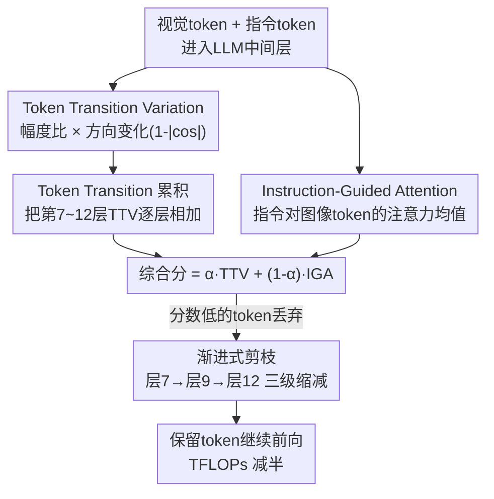

# TransPrune: Token Transition Pruning for Efficient Large Vision-Language Model

**会议**: CVPR 2026  
**论文**: [CVF Open Access](https://openaccess.thecvf.com/content/CVPR2026/html/Li_TransPrune_Token_Transition_Pruning_for_Efficient_Large_Vision-Language_Model_CVPR_2026_paper.html)  
**代码**: https://github.com/liaolea/TransPrune  
**领域**: 多模态VLM / 模型压缩  
**关键词**: 视觉token剪枝, 大视觉语言模型, token transition, 推理加速, 免训练

## 一句话总结
TransPrune 提出用「token 在模型内部传播时表示发生的变化」（token transition）来判断视觉 token 是否重要，组合两个互补信号——只看 token 自身幅度/方向变化的 TTV 和看指令对图像注意力的 IGA——做免训练的渐进式剪枝，在 LLaVA-1.5/Next、Qwen2.5-VL 上把推理 TFLOPs 砍掉一半还几乎不掉点。

## 研究背景与动机
**领域现状**：大视觉语言模型（LVLM）把图像编码成几百上千个视觉 token 喂给 LLM，这些 token 占了推理算力的大头。最直接的提速办法是 token 剪枝——只保留语义最丰富、和用户指令最相关的少数 token。现有方法分两类：projector-based（在进 LLM 前剪，如 VisionZip、DivPrune、CDPruner）和 within-LLM（在 LLM 内部逐层剪，如 FastV、PDrop、SparseVLM），但它们判断重要性几乎都靠两类准则——注意力分数或表示相似度。

**现有痛点**：注意力准则有两个老毛病。一是**位置偏置**（positional bias）：因为因果注意力的三角掩码，序列开头/结尾的 token 容易拿到虚高的注意力分，但对图像来说这些边缘位置往往语义稀薄；二是注意力会**过度关注视觉上显眼但语义无关的区域**。相似度准则则是把高度相似的 token 合并，本质上 task-agnostic，识别不出「对当前问题真正重要」的 token。

**核心矛盾**：判断 token 重要性时，大家都盯着 token 在某一层的**瞬时静态状态**（attention 值、相似度），而忽略了一个更本质的信号——token 表示在穿过各模块时**如何动态变化**。作者借用一个朴素观察：现实中一个实体的「动态演化」往往比它某一刻的静态快照更能反映其状态。

**本文目标**：找到一个不依赖注意力、能避开位置偏置、又能补上指令相关性的 token 重要性准则，并把它做成免训练、即插即用的剪枝方法。

**切入角度**：作者可视化了 LLaVA-1.5 各层里 token 表示在 self-attention 和 FFN 模块前后的幅度变化（输出/输入 L2 范数比）和方向变化（余弦相似度），发现这种「transition」确实和 token 语义重要性相关，而且在**中间层（约 6–14 层）最集中、最显著**——因为中间层正好处在浅层全局特征和深层局部特征之间，能融合两者，反映 LLM 在指令引导下从全局到局部的注意力转移。

**核心 idea**：用 token transition（表示变化）取代 attention/similarity 作为重要性准则，主信号 TTV 只看 token 自身的幅度+方向变化（天然无位置偏置），辅以 IGA 补回指令相关性，再用跨中间层的累积机制稳定信号，渐进式剪枝。

## 方法详解

### 整体框架
TransPrune 是一个 within-LLM、免训练的剪枝器，挂在 LLM 的若干中间层上。输入是图像编码后的视觉 token 序列 + 指令 token，输出是逐层缩减后的 token 序列。它在选定的几个**剪枝层**（论文用第 7、9、12 层）依次执行：先为每个视觉 token 算两个分数——TTV（token 自身 transition 变化，跨中间层累积得到）和 IGA（指令对该 token 的注意力），二者加权求和得到综合分，分数低的 token 被丢弃，幸存 token 继续往下传。这样视觉 token 数在第 7、9、12 层被三级递减地砍掉，把后续层的算力成本压下来。

### 关键设计

**1. Token Transition Variation（TTV）：用 token 自身的表示变化代替注意力打分，绕开位置偏置**

针对注意力准则的位置偏置痛点，TTV 完全不计算 token 之间的依赖，只看每个 token 流过一个模块前后自身怎么变。设模块 $F$（self-attention 或 FFN）把输入 $T_{in}$ 变成 $T_{out}=F(T_{in})$，定义幅度变化为输出/输入的 L2 范数比 $m(F,T_{in})=\|T_{out}\|_2 / \|T_{in}\|_2$，方向变化为两者余弦相似度 $d(F,T_{in})= (T_{out}\cdot T_{in}) / (\|T_{out}\|_2\|T_{in}\|_2)$。作者发现用 $1-|d|$（方向越正交、值越大）比直接用 $d$ 效果好，于是把它先在所有 token 上做 softmax 归一化，再乘以幅度变化，得到单层 TTV 分数：

$$\mathrm{TTV}(F, T_I) = \mathrm{Softmax}\big(1-|d(F, T_I)|\big)\cdot m(F, T_I).$$

一层的总 TTV 把 self-attention 和 FFN 两个模块的贡献相加：$\mathrm{TTV}_l(T_I)=\mathrm{TTV}(\text{Attention}, T_I)+\mathrm{TTV}(\text{FFN}, T_I)$。直觉是：幅度比大、方向偏转大（接近正交）的 token，说明模型正在对它做剧烈的语义重写，往往更重要。因为只算 token 自身的「自变换」、不碰三角掩码下的 token 间注意力，TTV 天然没有位置偏置——可视化里它均匀关注图像中央这种语义密集区，而注意力则偏爱首尾。

**2. Token Transition 累积机制：把多层 transition 加起来，弥补单层信号不稳**

TTV 虽然有效，但它的强度在不同层之间波动（见可视化），单看某一层往往不够准、不够稳。为此作者引入累积机制：定义累积层集合 $A=\{a_1,\dots,a_m\}$ 和其中的剪枝层集合 $P=\{p_1,\dots,p_k\}$，在每个剪枝层 $p_i$，把从第一个累积层到当前层为止所有层的 TTV 加起来作为该 token 的累积分数：

$$\mathrm{TTV}_{p_i}(T_I)=\sum_{l\in A,\, l\le p_i}\mathrm{TTV}_l(T_I).$$

这样每次剪枝决策都基于 token 的「transition 历史」而非某一层的快照，更可靠。论文把累积层定在第 7–12 层（中间层），剪枝在第 7、9、12 层进行。消融显示：用中间层（7–12）累积比用浅层（1–6）累积明显更好（MME 1540 vs 1515），因为中间层兼具全局与局部信息，最能反映 LLM 注意力的转移；而且加上累积比不加（w/o Accumulation）在几乎所有 benchmark 上都涨。

**3. Instruction-Guided Attention（IGA）：补回 TTV 缺失的指令相关性**

TTV 只看图像 token 自身的变化，完全不知道用户问的是什么，可能漏掉「对当前指令很关键」的 token（TTV-only 在 TextVQA 上掉得明显就是证据）。IGA 用最简单的方式补这块：取指令 token 的 query 和图像 token 的 key 算注意力矩阵 $A$，再对所有指令 token 求平均，得到每个图像 token 的指令注意力 $\mathrm{IGA}(T_I)=\frac{1}{L}\sum_{j=1}^{L}A_j$（$L$ 为指令长度）。值越高说明该 token 在当前指令下越相关。注意 IGA 只算「指令→图像」这一小块注意力（不是整张注意力图），所以仍兼容 FlashAttention，额外开销很小。

**4. TTV 与 IGA 的综合打分与渐进式剪枝：两个互补信号一加一减位置偏置**

最后把累积 TTV 和 IGA 加权融合成综合分，在每个剪枝层 $p_i$ 对图像 token 打分：

$$\mathrm{Score}_{p_i}(T_I)=\alpha\cdot \mathrm{TTV}_{p_i}(T_I)+(1-\alpha)\cdot \mathrm{IGA}_{p_{i+1}}(T_I),$$

其中 $\alpha\in[0,1]$ 平衡两者，论文取 $\alpha=0.5$ 让二者等权（消融里 0.5 最优）。综合分低的 token 被剪掉，累积机制只作用于 TTV、不用于 IGA。这一融合的妙处在于：TTV 无位置偏置但缺指令信息，IGA 有指令信息但带位置偏置，两者相加既补全了语义来源、又**部分抵消了位置偏置**。通过设置每个剪枝层保留不同 token 数，作者给出 High / Low 两档配置覆盖不同算力预算。

### 损失函数 / 训练策略
无训练。TransPrune 完全免训练、即插即用，仅在推理时插入打分与剪枝逻辑，不改模型权重，因此可直接套到 LLaVA-1.5/Next、Qwen2.5-VL、Video-LLaVA 等不同架构上。

## 实验关键数据

### 主实验
在 LLaVA-1.5-7B 上和其他 within-LLM 方法对比，TransPrune 在最低 TFLOPs 下拿到最好综合表现：

| 方法 | TFLOPs | Acc.(%) | MME_P | SQA_I | POPE | MMBench |
|------|--------|---------|-------|-------|------|---------|
| LLaVA-1.5-7B（上界） | 3.82 (100%) | 100.0 | 1506 | 69.5 | 85.9 | 64.6 |
| FastV (ECCV24) | 2.01 (52.6%) | 97.8 (-2.2) | 1474 | 68.5 | 84.0 | 64.2 |
| PDrop (CVPR25) | 1.78 (46.6%) | 98.8 (-1.2) | 1500 | 69.4 | 84.8 | 64.9 |
| SparseVLM (ICML25) | 1.57 (41.1%) | 98.8 (-1.2) | 1484 | 67.7 | 85.7 | 64.7 |
| **TransPrune-High** | **1.56 (40.8%)** | **100.0 (-0.0)** | **1540** | **69.5** | 85.0 | **66.0** |
| TransPrune-Low | 1.19 (31.2%) | 98.4 (-1.6) | 1491 | 68.7 | 85.1 | 65.6 |

TransPrune-High 用 ~41% 的算力把综合准确率拉回到与原模型几乎持平（-0.0），MME 甚至从 1506 涨到 1540。在更高分辨率的 LLaVA-Next-7B（8.33 TFLOPs / 40%，Acc -0.2）和异构架构 Qwen2.5-VL-7B（45.1% TFLOPs，POPE 反超原模型 87.5 vs 86.2）上也都成立，证明泛化性。

效率上，TransPrune 引入的额外开销（TTV 的范数/余弦计算 + IGA 的局部注意力）相对 baseline 是边际的，实测延迟和显存还更低：

| 方法 | 延迟(ms) | 显存(GB) | MME 准确率 |
|------|---------|---------|-----------|
| FastV | 125.2 | 14.99 | 1474 |
| PDrop | 115.2 | 14.87 | 1500 |
| SparseVLM | 129.1 | 19.05 | 1484 |
| **TransPrune** | **111.4** | **14.82** | **1540** |

### 消融实验
| 配置 | MME_P | SQA_I | GQA | MMBench | 说明 |
|------|-------|-------|-----|---------|------|
| Only IGA | 1514 | 69.0 | 61.1 | 65.6 | 仅指令注意力 |
| IGA + Direction | 1521 | 69.1 | 61.2 | 65.4 | 加方向变化 |
| IGA + Magnitude | 1532 | 69.4 | 61.4 | 65.7 | 加幅度变化（增益更大） |
| IGA + TTV（完整） | **1540** | **69.5** | 61.4 | **66.0** | 幅度+方向都加最优 |
| w/o Accumulation | 1530 | 69.2 | 61.4 | 65.7 | 去掉累积机制 |
| TTV 用浅层(1–6) | 1515 | 69.4 | 61.3 | 65.6 | 累积层选错 |
| TTV 用中层(7–12) | **1540** | 69.5 | 61.4 | **66.0** | 中间层最优 |

### 关键发现
- **幅度比方向更关键**：从 Only IGA 起逐项加，IGA+Magnitude（1532）的提升明显大于 IGA+Direction（1521），但两者合起来（TTV）才最优——说明幅度变化是 token transition 里更强的语义信号。
- **累积层必须选中间层**：中间层（7–12）累积 1540，浅层（1–6）只有 1515；进一步扫层组合，第 {7,9,12} 组在 MME 上 1540 全场最高，印证「中间层 transition 最能反映语义」的核心假设。
- **TTV 单独用也能打但缺指令性**：TTV-only 在多数 benchmark 上有竞争力，却在 TextVQA 上大跌（58.2→50.9），正是因为它不看指令；这反过来证明 IGA 的必要性。
- **位置偏置可视化**：IGA 保留的 token 频率明显偏向图像首尾，而 TTV 均匀聚焦图像中央语义密集区，二者结合能部分缓解位置偏置。
- **可与 projector-based 方法叠加**：和 VisionZip / CDPruner 组合后，在只保留 24 个 token 时 TFLOPs 降到 11.5%、性能几乎不掉（VisionZip+TransPrune Acc -0.0），证明 within-LLM 与 projector-based 是互补而非互斥。

## 亮点与洞察
- **换了个看 token 的「时间维度」**：以往都盯着 token 某一层的静态值（attention/similarity），TransPrune 改看它穿过模块时「变了多少、转了多少方向」，这个 transition 视角既新颖又有可视化证据支撑，是真正的「啊哈」点。
- **TTV 无位置偏置是结构性优势**：因为只算 token 自变换、不碰三角掩码，TTV 从机制上就避开了注意力的位置偏置，而不是靠后处理打补丁——这类「换准则绕开根因」的思路可迁移到其他依赖注意力的打分场景。
- **两个互补信号互相补盲区**：TTV 无偏置但不懂指令，IGA 懂指令但有偏置，简单加权就让两者各补其短，设计干净。
- **完全免训练 + 兼容 FlashAttention**：IGA 只取指令→图像的局部注意力而非全图，使方法在工程上仍可用 FlashAttention，落地友好。

## 局限与展望
- **TTV 的可解释性偏经验**：「幅度比大、方向越正交越重要」以及「用 $1-|d|$ 比 $d$ 好」主要靠可视化和实验观察支撑，缺乏更严格的理论解释，换模型/换模态时这个规律是否稳固存疑。
- **关键超参依赖人工选层**：累积层 7–12、剪枝层 7,9,12、$\alpha=0.5$ 都是在 LLaVA-1.5 上调出来的，论文也承认剪枝层由累积层决定、难独立分析；不同模型「中间层」的位置可能要重新搜索，缺自适应机制。
- **增益主要在效率而非性能上限**：方法目标是「省一半算力且几乎不掉点」，并不能让模型变更强；在 TextVQA 这类强指令依赖任务上，剪枝仍有可见损失。
- **可改进方向**：把选层做成可学习/自适应（按层的 transition 统计自动定累积窗口）、把 TTV 推广到视频时序冗余更严重的场景做更激进的剪枝。

## 相关工作与启发
- **vs FastV / PDrop / SparseVLM（within-LLM 注意力派）**：它们都用注意力分数选 token，受位置偏置困扰；TransPrune 用 token transition 作为主准则、注意力只作辅助 IGA，在更低 TFLOPs 下反超它们，且延迟/显存更优。
- **vs VisionZip / DivPrune / CDPruner（projector-based 相似度/多样性派）**：这些在进 LLM 前剪、靠相似度或多样性、task-agnostic；TransPrune 在 LLM 内部利用视觉编码器拿不到的层间信息，且能和它们叠加（VisionZip+TransPrune 把 token 压到 24 个、TFLOPs 11.5% 仍不掉点）。
- **vs 一般「静态重要性」打分**：本文最大的启发是把重要性判据从「瞬时状态」换成「动态变化」，这个把时间/过程维度引入打分的思路，对 KV cache 压缩、层跳过等其他效率方向都有借鉴意义。

## 评分
- 新颖性: ⭐⭐⭐⭐⭐ token transition 这个动态视角在 LVLM token 剪枝里确实新颖，且有可视化与消融双重支撑。
- 实验充分度: ⭐⭐⭐⭐⭐ 覆盖 3 种架构 + 视频模型、与多类 SOTA 对比、累积/选层/α/幅度方向多维消融、还测了延迟显存。
- 写作质量: ⭐⭐⭐⭐ 动机—观察—方法链条清晰，公式与图配合到位；个别符号（如 $p_{i+1}$ 的下标含义）需对照原图才好理解。
- 价值: ⭐⭐⭐⭐ 免训练、即插即用、可与现有方法叠加，算力减半且几乎不掉点，对 LVLM 推理部署有实用价值。

<!-- RELATED:START -->

## 相关论文

- [\[CVPR 2026\] VLM-Pruner: Buffering for Spatial Sparsity in an Efficient VLM Centrifugal Token Pruning Paradigm](vlm-pruner_buffering_for_spatial_sparsity_in_an_efficient_vlm_centrifugal_token_.md)
- [\[ACL 2026\] HiPrune: Hierarchical Attention for Efficient Token Pruning in Vision-Language Models](../../ACL2026/multimodal_vlm/hiprune_hierarchical_attention_for_efficient_token_pruning_in_vision-language_mo.md)
- [\[ICML 2026\] CLIP Tricks You: Training-free Token Pruning for Efficient Pixel Grounding in Large Vision-Language Models](../../ICML2026/multimodal_vlm/clip_tricks_you_training-free_token_pruning_for_efficient_pixel_grounding_in_lar.md)
- [\[CVPR 2026\] DocPrune: Efficient Document Question Answering via Background, Question, and Comprehension-aware Token Pruning](docpruneefficient_document_question_answering_via_background_question_and_compre.md)
- [\[CVPR 2026\] HAWK: Head Importance-Aware Visual Token Pruning in Multimodal Models](hawk_head_importance-aware_visual_token_pruning_in_multimodal_models.md)

<!-- RELATED:END -->
