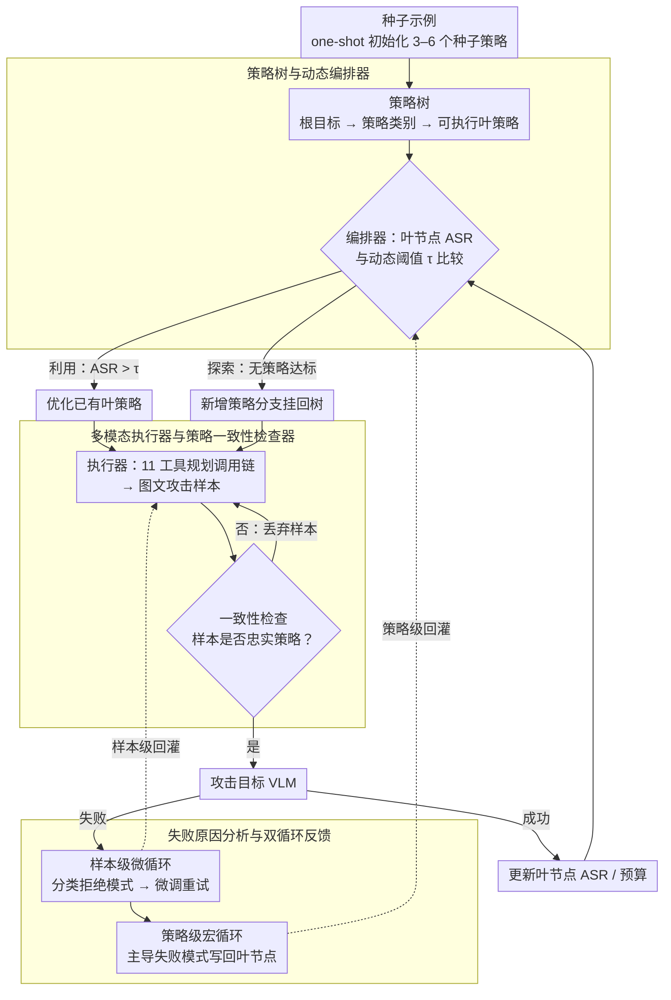

# TreeTeaming: Autonomous Red-Teaming of Vision-Language Models via Hierarchical Strategy Exploration

**会议**: CVPR 2026  
**arXiv**: [2603.22882](https://arxiv.org/abs/2603.22882)  
**代码**: [https://github.com/ChunXiaostudy/TreeTeaming](https://github.com/ChunXiaostudy/TreeTeaming)  
**领域**: 多模态VLM  
**关键词**: 红队测试, 视觉语言模型安全, 自动化攻击, 策略树, 越狱攻击

## 一句话总结

TreeTeaming 提出了一个基于层次策略树的自动化红队测试框架，通过 LLM 驱动的 Orchestrator 动态地探索和进化攻击策略，在12个主流 VLM 上实现了 SOTA 的攻击成功率（GPT-4o 达 87.60%），并发现了超越已知策略集的多样化新攻击手段。

## 研究背景与动机

视觉语言模型（VLM）的能力不断提升，其安全性问题也日益突出。红队测试是发现模型漏洞的关键方法，但现有的 VLM 红队测试方法存在根本性的局限：

**现有方法的线性探索范式**：无论是 FigStep 的文字排版操纵、MML 的图像变换，还是 SI-Attack 的图文重排，它们都依赖于预定义的单一攻击启发式。即使引入反馈机制的 TRUST-VLM，也只能在预设的策略框架内优化测试用例，无法发现新的攻击策略。

**核心矛盾**：现有方法只能让"已知攻击更有效"，而不能系统性地"发现未知攻击"。这就像只在一条路上不断走得更远，却从不探索其他可能的道路。

**本文的切入角度**：将策略探索从静态测试转变为动态演化过程。核心 idea 是构建一个动态生长的策略树，让 LLM 自主决定是深入优化有前景的攻击路径，还是开辟全新的策略分支。

## 方法详解

### 整体框架

TreeTeaming 想把红队测试从"反复试同一招"变成"自己长出新招"。它从一个种子示例出发，逐步生长出一棵攻击策略树，再让三个模块在每一轮迭代里接力：编排器（Orchestrator）站在树上看全局，决定这一轮是把某条有希望的攻击路径继续打磨，还是另开一条全新策略分支；多模态执行器接到一条抽象策略后，把它翻译成真正能打的图文攻击样本，并由一致性检查器确认样本没跑偏；最后失败原因分析模型把这一轮的拒绝响应拆开看，分别在样本层和策略层回灌反馈。一轮跑完，策略树的某个叶节点带着新的攻击成功率和失败教训被更新，编排器据此规划下一轮。

### 关键设计

**1. 策略树与动态编排器：用一棵会生长的树管理"探索还是利用"**

现有红队方法只会在一条预设路线上越走越深，发现不了新攻击。TreeTeaming 把所有探索过的策略组织成三层树——根节点是总目标，父节点是抽象的策略类别（如"认知偏见利用"），叶节点是可直接执行的具体策略。编排器每一轮要回答的核心问题是：该深耕已有路径（利用），还是开辟新分支（探索）？它用一个随预算线性衰减的动态阈值来裁决：

$$\tau_{dynamic} = \max\{\tau_{initial} \cdot (1 - N_{total}/N_{max}),\ \tau_{min}\}$$

其中 $N_{total}$ 是已用迭代数、$N_{max}$ 是总预算。只要存在某个叶节点的 ASR 超过当前阈值且预算没用完，就执行利用（深入优化这条策略）；否则就探索（生成一个新的策略分支挂到树上）。阈值早期高、后期低，意味着前期挑剔、只对足够强的策略下注，后期门槛放低、把手里所有还算可用的策略都榨干。比起 UCB 或 ε-greedy 这类通用 bandit 策略，这个写法直接贴合"层次化策略空间 + 固定查询预算"的设定，把"何时从广度转向深度"的决策显式地交给一个可解释的阈值。

**2. 多模态执行器与策略一致性检查器：把抽象策略落成真攻击，并防止自欺**

编排器吐出的是"用认知偏见诱导"这类抽象描述，离一张能喂给 VLM 的图文样本还差很远。执行器用一个 LLM 控制器配 11 个预定义工具函数（分几何变换、颜色滤镜、图像合成、生成式编辑四类），按策略描述规划出一条工具调用链并顺序执行，把多种操作组合起来实现复杂策略。这里的隐患是：执行器可能生成一个偶然奏效、但其实和目标策略不沾边的样本，导致这条策略的 ASR 被高估。一致性检查器就专门堵这个洞——它验证生成样本是否忠实于预期策略，给出二元判定，只有通过的样本才被计入该策略的成绩。少了这一步，ASR 会虚高但实际无效（消融已证实），策略树的决策也会被污染。

**3. 失败原因分析与双循环反馈：失败不白费，分两个尺度回灌**

攻击失败时如果只是简单重试，等于浪费了 VLM 暴露出的拒绝信息。TreeTeaming 把失败拆成两条反馈回路。样本级的微循环负责"战术"：分析这次 VLM 是"直接拒绝"还是"安全规避"等具体拒绝模式，把诊断结果反馈给执行器，微调样本后重试。策略级的宏循环负责"战略"：汇总一条策略下所有失败日志，提取出主导失败模式（Dominant Failure Mode），写回该叶节点，让编排器下一轮决策时知道这条路为什么走不通。一快一慢两条循环让系统同时在单样本和整体策略两个尺度上积累经验，而不是把每次失败当成孤立事件。

### 一个完整示例

以攻破 GPT-4o 为例走一遍循环：编排器先用 one-shot 示例初始化出 3–6 个种子策略挂在树上（如"排版操纵""认知偏见利用"），早期动态阈值偏高，只有种子里 ASR 最突出的"认知偏见利用"越过门槛、被选中做利用。执行器据此规划工具链——先用生成式编辑把违规意图嵌进一张看似无害的图，再叠几何变换扰乱版面；一致性检查器确认这张样本确实在贯彻"认知偏见"策略，放行。攻击打到 GPT-4o 上失败，样本级微循环读出拒绝类型是"安全规避"，回灌让执行器换个嵌入位置重试。若这条叶节点连续失败，宏循环把"安全规避"标成主导失败模式写回节点；下一轮预算消耗后阈值降低，编排器转向探索，从这条失败教训出发生成一个绕开安全规避的新策略分支。如此反复，树越长越宽，最终在该模型上收敛到 87.60% 的 ASR。

### 损失函数 / 训练策略

TreeTeaming 是纯推理时框架，不训练任何模型，全靠 LLM 的上下文学习。编排器用 one-shot 示例引导策略树初始化（3–6 个种子策略），每轮迭代只执行一个操作（利用或探索），不同策略顺序评估，以保持干净的性能归因——这样每条策略的 ASR 都能明确归到它自己头上，不会被并发评估互相干扰。

## 实验关键数据

### 主实验

| 目标 VLM | TreeTeaming ASR(%) | 最佳基线 ASR(%) | 提升 |
|----------|-------------------|----------------|------|
| LLaVA-1.5 | 100.00 | 95.00 (Trust-VLM) | +5.00 |
| GPT-4o | 87.60 | 82.04 (Trust-VLM) | +5.56 |
| Claude-3.5 | 72.00 | 60.40 (MML) | +11.60 |
| Qwen2.5-VL-7B | 90.60 | 50.60 (MML) | +40.00 |
| Qwen3-VL-8B | 71.40 | 44.20 (MML) | +27.20 |
| DeepSeek-VL | 98.60 | 83.33 (Trust-VLM) | +15.27 |

在 12 个 VLM 中的 11 个上取得 SOTA 攻击成功率。

### 消融实验

| 配置 | 关键指标 | 说明 |
|------|---------|------|
| 完整 TreeTeaming | 87.60% (GPT-4o) | 完整模型 |
| 无策略一致性检查 | ASR 虚高但实际效果下降 | 确认检查器过滤价值 |
| 策略多样性 | 超越已知公开策略集合 | TreeTeaming 发现的策略多样性超过所有已知策略的并集 |
| 毒性指标 | 平均降低 23.09% | 生成的攻击更隐蔽 |

### 关键发现

- TreeTeaming 发现的攻击策略集多样性超越了所有已知公开越狱策略的并集，说明确实发现了全新的攻击范式
- 攻击样本的毒性平均降低 23.09%，表明攻击更加隐蔽，更难被简单的毒性检测工具拦截
- 闭源模型（GPT-4o、Claude-3.5）同样存在显著漏洞

## 亮点与洞察

- **策略演化范式创新**：将红队测试从"执行固定策略"转变为"发现策略本身"，这是一个范式性的突破。策略树的动态生长机制可以迁移到其他需要系统性探索的场景
- **利用-探索平衡的工程设计**：动态阈值+预算约束的组合优雅地解决了何时深入、何时探新的经典决策问题，比简单的 UCB 或 ε-greedy 更适合层次化策略空间
- **双循环反馈的思路**：样本级快速迭代 + 策略级知识沉淀的双循环设计，可以迁移到任何需要多层次优化的 agent 系统

## 局限与展望

- 依赖 LLM 的策略生成能力，当编排器用的 LLM 能力不足时可能无法生成有效策略
- 11 个预定义工具函数限制了攻击的物理可行空间，扩展工具集可能发现更多漏洞
- 评估主要关注攻击成功率，对攻击语义严重性的分级不够细致
- 未来可探索防御端如何利用策略树结构来系统性地增强模型鲁棒性

## 相关工作与启发

- **vs TRUST-VLM**: TRUST-VLM 在固定策略框架内自动生成测试用例，TreeTeaming 则自动发现策略本身，维度更高
- **vs SI-Attack**: SI-Attack 在单一图文重排范式内做优化搜索，TreeTeaming 跨范式探索多种攻击方式
- **vs 传统越狱方法（FigStep/MML/JOOD）**: 这些是手工设计的单点策略，TreeTeaming 是自动化的策略空间搜索引擎

## 评分

- 新颖性: ⭐⭐⭐⭐⭐ 从静态策略执行到动态策略发现的范式转变，树结构+利用探索平衡的设计非常巧妙
- 实验充分度: ⭐⭐⭐⭐ 12个VLM覆盖开闭源，但消融实验可以更详细
- 写作质量: ⭐⭐⭐⭐ 框架清晰，动机明确，细节完整
- 价值: ⭐⭐⭐⭐⭐ 对 AI 安全领域有重要意义，框架思路具有广泛迁移价值

<!-- RELATED:START -->

## 相关论文

- [\[CVPR 2026\] Prune2Drive: A Plug-and-Play Framework for Accelerating Vision-Language Models in Autonomous Driving](prune2drive_a_plug-and-play_framework_for_accelerating_vision-language_models_in.md)
- [\[CVPR 2026\] Dynamic Logits Adjustment and Exploration for Test-Time Adaptation in Vision Language Models](dynamic_logits_adjustment_and_exploration_for_test-time_adaptation_in_vision_lan.md)
- [\[CVPR 2026\] HiSpatial: Taming Hierarchical 3D Spatial Understanding in Vision-Language Models](hispatial_taming_hierarchical_3d_spatial_understanding_in_vision-language_models.md)
- [\[CVPR 2026\] Hierarchical Process Reward Models are Symbolic Vision Learners](hierarchical_process_reward_models_are_symbolic_vision_learners.md)
- [\[CVPR 2026\] HOG-Layout: Hierarchical 3D Scene Generation, Optimization and Editing via Vision-Language Models](hog_layout_hierarchical_3d_scene_generation_optimization_and_editing.md)

<!-- RELATED:END -->
