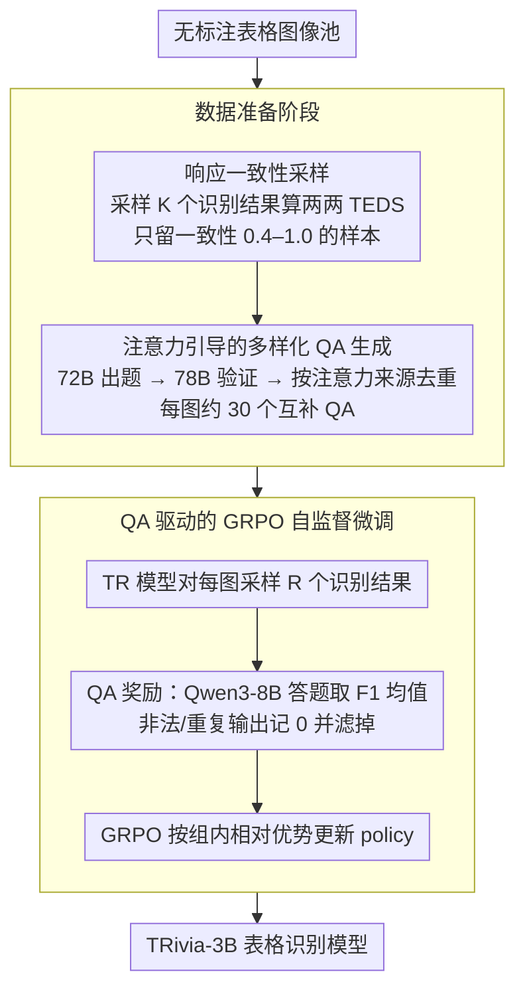

# TRivia: Self-supervised Fine-tuning of Vision-Language Models for Table Recognition

**会议**: CVPR 2026  
**arXiv**: [2512.01248](https://arxiv.org/abs/2512.01248)  
**代码**: [https://github.com/HKU-TASR/TRivia](https://github.com/HKU-TASR/TRivia)  
**领域**: 多模态VLM  
**关键词**: 表格识别, 自监督微调, GRPO, 视觉语言模型, 强化学习

## 一句话总结
提出 TRivia 自监督微调框架，通过表格问答（QA）驱动的 GRPO 强化学习，让 VLM 直接从无标注表格图像中学习表格识别能力，3B 参数的 TRivia-3B 在多个基准上超越 Gemini 2.5 Pro 和 GPT-5 等私有模型。

## 研究背景与动机

**领域现状**：表格识别（Table Recognition, TR）旨在将表格图像转换为 HTML 或 Markdown 等半结构化表示。近年 VLM 的发展让 TR 性能大幅提升，私有模型如 Gemini 2.5 Pro 已展现出强大的 TR 能力。开源 VLM 则受限于标注数据规模，仍明显落后。

**现有痛点**：TR 数据获取面临三难困境——(1) 合成数据可扩展但缺乏真实视觉多样性；(2) 真实数据标注昂贵耗时；(3) 从私有模型蒸馏伪标签不仅成本高，还受限于教师模型的性能天花板且可能违反服务协议。MinerU2.5 即使用了百万级样本、人工标注加 Gemini 蒸馏，仍无法超越教师模型。

**核心矛盾**：开源 TR 模型标注数据受限且天花板由教师模型决定——标注数据 vs 性能的瓶颈。而海量无标注表格图像唾手可得却无法直接利用。

**本文目标** (1) 如何从无标注表格图像中提取有效监督信号；(2) 如何筛选最具训练价值的样本；(3) 如何生成多样且可验证的 QA 对作为奖励信号。

**切入角度**：QA 是 TR 的下游任务——如果模型能正确回答关于表格的问题，就隐含表明它对表格结构和内容的识别是准确的。这比直接预测 HTML 标注容易得多，且 QA 对的正确性可通过交叉验证核实。

**核心 idea**：用"能否正确回答表格问题"作为 proxy reward，通过 GRPO 让 VLM 从无标注表格图像中自监督学习表格识别。

## 方法详解

### 整体框架
TRivia 分为两个阶段：(1) **数据准备阶段**——先用「响应一致性采样」从海量无标注表格图像里挑出最有训练价值的样本，再用「注意力引导的 QA 生成」为每张图自动产出一组覆盖全表的可验证 QA 对；(2) **训练阶段**——用 GRPO 强化学习，以"模型识别结果能否答对这些 QA"作为奖励来微调 VLM，全程不碰人工标注。这一 RL 阶段本身位于整体三段式训练的最后一环：OTSL 暖身（700K 合成数据）→ 监督微调（50K 真实数据）→ TRivia 自监督 RL（50K 无标注数据）。

### 关键设计

**1. 响应一致性采样（Response-Consistency Sampling）：用模型自己的"拿不准"来挑最该练的样本**

无标注表格图像唾手可得，但并非每张都值得训练——聚类那套只会衡量样本之间多不多样，量不出"对当前这个模型有没有训练价值"，人工筛又没法扩展。TRivia 直接拿 GRPO 的脾性来反推：GRPO 受益于一组多样化的响应，那模型对哪些图最拿不准、采样出来最五花八门，哪些图就最该拿去练。具体做法是对一张图先让 TR 模型生成 $K$ 个识别结果，算两两之间 TEDS（Tree Edit Distance-based Similarity）的平均，当作一致性得分：

$$\text{Consistency}(I) = \frac{2}{K^2-K}\sum_{i<j}\text{TEDS}(o_i, o_j)$$

得分越低代表模型越不确定、该样本越有价值。但太低又往往是垃圾图，所以实操上把一致性低于 0.4 的噪声样本滤掉，只在 0.4–1.0 区间均匀采样——既避开模型已经会的简单表，也避开纯噪声。

**2. 注意力引导的多样化 QA 生成（Attention-Guided QA Generation）：让一组 QA 真正铺满整张表，而不是反复问同一块**

QA reward 好不好用，取决于这组问题有没有覆盖全表。单次生成往往只盯着表格的一部分，多采几次又容易出同义改写——问来问去还是那几格。TRivia 的巧思是借 VLM 答题时的注意力来给每个 QA 标"视觉来源"：生成某个答案时哪些 visual token 被高度关注，那块区域就是这个 QA 的依据，

$$VS\big((q,a)\big) = \{\, v \mid \mathcal{A}(v\mid a) > \tau_\mathcal{A}\,\}$$

有了视觉来源，覆盖度就能量化。整个流程分三步：先用 Qwen2.5-VL-72B 多次采样攒一个候选 QA 池；再用 InternVL3-78B 交叉验证每个 QA——要求"有图能答、遮图答不出"，把那些不靠看表也能蒙对的问题剔掉，保证问题真和视觉绑定；最后贪心地挑视觉来源 IOU 最小的一批 QA，逼它们落在不同区域，每张图最终留下约 30 个互补的 QA 对。

**3. QA 驱动的 GRPO 自监督微调：把"答对表格问题"当成可验证的奖励信号**

直接预测 HTML 标注的麻烦在于难验证——一份输出里既有内容又有 colspan/rowspan 这类结构，对错没法自动判定，所以才离不开人工标注或教师蒸馏。TRivia 换了个角度：如果模型真的认对了表格，那它生成的识别结果应该能正确回答关于这张表的问题。于是对每张表格图像，TR 模型（policy）先采样出 $R$ 个识别结果 $\{o_j\}$，把每个结果连同前面准备好的 QA 对喂给一个 LLM（Qwen3-8B）去答题，再用回答的 F1 均值当奖励：

$$\text{Reward}(o_j) = \frac{1}{|QA|}\sum_{(q,a)} F1\big(M_{LLM}(q;o_j),\, a\big)$$

GRPO 拿这 $R$ 个结果的组内奖励相对差异去更新 policy，逐步逼到"识别得最准"的那种输出。QA 的对错可以靠交叉验证自动核实，这条链路就完全绕开了人工标注。这里还埋了一个稳定性细节——illegal-sample filtering：无效或重复的输出奖励恒为 0，如果不剔除，一组里全是 0 会把奖励分布压平、让 GRPO 的相对优势失效，所以训练时直接把这些样本滤掉。

### 一个完整示例：一张表格图怎么走完一轮

拿一张无标注的财报表格图来串一遍。**采样阶段**先让 TR 模型生成 $K$ 个识别结果，假设它们彼此 TEDS 平均只有 0.6——一致性偏低、模型对这张表拿不准，落在 0.4–1.0 区间内，于是被选进训练池（若低于 0.4 会被当噪声丢掉）。**出题阶段**用 72B 模型对这张图狂采一批问题（"第二季度营收是多少？""毛利率那一列共几行？"…），78B 验证后扔掉遮图也能猜的，再按注意力来源贪心去重，留下约 30 个铺满表头、数值区、合计行的 QA。**训练阶段**TR 模型对这张图采样 $R$ 个识别结果，逐个让 Qwen3-8B 拿这 30 个问题作答：识别准确的那份结果答对的多、F1 高，识别错位串行的那份答错的多、F1 低；非法/重复输出 reward 记 0 被滤掉。GRPO 看着这组高低分差，把 policy 往"高 F1 那种输出"推一步——全程没有用到任何一格人工标注的 ground-truth HTML。

### 损失函数 / 训练策略
三阶段训练：Stage 1 用 700K 合成+公开数据做 OTSL 格式暖身（冻结视觉编码器）；Stage 2 用 50K 真实表格做全参数监督微调；Stage 3 用 TRivia 框架在 50K 无标注数据上做 GRPO RL 微调。

## 实验关键数据

### 主实验

| 模型 | OmniDocBench TEDS | CC-OCR TEDS | OCRBench TEDS | Overall TEDS |
|------|-------------------|-------------|---------------|--------------|
| UniTable | 82.76 | 57.84 | 67.73 | 70.86 |
| Qwen2.5-VL-72B | 87.85 | 81.22 | 81.33 | 83.52 |
| Gemini 2.5 Pro | 90.90 | **85.56** | 88.94 | 88.93 |
| GPT-5 | 84.91 | 63.25 | 79.91 | 78.30 |
| MinerU2.5 | 90.85 | 79.76 | 87.13 | 86.82 |
| PaddleOCR-VL | 91.12 | 79.62 | 79.29 | 83.36 |
| **TRivia-3B** | **91.60** | 84.90 | **90.76** | **89.88** |

### 消融实验

| 配置 | OmniDocBench | CC-OCR | OCRBench | Overall | 说明 |
|------|-------------|--------|----------|---------|------|
| Stage-2 (SFT baseline) | 90.08 | 82.48 | 90.08 | 88.57 | 有监督微调天花板 |
| + 72B 伪标签 SFT | 84.41 | 70.54 | 80.87 | 80.02 | 伪标签质量差，性能暴跌 -8.55 |
| + 72B 伪标签 GRPO | 86.19 | 78.12 | 84.16 | 83.65 | GRPO 缓解但仍跌 -4.92 |
| TRivia-3B | 91.60 | 84.90 | 90.76 | 89.88 | QA reward 突破监督天花板 +1.31 |
| w/o Attention-guided QA | - | - | - | 显著下降 | 复杂表格尤其脆弱 |
| w/o Response-consistency | - | - | - | TEDS 52→63.5 | 随机采样收敛慢 |
| w/o Illegal filtering | - | - | - | 训练不稳定 | 收敛步数增加 25%，最终性能 -3 TEDS |

### 关键发现
- **QA proxy reward 突破了监督学习天花板**：TRivia-3B（89.88 TEDS）超越 Stage-2 监督极限（88.57），提升 1.31 个 TEDS。而用同一教师模型（72B）直接生成伪标签反而暴跌 8+ TEDS
- **3B 参数碾压 72B+ 私有模型**：TRivia-3B 以 3B 参数超越 Gemini 2.5 Pro（>千亿参数）和 GPT-5，证明自监督 RL 可弥补参数规模差距
- **Response-consistency sampling 加速收敛**：相比随机采样，TEDS 从 52 提升到 63.5（同等训练步数），关键是选到了对当前模型最有挑战性的样本
- **Illegal-sample filtering 对训练稳定性至关重要**：不过滤非法输出导致训练后期严重震荡，过滤后收敛步数减少 25%
- 作为数据标注器：TRivia-3B 生成的伪标签用于 SFT 蒸馏，可获得 89.99 TEDS，几乎等于 TRivia-3B 本身

## 亮点与洞察
- **QA 作为 proxy supervision 的精妙设计**：避开了直接预测难以验证的 HTML 标注，转而用下游任务（QA）的正确性作为间接监督。这个思路可推广到其他结构化输出任务——只要能设计出下游验证任务，就能实现自监督 RL。
- **注意力分布的创造性利用**：用 VLM 生成答案时的注意力分布来定位 QA 的视觉来源，实现了无需额外标注的空间 grounding，解决了 QA 多样性问题。
- **突破教师模型天花板**：传统蒸馏受限于教师模型质量，而 TRivia 通过 RL 绕过了这个限制——不直接使用教师的输出作为标签，而是仅让教师生成 QA 对作为验证工具，学生模型可超越教师。

## 局限与展望
- 当前仅针对**表格识别**验证，扩展到其他文档解析任务（图表、公式、布局）需要重新设计 QA proxy
- Response-consistency sampling 在离线阶段执行，训练过程中模型能力变化后可能采样分布不再最优——在线更新可能进一步提升
- 依赖多个外部模型（Qwen2.5-VL-72B 生成 QA、InternVL3-78B 验证、Qwen3-8B 答题），部署复杂度高
- 仅在 OTSL 格式上验证，对 Markdown/HTML 等更通用格式的适用性未验证
- PubTabNet 上的 S-TEDS 略低于专用 expert 模型，说明对特定领域数据的过拟合仍有价值

## 相关工作与启发
- **vs MinerU2.5**：大规模人工标注+Gemini 蒸馏，性能受限于教师模型天花板（86.82 TEDS）。TRivia 用 RL 突破天花板达 89.88，且无需人工标注。
- **vs UniTable**：传统 image-to-markup 方法，受限于分辨率和上下文窗口（448×448, 512 tokens），复杂表格上性能差。TRivia 基于 Qwen2.5-VL 架构支持更高分辨率。
- **vs DeepSeek-R1 的 GRPO 应用**：DeepSeek-R1 将 GRPO 用于 LLM 推理增强，TRivia 将其迁移到视觉文档理解领域，验证了 GRPO 在视觉任务的有效性。

## 评分
- 新颖性: ⭐⭐⭐⭐⭐ 自监督 RL 突破标注数据天花板的范式非常新颖，QA proxy reward 设计精巧
- 实验充分度: ⭐⭐⭐⭐⭐ 四个基准、12 个 baseline、全面消融，还验证了作为标注器的泛化能力
- 写作质量: ⭐⭐⭐⭐ 方法描述清晰，但整体篇幅较长，部分内容可精简
- 价值: ⭐⭐⭐⭐⭐ 3B 模型超越 Gemini 2.5 Pro，为开源 TR 指明自监督 RL 方向，实用价值极高

<!-- RELATED:START -->

## 相关论文

- [\[ICLR 2026\] Breaking the Limits of Open-Weight CLIP: An Optimization Framework for Self-supervised Fine-tuning of CLIP](../../ICLR2026/multimodal_vlm/breaking_the_limits_of_open-weight_clip_an_optimization_framework_for_self-super.md)
- [\[CVPR 2026\] MoE-GRPO: Optimizing Mixture-of-Experts via Reinforcement Learning in Vision-Language Models](moe-grpo_optimizing_mixture-of-experts_via_reinforcement_learning_in_vision-lang.md)
- [\[CVPR 2026\] MUPO: All Roads Lead to Rome - Incentivizing Divergent Thinking in Vision-Language Models](mupo_all_roads_lead_to_rome_incentivizing_divergent_thinking_in_vlms.md)
- [\[CVPR 2026\] AGFT: Alignment-Guided Fine-Tuning for Zero-Shot Adversarial Robustness of Vision-Language Models](agft_alignment-guided_fine-tuning_for_zero-shot_adversarial_robustness_of_vision.md)
- [\[CVPR 2026\] CropVLM: Learning to Zoom for Fine-Grained Vision-Language Perception](cropvlm_learning_to_zoom_for_fine_grained_vision_language_perception.md)

<!-- RELATED:END -->
