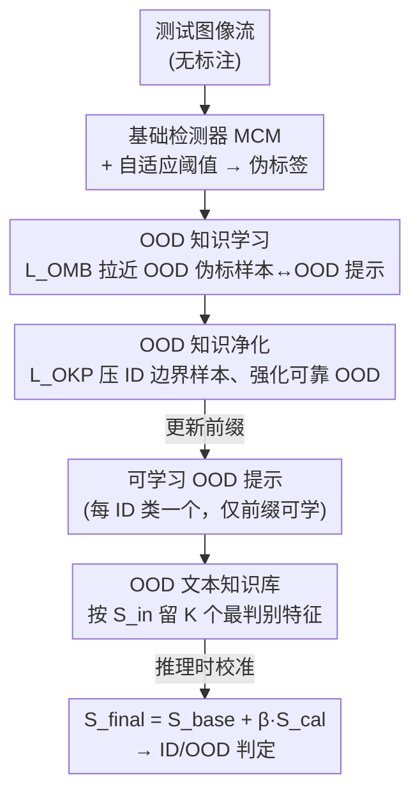

# TTL: Test-time Textual Learning for OOD Detection with Pretrained Vision-Language Models

**会议**: CVPR 2026  
**arXiv**: [2604.15756](https://arxiv.org/abs/2604.15756)  
**代码**: https://github.com/figec/TTL (有)  
**领域**: 多模态VLM / OOD检测 / 测试时适应  
**关键词**: OOD检测, CLIP, 测试时适应, 提示学习, 伪标签净化

## 一句话总结
针对现有 CLIP OOD 检测依赖"固定外部 OOD 标签"无法覆盖开放世界的痛点，TTL 在测试流上**只更新一组可学习的 OOD 文本提示**，用伪标签放大 OOD 相似度、用净化损失剔除 ID 边界样本噪声、再用一个文本知识库做跨批次分数校准，在两大基准九个 OOD 数据集上把平均 FPR95 降了 12.67%、AUROC 提了 3.94%。

## 研究背景与动机
**领域现状**：CLIP 这类视觉-语言模型靠图文对齐天然适合 OOD 检测——给定 ID 类名模板（"a photo of a {class}"）编码成文本特征，用图文余弦相似度算 OOD 分数（MCM 等）。为提升性能，一类方法引入**外部 OOD 知识**：从大规模语料挖潜在 OOD 标签（Neglabel、CSP）、学负提示（CLIPN）；另一类做**测试时适应（TTA）**，让模型在线适配真实 OOD 分布。

**现有痛点**：外部 OOD 标签是**有限且固定**的，而真实世界的 OOD 语义空间是**开放、无限、不断演化**的，固定标签无法表征测试流里多样且漂移的 OOD 语义。当前最强的 TTA 方法 AdaNeg 虽然引入了文本模态，但它做的是"把固定外部标签去和实际测试分布对齐"——一旦测试样本落在这些预定义语义范围之外（如 Figure 1c 所示），就无能为力。而更朴素的在线更新参数的方法（AdaND 等）又容易灾难性遗忘、检测性能不稳。

**核心矛盾**：固定的文本语义空间 ↔ 开放无限的真实 OOD 分布。现有方法都在"固定文本空间里调视觉特征"，文本侧的适应潜力没被真正挖掘。

**本文目标**：能不能**直接从测试流里学 OOD 文本语义**（而不是把已有标签往 OOD 分布上凑），从而摆脱对外部 OOD 标签的依赖？

**切入角度**：受提示学习（CoOp）启发——微调提示能让文本特征更好地贴合实际数据分布。作者把这个思路第一次搬到测试时 OOD 检测：为每个 ID 类配一个**可学习的 OOD 提示**，在线学出"贴近真实 OOD、且和 ID 拉开距离"的文本表征。

**核心 idea**：用一组在测试流上动态学习并净化的 OOD 文本提示，替代固定外部 OOD 标签，实现无需预定义 OOD 类别的测试时 OOD 检测。

## 方法详解

### 整体框架
TTL 输入是无标注的测试图像流，输出是每个样本的 ID/OOD 判定分数；CLIP 的图像/文本编码器、ID 提示、OOD 提示里的类名部分全部冻结，**唯一被更新的是 N 个可学习 OOD 提示的前缀**（"a photo of a"那部分），每个 ID 类对应一个 OOD 提示。

整条流程分两个阶段。**适应阶段**：基础检测器（MCM）先给每个测试样本打分并按自适应阈值产出 ID/OOD 伪标签；**OOD 知识学习**用这些伪标签优化 OOD 提示，把带 OOD 伪标签的图像往 OOD 提示上拉；但伪标签必有噪声，**OOD 知识净化**进一步把"被误判成 OOD 的 ID 边界样本"和"可靠 OOD 样本"区分开，压住前者、强化后者；学好的高质量 OOD 文本特征被收进**OOD 文本知识库**做跨批次积累。**推理阶段**：知识库被用来对基础检测器的分数做**校准**，得到最终 OOD 分数。

### 关键设计

**1. 可学习 OOD 提示 + OMB 损失：让文本侧自己长出 OOD 语义**

针对"固定外部标签覆盖不了开放 OOD"的痛点，TTL 为每个 ID 类 $c$ 引入一个可学习 OOD 提示 $u^{ood}_i$，用和 ID 提示相同的手工模板初始化（继承 CLIP 的先验语义），但**只放开前缀、冻住类名和编码器**，从而在保留泛化能力的同时把文本特征往真实 OOD 分布上挪。给定测试样本 $x$，OOD 概率定义为 OOD 提示相似度占 ID+OOD 总相似度的比例：

$$p(x) = \frac{\sum_{k=1}^{N} s(x, t^{ood}_k)}{\sum_{j=1}^{N} s(x, t^{id}_j) + \sum_{j=1}^{N} s(x, t^{ood}_j)}, \quad s(x,t)=\exp(\cos(f(x),t)/\tau)$$

优化用**OOD-focused minority-balanced 损失** $L_{OMB}$：对伪标签为 ID 的样本压低 $p(x)$、为 OOD 的样本抬高 $p(x)$，并用伪标签里 ID/OOD 的比例 $\pi^+,\pi^-$ 做归一化，缓解测试流中 ID/OOD 数量失衡：

$$L_{OMB} = -\frac{1}{\pi^+}\sum_{i:\hat y_i=1}\log(1-p(x_i)) - \frac{1}{\pi^-}\sum_{j:\hat y_j=0}\log p(x_j)$$

这一步的本质是放大"带 OOD 伪标签的图像特征"和"可学习 OOD 提示文本特征"之间的余弦相似度，让 OOD 提示在线吸收测试流里涌现的 OOD 知识——这是 TTL 区别于所有"在固定文本空间里调视觉"方法的根本点。

**2. OOD 知识净化（OKP）：把混进来的 ID 边界样本踢出去**

伪标签必然有噪声，被误判成 OOD 的其实是**ID 边界样本**，它们会把 OOD 提示往 ID 语义上带偏，而且随着批次累积、这种偏置会被逐步放大；现有 TTA 方法直接拿基础检测器结果更新、根本没处理这种噪声。OKP 的做法是：在每个批次内先收集伪标签 OOD 集合，再**用它们的 OOD 概率 $p(x)$ 作为分数、套用同一套最小化类内方差的自适应阈值 $\theta$**，把集合切成高置信子集 $S_h=\{i\mid p(x_i)>\theta\}$ 和低置信子集 $S_\ell=\{j\mid p(x_j)\le\theta\}$（后者就是 ID 边界样本）。净化损失同时拉高 $S_h$、压低 $S_\ell$ 的 OOD 概率：

$$L_{OKP} = -\Big(\frac{1}{|S_h|}\sum_{i\in S_h}p(x_i) - \frac{1}{|S_\ell|}\sum_{j\in S_\ell}p(x_j)\Big)$$

效果是 ID 边界样本和 OOD 提示的相似度被拉低、高置信 OOD 样本的相似度被进一步拉高，OOD 提示因此学到"更干净"的 OOD 知识。总目标为 $L = L_{OMB} + \alpha\cdot L_{OKP}$，$\alpha$ 平衡"学新 OOD 语义"和"抑制噪声"。消融里它带来约 +1.03% 平均 AUROC，是稳健性的关键。

**3. OOD 文本知识库（OKB）+ 分数校准：跨批次稳住检测**

单批次优化出的提示只抓到局部语义，对后续批次的分布漂移不稳。OKB 用一个**固定容量 $K$** 的库累积跨批次的高质量 OOD 文本特征，既防遗忘又扩大语义覆盖。库的更新靠一个"潜在 OOD 分数"——某个 OOD 文本特征到**所有 ID 提示文本特征的最小距离**：

$$S_{in}(t^{ood}_i) = \min_c \big(-\cos(t^{id}_c, t^{ood}_i)\big)$$

库满时只保留分数最高的 $K$ 个，即留下"离 ID 最远、最判别"的 OOD 提示。推理时，对图像特征 $z$ 用库内特征算校准分 $S_{cal}(x) = -\max_{j\in\{1..K\}}\cos(z, t^{ood}_j)$，再融进基础检测器：

$$S_{final}(x) = S_{base}(x) + \beta\cdot S_{cal}(x)$$

$\beta$ 很小（ImageNet 0.0005、CIFAR 0.006），因为校准分和基础分量级不同。校准后 OOD 样本的最终分被有效压低，ID/OOD 分布的重叠率从 24.67% 降到 2.76%（Figure 3）。

### 损失函数 / 训练策略
- 总损失 $L = L_{OMB} + \alpha L_{OKP}$，$\alpha=0.5$。
- 骨干 CLIP ViT-B/16，基础检测器 MCM；只优化 OOD 提示前缀，AdamW，学习率 0.005。
- OKB 容量 $K=2048$，批大小 $B=64$，融合系数 $\beta$：ImageNet 0.0005 / CIFAR-100 0.006。

## 实验关键数据

### 主实验
ImageNet-1k 基准（ID=ImageNet，OOD=iNaturalist/SUN/Places/Texture），平均结果：

| 方法 | 类型 | FPR95↓ | AUROC↑ |
|------|------|--------|--------|
| MCM | post-hoc | 42.77 | 90.76 |
| CSP（用外部标签） | post-hoc | 17.51 | 95.76 |
| MoFE | 训练型（最强） | 20.02 | 94.89 |
| OODD | TTA | 23.64 | 94.09 |
| AdaNeg（用外部标签） | TTA | 19.22 | 96.17 |
| **TTL（本文）** | TTA | **12.46** | **97.29** |

不用任何外部 OOD 标签的情况下，TTL 平均 FPR95=12.46、AUROC=97.29，比次优 AdaNeg 还低 6.76% FPR95，比最强训练型 MoFE 低 7.56% FPR95。

CIFAR-100 基准（六个 OOD 数据集）平均：

| 方法 | FPR95↓ | AUROC↑ |
|------|--------|--------|
| AdaND | 20.95 | 92.50 |
| AdaNeg | 40.52 | 88.97 |
| FA | 36.11 | 92.43 |
| **TTL（本文）** | **2.36** | **99.26** |

在其它 TTA 方法集体失效的 Places365 上，TTL 的 AUROC 比它们高约 19.9%。

### 消融实验
三组件逐项叠加（左 ImageNet-1k / 右 CIFAR-100，FPR95 / AUROC）：

| L_OMB | L_OKP | OKB | ImageNet FPR95 | ImageNet AUROC | CIFAR FPR95 | CIFAR AUROC |
|:---:|:---:|:---:|---|---|---|---|
| ✗ | ✗ | ✗ | 42.77 | 90.76 | 73.09 | 81.40 |
| ✓ | ✗ | ✗ | 30.56 | 92.54 | 14.40 | 96.25 |
| ✓ | ✓ | ✗ | 24.59 | 93.95 | 4.14 | 98.71 |
| ✓ | ✗ | ✓ | 18.40 | 95.63 | 5.23 | 98.86 |
| ✓ | ✓ | ✓ | **12.46** | **97.29** | **2.36** | **99.26** |

OKB 更新策略对比（本文 vs 随机/FIFO/全存）：

| 策略 | ImageNet FPR95 | ImageNet AUROC | CIFAR FPR95 | CIFAR AUROC |
|------|---|---|---|---|
| RAND | 27.29 | 93.07 | 29.06 | 87.07 |
| FIFO | 14.69 | 96.40 | 8.15 | 98.78 |
| SA（全存） | 23.19 | 94.27 | 27.33 | 88.04 |
| **本文（留最判别 K 个）** | **12.46** | **97.29** | **2.36** | **99.26** |

### 关键发现
- **三组件缺一不可，且互补**：只有 $L_{OMB}$ 时 ImageNet 已从 42.77→30.56 FPR95；加 OKB 或加 OKP 各自再降一截；三者全开才到 12.46。OKP 单独贡献约 +1.03% 平均 AUROC，说明显式处理伪标签噪声对稳健性是关键。
- **OKB 更新策略很重要**：按"离 ID 文本最远"的判别度留 K 个，明显优于随机替换、FIFO、无限全存——后两者会把噪声/冗余 OOD 特征也留下来。
- **对基础检测器不敏感**：换 GL-MCM/Neglabel/LoCoOp/FA 当 base 都能涨，配 FA 时达 5.88% FPR95 / 98.76% AUROC。
- **初始化用类名+手工模板最好**：用 ID 类名初始化 OOD 提示的冻结部分，能引导探索"贴近 ID 语义边界"的 OOD 知识；CIFAR 上从随机初始化的 45.23 FPR95 直接降到 2.36。
- 对 $K\in[2^8,2^{14}]$、$\beta$、$\alpha\in[0.2,1.0]$、$B\in[2^3,2^9]$ 都不敏感，全程超过最强基线。

## 亮点与洞察
- **把适应从"视觉侧"搬到"文本侧"**：以往 TTA 都在固定文本空间里调视觉特征或存视觉库，TTL 反过来——冻住视觉、在线学文本提示，第一次把测试时提示学习用到 OOD 检测，这是一个干净的范式切换。
- **只放开提示前缀、冻住类名**：这个小设计让 OOD 提示既能继承 CLIP 先验、又被约束在"每个 ID 类附近"探索，避免漫无目的地学，是性能稳定的隐形功臣。
- **用同一套自适应阈值做两件事**：既给基础检测器分伪标签、又在 OKP 里给伪 OOD 集合切高/低置信，复用最小类内方差阈值，工程上很省。
- **OKB 的留存准则可迁移**："到 ID 文本最小距离"作为判别度筛记忆库，这套"留最远/最判别"的思路可搬到其它需要维护 OOD/负样本记忆的在线任务。

## 局限与展望
- **依赖基础检测器的伪标签质量**：整条流程的起点是 MCM 给的伪标签，虽然 OKP 能净化噪声，但若 base 在某分布上系统性失效，起点偏差会限制上限。
- **测试流的批次与分布假设**：方法在批大小 64、相对成块的测试流上验证；极小批、单样本流式或 ID/OOD 比例极端时的稳健性未充分讨论。
- **每个 ID 类一个 OOD 提示**：类别数极大时 N 个可学习提示 + OKB 的开销会上升，对开放词表/海量类场景的扩展性待验证。
- **校准是分数线性融合**：$S_{final}=S_{base}+\beta S_{cal}$ 用一个全局 $\beta$，对量级差异敏感、需按数据集调，自适应融合或许更鲁棒。

## 相关工作与启发
- **vs AdaNeg**：都用文本模态，但 AdaNeg 是拿**固定外部 OOD 标签**去对齐测试分布，落在标签语义范围外就失效；TTL 直接从测试流**学**OOD 文本提示、无需任何外部标签，ImageNet 上 FPR95 从 19.22 降到 12.46。
- **vs OODD**：OODD 只存**视觉**特征做校准；TTL 存的是**文本**特征并主动学习 OOD 语义，文本侧适应被证明更有效。
- **vs Neglabel / CSP / CLIPN**：这些靠外部语料挖 OOD 标签/学负提示，受真实 OOD 无限多样性所限不实用；TTL 把"OOD 知识"从离线挖掘变成在线学习。
- **vs CoOp 等提示学习**：CoOp 在训练时用有标注 ID 数据学提示；TTL 是首个把提示学习用到**测试时无标注**OOD 检测、动态对齐真实 OOD 分布的工作。

## 评分
- 新颖性: ⭐⭐⭐⭐⭐ 首个测试时文本提示学习做 OOD 检测，范式从"调视觉"转向"学文本"，且摆脱外部 OOD 标签。
- 实验充分度: ⭐⭐⭐⭐⭐ 两基准九数据集、三组件消融、四种更新策略、对 base/超参的敏感性都覆盖到了。
- 写作质量: ⭐⭐⭐⭐ 动机—方法—校准链条清晰，公式完整；个别符号（OMB 损失的 $\pi$ 归一）需结合上下文理解。
- 价值: ⭐⭐⭐⭐⭐ 平均 FPR95 −12.67%、AUROC +3.94%，无需外部标签即超过用标签的强基线，实用性强。

<!-- RELATED:START -->

## 相关论文

- [\[CVPR 2026\] STAR: Test-Time Adaptation Can Enhance Universal Prompt Learning for Vision-Language Models](star_test-time_adaptation_can_enhance_universal_prompt_learning_for_vision-langu.md)
- [\[CVPR 2026\] ANTS: Adaptive Negative Textual Space Shaping for OOD Detection via Test-Time MLLM Understanding and Reasoning](ants_adaptive_negative_textual_space_shaping_for_ood_detection_via_test-time_mll.md)
- [\[CVPR 2026\] Activation Matters: Test-time Activated Negative Labels for OOD Detection with Vision-Language Models](activation_matters_test-time_activated_negative_labels_for_ood_detection_with_vi.md)
- [\[CVPR 2026\] Improving Calibration in Test-Time Prompt Tuning for Vision-Language Models via Data-Free Flatness-Aware Prompt Pretraining](improving_calibration_in_test-time_prompt_tuning_for_vision-language_models_via_.md)
- [\[CVPR 2026\] Controllable Federated Prompt Learning at Test Time](controllable_federated_prompt_learning_at_test_time.md)

<!-- RELATED:END -->
