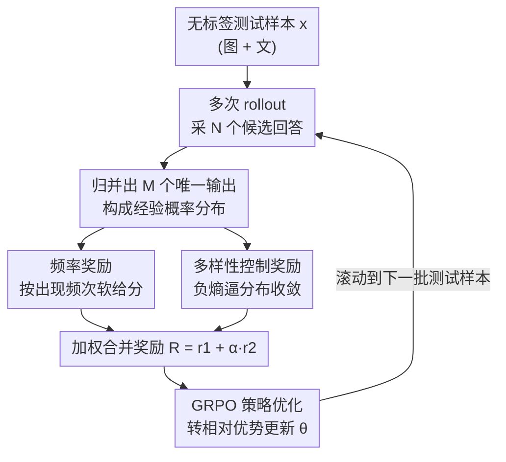

# TTRV: Test-Time Reinforcement Learning for Vision Language Models

**会议**: CVPR 2026  
**论文**: [CVF Open Access](https://openaccess.thecvf.com/content/CVPR2026/html/Singh_TTRV_Test-Time_Reinforcement_Learning_for_Vision_Language_Models_CVPR_2026_paper.html)  
**领域**: 多模态VLM  
**关键词**: 测试时强化学习, GRPO, 无监督奖励, VLM 自适应, 熵正则化

## 一句话总结
TTRV 让现成的解码器型 VLM 在推理阶段、对着**无标签**的测试数据直接做强化学习——靠"模型自己输出的频率"和"输出分布的熵"两个自监督奖励驱动 GRPO，在 16 个数据集上物体识别平均涨 24.6%、VQA 平均涨 10.0%，甚至把 InternVL3-8B 的 ImageNet 识别推到超过 GPT-4o。

## 研究背景与动机

**领域现状**：用 RL 做 VLM 后训练（RFT）已经是涨点利器——RLHF、DPO、GRPO 这条线证明了"规则奖励 + 策略优化"能显著增强 VLM 的识别、推理、对齐能力（VLM-R1、Perception-R1、CLS-RL 等）。但这套范式有一个共同前提：奖励信号来自人工标注，训练发生在专门切出来的 train split 上。

**现有痛点**：真实世界里根本不存在天然的"训练集/测试集"划分。模型一旦训练完就是静态的，碰到新域、新任务就得重新标数据、重新微调，代价高且滞后。这跟人类"在环境里边用边学、从模糊的无标签经验中持续精进"的方式完全相反。

**核心矛盾**：RL 想标榜"从经验中学习"，但它实际依赖的是被精心策划过的 benchmark 和人工标签——奖励无法在"野生的、无标签的"数据流上自己长出来。换句话说，缺一个**在测试时、没有任何标签**的情况下也能产生有效奖励的机制。

**本文目标**：给解码器型 VLM（LMM，如 InternVL、Qwen-VL）造一个能在推理现场、对无标签测试样本就地提取奖励、就地做 RL 自适应的框架。

**切入角度**：作者观察到——模型对同一张图反复采样时，**越频繁出现的答案越可能是对的**；而一个置信、收敛的模型，其输出经验分布的**熵应该低**。这两个量都不需要标签，纯靠模型自己的 rollout 统计就能算出来，天然适合当奖励。

**核心 idea**：把 GRPO 的"标签奖励"换成两个自监督奖励——**频率奖励**（鼓励一致、共识的答案）+ **多样性控制奖励**（用负熵逼分布收敛），在测试时对每个样本多次采样、就地更新策略，让静态 VLM 变成能自我提升的动态系统。

## 方法详解

### 整体框架
TTRV 不改 VLM 结构、不需要任何标签，直接在现成 VLM（如 InternVL）外面套一层 GRPO。流程是：对每个无标签测试 prompt $x$（图+文），用当前策略 $\pi_\theta(\cdot|x)$ 采 $N$ 个候选回答 $\{\hat{y}_1,\dots,\hat{y}_N\}$；这些回答归并出 $M$ 个**唯一输出** $\{\tilde{y}_1,\dots,\tilde{y}_M\}$，构成一个经验概率分布；从这个分布里抽出两路奖励——频率奖励（按出现频次给分）和多样性控制奖励（负熵，逼分布收敛）——加权成最终奖励 $R$，再用 GRPO 把它转成组内相对优势去更新策略。整个过程"采样→统计→算奖励→更新"就在测试数据上滚动进行，模型边推理边自适应。

### 关键设计

**1. 频率奖励：用"答案出现得多不多"代替人工标签**

测试时没有 ground truth，没法算"答对没"。作者的替代直觉是：模型反复回答同一题时，越是被一致产出的答案，越可能是对的。于是对样本 $x$ 采 $N$ 个回答，先估计每个唯一输出 $\tilde{y}_m$ 的经验概率

$$p(\tilde{y}_m) = \frac{1}{N}\sum_{j=1}^{N}\mathbb{1}\{\hat{y}_j = \tilde{y}_m\}$$

再把单个回答 $\hat{y}_j$ 的奖励定义为它所属唯一输出的频率：

$$r_1(\hat{y}_j) = \sum_{m=1}^{M} p(\tilde{y}_m)\cdot\mathbb{1}\{\hat{y}_j = \tilde{y}_m\}$$

关键在于它是**软**的而非硬的。最接近的工作 TTRL [74] 用 best-of-N / 多数投票，只挑最频繁那一个当伪标签、其余全丢——当模型不确定、或最频繁答案恰好是错的时候，这会给出一个"自信但错"的强误导信号。TTRV 反过来让每个回答都按自己的频率拿到非零、分级的奖励，保留了对少数推理路径的不确定性，作者把这类比成贝叶斯——不坍缩到单点估计，而是带着假设上的不确定性去塑形学习。消融里（表 3）这一软奖励确实稳压多数投票。

**2. 多样性控制奖励：用负熵逼输出分布收敛**

光有频率奖励，模型可能在多个模式间摊得太开、迟迟不收敛。作者补一个基于熵的正则项：对经验分布算香农熵

$$H(P) = -\sum_{m=1}^{M} p(\tilde{y}_m)\log p(\tilde{y}_m)$$

把辅助奖励设成它的负值 $r_2 = -H(P)$，惩罚输出分布过度分散。这样模型在前期靠频率奖励探索多样推理模式，后期则被负熵驱动把概率质量逐渐聚拢到稳定、高概率的答案上，而不是无谓地在冗余回答之间分散注意力。值得注意的是，"只用这一项（去掉频率奖励）"恰好等价于把 TENT [58] 的熵最小化搬到测试时——而完整 TTRV 在消融里明显胜过这个纯熵最小化的退化版，说明两路奖励是互补的、缺一不可。

**3. 合并奖励 + GRPO 相对优势：把自监督信号转成稳定更新**

两路奖励加权合成最终奖励

$$R(\hat{y}_j) = r_1(\hat{y}_j) + \alpha\, r_2$$

$\alpha$ 是权衡"收敛 vs 多样性"的超参。RL 目标就是最大化策略下的期望奖励 $\max_\theta \mathbb{E}_{y\sim\pi_\theta(\cdot|x)}[R(y)]$，对解码器型 VLM 通过标准自回归语言建模目标、用奖励对预测 token 做样本级软加权来优化。但作者没有直接拿原始奖励做梯度上升，而是接 GRPO：把奖励换成组内相对优势

$$A_i = \frac{r(x,y_i) - \mathrm{mean}_j(r(x,y_j))}{\mathrm{std}_j(r(x,y_j))}$$

并配 KL 正则约束偏离参考策略。这一步把优化从"绝对奖励"转向"组内相对比较"，正是它让一个没有真实标签、奖励尺度本身就不可靠的测试时 RL 变得稳定可训——相对优势天然对奖励的绝对大小不敏感，只看谁在这一组里更好。

## 实验关键数据

### 主实验
在 InternVL 系列三个尺寸上，对每个数据集**只随机采 20 张测试图**做 TTRV，物体识别（表 1，8 个 benchmark）平均涨幅就非常可观；InternVL3-8B 被推到 ImageNet >99%，平均超过 GPT-4o 约 2.3%。

| 模型（识别，8 数据集均值） | 指标 | 基座 | w/ TTRV | 提升 |
|--------|------|------|----------|------|
| InternVL3-2B | Top-1 Acc | 62.03 | 94.99 | +32.95 |
| InternVL2.5-4B | Top-1 Acc | 70.47 | 82.34 | +11.88 |
| InternVL3-8B | Top-1 Acc | 66.74 | 95.71 | +28.97 |
| GPT-4o（参考） | Top-1 Acc | 93.37 | — | — |

VQA（表 2，8 个数据集）同样一致涨点，最大单项如 InternVL3-2B 在 AI2D +28.07、InternVL3-8B 在 MME +29.75：

| 模型（VQA，8 数据集均值） | 指标 | 基座 | w/ TTRV | 提升 |
|--------|------|------|----------|------|
| InternVL3-2B | Acc | 47.47 | 57.15 | +9.69 |
| InternVL2.5-4B | Acc | 66.37 | 69.40 | +3.03 |
| InternVL3-8B | Acc | 38.05 | 55.56 | +17.50 |

### 消融实验
表 3 拆开两路奖励、并对比 TTRL 的多数投票奖励（以 InternVL2.5-4B 为基座，部分数据集）：

| 配置 | AI2D | SEED | 相对基座 | 说明 |
|------|------|------|---------|------|
| 多数投票（TTRL 风格） | 47.52 | 58.37 | AI2D −4.03 | 硬伪标签，反而掉点 |
| w/o 频率奖励（≈ TENT 熵最小化） | 52.66 | 58.87 | AI2D +1.11 | 只剩负熵，涨幅有限 |
| w/o 多样性奖励 | 53.06 | 59.27 | AI2D +1.51 | 只剩频率，缺收敛 |
| 完整 TTRV（频率+多样性） | 61.09 | 61.14 | AI2D +9.54 | 两路互补最优 |

### 关键发现
- **多数投票的硬伪标签会害人**：TTRL 风格的多数投票在 AI2D 上相对基座掉 4.03、CRPE 掉 2.73，而 TTRV 软奖励大涨；证明"保留分布不确定性"比"坍缩到单点"更安全。
- **两路奖励缺一不可且互补**：单独频率或单独负熵都只小涨（多数 +1 上下），合起来在 AI2D 直接 +9.54，说明探索（频率）与收敛（负熵）必须配合。
- **极致数据高效**：仅用 20 张图就拿到这些增益；甚至**单张随机测试样本**也能涨——ImageNet-A +4.61、ImageNet-R +5.47（表 6），暗示 TTRV 不是在拟合数据分布，而是在**唤醒预训练里已有、被指令微调削弱的能力**。
- **跨数据集泛化**：在 Food101 上做 TTRV 却在 DTD 上测，仍大涨（图 3，如 +52.03），进一步佐证它增强的是底层任务能力而非分布适配。
- **奖励必须有意义**：随机奖励（表 5）对 InternVL 反而掉点（SEED −4.96），说明 TTRV 的增益来自真实信号而非 GRPO 的"虚假奖励也涨点"现象。
- **跨模型族**：换到 Qwen2.5-VL-3B 一样稳涨（表 7，识别/VQA 均 +2.6~+4.1），不绑定 InternVL。
- **会翻车的情形**：当基座本身极弱时（如 InternVL2.5-4B 在 Resisc45 base 仅 23.44），rollout 质量太差叠加 GRPO 不稳定，TTRV 反而掉 10.14——奖励质量受制于基座质量。

## 亮点与洞察
- **"频率即标签"的软奖励设计很巧**：不丢弃少数派、按频率分级给分，把多数投票的硬决策升级成贝叶斯式的软监督，既避免误导又保留探索，是全文最核心的"啊哈"点。
- **一个统一视角串起两条线**：去掉频率奖励就退化成 TENT 熵最小化、退化版被完整版打败——一句话就把"为什么需要频率奖励"说清楚了，论证非常干净。
- **"恢复而非适配"的解释发人深省**：20 张图、单张图、跨数据集都能涨，强烈暗示指令微调其实**压抑**了预训练里的识别能力，而测试时 RL 把它重新激活——这个观点可迁移到"用无监督信号修复指令微调副作用"的更广命题。
- **可即插即用**：TTRV 不动模型结构、不需标签，任何开源解码器 VLM 都能 bootstrap，落地门槛低。

## 局限与展望
- **缺理论支撑**：作者自承只有经验证据说明 TTRV"增强任务能力而非拟合分布"，没有理论解释为什么会这样。
- **受基座质量制约**：基座弱时 rollout 质量差，频率/熵奖励都建立在垃圾输出上，可能不升反降（Resisc45 上 −10.14），缺一个"何时该退出/降权"的安全机制。
- **频率奖励对答案空间有隐含假设**：识别/选择题这类离散、可枚举的输出适合"统计频次"，但对开放式长文本生成，唯一输出几乎不重合，频率分布会退化——方法对自由生成任务的适用性存疑。
- **测试时计算开销**：每个样本要采 $N$ 个 rollout 并就地更新，延迟分析被放到附录，正文未充分讨论部署成本。
- **改进方向**：可探索把基座置信度/rollout 一致性作为门控，自动决定对哪些样本启用 TTRV、用多大 $\alpha$，避免在低质样本上反向优化。

## 相关工作与启发
- **vs TTRL [74]**：同样是"测试时 RL + 自产奖励"，但 TTRL 针对 LLM、用多数投票挑单一伪标签（硬）；TTRV 扩到多模态、用频率软奖励 + 负熵正则（软+收敛），消融证明软奖励显著优于多数投票。
- **vs TENT [58] / 熵最小化 TTT**：TENT 依赖类别概率分布的熵最小化，解码器 VLM 输出的是全词表自回归 token 分布，没有类级分布，直接套不了；TTRV 用经验输出分布的熵近似，且完整版（加频率奖励）胜过纯熵最小化。
- **vs TPT/DiffTPT/C-TPT 等 prompt 级 TTT**：那些主要面向双编码器 CLIP、调 prompt；TTRV 直接面向解码器型 LMM、更新模型参数，目标任务从匹配转向开放识别/推理。
- **vs VLM-R1 / Perception-R1 / CLS-RL 等 RFT**：它们仍依赖策划的 train split 和标签反馈；TTRV 把奖励的来源从"人工标注"挪到"测试时模型自身的 rollout 统计"，是范式上的差异。

## 评分
- 新颖性: ⭐⭐⭐⭐⭐ 首个面向解码器型 VLM 的测试时 RL 框架，频率+负熵的无监督奖励设计干净而有效。
- 实验充分度: ⭐⭐⭐⭐⭐ 16 数据集、多模型族、单样本/跨数据集/随机奖励/biased 采样等消融非常完整，且诚实报告翻车案例。
- 写作质量: ⭐⭐⭐⭐ 动机—方法—消融逻辑清晰，公式完整；"恢复 vs 适配"的解释略偏推测、缺理论。
- 价值: ⭐⭐⭐⭐⭐ 无需标签即可让现成 VLM 推理时自我提升、还能超 GPT-4o，对实际部署与"修复指令微调副作用"都有启发。

<!-- RELATED:START -->

## 相关论文

- [\[CVPR 2026\] TTL: Test-time Textual Learning for OOD Detection with Pretrained Vision-Language Models](ttl_test-time_textual_learning_for_ood_detection_with_pretrained_vision-language.md)
- [\[CVPR 2026\] STAR: Test-Time Adaptation Can Enhance Universal Prompt Learning for Vision-Language Models](star_test-time_adaptation_can_enhance_universal_prompt_learning_for_vision-langu.md)
- [\[CVPR 2026\] Controllable Federated Prompt Learning at Test Time](controllable_federated_prompt_learning_at_test_time.md)
- [\[CVPR 2026\] MoE-GRPO: Optimizing Mixture-of-Experts via Reinforcement Learning in Vision-Language Models](moe-grpo_optimizing_mixture-of-experts_via_reinforcement_learning_in_vision-lang.md)
- [\[CVPR 2026\] Dynamic Logits Adjustment and Exploration for Test-Time Adaptation in Vision Language Models](dynamic_logits_adjustment_and_exploration_for_test-time_adaptation_in_vision_lan.md)

<!-- RELATED:END -->
