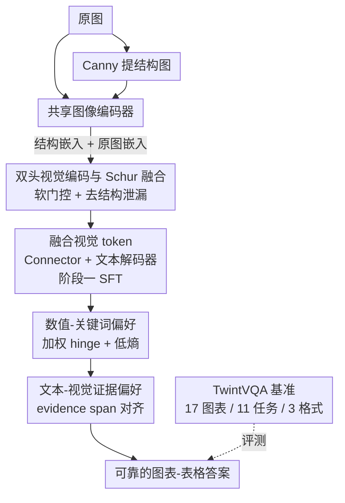

# Twin-T & TwintVQA: A Reliable Structure-Detail Separating VLM and a Comprehensive Benchmark for Chart and Table Tasks

**会议**: CVPR 2026  
**论文**: [CVF Open Access](https://openaccess.thecvf.com/content/CVPR2026/html/Bao_Twin-T__TwintVQA_A_Reliable_Structure-Detail_Separating_VLM_and_a_CVPR_2026_paper.html)  
**代码**: https://github.com/Samsara-1999/Twin-T-TwintVQA  
**领域**: 多模态VLM  
**关键词**: 图表理解, 表格问答, 双头视觉编码, 偏好学习, 评测基准

## 一句话总结
Twin-T 用「双头图像编码器 + Schur 式融合」显式把图表的结构线索（坐标轴、网格、布局）与细节线索（数值、图例、文字）拆开再重组，再用 MINT 偏好学习专门强化数字与关键词的保真度，配套提出覆盖 17 种图表、11 类任务、3 种格式的 TwintVQA 基准；7B 模型在主流图表-表格榜上超过 GLM-4.5V-106B，逼近 GPT-4o 与 Gemini-2.5-Pro。

## 研究背景与动机

**领域现状**：图表和表格是定量信息的主要载体，对它们做自动分析的需求随 VLM 普及而快速上升。主流图表专家模型（ChartLlama、ChartVLM、ChartAst 等）基本沿用「单一视觉编码器 + 文本解码器」的通用配方，靠大规模图表-表格指令微调来涨点。

**现有痛点**：作者指出两个具体短板。其一，单一编码器把结构线索和细粒度细节**隐式地混在一起**，缺少图表特有的归纳偏置，导致全局布局（轴、网格、表头）很难和局部数值、图例、文字区域对齐；已有工作加辅助 token、线性层、路由模块或跨层融合块，但都没有**显式地分离并控制**结构与细节的交互。其二，图表数据里数字密集，而模型对数字不够敏感——它们偏重视觉内容，却经常读错具体数值，在实际场景里可靠性差。

**核心矛盾**：人类读图是「先看结构、再抠细节」——看饼图时第一印象是各部分占比这个全局骨架，然后才落到颜色和具体数字上完成任务。现有 VLM 把这两类信号一锅炖，既没把结构当成解读细节的脚手架，也没把数字当成需要专门保真的关键 token。

**本文目标**：让 VLM 像人一样，先把结构与细节**分开再整合**，并在生成端专门保证数值和关键词的正确，同时补一个覆盖足够广的评测基准。

**核心 idea**：用「双头视觉编码（结构头 + 细节头）+ Schur 式去结构泄漏融合」替代单编码器，再用「针对数字/比较词加权 + 低熵 + 文本-视觉证据对齐」的偏好学习替代均匀对待所有 token 的偏好优化。

## 方法详解

### 整体框架
Twin-T 是一个两阶段训练的图表-表格专家 VLM，1B 版基于 Ovis2-1B、7B 版基于 Qwen2.5-VL-7B。**阶段一（Dual-Head Visual Encoding）**做视觉增强：除了原图，再用 Canny 从原图算出一张「结构图」，两张图过同一个共享、可训练的图像编码器，分别得到结构嵌入和原图嵌入；中间插入一个**无参数的 Schur 式模块**，软性地门控并扣掉原图嵌入里的结构方向，得到纯细节嵌入，再把结构与细节融合成融合视觉 token，喂给 connector 和文本解码器，用交叉熵做监督指令微调，让整个 VLM 适配这条双头通路。**阶段二（MINT Preference Learning）**做生成增强：在阶段一数据基础上构造偏好数据（chosen vs. rejected 回复），只训练文本解码器，用 MINT 损失同时提升数值保真、压低数字 token 的 logits 熵、增大文本-视觉证据对齐。

### 关键设计

**1. 双头视觉编码与 Schur 式融合：把结构从图像特征里"减"出去**

针对「单编码器把结构与细节隐式混在一起、全局布局难对齐局部数值」这个痛点，阶段一不直接用原图嵌入，而是显式构造两路信号。结构这条路利用一个先验：边、直线、框这类结构在图像里像素幅值更大、是高频成分，所以用 Canny 从原图抽出一张结构图，和原图分别过共享编码器，得到结构嵌入 $E_{Stru}\in\mathbb{R}^{B\times N_{vis}\times D_{vis}}$ 和原图嵌入 $E_{Img}$（后者同时含结构与细节）。

由于 Canny 结构图常带伪边和背景杂讯（附录验证未净化的结构嵌入反而掉点），作者先用结构嵌入的范数衡量结构强度，再过一个 **soft gate** 而非硬阈值：

$$w_{Stru}[b,t]=\sigma\big(\alpha(\|E_{Stru}[b,t,:]\|_2-\tau)\big),\quad w_{Det}[b,t]=1-w_{Stru}[b,t]$$

其中 $\alpha$ 是温度、$\tau$ 是结构阈值，sigmoid 避免硬阈值带来的不稳定——结构强的 token 门值趋近 1、弱的趋近 0，提高结构信息的可区分度。接着用 **Schur 式融合**把结构方向从原图嵌入里投影扣除：取结构单位方向 $u$ 和保留因子 $\gamma[b,t]=\frac{\|E_{Stru}\|_2^2}{\lambda+\|E_{Stru}\|_2^2}$（$\lambda$ 越大保留越少结构），得到细节嵌入

$$E_{Det}[b,t]=E_{Img}[b,t]-\underbrace{\gamma[b,t]\,w_{Stru}[b,t]^2}_{\text{自适应扣除}}\,\mathrm{proj}\big(E_{Img}[b,t]\big)$$

最后按门权重重组 $E_{fuse}=w_{Det}\,E_{Det}+w_{Stru}\,E_{Stru}$。这里的巧妙之处在于「自适应扣除」：$\gamma$ 让结构越强扣得越多，$w_{Stru}^2$ 进一步只在高度结构化的位置发力、几乎不动弱结构 token，于是结构主导的位置被压掉结构泄漏、表示向细节偏移，而细节为主的位置基本保持原样。相比直接用 $E_{Img}$，这套设计在融合前就把结构和细节真正拆开了。消融显示，去掉双头编码器在 Overall 上掉约 5%、是阶段一最大功臣，结构门控和 Schur 融合各再贡献约 2~3%。

**2. 数值-关键词偏好：让梯度集中到数字与比较词上**

阶段一模型在数字 token 和比较词上仍会出错（Tab.6 验证）。图表-表格任务几乎都围着数字转——读值、比大小、算差/比值、看趋势，而普通偏好学习把所有生成 token 一视同仁，风格词和填充词的梯度白白稀释了对数值正确性的优化。MINT 的第一个组件就是 token 级地把训练火力压到数值和比较关键词（如 greater、smaller）上。

具体地，用掩码 $M_{num},M_{key}\in\{0,1\}$ 标出数值与比较词位置，构造样本内归一化（均值≈1）的逐 token 权重 $W[b,t]=\mathrm{norm}(1+M_{num}[b,t]+M_{key}[b,t])$，再对这些"金 token"（被掩码标中的位置）施加加权 hinge 对比损失，强制 chosen 回复在这些 token 上的 logits 高于 rejected：

$$L_{NK}=\frac{1}{N}\sum_{t=0}^{N} W[b,t]\big[-(\ell^{ch}_{[b,t]}-\ell^{rj}_{[b,t]})\big]_{+}$$

为进一步稳住「从图里抄/算数字」这件事，再在数值位置 $P$ 上加低熵正则 $L_{Ent}=\frac{1}{|P|}\sum_{t\in P}H_{[b,t]}$（$H$ 是 logits 的香农熵），压低数字 token 的输出熵让生成更自信稳定。两者合成 $L_{NKp}=L_{NK}+L_{Ent}$。消融里去掉 Num-Key 在 7B 上 Overall 掉 27.44、NK Acc 掉 5.9%，是阶段二最关键的一块；去掉低熵正则数字熵从 13.4% 飙到 17.2%，印证它确实在收紧数字分布。

**3. 文本-视觉证据偏好：把答案钉在图里的证据上**

为让答案更可靠，作者希望模型不仅给最终值，还要**暴露真实的推理证据**并让这段证据切实对应图中事实。做法是把回复里的证据片段用 `<evidence>...</evidence>` 包起来——例如某城市人口 2024 年 0.50M、2025 年 0.52M，问相对增长时，chosen 回复写 `<evidence>(0.52-0.5)/0.5=4%</evidence>`，而 rejected 给粗糙或错误的证据（如 =3%）。

在这段证据 span 上，取文本 token 与视觉 token 末层隐状态的余弦相似度矩阵 $Mat_{txt\text{-}vis}$，对每个证据文本 token 取它对所有视觉 token 的最大相似度再平均，得到该 span 的文本-视觉匹配度 $\mu$，然后用 chosen 与 rejected 的匹配度差构造 hinge 损失：

$$L_{TV}=\frac{1}{B}\sum_{b=1}^{B}\big[-\big(\mu(Mat^{ch}_{txt\text{-}vis}[b])-\mu(Mat^{rj}_{txt\text{-}vis}[b])\big)\big]_{+}$$

当 chosen 的证据更贴合视觉时损失小，相当于奖励「证据落在图上而非凭空编」。最终 MINT 损失 $L_{MINT}=L_{NKp}+L_{TV}$。消融中去掉 Txt-Vis，Match 分从 95.8% 掉到 94.1%（1B 上更明显，从 90.6% 掉到 82.4%），说明它主要拉的是证据对齐度。

**4. TwintVQA：补一个足够广的图表-表格评测基准**

现有基准任务和图表类型太少、又偏重短答案，撑不起对模型能力的全面评估。TwintVQA 含 4,941 道题，覆盖 **17 种图表/表格类型**（bar、pie、line、bubble、heatmap、radar、donut、sankey、scatter、rose、box、waterfall、stacked、candle、gantt、composite、table）、**11 类任务**（Table→LaTeX、Chart→Python、Image/LaTeX/Python 的 Analysis 与 Summary、Multiple Choice、Numerical QA、Open QA）、**3 种数据格式**（Image、LaTeX、Python），并按 token 长度分 short/medium/long 三档。评测时每道 QA 由 GPT-4o-Mini 在 [0,1] 打分、取均值转百分比。训练侧从公开网络收集约 40K 图表-表格图，用 GPT-4o 按模板每图生成 5 对 QA、共约 200K 对；基准图来自 arXiv 论文与网络并人工筛选、约 5K 张，与训练集无重叠。

### 损失函数 / 训练策略
阶段一用交叉熵让模型基于融合视觉 token $E_{fuse}$ 生成目标答案，适配整条双头通路；阶段二在阶段一对齐基础上**只训练文本解码器**，用 $L_{MINT}=L_{NK}+L_{Ent}+L_{TV}$ 做偏好优化。所有实验在 NVIDIA A800 上跑、重复三次取平均。

## 实验关键数据

### 主实验
在 10 个图表-表格基准（AI2D、CharXivD/R、ChartMimic、ChartQA、LogicVista、OCRVQA、SEEDBench2、TableVQA、TwintVQA）上比较，Overall 为各榜总分：

| 模型 | 参数量 | TwintVQA↑ | Overall↑ | 说明 |
|------|--------|-----------|----------|------|
| Twin-T-7B | 7B | **70.20** | **719.94** | 开源 SOTA，超 GLM-4.5V-106B |
| Twin-T-1B | 1B | 58.79 | 576.20 | 小模型领先，超多个更大模型 |
| GLM-4.5V-106B | 106B | 60.62 | 667.08 | 被 7B 反超 |
| GPT-4o | API | 67.06 | 714.89 | 7B 逼近 |
| Gemini-2.5-Pro | API | 63.58 | 724.26 | 仅略高于 7B |
| Qwen2.5-VL-7B（基座） | 7B | 51.36 | 631.09 | 7B 较其涨 88.85 |
| ChartAst-13B | 13B | 51.38 | 600.98 | 最强专家基线 |

Twin-T-7B 在 AI2D、CharXivR、LogicVista、SEEDBench2、TableVQA 和 TwintVQA 上拿到最强开源结果；作者也坦言 Twin-T 在 OCR 重和代码重建（ChartMimic、C2P）这两类任务上落后，主因是参数量和训练数据规模都小于商用/API 模型。

### 消融实验
阶段消融（Tab.4，7B，Overall）与阶段一/二组件消融（Tab.5/6）：

| 配置 | Overall↑ | 关键变化 | 说明 |
|------|----------|---------|------|
| Full（7B） | 719.94 | NK Acc 90.60 / Entropy 13.40 / Match 95.80 | 完整模型 |
| w/o Stage 2 | 675.05 ▼44.89 | — | 去掉偏好学习 |
| w/o Stage 1 | 672.52 ▼47.42 | TwintVQA ▼13.15 | 去掉双头视觉 |
| w/o Dual-head（S1） | 642.28 ▼32.77 | — | 阶段一最大功臣 |
| w/o Structure gating（S1） | 656.98 ▼18.07 | — | 软门控约 +2.7% |
| w/o Schur fusion（S1） | 660.26 ▼14.79 | — | 融合约 +2.2% |
| w/o Num-Key（S2） | 692.50 ▼27.44 | NK Acc ▼5.90 | 阶段二最关键 |
| w/o Low-Entropy（S2） | 702.36 ▼17.58 | Entropy ▲3.80 | 数字熵明显上升 |
| w/o Txt-Vis（S2） | 695.65 ▼24.29 | Match ▼1.70 | 证据对齐下降 |

### 关键发现
- **双头编码器是阶段一的主引擎**：去掉它 Overall 掉约 5%，远大于门控（2.7%）和 Schur 融合（2.2%），说明「先把结构/细节拆开」这一步本身最值钱。
- **数值-关键词偏好是阶段二最关键的一块**：去掉后 NK Acc 在 7B 上掉 5.9%；去掉低熵正则数字熵从 13.4% 升到 17.2%，直接印证它在压低数字 token 的不确定性。
- **超参有清晰最优**：温度 $\alpha\approx4$（门够锐又不放大局部噪声）；结构阈值 $\tau$ 在 7B 取中位数 p50、1B 偏向 p50~p75（小模型更需稍高阈值压噪）；$\lambda$ 在 7B≈1、1B≈0.5（太小留结构泄漏、太大扣掉有用布局线索）。
- **结构图抽取选 Canny**：相比 Sobel/Scharr/Laplacian/HED，Canny 速度-性能折中最好，推理仅多约 0.008s/图，远小于约 0.02s/token 的解码开销，且更不易过抽背景杂讯。
- **短板可解释**：C2P（图→Python）对几乎所有模型都低，因为它要忠实重建程序、需代码对齐监督和更大容量，与 LaTeX 生成不同。

## 亮点与洞察
- **把"人怎么读图"翻译成显式的特征分解**：先全局结构、后局部细节这个认知直觉，被落成 Canny 结构图 + 软门 + Schur 投影扣除，结构-细节分离是可计算、可消融的，而不是停留在口号。
- **Schur 式"自适应扣除"很巧**：用 $\gamma\cdot w_{Stru}^2$ 双重门控，只在结构主导的位置扣结构方向、弱结构位置几乎不动，避免一刀切扣除误伤细节——这套「按结构强度自适应去泄漏」的思路可迁移到任何需要解耦两类共存信号的表示学习。
- **偏好学习做"token 级加权 + 低熵"**：不是均匀对待所有生成 token，而是把梯度压到数字/比较词上并压低其熵，这对一切「答案对错由少数关键 token 决定」的任务（如数学、代码、结构化抽取）都有借鉴价值。
- **证据 span 对齐反幻觉**：用 `<evidence>` 包裹推理过程并让它和视觉 token 对齐，相当于把"言之有据"变成可优化的损失项。

## 局限与展望
- **作者承认的局限**：受参数量和数据规模所限，OCR 重和代码重建（C2P）任务明显落后，OCR 覆盖与代码重建先验不足。
- **结构先验依赖边缘算子**：整套结构头建立在 Canny 高频假设上，对低对比度、手绘、噪声重或非「轴-网格-框」式版面（如复杂信息图）是否仍成立存疑；附录已显示未净化的结构嵌入会掉点，说明该路对噪声敏感。
- **偏好数据由 GPT-4o 生成、评测由 GPT-4o-Mini 打分**：训练 QA 和基准评分都重度依赖闭源模型，可能引入评测偏置；用同源模型既造数据又判分，结论的独立性需谨慎看待。
- **改进方向**：补充代码对齐监督提升 C2P；把结构图从单一 Canny 换成可学习/多算子自适应的结构提取；引入非 LLM 的客观指标（如数值精确匹配）交叉验证 GPT 打分。

## 相关工作与启发
- **vs 通用 VLM（LLaVA / Qwen-VL / Ovis）**：它们靠通用视觉通路 + 大规模指令微调，单编码器隐式混合结构与细节；Twin-T 在其基座（Ovis2-1B / Qwen2.5-VL-7B）上加双头分离，7B 较基座 Qwen2.5-VL-7B 的 Overall 涨 88.85，证明分离带来的增益是基座本身给不了的。
- **vs 图表专家模型（ChartLlama / ChartVLM / ChartAst）**：这些工作多靠「一刀切」配方加图表预训练、缺少任务感知的结构监督，且基准任务/图表类型偏少、偏重短答案；Twin-T 既显式注入结构归纳偏置，又用 TwintVQA 把评测扩到 17 图表 × 11 任务 × 3 格式 × 三档长度。
- **vs 标准偏好学习（DPO 类）**：DPO 把所有生成 token 等权重对待；MINT 针对图表-表格场景做 token 级加权（数字/比较词）+ 低熵 + 证据对齐，把优化重心从"表面措辞"挪到"事实正确"。

## 评分
- 新颖性: ⭐⭐⭐⭐ 「结构-细节双头 + Schur 去泄漏 + token 级数值偏好」组合在图表 VLM 上是新颖且自洽的，单点技术多有渊源但拼装巧妙。
- 实验充分度: ⭐⭐⭐⭐⭐ 10 个基准 + 任务/长度/图表三维分组 + 两阶段及组件全消融 + α/τ/λ/结构算子敏感性，覆盖很全。
- 写作质量: ⭐⭐⭐⭐ 动机-方法-公式串联清晰，图表丰富；个别公式排版（Schur 扣除项）略需对照原文。
- 价值: ⭐⭐⭐⭐ 同时给出方法、1B/7B 开源模型与一个广覆盖基准，对图表-表格理解社区实用价值高。

<!-- RELATED:START -->

## 相关论文

- [\[CVPR 2026\] Is your VLM Sky-Ready? A Comprehensive Spatial Intelligence Benchmark for UAV Navigation](is_your_vlm_sky-ready_a_comprehensive_spatial_intelligence_benchmark_for_uav_nav.md)
- [\[CVPR 2026\] Beyond Graph Model: Reliable VLM Fine-Tuning via Random Graph Adapter](beyond_graph_model_reliable_vlm_fine-tuning_via_random_graph_adapter.md)
- [\[CVPR 2026\] PIX-TAB: Efficient PIXel-Precise TABle Structure Recognition Approach with Speculative Decoding and Region-Based Image Segmentation](pix-tab_efficient_pixel-precise_table_structure_recognition_approach_with_specul.md)
- [\[CVPR 2026\] PAI-Bench: A Comprehensive Benchmark for Physical AI](pai-bench_a_comprehensive_benchmark_for_physical_ai.md)
- [\[CVPR 2026\] ENC-Bench: A Benchmark for Evaluating MLLMs in Electronic Navigational Chart Understanding](enc-bench_a_benchmark_for_evaluating_multimodal_large_language_models_in_electro.md)

<!-- RELATED:END -->
