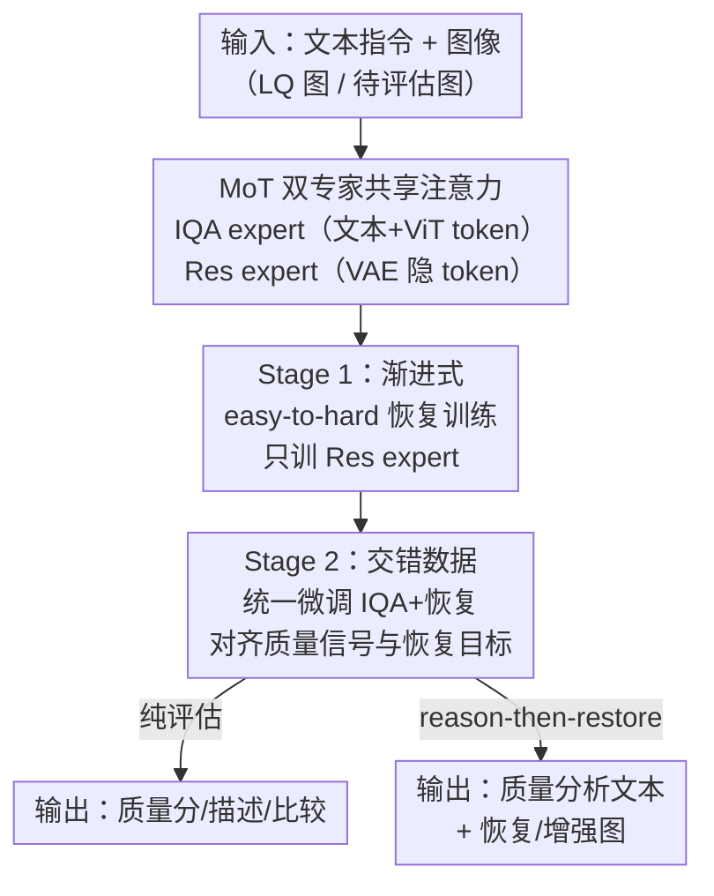

# UARE: A Unified Vision-Language Model for Image Quality Assessment, Restoration, and Enhancement

**会议**: CVPR 2026  
**论文**: [CVF Open Access](https://openaccess.thecvf.com/content/CVPR2026/html/Li_UARE_A_Unified_Vision-Language_Model_for_Image_Quality_Assessment_Restoration_CVPR_2026_paper.html)  
**领域**: 多模态VLM  
**关键词**: 统一视觉语言模型, 图像质量评估, 图像恢复, MoT 专家, reason-then-restore

## 一句话总结
UARE 把图像质量评估（IQA）、图像恢复与增强塞进同一个基于 MoT（mixture-of-transformers）的视觉语言模型里，用"先评估、再恢复"（reason-then-restore）的交错数据做两阶段训练，首次系统验证了"让模型先把质量分析说清楚，恢复结果就更好"这一假设，在 SR / 多退化恢复 / IQA 三类任务上都拿到有竞争力的成绩。

## 研究背景与动机

**领域现状**：图像质量评估（IQA，预测人眼感知质量，输出标量分或自然语言描述）和图像恢复/增强（从退化图恢复干净图）是低层视觉里两条长期主线。近年 MLLM 进 IQA 后，能给出细粒度的质量描述；恢复侧则有 PromptIR、扩散先验、FoundIR 这类 all-in-one 通用模型。

**现有痛点**：这两条线几乎完全割裂。IQA 方法只管打分/描述，根本不考虑下游恢复怎么用这些文字；恢复方法只顾把图修好，不去借助 IQA 提供的质量上下文。结果就是——MLLM 辛辛苦苦生成的"这张图哪里糊、噪声多少"的描述，恢复模型一句也没听进去。

**核心矛盾**：IQA 和恢复在逻辑上明明互补（评估能指导恢复对齐人眼偏好，恢复又能反过来校准评估），但它们目标函数完全不同（一个是文本预测的最大似然、一个是图像生成的回归），硬塞进一个模型会因目标冲突而互相拖累，导致没人愿意统一它们。

**切入角度**：作者注意到一个类比——近期统一理解-生成模型（Chameleon / Transfusion / Bagel）反复证明"更强的理解能提升生成"。IQA 之于恢复，恰好就像理解之于生成。那么把 IQA 当"理解"、恢复当"生成"塞进一个统一架构，IQA 应当也能反哺恢复。

**核心 idea**：用一个 MoT 双专家 VLM 同时承载 IQA 与恢复，通过"先分析质量、再执行恢复"的交错训练数据把两者目标对齐，让质量评估真正变成恢复的指导信号。

## 方法详解

### 整体框架
UARE 以 Bagel 的 MoT 架构为骨干，内置两个全容量 transformer 专家：**IQA expert** 接收文本 token（来自 text tokenizer）和理解侧视觉 token（来自 understanding ViT encoder），负责打分/描述/比较；**Res expert** 接收 VAE 隐空间 token，负责修图。两个专家跑在同一条交错 token 流上、每个 block 共享自注意力——共享上下文保住跨模态对齐，分离的专家参数则降低两类任务的梯度干扰。

训练分两阶段：Stage 1 只训 Res expert，用"单退化→多退化→高阶退化"的渐进课程把生成能力转成恢复能力；Stage 2 解冻整模（除 VAE 和 text tokenizer），用 IQA 数据 + "分析-再恢复"的交错图文数据联合微调，把 IQA 信号对齐到恢复目标上。推理时支持三种数据流，最有价值的是 assessment-guided restoration：模型先吐一段质量分析文本，Res expert 通过共享自注意力 condition 在这段分析上再去更新 VAE 隐变量，最终同时输出"分析文本 + 修好的图"。

### 关键设计

**1. MoT 双专家 + 共享自注意力：让一个模型同时干两件目标冲突的活**

痛点很直接：IQA 训练目标是文本预测（自回归最大似然），恢复是图像生成（流匹配回归），两类梯度方向不一致，单一网络硬学会互相打架掉点。UARE 的解法是 mixture-of-transformers——IQA expert 和 Res expert 各持一套完整参数，分别处理 understanding 视觉 token / 文本 token 与 VAE 隐 token，**但两者在每个 block 共享同一条交错 token 流的自注意力**。这样跨模态信息（"我刚分析出这图有噪声"）能透过共享注意力流到恢复侧，而独立的专家参数又把彼此的梯度干扰隔开，缓解任务冲突。三类任务通过这套架构统一表达：IQA 是 `text+image→text`（Res expert 关闭）、恢复是 `text+image→image`（IQA expert 把指令编码进共享流、Res expert 据此 steer 隐变量）、评估引导恢复是 `text+image→text+image`（IQA expert 先产分析、Res expert condition 其上）。

**2. 渐进式 easy-to-hard 恢复训练（Stage 1）：把生成能力稳稳转成恢复能力**

如果一上来就拿"低光+模糊+噪声+JPEG"的高阶混合退化去训，预训练 Bagel 的生成能力很难直接迁过来。Stage 1 因此冻结其余组件、只训 Res expert，并按难度递进喂数据：先单类退化（来自 FoundIR），再多退化组合，最后是按 RealESRGAN/APISR 退化流程合成、并 4× 下采样的高阶退化。token 预算也体现了这个 schedule——单退化 9.6B、多退化 19.2B、高阶退化 1.3B 图像 token。这条课程把模型从简单 case 一步步带到复杂 case，让基座的生成容量平滑转化为跨退化类型与强度的恢复能力。消融里 `+high-order deg.` 一步把 MUSIQ 从 30.96 直接拉到 60.21，说明高阶退化训练是恢复质量的关键跳变点。

**3. 交错"分析-再恢复"数据 + 统一微调（Stage 2）：把 IQA 真正变成恢复的指导信号**

这是全文最核心的设计，回答了"IQA 到底能不能帮恢复"。光把 IQA 数据和恢复数据混训不够，关键是构造**交错图文数据**：在已有 LQ-HQ 对基础上，用 prompt pool 生成 analyze-then-restore 风格的输入指令（"先简要分析缺陷与目标外观、列出处理步骤、再执行并返回改进图"），输出文本则遵循四步结构——(1) 用户意图、(2) 当前质量分析、(3) 增强计划、(4) 预期结果。这种结构在训练时让 Res expert 能 condition 在 IQA expert 的输出上、两个专家一次前向同时更新，从而把"质量分析"和"恢复动作"显式串起来。Stage 2 解冻整模（除 VAE 与 text tokenizer），用 0.4B IQA 文本 token + 4.6B 图像 token 联合微调，最终把分散的质量理解能力对齐到恢复目标上。

**4. Reason-then-restore 推理：先说清问题、再动手修图**

训练对齐后，推理阶段 UARE 走 analysis-then-restore 范式：给一条"分析图像质量并增强"的指令和 LQ 图，IQA expert 先生成一段紧凑的质量分析与增强建议，这些分析 token 留在共享流里，Res expert 在更新 VAE 隐变量时通过共享自注意力 condition 其上，最终隐变量与解码出的 HQ 图都被这段分析"导航"过。为何有效：消融 Table 5 显示，相比直接喂简单指令（MUSIQ 66.52）或外接 Q-Insight 产建议再喂入（64.43），UARE 自产自用的分析拿到 69.67——因为它的 IQA 与恢复能力是在同一模型里对齐的，分析里的质量判断能更精准地翻译成恢复动作，而外接模型的建议存在"理解与执行不同源"的错位。

### 损失函数 / 训练策略
两类样本都分 condition（输入指令+图像）和 response（任务目标）两部分。文本目标用自回归最大似然，只对 response 的文本 token 计损：

$$\mathcal{L}_{AR}(\theta) = -\mathbb{E}_{\mathbf{x}\sim \mathcal{D}_\text{IQA}}\left[\sum_{i=l_\text{con}}^{l-1} \log P_{\theta}(\mathbf{x}_{i+1}\mid \mathbf{x}_1,\dots,\mathbf{x}_i)\right]$$

图像恢复用 rectified flow（流匹配）目标，$\mathbf{z}_t = t\,\mathbf{x}_\text{res} + (1-t)\,\mathbf{z}_0$，网络 $v_\theta$ 预测速度：

$$\mathcal{L}_{RF}(\theta) = \mathbb{E}_{\mathbf{x}\sim \mathcal{D}_\text{res},\,\mathbf{z}_0\sim \mathcal{N}(0,\mathbf{I})}\left[\|v_{\theta}(\mathbf{z}_t, t\mid \mathbf{x}_\text{con}) - (\mathbf{x}_\text{res}-\mathbf{z}_0)\|^2\right]$$

Stage 1 只用 $\mathcal{L}_{s1}=\mathcal{L}_{RF}$；Stage 2 用 $\mathcal{L}_{s2}=\mathcal{L}_{RF}+\lambda\mathcal{L}_{AR}$，全程 $\lambda=0.25$。基座为 Bagel（ViT 理解编码器 + FLUX VAE），为支持 classifier-free guidance 随机以 0.1 概率丢弃 text/ViT/clean-VAE token。Stage 1 单/多/高阶退化分别训 10K/20K/1.5K 步、Stage 2 训 10K 步，学习率固定 2e-5、500 步 warmup，AdamW，64×H20(96GB) 训约一周。

## 实验关键数据

### 主实验：4× 超分（RealSR）
UARE 在感知指标上全面占优，但保真指标（PSNR/SSIM）有所牺牲——这是扩散/生成式恢复的典型 trade-off，且 UARE 与同为生成范式的 PURE 量级相当。

| 方法 | PSNR↑ | LPIPS↓ | MUSIQ↑ | MANIQA↑ | TOPIQ↑ |
|------|-------|--------|--------|---------|--------|
| OSEDiff | 23.07 | 0.2941 | 68.95 | 0.4876 | 0.6441 |
| S3Diff | 23.16 | 0.2748 | 67.57 | 0.4677 | 0.6301 |
| PURE | 21.31 | 0.3859 | 66.57 | 0.4829 | 0.6301 |
| **UARE** | 21.38 | 0.3095 | **69.67** | **0.5260** | **0.6796** |

UARE 在所有数据集（RealSR/DRealSR/DIV2K）上 MUSIQ、TOPIQ 排第一，MANIQA、LIQE 进前三；PSNR 与 PURE 相当但 SSIM/LPIPS/DISTS 更好。多退化恢复（FoundIR 九个混合退化子集）上 UARE 在几乎所有指标取得 top-3。

### IQA 评分（PLCC / SRCC）
作为"附带能力"，UARE 的纯 IQA 也很能打，尤其在 KADID、CSIQ 上大幅超过当前 SOTA 的 Q-Insight。

| 方法 | SPAQ | KADID | CSIQ |
|------|------|-------|------|
| Q-Align | 0.886 / 0.887 | 0.674 / 0.684 | 0.671 / 0.737 |
| DeQA | 0.895 / 0.896 | 0.694 / 0.687 | 0.787 / 0.744 |
| Q-Insight | 0.913 / 0.907 | 0.757 / 0.765 | 0.768 / 0.740 |
| **UARE** | 0.902 / 0.898 | **0.878 / 0.873** | **0.930 / 0.915** |

### 消融一：两阶段训练（RealSR）
| 配置 | PSNR↑ | LPIPS↓ | MUSIQ↑ | MANIQA↑ | 说明 |
|------|-------|--------|--------|---------|------|
| Pretrained Bagel | 21.00 | 0.5906 | 29.66 | 0.1792 | 基座，几乎不会修图 |
| + single deg. | 22.26 | 0.4205 | 28.10 | 0.2033 | Stage1 单退化 |
| + multi deg. | 21.17 | 0.3989 | 30.96 | 0.2152 | Stage1 多退化 |
| + high-order deg. | 22.74 | 0.2603 | 60.21 | 0.4082 | Stage1 高阶，感知质量跳变 |
| All-in-one stage | 23.65 | 0.2662 | 57.50 | 0.3760 | 单阶段混训对照，感知更差 |
| **UARE** | 21.38 | 0.3095 | **69.67** | **0.5260** | +Stage2 IQA 联合微调 |

### 消融二：IQA 引导恢复（RealSR）
| 配置 | PSNR↑ | LPIPS↓ | MUSIQ↑ | MANIQA↑ | 说明 |
|------|-------|--------|--------|---------|------|
| Simple prompt | 21.79 | 0.2772 | 66.52 | 0.4668 | 只喂简单指令 |
| Q-Insight prompt | 21.26 | 0.3175 | 64.43 | 0.4817 | 外接模型产建议再喂入 |
| **UARE** | 21.38 | 0.3095 | **69.67** | **0.5260** | 自产分析、自用引导 |

### 关键发现
- **IQA 联合微调（Stage 2）贡献最大**：从 `+high-order deg.` 到最终 UARE，MUSIQ 60.21→69.67、MANIQA 0.4082→0.5260，证明引入 IQA 数据联合微调能显著提升感知质量——这是"IQA 反哺恢复"的直接证据。
- **渐进课程优于单阶段混训**：`All-in-one stage` 把所有数据一锅炖，PSNR 更高（23.65）但感知指标（MUSIQ 57.50/MANIQA 0.3760）明显差于渐进训练，说明 easy-to-hard 课程对平衡保真与感知是必要的。
- **自产自用 > 外接更强模型**：UARE 自己生成的分析（69.67）比直接调用 Q-Insight 产建议再喂入（64.43）效果更好，关键不在分析质量本身，而在"理解与执行同源、能力对齐"。
- **保真 vs 感知的取舍**：UARE 的 PSNR 不高（与 PURE 同档），是生成式恢复换取感知真实度的代价，应用时需根据场景权衡。

## 亮点与洞察
- **把"理解→生成"的成功经验迁到低层视觉**：作者敏锐地把"IQA 之于恢复"类比成"理解之于生成"，这个 framing 让整篇工作有了清晰的理论指引，也是统一两条割裂主线的关键洞察。
- **交错四步文本结构是落地核心**：用户意图→质量分析→增强计划→预期结果，这套结构化输出把抽象的"IQA 帮恢复"变成了可训练的显式监督信号，是让 reason-then-restore 真正 work 的工程关键，可迁移到任何"先诊断后执行"的任务（如医学图像、文档修复）。
- **MoT 双专家是解任务冲突的优雅范式**：分离参数降梯度干扰 + 共享注意力保跨模态对齐，这个"分而不离"的设计可复用到其他需要同时承载异质目标（分类+生成、检索+生成）的统一模型。
- **"自产自用胜过外接更强模型"反直觉但合理**：揭示了能力对齐（alignment）比单点能力更重要——这对当下流行的"用强模型做 planner 再调用执行器"的 agentic 范式是个有意思的反例提醒。

## 局限与展望
- **保真度明显牺牲**：PSNR/SSIM 偏低，对需要像素级保真的场景（医学、遥感测量）不友好，作者未深入讨论如何缓解感知-保真 trade-off。
- **算力门槛极高**：64×H20 训一周，基座是 Bagel + FLUX VAE 的重型 VLM，复现和落地成本远高于专用恢复网络。
- **"IQA 帮恢复"的因果尚不充分**：消融证明了相关性（加 IQA 数据→感知提升），但提升究竟来自质量分析的语义引导，还是单纯多了一批高质量图文数据/更长训练，缺乏更干净的控制实验来剥离。
- **任务边界仍偏窄**：恢复任务集中在 SR/去雾/低光/去噪等常见退化，对真实世界更复杂的复合退化、视频时序退化未覆盖。
- **可改进方向**：引入显式的保真约束或可调 guidance scale 让用户在感知/保真间滑动；或用 RL（类似 Q-Insight）让 IQA 分析直接以恢复指标为 reward 优化，进一步收紧"分析→恢复"的因果链。

## 相关工作与启发
- **vs Q-Insight / DeQA（MLLM-based IQA）**：它们只做评估、产出质量描述但不管下游恢复怎么用；UARE 把 IQA 嵌进统一模型并让恢复 expert 真正消费这些文本，且纯 IQA 指标（KADID/CSIQ）还反超 Q-Insight。
- **vs FoundIR / PromptIR（all-in-one 恢复）**：它们专注把多退化修好、不带 IQA 能力；UARE 在统一模型里同时具备质量理解，并证明这种理解能反哺恢复。
- **vs PURE（自回归 SR）**：PURE 也探索了退化估计+超分的联合，但只输出简单退化描述、只做超分、且未研究 IQA 如何影响增强；UARE 覆盖评估/恢复/增强全谱并系统验证 IQA→恢复的引导效应。
- **vs Bagel（统一理解-生成 VLM）**：UARE 直接以 Bagel 的 MoT 为基座，把"理解提升生成"的高层经验下沉到低层视觉，是该范式在 IQA+恢复上的首次系统落地。

## 评分
- 新颖性: ⭐⭐⭐⭐⭐ 首个统一 IQA+恢复+增强的 VLM，并把"理解助生成"成功类比到低层视觉、系统验证 IQA 反哺恢复。
- 实验充分度: ⭐⭐⭐⭐ SR/多退化/IQA 三类任务 + 两组关键消融，覆盖全面；但"IQA 帮恢复"的因果剥离与保真 trade-off 分析略欠。
- 写作质量: ⭐⭐⭐⭐ 动机类比清晰、三类数据流讲解到位、消融针对性强，图文组织好读。
- 价值: ⭐⭐⭐⭐⭐ 打通 IQA 与恢复两条割裂主线，reason-then-restore 范式和"自产自用胜外接"的洞察对统一低层视觉模型有方向性意义。

<!-- RELATED:START -->

## 相关论文

- [\[CVPR 2026\] Probabilistic Prompt Adaptation for Unified Image Aesthetics and Quality Assessment](probabilistic_prompt_adaptation_for_unified_image_aesthetics_and_quality_assessm.md)
- [\[CVPR 2026\] R4-CGQA: Retrieval-based Vision Language Models for Computer Graphics Image Quality Assessment](r4-cgqa_retrieval-based_vision_language_models_for_computer_graphics_image_quali.md)
- [\[ICLR 2026\] Self-Evolving Vision-Language Models for Image Quality Assessment via Voting and Ranking](../../ICLR2026/multimodal_vlm/self-evolving_vision-language_models_for_image_quality_assessment_via_voting_and.md)
- [\[ICLR 2026\] Grounding-IQA: Grounding Multimodal Language Models for Image Quality Assessment](../../ICLR2026/multimodal_vlm/grounding-iqa_grounding_multimodal_language_model_for_image_quality_assessment.md)
- [\[CVPR 2026\] VITAL: Vision-Encoder-centered Pre-training for LMMs in Visual Quality Assessment](vital_vision-encoder-centered_pre-training_for_lmms_in_visual_quality_assessment.md)

<!-- RELATED:END -->
