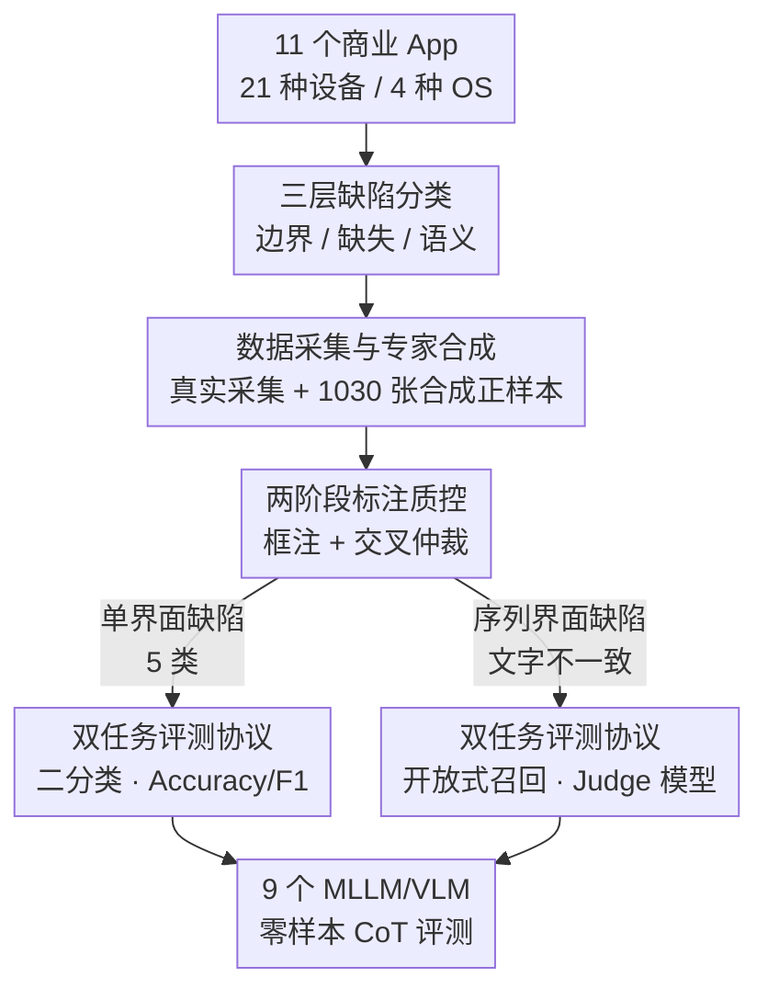

# UI-Lens: Assessing General MLLMs' Potential to Automate UI Display Quality Assurance

**会议**: CVPR 2026  
**论文**: [CVF Open Access](https://openaccess.thecvf.com/content/CVPR2026/html/Xiang_UI-Lens_Assessing_General_MLLMs_Potential_to_Automate_UI_Display_Quality_CVPR_2026_paper.html)  
**代码**: 数据集公开（论文称将开源中/英文版，链接以原文为准）  
**领域**: 多模态VLM  
**关键词**: UI缺陷检测, MLLM评测基准, 细粒度边界感知, 跨界面语义一致性, 商业App界面

## 一句话总结
UI-Lens 构建了一个面向真实商业 App 的多语言 UI 显示缺陷检测基准（中文 4,759 张界面 + 英文 3,392 张，6 类缺陷、专家标注），系统评测 9 个主流 MLLM/VLM 后发现：它们在细粒度边界缺陷（文字溢出 F1 仅 22.19%）和跨界面语义一致性（F1 仅 11.44%）上几乎等同随机猜测，暴露出当前模型"只认识物体是什么、不关心它怎么呈现"的根本短板。

## 研究背景与动机
**领域现状**：通用 MLLM/VLM 在"看懂正常 UI"上已经很强——能识别控件、读取文字、推断界面功能，OCR 和 UI 理解类任务做得不错。业界自然想把它们用到 UI 质量保障（QA）上，自动替代人工逐屏检查界面是否渲染异常。

**现有痛点**：但"看懂正常界面"和"发现界面坏了"是两回事。论文指出 MLLM 存在一个系统性偏置——它们被训练成关心"这是什么物体"（object-centric），而不关心"它是怎么被呈现的、当前处于什么状态"。可显示缺陷恰恰是后者：文字溢出、内容被裁切、容器重叠这类问题，往往只差几个像素，或者需要跨多张界面比对才能发现。现有 MLLM 研究大多在干净页面上做 OCR 或 UI 理解，根本没碰这个场景。

**核心矛盾**：缺一个能逼出模型真实能力的基准。已有的 UI 缺陷评测多基于 RICO 这类老旧开源数据集，交互逻辑简单、样式陈旧，捕捉不到现代商业级 App 里五花八门的显示缺陷；而且真实缺陷天然稀缺（高质量商业 App 本来就很少出 bug），导致大规模评测集难以构建。于是"基础模型到底能不能检测真实 UI 显示缺陷"一直是个未知数。

**本文目标**：把这个未知数变成可量化的结论——(1) 定义一套覆盖真实显示缺陷的细粒度任务体系；(2) 造一个高密度、专家标注、贴近真实的评测集；(3) 用统一协议系统评测主流模型，定位它们到底栽在哪。

**切入角度**：作者认为显示缺陷检测需要三种能力——细粒度元素边界理解、缺失内容感知、语义一致性判断——而这三者正是 object-centric 模型的盲区。所以与其堆规模，不如做一个"高难度、专家精标、1:1 正负平衡"的诊断性基准，专门测 SOTA 模型的极限。

**核心 idea**：用"专家合成 + 真实采集"补足缺陷样本稀缺，配上三层缺陷分类和双任务评测协议，把 UI 显示 QA 这个被忽视的能力维度第一次系统地量化出来。

## 方法详解
这是一篇基准（benchmark）论文，所以"方法"的核心是**数据怎么造**和**评测怎么设计**，而不是提出新模型。整体可以分成四步：先定义一套三层的缺陷分类体系，再按"真实采集 + 专家合成"凑齐贴近真实的样本，经过两阶段标注质控后，最后用一套针对单界面/序列界面分别设计的双任务协议去评测 9 个模型。

### 整体框架

输入是从真实商业 App 采集（并经专家增补）的界面截图，输出是 9 个主流模型在 6 类缺陷上的 Accuracy 与 F1 分数及误差归因。中间经过分类定义、数据构建、标注质控、双任务评测四个阶段。

### 关键设计

**1. 三层缺陷分类：把"界面坏了"拆成三种不同难度的能力**

作者没有把缺陷当成一个笼统的"异常"，而是按所需能力把 6 个子类组织成三大类，这样评测才能定位模型究竟缺哪种能力。**元素边界缺陷**（Element-boundary）包括文字溢出（Text Overflow）、内容裁切（Cropped Content）、容器重叠（Container Overlap），缺陷区域通常很细微，需要分析多个元素边界之间的空间关系；**内容缺失缺陷**（Content-missing）包括未显示内容（Undisplayed Content）和异常文字省略（Abnormal Text Ellipsis），考验模型判断信息呈现是否完整；**语义不一致缺陷**（Semantic-inconsistency）只含文字不一致（Text Inconsistency），通常发生在序列界面场景，需要跨多页理解上下文（如核对购买流程中各页价格是否一致）。这套分层让"边界 vs 缺失 vs 语义"成为可独立打分的轴，后面的结论才能落到"模型在边界上几乎随机、在缺失上还行、在语义上最差"这种细粒度判断。

**2. 数据采集与专家合成：用 Figma 精修弥补真实缺陷的稀缺**

真实商业 App 质量很高，显示缺陷天然稀缺，纯靠真实样本凑不出大规模评测集——这正是任务难的体现。作者先从 11 个头部商业 App（覆盖社交、电商、创作工具等，跨 21 种设备、4 种操作系统，特意包含大字体模式、深色模式等挑战场景）人工采集真实界面；再联合 8 位资深 UI/UX 设计专家（平均 7.8 年经验），基于真实界面用 Figma（类似 Photoshop 的专业图像处理）合成额外 1,030 张正样本（中文集）。关键是合成数据的真实性得到验证：在 35,308 条预测上，合成集与真实集的平均准确率几乎一致（62.82% vs 61.81%），且各缺陷类别上 Pearson 相关系数高达 $r=0.88$，说明这些合成样本高度贴近真实缺陷场景。这一步是整个基准成立的前提——既保证了规模和类型平衡，又没牺牲真实性。

**3. 两阶段标注质控：把专家标注做成可信的金标准**

细粒度缺陷检测对标注质量极其敏感，非专家标注会不可靠。作者让 8 位专家先共同制定 6 类缺陷的详细标注规范，再走两阶段流程：(1) 初标——专家用边界框（bounding box）标出缺陷区域；(2) 交叉验证与仲裁——由另一位专家复核，分歧由专家组讨论裁决。为量化一致性，在 1,000 条多专家标注子集上计算 Krippendorff's alpha，得分 0.8417，超过 0.80 的公认阈值，证明标注可靠。专家驱动的高质量标注正是这个基准区别于自动采集类数据集（如 WebUI 靠自动化追求规模）的核心——它不是训练语料，而是专门用来测 SOTA 模型极限的高密度诊断集。

**4. 双任务评测协议：单界面与序列界面用两套不同的度量**

两类缺陷的判定形式不同，需要分别设计评测。**单界面缺陷检测**：把每类缺陷当作二分类任务（界面有/无此缺陷），覆盖除文字不一致外的全部 5 类。由于数据集严格维持 1:1 正负平衡，Accuracy 成为主指标，此时 50% 恰好代表随机猜测；同时报告 Precision、Recall 和 F1。**序列界面缺陷检测**：针对文字不一致，需跨多页推理，被建模为开放式召回任务——引入一个 judge（裁判）模型，先从答案集抽取标准答案、从模型输出抽取对应输出，再依次做"页面交集判断"和"问题细节一致性校验"，用 Precision/Recall/F1 度量。这里不用 Accuracy，因为开放式任务没有明确的"真负例"集合（无法穷举模型没说出的所有正确陈述）。四个指标定义为：

$$\text{Accuracy} = \frac{TP+TN}{TP+TN+FP+FN}, \quad \text{Precision} = \frac{TP}{TP+FP}$$

$$\text{Recall} = \frac{TP}{TP+FN}, \quad \text{F1} = \frac{2 \times \text{Precision} \times \text{Recall}}{\text{Precision} + \text{Recall}}$$

所有评测统一用零样本 CoT、每个设置跑两次取平均，保证横向可比与公平。

### 数据集统计
中文集共 4,759 张界面，标注了 5,356 个缺陷实例。单界面缺陷维持约 1:1 正负比（确保 50% Accuracy 真正代表随机）；序列界面则采集 89 个序列，平均每序列 6.8 张界面、8.1 个标注实例，共 735 个文字不一致实例。各子类分布见下表。

| 缺陷子类 | 总样本 | 正样本 | 缺陷实例 | Bbox | 序列 |
|---------|-------|-------|---------|------|------|
| Text Overflow（文字溢出） | 716 | 358 | 835 | ✓ | ✗ |
| Cropped Content（内容裁切） | 790 | 395 | 831 | ✓ | ✗ |
| Container Overlap（容器重叠） | 872 | 436 | 921 | ✓ | ✗ |
| Undisplayed Content（未显示内容） | 850 | 425 | 878 | ✓ | ✗ |
| Abnormal Text Ellipsis（异常省略） | 928 | 464 | 1,156 | ✓ | ✗ |
| Text Inconsistency（文字不一致） | 603 | N/A | 735 | ✗ | ✓ |
| **合计** | **4,759** | **2,078** | **5,356** | — | — |

## 实验关键数据

### 主实验
评测 9 个主流模型（7 闭源 + 2 开源）：Seed 系列（Seed1.6、Seed1.6-Vison、Seed1.5-VL）、GPT 系列（GPT-5、GPT-4.1、GPT-4o）、Gemini-2.5-Pro，以及开源的 Qwen3-VL-235B-A22B 和 GLM-4.5V。下表为各任务的 F1 分数（TO=文字溢出，CC=内容裁切，CO=容器重叠，UC=未显示内容，ATE=异常省略，TI=文字不一致）。

| 模型 | TO | CC | CO | UC | ATE | TI |
|------|----|----|----|----|-----|-----|
| Seed1.6-Vison | 52.54 | 62.31 | 63.23 | 69.26 | 77.30 | 7.59 |
| Gemini-2.5-Pro | 64.67 | 61.60 | 65.05 | 67.68 | 74.97 | **24.94** |
| GPT-5 | 6.80 | 25.51 | 34.65 | 60.18 | 81.13 | 19.43 |
| GPT-4o | 38.77 | 62.01 | 36.24 | 61.11 | 74.42 | 11.71 |
| Seed1.5-VL | 4.91 | 30.62 | 8.83 | 57.28 | 74.06 | 1.92 |
| GLM-4.5V | 10.30 | 22.81 | N/A | 31.77 | 72.80 | 6.64 |
| **全模型均值（ALL）** | **22.19** | **42.05** | **33.75** | **57.78** | **75.24** | **11.44** |

最强的 Seed1.6-Vison 和 Gemini-2.5-Pro 也只有约 64%–66% 的模型平均 F1；细粒度边界任务上，全模型平均 Accuracy 仅 50.04%（TO）、54.07%（CC）、54.14%（CO），几乎就是抛硬币。

### 消融实验（提示策略）
作者在两个 SOTA 模型上对比 4 种提示范式，看能否靠 prompt engineering 救回性能（F1 分数）：

| 模型 | 0-shot | Self-correction | FGVP | One-shot |
|------|--------|-----------------|------|----------|
| Gemini-2.5-Pro | 66.79 | 66.89 (+0.10) | 67.08 (+0.29) | 67.39 (+0.60) |
| Seed1.6-Vison | 64.93 | 63.94 (−0.99) | 66.21 (+1.28) | 67.41 (+2.48) |

One-shot 通过给显式领域上下文略好于自推理类方法，但整体提升只有 +0.60 ~ +2.48，自纠正甚至可能掉点（−0.99）。

### 关键发现
- **细粒度边界与跨界面语义是重灾区，内容缺失相对可做**：边界类 F1 普遍极低（TO 22.19%、CO 33.75%、CC 42.05%，接近随机），文字不一致更只有 11.44%；相比之下内容缺失类好得多（UC 57.78%、ATE 75.24%）。说明模型擅长"内容在不在"，但不擅长"边界对不对、跨页一不一致"。
- **明显的 precision–recall 两极分化**：Gemini-2.5-Pro 走激进路线，召回率最高（81.41%）但精度最低（56.85%），需大量人工复核；Seed1.5-VL 走保守路线，精度最高（75.7%）但召回仅 27.07%，高覆盖场景下基本不可用。没有模型能两头兼顾。
- **提示工程救不了根本短板**：各种高级 prompt 只带来边际提升，说明模型缺的是"UI 常识认知模型"，只会推理表层视觉线索，"原子缺陷检测"能力靠 prompt 补不上来。
- **误差归因揭示四类硬伤**（以最强的 Gemini-2.5-Pro 为例）：细粒度感知瓶颈（"Minor Defect"占 29.5%，常是亚像素文字截断）、布局理解失败（幻觉出不存在的缺陷，如把代金券卡片的留白当异常空白）、无法推断设计意图（把环形图里故意的"?"误判为缺数据）、静态分析与交互上下文脱节（把可滚动容器里自然裁切的内容误判为裁切缺陷）；序列任务上则表现为"浅层推理"（85% 命中样本是简单数值不符如价格差异）和"缺乏路径级状态追踪"。

## 亮点与洞察
- **诊断性而非训练性基准**：它刻意做成"高密度、专家精标、1:1 平衡"，目的是测 SOTA 模型的极限而非当训练语料；50% Accuracy = 随机的设计，让"接近随机"这个结论极具说服力，避免了不平衡数据下的虚高准确率。
- **专家合成 + 量化验真这套方法可复用**：面对"真实缺陷稀缺"的通病，用专业设计师在 Figma 里精修合成，再用"合成集 vs 真实集准确率几乎相同 + Pearson r=0.88"证明真实性——这套"合成补稀缺、统计验真"的思路可迁移到任何缺陷/异常类稀缺数据场景。
- **三层分类直接对应三种模型能力**：把缺陷按"边界/缺失/语义"分层，使评测结果天然落到"模型缺哪种能力"上，比笼统报一个总分信息量大得多；这也是它能精确指出"边界几乎随机、语义最差"的原因。
- **序列任务的 judge 协议值得借鉴**：开放式召回任务无法定义真负例，作者用"页面交集判断 + 问题细节一致性校验"两步裁判流程，给跨页一致性这种难度量的能力提供了可操作的评测范式。

## 局限与展望
- **只评测、不提方案**：论文定位是基准，揭示了模型短板但没给出改进的检测方法（如专门的边界感知模块或交互式推理），如何把这些发现转成更强模型留给未来工作。
- **依赖 judge 模型评分**：序列界面任务的 F1 取决于裁判模型对"一致性"的判断，裁判本身的偏差/能力会影响结论的绝对值（不过横向比较仍可信）。
- **合成样本的潜在偏置**：尽管用统计指标验证了真实性，专家在 Figma 里合成的缺陷可能比真实缺陷更"典型/干净"，对最棘手的边角真实缺陷覆盖可能不足。
- **数据规模与训练价值有限**：作者也承认这是测试集而非大规模训练集，无法直接用来微调模型；要推动模型进步还需配套更大的训练资源。
- **改进思路**：可在此基准上探索引入版面/边界先验的视觉编码器、显式建模"是否可滚动"等交互可供性，以及为跨页一致性加入路径级状态记忆。

## 相关工作与启发
- **vs Owl Eyes / Nighthawk**: 早期系统基于视觉理解方法在移动 App 里定位元素错位、遮挡等显示缺陷；UI-Lens 不做检测系统，而是提供一个覆盖更广、贴近现代商业 App、专家精标的统一评测基准，并把通用 MLLM 拉进来横向评测。
- **vs AutoConsis**: AutoConsis 用多模态模型 + LLM 检测跨界面数据不一致（端到端检测方案）；UI-Lens 把"文字不一致"作为序列任务的一个子类纳入评测，关注的是通用模型在这类任务上的能力边界而非具体方案。
- **vs WebRSSBench / GUI Testing Arena**: WebRSSBench 评测 MLLM 在网页上的颜色鲁棒性与安全关键检测，GUI Testing Arena 评测 GUI agent 执行中发现缺陷的能力；UI-Lens 聚焦"显示缺陷的细粒度感知"维度（边界/缺失/语义），且强调多语言、商业级真实界面与专家标注。
- **vs OCR / UI 理解基准**: OCR 关注文字识别、UI 理解关注控件定位与功能推断，二者都假设页面是"正常的"；UI-Lens 第一次系统地把"界面是否坏了"作为独立能力维度量化出来，填补了这个空白。

## 评分
- 新颖性: ⭐⭐⭐⭐ 第一个系统化的 UI 显示缺陷检测基准，三层分类 + 双任务协议 + 专家合成验真的组合很扎实，但属于"开辟评测维度"而非提出新方法。
- 实验充分度: ⭐⭐⭐⭐⭐ 9 个主流模型、6 类任务、4 种提示策略横评，外加细粒度误差归因，结论可信且信息量大。
- 写作质量: ⭐⭐⭐⭐ 逻辑清晰、四个 Finding 层层递进、误差分析具体生动；个别统计细节散落在多处。
- 价值: ⭐⭐⭐⭐⭐ 揭示了 MLLM 在 UI QA 上"接近随机"的真实差距，为自动化 UI 测试与下一代视觉编码器指明了明确方向。

<!-- RELATED:START -->

## 相关论文

- [\[CVPR 2026\] Widget2Code: From Visual Widgets to UI Code via Multimodal LLMs](widget2code_from_visual_widgets_to_ui_code_via_multimodal_llms.md)
- [\[CVPR 2026\] FocusUI: Efficient UI Grounding via Position-Preserving Visual Token Selection](focusui_efficient_ui_grounding_via_position-preserving_visual_token_selection.md)
- [\[ACL 2026\] Beyond Screenshots: Evaluating VLMs' Understanding of UI Animations](../../ACL2026/multimodal_vlm/beyond_screenshots_evaluating_vlms_understanding_of_ui_animations.md)
- [\[CVPR 2026\] R-4B: Incentivizing General-Purpose Auto-Thinking in MLLMs via Bi-Mode Annealing and Reinforce Learning](r-4b_incentivizing_general-purpose_auto-thinking_in_mllms_via_bi-mode_annealing_.md)
- [\[ACL 2025\] Aria-UI: Visual Grounding for GUI Instructions](../../ACL2025/multimodal_vlm/aria-ui_visual_grounding_for_gui_instructions.md)

<!-- RELATED:END -->
