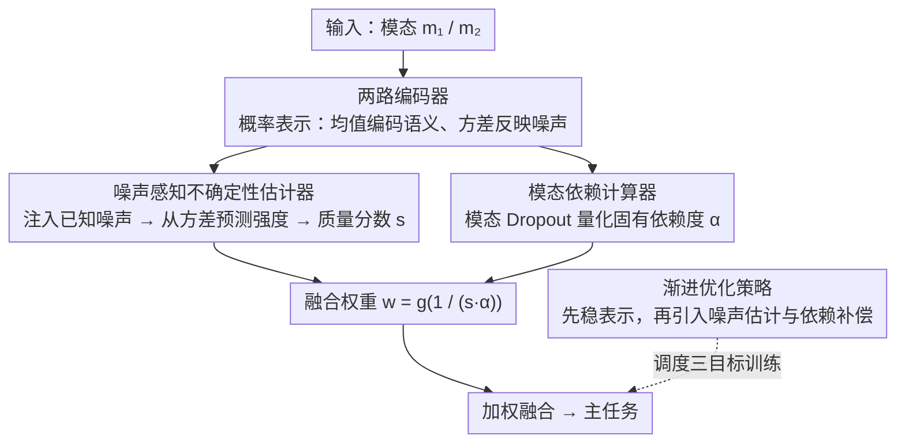

# Unbiased Dynamic Multimodal Fusion

**会议**: CVPR 2026  
**arXiv**: [2603.19681](https://arxiv.org/abs/2603.19681)  
**代码**: [https://github.com/shicaiwei123/UDML](https://github.com/shicaiwei123/UDML)  
**领域**: 多模态VLM / 多模态融合  
**关键词**: 动态多模态融合, 不确定性估计, 模态依赖偏差, 噪声感知, 双重抑制

## 一句话总结

UDML 提出无偏动态多模态学习框架，包含噪声感知不确定性估计器（通过注入可控噪声并预测其强度来实现在低噪和高噪条件下均准确的模态质量评估）和模态依赖计算器（通过 Dropout 量化模型对各模态的固有依赖偏差并融入加权机制），解决了现有方法的双重抑制问题，在多个多模态基准上一致提升性能。

## 研究背景与动机

1. **领域现状**：动态多模态学习根据输入数据的模态质量动态调整各模态的贡献权重，主要有基于先验的方法和基于不确定性的方法。
2. **现有痛点**：(1) 不确定性估计偏差：现有经验度量（如能量分数、概率嵌入）在低噪时不敏感（无法检测轻微退化），在高噪时仍给严重损坏的模态分配不可忽略的权重；(2) 双重抑制效应：现有方法假设各模态初始贡献相同，忽视了模型优化过程中产生的模态依赖偏差——难学的模态既被优化偏差抑制，又被高不确定性二次抑制。
3. **核心矛盾**：双重抑制导致动态融合反而不如静态融合，这与动态融合的设计初衷矛盾。
4. **本文目标**：设计一种在各噪声水平下都准确的不确定性估计器，同时量化并补偿模态依赖偏差。
5. **切入角度**：主动注入已知噪声来建立特征损坏与噪声强度的清晰对应关系；用模态 Dropout 量化固有依赖。
6. **核心 idea**：噪声感知估计 + 偏差补偿的双管齐下策略。

## 方法详解

### 整体框架

UDML 想解决的是动态多模态融合"越调越差"的怪现象：本该按模态质量动态加权，结果在 CREMA-D 上动态融合反而低于静态融合。论文把病根归结为两件事——不确定性估计在低噪和高噪两端都不准，以及模型对难学模态本身就存在依赖偏差。于是整条 pipeline 是这样转的：各模态编码后（用概率表示，均值编码语义、方差反映噪声），一路送进**噪声感知不确定性估计器**得到模态质量分数 $s$，另一路由**模态依赖计算器**算出模型对每个模态的固有依赖度 $\alpha$，两者共同决定融合权重 $w=g(1/(s\cdot\alpha))$，再加权融合送入主任务；整个训练由**渐进优化策略**调度，先把表示训稳再逐步引入后两者。整个框架只在模态表示这一层动手，不依赖具体的编码器或融合结构，因此可以即插即用到任意多模态模型。

### 关键设计

**1. 噪声感知不确定性估计器：让模态质量在任何噪声水平下都可测**

现有的经验度量（能量分数、概率嵌入 PE）有个隐患——它们没有对噪声的直接监督信号，于是低噪时迟钝（检测不到轻微退化），高噪时又对已经严重损坏的模态分配不可忽略的权重，两端都失准。UDML 换了个更有原则性的做法：训练时主动向模态数据注入**已知强度**的可控噪声，再让模型从编码特征反过来预测这个噪声强度。这里引入概率表示，把每个模态映射成一个分布——均值编码语义信息，方差反映噪声特性——估计器正是从方差去推导噪声强度。因为注入的噪声强度是已知的，特征损坏与噪声水平之间就建立起了清晰的监督对应，模型被迫学会"越脏的特征方差越大"，从而在从无噪声到严重损坏的全区间上单调响应，而不像 PE 那样在两端饱和失效。

**2. 模态依赖计算器：补偿难学模态被"双重抑制"的偏差**

光把不确定性估准还不够。论文指出现有方法都默认各模态初始贡献相同，却忽略了优化过程本身会让模型偏向易学的模态——难学模态先被优化偏差压低一次，再被随之而来的高不确定性二次压低，这就是"双重抑制"，也是动态融合不如静态融合的真正原因。为此 UDML 用模态 Dropout 量化模型输出对各模态的依赖程度 $\alpha^m$（去掉某模态后性能掉得越多，说明依赖越强），并把它直接乘进权重公式：

$$w_i^{m_1} = g\!\left(\frac{1}{s(z_i^{m_1}) \cdot \alpha^{m_1}}\right)$$

其中 $s(\cdot)$ 是不确定性分数。这样一来，一个本就高依赖的模态不会因为不确定性而被过度惩罚，一个低依赖、难学的模态也不会再被不确定性二次打压——分母里的 $\alpha$ 起到了反向托底的作用，把优化阶段欠下的偏差在融合阶段补回来。消融里这一项贡献约 1.7%，说明双重抑制确实是现有方法绕不过去的瓶颈。

**3. 渐进优化策略：让三个目标不互相打架**

噪声估计、依赖补偿和主任务这三个目标如果一上来一起优化，彼此会干扰——表示还没稳，噪声预测就在乱学。UDML 采用渐进式训练：先把多模态表示训稳，再逐步引入噪声感知估计与依赖补偿，让后两者建立在一个可靠的表示基础上，避免早期梯度互相拉扯。

### 损失函数 / 训练策略

总损失由三部分组成：主任务损失（分类 / 检测 / 分割等）、噪声预测损失（MSE，监督估计器学准噪声强度）、以及概率表示的 KL 散度正则化（约束模态分布、帮助泛化）。

## 实验关键数据

### 主实验

| 数据集 | 任务 | 静态融合 | 动态(PE) | UDML | 提升 vs 动态 |
|--------|------|---------|---------|------|-------------|
| CREMA-D | 音视频分类 | 67.2 | 65.8 | 71.5 | +5.7 |
| Kinetics-Sound | 音视频分类 | 64.1 | 63.5 | 66.8 | +3.3 |
| NYU Depth v2 | RGB-D分割 | 51.2 | 50.8 | 53.1 | +2.3 |

注意：在 CREMA-D 上，PE 动态融合(65.8)反而低于静态融合(67.2)，验证了双重抑制问题的存在。UDML 显著解决了此问题。

### 消融实验

| 配置 | CREMA-D Acc | 说明 |
|------|------------|------|
| 静态融合基线 | 67.2 | 无动态权重 |
| +噪声感知估计器 | 69.8 | 准确估计的贡献 |
| +模态依赖计算器 | 71.5 | 消除双重抑制 |
| w/o 概率表示 | 70.1 | 概率表示帮助泛化 |

### 关键发现

- 噪声感知估计器在所有噪声水平下单调响应，PE 在 $\sigma < 4$ 和 $\sigma > 10$ 时失效
- 模态依赖计算器贡献约 1.7%，说明双重抑制确实是现有方法的重要瓶颈
- UDML 架构无关，在 Concat/Attention/Gating 等多种融合方式上均有提升
- 在高噪声条件下优势更加明显，证明了鲁棒性

## 亮点与洞察

- **双重抑制的发现**：首次清晰地指出"动态融合不如静态融合"的根源是双重抑制，而非方法本身的缺陷
- **噪声注入+预测的估计范式**：比经验度量更有原则性，建立了噪声水平与不确定性的直接因果关系
- **架构无关设计**：所有组件仅操作模态表示，可即插即用到任意多模态模型

## 局限与展望

- 可控噪声注入假设噪声类型已知，实际中退化可能是未知类型
- 模态 Dropout 计算的依赖度是全局统计量，不是逐样本的
- 目前只验证了两模态场景，三模态及以上的扩展性待验证
- 未来可结合更精细的噪声建模（如噪声类型分类）

## 相关工作与启发

- **vs 概率嵌入 (PE)**: PE 经验性地用方差估不确定性，UDML 通过噪声预测任务显式学习
- **vs OGM-GE/Greedy**: 这些方法通过梯度调制解决优化不平衡，但未处理推理时的依赖偏差
- **vs TMC**: TMC 用 Dirichlet 分布建模不确定性，但同样假设模态等贡献

## 评分

- 新颖性: ⭐⭐⭐⭐ 双重抑制的分析深刻，噪声感知估计器设计合理
- 实验充分度: ⭐⭐⭐⭐ 多任务多数据集验证
- 写作质量: ⭐⭐⭐⭐ 问题分析清晰，可视化直观
- 价值: ⭐⭐⭐⭐ 对动态多模态融合有实际指导意义

<!-- RELATED:START -->

## 相关论文

- [\[CVPR 2026\] CoRiM: Conflict-driven Risk Minimization for Dynamic Multimodal Fusion](corim_conflict-driven_risk_minimization_for_dynamic_multimodal_fusion.md)
- [\[CVPR 2026\] Beyond Sequential Tools: A Unified VLM Agent System for Photographic Post-Processing via Dynamic Multi-Expert Fusion](beyond_sequential_tools_a_unified_vlm_agent_system_for_photographic_post-process.md)
- [\[CVPR 2026\] Towards Dynamic Modality Alignment in Multimodal Continual Learning](towards_dynamic_modality_alignment_in_multimodal_continual_learning.md)
- [\[CVPR 2026\] Multimodal Continual Instruction Tuning with Dynamic Gradient Guidance](multimodal_continual_instruction_tuning_with_dynamic_gradient_guidance.md)
- [\[CVPR 2026\] Geoint-R1: Formalizing Multimodal Geometric Reasoning with Dynamic Auxiliary Constructions](geoint-r1_formalizing_multimodal_geometric_reasoning_with_dynamic_auxiliary_cons.md)

<!-- RELATED:END -->
