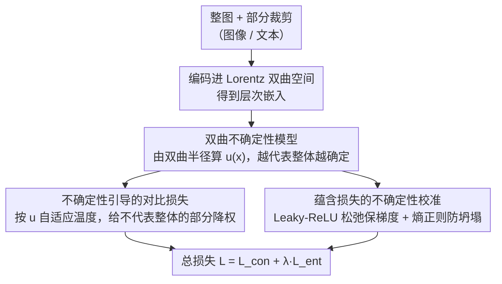

# Uncertainty-guided Compositional Alignment with Part-to-Whole Semantic Representativeness in Hyperbolic Vision-Language Models

**会议**: CVPR2026  
**arXiv**: [2603.22042](https://arxiv.org/abs/2603.22042)  
**代码**: [github.com/jeeit17/UNCHA](https://github.com/jeeit17/UNCHA)  
**领域**: 多模态VLM  
**关键词**: 双曲VLM, 不确定性建模, 部分-整体对齐, 组合性理解, 蕴含损失

## 一句话总结
提出UNCHA框架，在双曲VLM中用双曲不确定性建模部分图像对整体场景的语义代表性，通过不确定性引导的对比损失和蕴含损失增强组合性场景理解，在多个下游任务上超越现有双曲VLM。

## 研究背景与动机

**领域现状**：VLM 如 CLIP 在欧氏空间中难以捕捉层次关系（如部分-整体、父-子结构），且在多物体组合场景中存在偏差。双曲 VLM（如 MERU、ATMG、HyCoCLIP）通过双曲空间的负曲率和指数体积增长更好地保留层次结构。

**现有痛点**：现有双曲 VLM 未建模"不同部分对整体的不同语义代表性"——包含场景核心物体的裁剪比背景裁剪更能代表整体场景。如果所有部分被平等对待，模型无法区分更具代表性的部分和较少代表性的部分。

**核心 idea**：用双曲不确定性建模"部分图像对整体场景的语义代表性"，通过不确定性引导的对比损失和蕴含损失增强组合性场景理解。

## 方法详解

### 整体框架

双曲 VLM 已经能用负曲率空间保留「部分-整体」这类层次结构，但它把一张图的所有局部裁剪一视同仁——而含核心物体的裁剪显然比纯背景裁剪更能代表整张场景。UNCHA 在 HyCoCLIP 之上补上这层「代表性」：先用双曲半径定义一个能反映语义代表性的不确定性（uncertainty），把它接进对比损失去调每个部分的权重，再用蕴含损失（entailment loss）对不确定性做校准，让「越能代表整体的部分、不确定性越低」这件事真正成立。整条流程共享同一个不确定性 $u$，再分叉进对比与蕴含两条损失支路，最后合并成总损失。

### 关键设计

**1. 双曲不确定性模型：用到原点的距离衡量「有多代表整体」**

要区分代表性强弱，得先有个可量化的代理。UNCHA 利用双曲空间的几何特性——双曲半径（到原点的测地距离）与抽象程度单调相关：靠近原点的嵌入更抽象、更不确定，远离原点的更具体、更确定。据此定义不确定性 $u(x) = \log(1 + \exp(-\|x\|_2))$，于是「更能代表整体场景的部分」自然对应「更低的不确定性」，无需额外打标。

**2. 不确定性引导的对比损失：让模糊的部分少拉一点对齐**

如果所有部分等权参与对比，代表性差的背景裁剪会把对齐方向带偏。UNCHA 把不确定性接进对比温度，做成自适应温度 $\tau_{un,i}^I = \exp(u(i_i^{part})/2) \cdot \tau_{gl}$：不确定性越高的部分温度越大、对比损失贡献越小，相当于自动给「不像整体」的部分降权；同时补上局部对比损失，让部分图像与部分文本也对齐。

**3. 蕴含损失的不确定性校准：弱关系就允许更不确定，但别一起躺平**

部分压进整体的「蕴含锥」（entailment cone）后，原始蕴含损失在满足约束时梯度归零、不再提供信号。UNCHA 先用分段连续的松弛形式 $L_{ent}^* = \max(0, \phi - \eta\omega) + \alpha\phi$（Leaky-ReLU 式，末项 $\alpha\phi$ 即便嵌入已落进锥内也保留一点角度梯度）保住信号，再做不确定性校准 $L_{ent}^{cal} = \lfloor L_{ent}^* \rfloor e^{-u(p)} + u(p) + \mathcal{H}(\tilde{u}(p))$（$\lfloor\cdot\rfloor$ 为 stop-gradient）：蕴含关系弱时 $e^{-u(p)}$ 项鼓励增大不确定性，$u(p)$ 项防止模型为压低损失而把不确定性调得过高，末尾的熵正则 $\mathcal{H}$ 则防止所有部分的不确定性被压成均匀分布而坍塌——从而把整体与局部表示在双曲半径上拉开。

### 损失函数 / 训练策略

总损失为对比与蕴含两路之和：
$$L = \mathcal{L}_{con}^{un} + \lambda_{ent}\mathcal{L}_{ent}^{un}$$
全程在基于 Lorentz 模型的双曲空间内进行，用指数映射/对数映射在流形与切空间之间往返。

## 实验关键数据

### 主实验

| 模型 | ImageNet | CIFAR-10 | CUB | Cars | Pets | 说明 |
|------|---------|----------|-----|------|------|------|
| CLIP (ViT-S/16) | 36.7 | 70.2 | 9.8 | 6.9 | 44.6 | 基线 |
| MERU | 35.4 | 71.2 | 11.3 | 5.2 | 42.7 | 双曲基线 |
| HyCoCLIP | 提升 | 提升 | 提升 | 提升 | 提升 | 加入Part对齐 |
| UNCHA | 最优 | 最优 | 最优 | 最优 | 最优 | 加入不确定性建模 |

### 消融实验

| 配置 | 关键指标 | 说明 |
|------|---------|------|
| 无不确定性引导 | 性能下降 | 平等对待所有部分不够 |
| 无熵正则化 | 嵌入空间坍塞 | 不确定性趋向均匀 |
| 不确定性 vs 相似度 | r=-0.739 | 强负相关证实建模有效 |

### 关键发现
- 不确定性与部分-整体相似度的强负相关(r=-0.739)验证了建模的有效性
- 语义上更具代表性的部分显示更低不确定性，模糊或不具代表性的裁剪显示更高不确定性
- 在零样本分类、检索、多标签分类等多个下游任务上均超越现有双曲VLM

## 亮点与洞察
- 用双曲半径作为不确定性的代理是自然且优雅的设计
- 熵正则化防止不确定性坍塞的设计细节体现了对双曲空间特性的深入理解
- Leaky-ReLU式松弛的蕴含损失解决了压入锥体后梯度为零的问题
- 可视化分析直观展示了不确定性与语义代表性的对应关系

## 局限与展望
- 双曲空间的计算复杂度限制了向更大规模模型的扩展
- 部分图像通过随机裁剪生成，未q探索更智能的部分分割策略
- 仅在ViT-S/16和ViT-B/16上验证，更大视觉编码器待验证
- 不确定性阈值$\tau_A$的设置较为启发式

## 相关工作与启发
- MERU首先引入双曲VLM但仅建模跨模态蕴含
- HyCoCLIP扩展到模态内蕴含但未区分部分代表性
- 双曲半径作为不确定性代理的思路可推广到任何双曲表示学习场景

## 评分
- 新颖性: ⭐⭐⭐⭐ 双曲不确定性+语义代表性建模新颖
- 实验充分度: ⭐⭐⭐⭐ 16个数据集的零样本分类+多维度评估
- 写作质量: ⭐⭐⭐⭐ 公式推导详尽，结构清晰
- 价值: ⭐⭐⭐⭐ 推进了双曲VLM的组合性理解能力

<!-- RELATED:START -->

## 相关论文

- [\[CVPR 2026\] Hyperbolic Gramian Volumes for Multimodal Alignment](hyperbolic_gramian_volumes_for_multimodal_alignment.md)
- [\[CVPR 2026\] Proxy3D: Efficient 3D Representations for Vision-Language Models via Semantic Clustering and Alignment](proxy3d_efficient_3d_representations_for_vision-language_models_via_semantic_clu.md)
- [\[CVPR 2026\] Gravitation-Driven Semantic Alignment for Text Video Retrieval](gravitation-driven_semantic_alignment_for_text_video_retrieval.md)
- [\[CVPR 2026\] Uncertainty-Aware Knowledge Distillation for Multimodal Large Language Models](uncertainty-aware_knowledge_distillation_for_multimodal_large_language_models.md)
- [\[CVPR 2026\] When to Think and When to Look: Uncertainty-Guided Lookback](when_to_think_and_when_to_look_uncertainty-guided_lookback.md)

<!-- RELATED:END -->
