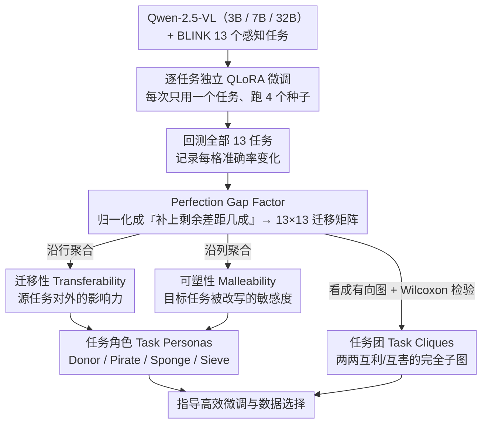

# Understanding Task Transfer in Vision-Language Models

**会议**: CVPR 2026 Oral  
**arXiv**: [2511.18787](https://arxiv.org/abs/2511.18787)  
**代码**: [https://aka.ms/task-transfer-vlms](https://aka.ms/task-transfer-vlms) (项目页)  
**领域**: 多模态VLM  
**关键词**: 视觉语言模型, 任务迁移, 感知任务, 微调, Perfection Gap Factor

## 一句话总结
本文首次系统研究了 VLM 在一个视觉感知任务上微调后对其他感知任务零样本性能的影响，提出 Perfection Gap Factor (PGF) 归一化指标量化跨任务迁移，在 Qwen-2.5-VL 三个尺度模型上揭示了任务迁移的结构性规律（正/负迁移团、任务角色分类、尺度依赖等），并证明 PGF 可指导数据选择提升微调效率。

## 研究背景与动机

1. **领域现状**：VLM 在多模态基准上表现优秀，但在基础视觉感知任务（深度估计、计数、目标定位等）上仍落后于人类和专家模型。在 BLINK 基准上，最好的模型（GPT-4o）也只有 60%，而人类达 95%。实践中通常用 LoRA 等方法在特定感知任务上微调来弥补差距。

2. **现有痛点**：对一个感知任务微调后，模型在其他感知任务上的表现变化是不可预测的——可能是正迁移也可能是负迁移。这种不确定性使得任务特定微调存在风险，但目前缺乏系统性研究来理解这种跨任务影响。

3. **核心矛盾**：VLM 的内部表示如何在不同感知任务间共享或竞争是未知的。不同任务可能依赖相同的底层视觉特征（互相促进），也可能争夺有限的模型容量（互相干扰）。

4. **本文目标** 回答一个核心问题：在 VLM 上微调一个感知任务，如何影响其在其他感知任务上的零样本表现？如何量化和利用这种跨任务关系？

5. **切入角度**：与 Taskonomy（需要在源和目标任务都做迁移学习）不同，本文研究的是零样本跨任务迁移——只微调源任务，不在目标任务上做任何训练。

6. **核心 idea**：通过 Perfection Gap Factor 归一化指标系统量化 VLM 感知任务间的零样本迁移关系，发现跨任务迁移具有结构性规律，可用于指导高效微调。

## 方法详解

### 整体框架
这篇论文要回答的问题很具体：在 VLM 上只微调一个感知任务，会怎样改变它在别的感知任务上的零样本表现？为此作者把 Qwen-2.5-VL 的三个尺度（3B、7B、32B）当作研究对象，在 BLINK 基准的 13 个感知任务上**逐个独立微调**（每次只用一个任务的数据做 LoRA），再让每个微调后的模型回到全部 13 个任务的验证集上重新测一遍。这样每个模型尺度都能填出一张 13×13 的迁移矩阵：行是被微调的源任务、列是被评估的目标任务，格子里装的就是下面定义的 PGF 分数。整套分析——正负迁移团、任务角色、尺度规律——全部建立在这张矩阵之上，方法的核心因此落在"格子里到底该填什么数、怎么从矩阵里读出结构"这两件事。

### 关键设计

**1. Perfection Gap Factor（PGF）：把"提升了多少"换成"补上了多少剩余差距"**

直接用准确率增益（微调后减微调前）填迁移矩阵有个致命问题：不同任务难度天差地别，增益的绝对值没法横向比。一个已经 90% 的任务再涨 3 个点，和一个 40% 的任务涨 10 个点，前者其实更难、更说明问题，但后者数字更大。PGF 的做法是把增益除以"到上界还剩多少空间"来归一化：

$$\mu_{i \to j} = \frac{\text{Acc}(\mathcal{M}(T_i), T_j) - \text{Acc}(\mathcal{M}, T_j)}{U_j - \text{Acc}(\mathcal{M}, T_j) + \epsilon}$$

分子是源任务 $T_i$ 微调后模型在目标任务 $T_j$ 上的准确率变化，分母是微调前模型离上界 $U_j$（默认 100%）还差的那段距离。这样读数就变成"这次微调把剩余差距填掉了几成"：$\mu=0$ 是无迁移，正值正迁移、负值负迁移。回到刚才的例子，90%→93% 的任务剩余空间只有 10 个点，填了 3 个点 PGF≈0.30；40%→50% 剩 60 个点只填了 10 个点 PGF≈0.17——归一化之后前者的迁移确实被判为更显著，正好对上直觉。PGF 的取值还天然不对称：正向最多填满剩余空间所以上界是 1，负向却可以一路掉到 $-(m-1)$，这对应"接近满分时退步比远离满分时退步更伤"的事实。

**2. Task Transferability（迁移性）：一个源任务对外的整体影响力**

填好矩阵后，第一件想知道的是"哪些任务微调后对别人最有益（或最有害）"。作者沿矩阵的行方向把一个源任务 $T_i$ 流向所有目标任务的 PGF 聚合起来，正负分开统计，正迁移性写作

$$\Delta(i)^+ = \frac{1-e^{-p/N}}{p}\sum_{j} \mu_{i\to j}\,\mathbf{1}_{\mu_{i\to j}>0}$$

负迁移性 $\Delta(i)^-$ 同理只累加负的那部分。关键在前面那个指数加权因子 $(1-e^{-p/N})/p$（$p$ 是它实际影响到的任务数、$N$ 是任务总数），它让"在少数任务上有大提升"和"在很多任务上各有小提升"这两种模式不会得到一样的分——既看影响的强度，也看影响的广度，单纯求和或求平均都做不到这点。

**3. Malleability（可塑性）：一个目标任务被外界改写的敏感度**

迁移性看的是"谁影响别人"，可塑性是它的对偶，看"谁容易被别人影响"。计算方式完全对称，只是改成沿矩阵的列方向聚合——把所有源任务流向同一个目标任务 $T_j$ 的 PGF 收集起来，同样正负分开。正可塑性高的任务，意味着随便拿别的任务来微调它都容易跟着受益；负可塑性高则相反，别人一动它就掉。有了迁移性和可塑性这一对，双向迁移关系才算刻画完整：既知道每个任务作为"输出方"的脾气，也知道它作为"接收方"的脾气。

**4. Task Cliques（任务团）：从矩阵里挖出互利/互害的任务子集**

单个格子只说明一对任务的单向关系，作者更想找的是"成群结伙"的结构——一组任务两两之间都正迁移（互利团）或都负迁移（互害团）。把迁移矩阵看成有向图，任务团就是其中所有有序对 $(T_i, T_j)$ 都呈现一致正（或一致负）迁移的完全子图。为了排除随机种子带来的噪声，每条边的迁移方向都用 Wilcoxon 检验跨 4 个 seed 验证显著性，只有稳定显著的边才算数。挖出来的结果直接体现了尺度效应：32B 能形成最大 9 个任务的正团，而 3B/7B 只能凑出 3-4 个任务的小团，说明大模型内部更多任务在共享而非争抢表示。

**5. Task Personas（任务角色）：给每个任务贴一张可操作的标签**

迁移性和可塑性各有正负两面，两两组合就把任务分成四种角色，这是给微调实践者最直接的产出。**Donor（施主）**是跨所有模型尺度都保持高正迁移性的任务——拿它微调几乎对别人都有好处，典型如 Semantic Correspondence；**Pirate（海盗）**反过来，持续高负迁移性、一微调就拖累别人，典型是 Functional Correspondence；**Sponge（海绵）**是高正可塑性的任务，随便用别的任务训都容易蹭到提升，如 Visual Similarity、Relative Depth；**Sieve（筛子）**则是高负可塑性，特别脆、容易被无关微调伤到，如 Forensic Detection。落到操作上就是一句话：优先微调 donor、回避 pirate 的数据、把希望寄托在 sponge 任务上。

### 损失函数 / 训练策略
使用 QLoRA（4-bit 量化）微调 Qwen-2.5-VL。训练集从 BLINK 的原始数据源重新构建，保持与 BLINK 一致的任务定义和回答格式，使评估口径不偏移。每个微调实验都跑 4 个随机种子，迁移矩阵里的每个数都是跨种子统计的结果，任务团也据此做显著性检验。

## 实验关键数据

### 主实验：PGF 迁移热力图关键发现

| 发现 | 3B | 7B | 32B |
|------|----|----|-----|
| 平均正迁移性 | 低 | 中 | 高（随模型增大单调增） |
| 最大正团大小 | 3-4 | 3-4 | **9** |
| Donor 任务 | SC | SC | SC（Semantic Corr.跨尺度一致） |
| Pirate 任务 | FC | FC | FC（Functional Corr.跨尺度一致） |
| Sponge 任务 | VS, RD, RR | VS, RD, RR | VS, RD, RR |
| Sieve 任务 | FD | — | FD（Forensic Detection） |

### PGF 引导数据选择 vs 随机选择（Qwen-2.5-VL 7B）

| 目标任务 | 直接微调 | 随机混合 | PGF引导混合 | 说明 |
|----------|---------|---------|------------|------|
| Jigsaw | baseline | 低于直接 | **超过直接微调** | PGF 选择优于直接监督 |
| Object Localization | baseline | 低于直接 | **超过直接微调** | PGF 选择优于直接监督 |
| 其他任务 | baseline | 各异 | 一致优于随机 | PGF 引导稳定有效 |

### 关键发现
- **尺度效应**：模型越大，正迁移越强（32B 正迁移最显著），但负迁移无明确趋势
- **感知层级**：低层任务（Relative Depth、Relative Reflectance）迁移性和可塑性都最高
- **粒度层级**：image-level 任务的正迁移性最大，pixel-level 和 image-level 任务都有高可塑性
- **视频迁移**：在 VSI-Bench 视频任务上也观察到类似模式，Relative Reflectance 仍是 donor，Forensic Detection 仍是 pirate
- **PGF 引导**：在 Jigsaw 和 Object Localization 上，PGF 引导的混合数据甚至超过了直接在目标任务上微调

## 亮点与洞察
- **PGF 指标设计巧妙**：通过归一化剩余提升空间，解决了不同难度任务间迁移效果不可比的核心问题。正值上界为1、负值下界为 $-(m-1)$ 的不对称性也是合理的——接近满分时退步比远离满分时退步更严重。
- **任务角色分类**：Donor/Pirate/Sponge/Sieve 的分类框架非常直观实用，为多任务微调策略提供了即刻可用的指导。
- **反直觉发现**：PGF 引导的间接混合数据微调可以超过直接在目标任务上微调，说明正迁移的叠加效应有时优于单一监督。
- **低层感知任务的核心地位**：低层任务（深度、反射率）既是最好的 donor 又是最好的 sponge，暗示 VLM 的早期视觉特征是高度可复用和可适应的。

## 局限与展望
- 基于多选题格式的基准，可能限制了开放式生成场景下迁移模式的发现
- 仅使用 Qwen-2.5-VL 系列模型，其他架构（如 LLaVA、InternVL）上的泛化性未验证
- 上界 $U_j$ 默认设为 100%，对不同任务可能不合理（有些任务人类也达不到 100%）
- 未研究多任务联合微调的迁移效应（本文仅考虑单源任务微调）
- PGF 引导数据选择的实验仅限于 7B 模型，需要更多模型和任务组合的验证

## 相关工作与启发
- **vs Taskonomy**: Taskonomy 在 pre-foundation model 时代用 CNN + 小解码器研究迁移学习（需要在目标任务也做 transfer learning），本文研究 VLM 时代的零样本跨任务迁移，更贴合基础模型的使用范式
- **vs Task2Vec/LEEP 等迁移度量**: 这些是基于信息论的表示间度量，PGF 直接基于任务性能定义，更直观且不需额外计算表示距离
- 对多任务微调策略设计非常有价值——先微调 donor 任务，避免 pirate 任务数据，优先考虑 sponge 任务

## 评分
- 新颖性: ⭐⭐⭐⭐ 首次系统研究 VLM 感知任务的零样本跨任务迁移，PGF 指标设计合理
- 实验充分度: ⭐⭐⭐⭐⭐ 三个模型尺度、13个任务、4个种子、视频扩展、数据选择应用，覆盖极广
- 写作质量: ⭐⭐⭐⭐ 形式化定义清晰，图表丰富，分析有深度
- 价值: ⭐⭐⭐⭐ 对 VLM 微调实践有直接指导意义，PGF 指标可广泛复用

<!-- RELATED:START -->

## 相关论文

- [\[CVPR 2026\] VOLD: Reasoning Transfer from LLMs to Vision-Language Models via On-Policy Distillation](vold_reasoning_transfer_from_llms_to_vision-language_models_via_on-policy_distil.md)
- [\[CVPR 2026\] AXG-Reasoner: Error Detection and Explanation in Long Task Videos with Vision-Language Models](axg-reasoner_error_detection_and_explanation_in_long_task_videos_with_vision-lan.md)
- [\[CVPR 2026\] LVLM-Aided Alignment of Task-Specific Vision Models](lvlm-aided_alignment_of_task-specific_vision_models.md)
- [\[CVPR 2026\] HiSpatial: Taming Hierarchical 3D Spatial Understanding in Vision-Language Models](hispatial_taming_hierarchical_3d_spatial_understanding_in_vision-language_models.md)
- [\[ECCV 2024\] Select and Distill: Selective Dual-Teacher Knowledge Transfer for Continual Learning on Vision-Language Models](../../ECCV2024/multimodal_vlm/select_and_distill_selective_dual-teacher_knowledge_transfer_for_continual_learn.md)

<!-- RELATED:END -->
