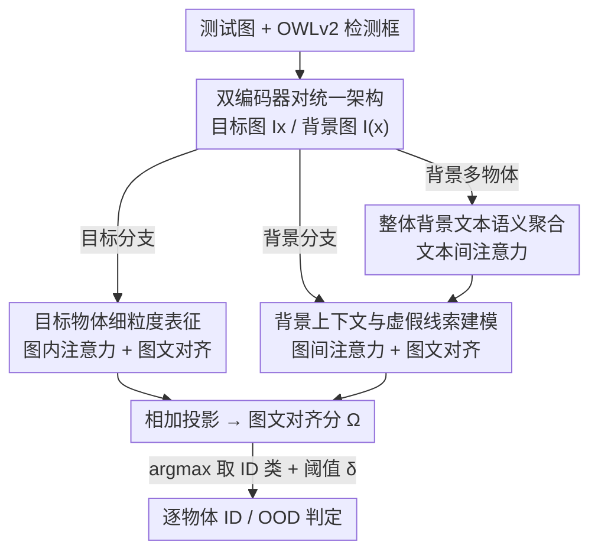

# UNI-OOD: Unified Object- and Image-level Out-of-Distribution Detection via Cross-Context Attentive Vision-Language Modeling

**会议**: CVPR 2026  
**论文**: [CVF Open Access](https://openaccess.thecvf.com/content/CVPR2026/html/Li_UNI-OOD_Unified_Object-_and_Image-level_Out-of-Distribution_Detection_via_Cross-Context_Attentive_CVPR_2026_paper.html)  
**代码**: 待确认  
**领域**: 多模态VLM（OOD 检测 / 可靠部署）  
**关键词**: OOD 检测, 视觉语言模型, CLIP, 跨上下文注意力, 物体级检测

## 一句话总结
UNI-OOD 用两对相同的 CLIP 图文编码器分别建模"目标物体"和"背景"，靠四类跨上下文注意力（图内 / 图间 / 文本间 + 图文对齐）把细粒度物体证据从虚假背景关联中解耦出来，第一次用一个模型、无需推理时预先知道任务类型，就在物体级和图像级 OOD 检测上同时刷到 SOTA。

## 研究背景与动机
**领域现状**：OOD（分布外）检测是模型可靠落地的前提——它要识别出落在已知语义范围之外的输入。近年视觉语言模型（VLM，尤其 CLIP）把图像级 OOD 检测推到了很高水平，靠的是 CLIP 丰富的图文语义和少样本提示学习（CoOp、LoCoOp、NegPrompt 等）。

**现有痛点**：这些图像级方法几乎都默认"一张图里只有一个主导物体"。但自动驾驶、机器人、监控这些真实场景里，一张图天然包含多个物体，每个都要独立判断是不是 OOD。于是物体级 OOD 检测才是更贴合实际的形式，而图像级只是它的特例（图里只有/只主导一个物体时）。问题是两条线长期割裂：图像级方法压根没法用在多物体上；物体级方法又大多依赖全量训练的 CNN backbone（要拿到完整 ID 数据、容量也比 VLM 弱）。

**核心矛盾**：唯一把 VLM 引入物体级的工作 RUNA 仍有两处硬伤——(1) 它对目标物体和背景都只取 ViT 的 `[CLS]` 输出嵌入，丢掉了 patch 级的细粒度空间信息；(2) 它对整个背景一刀切地做全局高斯模糊，无视背景里不同区域的语义差异。结果是 RUNA 既没用好目标物体的细节，也没分清背景里哪些是有用上下文、哪些是会误导的虚假关联（spurious cue），甚至在图像级任务上还明显输给现代图像级方法。

**本文目标**：做一个统一框架，无需推理时预先告知是物体级还是图像级，就能在两种设定下都达到 SOTA。

**切入角度**：把"目标物体"和"它的背景"当成两个互补的上下文来联合推理——对每个物体，把它本身当目标、把图里其余部分当背景，并用注意力机制在视觉/文本、目标/背景之间建立细粒度的跨上下文对应。

**核心 idea**：用"跨上下文注意力建模"取代 RUNA 的粗糙全局表征——同时挖掘目标物体内部的细粒度证据、对齐图文语义、并显式建模目标与背景之间的相互作用，从而在不同视觉粒度上得到一致的 OOD 评分。

## 方法详解

### 整体框架
UNI-OOD 的骨架是**两对完全相同的 CLIP 图文编码器**（图像编码器 1/文本编码器 1 负责目标物体，图像编码器 2/文本编码器 2 负责背景），权重和结构一致但参数独立服务两个上下文。对一张图 $I$，把每个物体 $x$ 轮流当作"目标"：用其 bounding box 裁出目标图 $I_x$ 交给编码器 1，把 $x$ 区域 mask 掉得到背景图 $I_{(x)}$ 交给编码器 2，背景里剩下的物体集合记为 $X^I_{(x)} = X^I \setminus \{x\}$。

统一的关键在于**让图像级成为物体级的特例**：图像级数据集（如 ImageNet-1k）每图只有一个物体、没有 box，作者特意在训练时引入预训练检测器 OWLv2 给它框出唯一物体 $x$，于是 $|X^I|=1$、背景里没有别的物体（$X^I_{(x)}=\varnothing$），此时文本编码器 2 被省略、但图像编码器 2 仍照常给背景图出视觉嵌入。这样两种设定共用一套训练/推理流程，推理时不必预先知道是哪种任务。

整体数据流是：目标分支用图内注意力 + 图文对齐得到细粒度目标嵌入 $z^{img}_x$，背景分支用图间注意力 + 文本间注意力 + 图文对齐得到背景嵌入 $z^{img}_{(x)}$，两者相加投影成最终图像表征 $M^{img}(I_x, I_{(x)}) = P\cdot(z^{img}_x + z^{img}_{(x)})$，再和目标物体的文本嵌入算余弦相似度 $\Omega(I_x, t_x)$ 作为对齐分数；推理时对所有 ID 类提示取最大对齐分、与阈值 $\delta$ 比较来判 ID/OOD。

### 关键设计

**1. 双编码器对 + 目标/背景统一形式化：把图像级收编为物体级的特例**

RUNA 之所以割裂，是因为它没有一个能同时承载"单物体"和"多物体"的统一表示。本设计的做法是为每个目标物体 $x$ 构造一对输入——目标图 $I_x$（裁框）和背景图 $I_{(x)}$（mask 掉 $x$），分别送进两对独立的 CLIP 编码器。对多物体图，逐物体轮流当目标；对单物体图，用 OWLv2 先检测出唯一物体再走同一流程，此时背景为空、文本编码器 2 自动退化。这一形式化让"图像级 = 物体集合大小为 1 的物体级"在数学上自然成立，因此一套模型、一套训练目标就覆盖两种任务，推理时也无需预先指定任务类型。

**2. 目标物体细粒度表征：用图内注意力 + 图文对齐把 patch 级证据找回来**

针对 RUNA 只用 `[CLS]`、丢掉 patch 细节的硬伤，本设计为目标图的每个 token（含 `[CLS]` 和 $N$ 个 patch）算两组互补权重再融合。第一组 $\beta^{img}_{i,x}$ 来自**图内注意力**（intra-image attention）：度量 `[CLS]` token 对每个 patch 的关注度，逐头逐层注意力系数

$$\alpha^{img,l,h}_{i,0,intra} = \text{softmax}_i\!\left(\frac{1}{\sqrt{d^{img}_h}}\,(k^{img,l,h}_{i,x})^\top q^{img,l,h}_{0,x}\right)$$

再对所有层 $L$、所有头 $H$ 平均得 $\beta^{img}_{i,x} = \frac{1}{LH}\sum_l\sum_h \alpha^{img,l,h}_{i,0,intra}$，捕捉"整体表征与局部空间细节"的内部相关性。第二组 $\mu_{i,x}=\max(\cos(Pz^{img,L}_{i,x}, M^{text}(t_x)), 0)$ 来自**图文对齐**，度量每个视觉 token 与目标文本描述的语义一致性。两组权重相乘后加权所有嵌入：patch 嵌入先经一个三层 CNN（保留二维空间结构）聚合，再和加权 `[CLS]` 嵌入经单层 MLP 融合，得到细粒度目标表征 $z^{img}_x$。$\beta$ 负责"哪里在空间上重要"、$\mu$ 负责"哪里在语义上对得上"，两者共同把被 RUNA 丢弃的细粒度证据重新激活。

**3. 背景上下文与虚假线索建模：用图间注意力区分有用上下文与误导关联**

RUNA 把整个背景一律高斯模糊，等于放弃了背景里的语义结构。本设计改用**图间注意力**（inter-image attention）：让目标编码器 1 的 `[CLS]` query 去 attend 背景编码器 2 的每个 token，

$$\alpha^{img,l,h}_{i,0,inter} = \text{softmax}_i\!\left(\frac{1}{\sqrt{d^{img}_h}}\,(k^{img,l,h}_{i,(x)})^\top q^{img,l,h}_{0,x}\right)$$

逐头逐层平均成背景视觉权重 $\beta^{img}_{i,(x)}$，量化"目标物体对背景每个区域的关注度"——这正是在挑出哪些背景区域是相对目标的潜在虚假线索 / 信息性上下文。物体级任务再叠加背景的图文对齐权重 $\mu_{i,(x)}$，图像级任务因没有背景文本则只用 $\beta$（公式里用 $[y]_{obj}$ 开关：物体级取真值、图像级取 1）。同样经 CNN+MLP 融合得背景嵌入 $z^{img}_{(x)}$。和目标分支共用"双权重加权 + CNN 保空间 + MLP 融合"的 combiner 结构，但语义指向是"背景里什么该被当作上下文证据、什么是该被抑制的虚假关联"。

**4. 整体背景文本语义聚合：用文本间注意力把多物体提示揉成一个 holistic 嵌入**

背景常含多个物体，CLIP 文本编码器却习惯"A photo of a [object]"这种单物体提示。作者实测发现：把多个物体嵌入简单平均、或把类名用逗号拼成一个提示，都无法表达 CLIP 训练时（描述性 caption）那种物体间整体语义关系。本设计提出**文本间注意力**（inter-text attention）：让文本编码器 1 中目标物体的 `[EOT]` token 去 attend 文本编码器 2 中每个背景物体的 `[EOT]` token，得到权重 $w^{text}_{x',x}$，再按权重加权聚合多个背景文本嵌入成单一整体嵌入

$$\tilde{M}^{text}(t_{(x)}) = \sum_{x'\in X^I_{(x)}} w^{text}_{x',x}\cdot M^{text}(t_{x'})$$

它再与背景视觉嵌入算图文对齐 $\mu_{i,(x)}$。推理时有个工程难点：真实背景物体组合数随 ID 类数组合爆炸（如 PASCAL-VOC 20 类、背景 5 物体就要算 $\binom{20}{5}=15{,}504$ 种）。作者用同一套 inter-text 注意力，把所有 ID 类提示 $\{M^{text}(t^c_{ID})\}$ 按与目标文本 $t_x$ 的注意力权重聚合成一个**条件于目标物体的整体背景文本嵌入** $\tilde{M}^{text}(t_{C_{ID}}, x)$，从组合枚举变成一次加权聚合，让推理可行。

### 损失函数 / 训练策略
少样本设定下只用 ID 样本（物体级如 BDD-100k 用 10-shot，图像级如 ImageNet-1k 用 16-shot）。把最终图像表征与目标文本嵌入的余弦相似度 $\Omega(I_x, t_x)=\cos(M^{img}(I_x,I_{(x)}), M^{text}(t_x))$ 当作标准 CLIP 损失里的对齐分数，但**把每张图替换成每个物体**，计算图到文 $L_{image}$ 和文到图 $L_{text}$，总损失 $L = L_{image} + L_{text}$。CLIP 主干冻结，只训练 combiner 里的 CNN 和 MLP。推理时对每个目标物体取最可能 ID 类 $c^\star = \arg\max_{c\in C_{ID}} \Omega(I^{test}_x, t^c_{ID})$，若 $\Omega(I^{test}_x, t^{c^\star}_{ID}) > \delta$ 判为 ID，否则 OOD。

## 实验关键数据

### 主实验
物体级（10-shot 微调，ID 为 BDD-100k / PASCAL-VOC，OOD 为 OpenImages / MS-COCO）UNI-OOD 在全部 8 个指标上都超过此前 SOTA RUNA，且优于全量训练的传统方法：

| 设定 (ID→OOD) | 指标 | RUNA | 本文 (Ours) |
|---|---|---|---|
| BDD-100k → OpenImages | AUROC↑ / FPR95↓ | 97.05 / 8.57 | **98.52 / 3.68** |
| BDD-100k → MS-COCO | AUROC↑ / FPR95↓ | 94.10 / 15.23 | **95.91 / 11.32** |
| PASCAL-VOC → OpenImages | AUROC↑ / FPR95↓ | 94.13 / 22.35 | **96.25 / 14.30** |
| PASCAL-VOC → MS-COCO | AUROC↑ / FPR95↓ | 92.92 / 28.35 | **95.07 / 22.24** |

图像级（ImageNet-1k 为 ID，16-shot）平均 AUROC 96.83 / FPR95 15.93，全面超过 NegPrompt、DPM-T 等专门的图像级方法；尤其值得注意的是 RUNA 即使被"额外告知任务是图像级"，平均也只有 93.32 / 26.58，明显落后：

| 方法 | 平均 AUROC↑ | 平均 FPR95↓ |
|---|---|---|
| LoCoOp | 93.53 | 28.66 |
| DPM-T | 95.72 | 21.09 |
| NegPrompt | 94.81 | 23.03 |
| RUNA（需预知任务类型） | 93.32 | 26.58 |
| **本文 (Ours)** | **96.83** | **15.93** |

### 消融实验
以物体级（10-shot，AUROC↑ / FPR95↓）的 BDD-100k→OpenImages 为代表，逐一去掉/替换组件：

| 配置 | AUROC↑ / FPR95↓ | 说明 |
|---|---|---|
| 背景文本用逗号拼接 | 93.21 / 12.72 | 朴素拼接，掉点最多 |
| 背景文本简单平均 | 95.05 / 8.60 | 平均嵌入仍不足 |
| 背景文本用 MLP 聚合 | 97.20 / 4.63 | 比 inter-text 差 |
| w/o 图间注意力（背景） | 96.02 / 6.21 | 失去虚假线索建模 |
| w/o 图文对齐（背景） | 96.67 / 5.04 | 背景语义对齐缺失 |
| w/o 图内注意力（目标） | 95.72 / 6.87 | 丢目标细粒度，掉点显著 |
| w/o 图文对齐（目标） | 96.35 / 5.26 | 目标语义对齐缺失 |
| w/o CNNs（combiner） | 97.14 / 4.59 | 丢失 patch 空间结构 |
| **Ours (Full)** | **98.52 / 3.68** | 完整模型 |

### 关键发现
- **背景文本聚合方式是最大杠杆**：用逗号拼接 / 简单平均替代 inter-text 注意力时掉点最猛（AUROC 从 98.52 跌到 93.21），印证"CLIP 文本编码器更吃整体描述性语义、而非机械拼接类名"这一观察。
- **目标分支的图内注意力贡献突出**：去掉后 AUROC 掉到 95.72，说明 RUNA 只用 `[CLS]`、丢 patch 细节确实是它的主要瓶颈。
- **背景的图间注意力与图文对齐缺一不可**：两者去任一都同时拖累物体级和图像级，验证"区分有用上下文 vs 虚假关联"对统一框架的必要性。
- **combiner 里的 CNN 价值在保空间结构**：去掉后 AUROC 从 98.52 降到 97.14，说明二维空间信息对细粒度 OOD 判别有实质帮助。

## 亮点与洞察
- **"图像级是物体级特例"的统一形式化很干净**：通过在训练时给单物体图也跑 OWLv2 检测，作者把两个长期割裂的任务收进同一套数学形式，推理时还能免去"预先知道任务类型"这个不现实的假设——这是把工程约束转成研究优势的漂亮一手。
- **四类跨上下文注意力各司其职、可解释**：图内（目标内部细节）、图间（目标↔背景虚假线索）、文本间（多背景物体→整体语义）、图文对齐（视觉↔文本），每个都对应一个明确痛点，消融也逐一验证，不是堆 attention 凑性能。
- **推理期的组合爆炸近似很实用**：把背景物体组合枚举（$\binom{20}{5}$）换成"对 ID 类提示做一次条件聚合"，是个可迁移到其它需要枚举上下文场景的工程 trick。
- **冻结 CLIP、只训 combiner 的轻量微调**：10/16-shot 就超过全量训练的 CNN 方法，说明性能主要来自表征的"用法"而非"重训"。

## 局限与展望
- **强依赖外部检测器 OWLv2**：物体框由 OWLv2 提供，检测漏检/错框会直接传导到 OOD 判定；论文虽有检测器影响的附录分析，但框架对检测质量的鲁棒性边界值得更系统地评估。
- **逐物体处理的计算开销**：多物体图要把每个物体轮流当目标、各跑一遍双编码器对，物体数多时推理成本随之线性增长，论文把复杂度分析放在附录，正文未给出与 RUNA 的直接时延对比。
- **双倍编码器的显存代价**：两对完整 CLIP 编码器（虽共享预训练权重）相比单编码器方案占用更高，资源受限场景下的可部署性需要权衡。
- **背景文本推理近似的语义偏差**：推理时用全 ID 类聚合代替真实背景物体，理论上和训练时的真实背景嵌入存在分布差，这种近似在背景物体远超 ID 类范围时是否仍稳健，缺少压力测试。

## 相关工作与启发
- **vs RUNA**：同样是首批把 CLIP 用于物体级 OOD 的工作，但 RUNA 只取 `[CLS]`、对背景统一高斯模糊；UNI-OOD 改用 patch 级图内注意力找回细粒度、用图间/文本间注意力精细建模背景，且统一了物体级与图像级，结果在两个任务上都反超 RUNA。
- **vs 图像级 VLM 方法（NegPrompt / DPM-T / LoCoOp 等）**：它们默认单物体、靠提示学习或负文本语义，多物体场景直接失效；UNI-OOD 把图像级当成物体级特例处理，在 ImageNet-1k 图像级 benchmark 上还反过来超过这些专门方法。
- **vs 传统 CNN 物体级方法（VOS / SIREN / SAFE / WFS 等）**：传统方法需全量 ID 数据训练、容量受限于 CNN；UNI-OOD 冻结 CLIP、仅 10-shot 微调 combiner，就在 AUROC/FPR95 上全面领先，体现 VLM 表征的样本效率优势。

## 评分
- 新颖性: ⭐⭐⭐⭐⭐ 首个统一物体级与图像级 OOD 的 VLM 框架，四类跨上下文注意力 + "图像级即特例"的形式化都很有原创性。
- 实验充分度: ⭐⭐⭐⭐ 物体级/图像级双 benchmark + 逐组件消融充分，10 次重复带 SEM；但正文未给计算/时延对比，部分分析压在附录。
- 写作质量: ⭐⭐⭐⭐ 动机层层递进、公式完整、模块职责清晰；符号略密集，多物体逐一处理的流程需要读者自行串联。
- 价值: ⭐⭐⭐⭐⭐ 直击多物体真实场景的可靠部署需求，统一框架 + SOTA 性能对自动驾驶/机器人等安全敏感应用有直接价值。

<!-- RELATED:START -->

## 相关论文

- [\[CVPR 2026\] Modeling Cross-vision Synergy for Unified Large Vision Model](modeling_cross-vision_synergy_for_unified_large_vision_model.md)
- [\[CVPR 2026\] Boosting Vision-Language Models Towards Cross-Domain Incremental Object Detection](boosting_vision-language_models_towards_cross-domain_incremental_object_detectio.md)
- [\[CVPR 2026\] TTL: Test-time Textual Learning for OOD Detection with Pretrained Vision-Language Models](ttl_test-time_textual_learning_for_ood_detection_with_pretrained_vision-language.md)
- [\[AAAI 2026\] Cross-modal Proxy Evolving for OOD Detection with Vision-Language Models](../../AAAI2026/multimodal_vlm/cross-modal_proxy_evolving_for_ood_detection_with_vision-lan.md)
- [\[CVPR 2026\] Activation Matters: Test-time Activated Negative Labels for OOD Detection with Vision-Language Models](activation_matters_test-time_activated_negative_labels_for_ood_detection_with_vi.md)

<!-- RELATED:END -->
