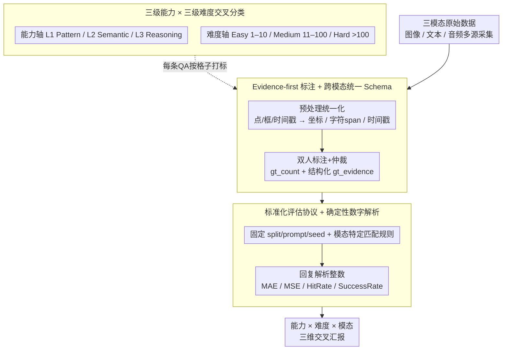

# UNICBench: UNIfied Counting Benchmark for MLLM

**会议**: CVPR 2026  
**arXiv**: [2603.00595](https://arxiv.org/abs/2603.00595)  
**代码**: 公开评估工具包  
**领域**: 多模态基准 / MLLM评估  
**关键词**: counting benchmark, multimodal LLM, image-text-audio, unified evaluation, stratified difficulty  

## 一句话总结

推出UNICBench，首个统一的跨模态（图像/文本/音频）多层级计数基准，包含5,508+5,888+2,905共14,301个QA对及三级能力(Pattern/Semantic/Reasoning)×三级难度(Easy/Medium/Hard)分类，系统评估45个SOTA MLLM，揭示基本计数任务趋近但推理级和困难任务存在显著差距。

## 研究背景与动机

**领域现状**：计数是多模态大模型的核心认知能力，关乎数感（人类和动物的基本认知）。MLLM在通用VQA/推理基准上进展迅速，但缺乏将"计数"作为独立能力进行跨模态系统评估的基准。

**现有痛点**：(1) 图像计数数据集标注格式不统一（点/框/密度图），难以直接用于MLLM的QA评测；(2) 文本和音频计数数据极度稀缺——文档去重计数、音频事件计数几乎无公开QA数据集；(3) 评估协议不一致——不同工作的split/prompt/seed/匹配规则各异，结果不可比；(4) 闭源模型API成本高、速率受限，跨模型公平对比困难。

**核心矛盾**：计数能力横跨感知定位、语义过滤、规则推理三个层次，现有基准要么只覆盖单一模态，要么不区分能力层级，无法系统定位MLLM的计数瓶颈。

**本文目标** 建立一个覆盖图像/文本/音频三模态、有统一QA格式和评估协议、并能分层诊断能力短板的计数基准。

**切入角度**：设计三级能力分类(Pattern/Semantic/Reasoning)和三级难度分类(Easy/Medium/Hard)的交叉分类体系，配合evidence-first GT和确定性数字解析。

**核心 idea**：将计数能力分解为感知计数→语义过滤→规则推理三个层次，跨图像/文本/音频统一评测，用MAE/HitRate等指标分层诊断MLLM的计数瓶颈。

## 方法详解

### 整体框架

UNICBench要解决的是「计数」这件事在多模态大模型里没有一把统一标尺的问题——图像、文本、音频三种模态各有各的标注格式和评测协议，结果之间没法横向比。它的做法是把三模态的计数题全部归一成同一种「问题—证据—答案」结构：每道题给出一段输入（一张图、一篇文档或一段音频）、一个自然语言问题、一个整数答案，外加一份可追溯的证据。在这套统一语料之上，再叠两层结构——一是把每道题按「考的是哪种计数能力」和「场景有多难」做交叉打标，二是固定一套评测协议（split、prompt、随机种子都钉死，配模态特定的答案匹配规则），最后按「能力×难度×模态」三维交叉汇报成绩，让人能直接读出某个模型在哪一格塌方。

### 关键设计

**1. 三级能力 × 三级难度交叉分类：把「数不对」拆成可定位的格子**

只报一个总体准确率，没法回答「模型到底是看不清还是算不明白」。UNICBench把计数能力沿难度递增切成三层：Pattern（L1）是直接感知计数，答案就是实例集合的大小 $y=|E|$，比如「图里有几个人」；Semantic（L2）要先按属性过滤或去重再数，$y=|\{e \in E \mid P(e)\}|$，比如「穿红衣服的人有几个」；Reasoning（L3）要按规则做组合计数，$y=g(|S_1|,\ldots)$，比如「2022 年被修改过的文件夹有几个」。难度则按客观度量（目标密度、遮挡、重复率）映射成 Easy（1–10）、Medium（11–100）、Hard（>100）三档。两套标签一交叉，诊断粒度就细到「是感知层在密集场景塌了，还是推理层在简单场景就出错」，而不是笼统说一句模型计数差。

**2. Evidence-first 标注 + 跨模态统一 Schema：让每个答案都查得到来源**

跨模态对比要有意义，前提是三种模态的真值得是同一种东西。UNICBench 给每道题的真值不只存一个 `gt_count`，还存一份结构化的 `gt_evidence`——图像存实例坐标、文本存字符级 span、音频存时间戳，等于把「凭什么数出这个数」一并落盘，答案可逐一回溯核对。问题模板也分层处理：L1 用确定性模板压住语言表述的随机变异，L2/L3 放开成自由格式但显式写清过滤规则，避免歧义。标注走双人独立标注加仲裁的多阶段质控，做到 100% 一致性。这样统一的 schema 既保证了真值可验证，也让「图像的数」和「音频的数」能放进同一张表里比。

**3. 标准化评估协议 + 确定性数字解析：把结果不可比的隐患堵死**

以往不同工作的 split、prompt、seed、匹配规则各不相同，分数压根没法对齐。UNICBench 把这些全部钉死：split、prompt、随机种子固定，匹配规则按模态定制（数值类走精确匹配，连续量走 ε-容差）。模型输出是自然语言，还要过一道确定性数字解析，从回复里稳定地抽出那个整数，避免「答对了但格式没解析到」的误判。最终用一组互补指标汇报——MAE、MSE 衡量数值偏差，SuccessRate 衡量模型能不能稳定吐出可解析的数字，HitRate@100%/@90%/@80% 衡量在不同容错带内的命中率，合起来既看准头也看鲁棒性。

### 评估指标定义

UNICBench 是评测基准，不涉及模型训练。核心指标定义为：MAE $=\frac{1}{N}\sum|y_i - \hat{y}_i|$、MSE $=\frac{1}{N}\sum(y_i - \hat{y}_i)^2$ 衡量预测计数与真值的偏差；HitRate@X% 是允许 X% 误差带内的准确率；SuccessRate 是模型成功返回可解析数字的比率。

## 实验关键数据

### 主实验（图像模态Top-10模型）

| 模型 | Overall MAE↓ | Easy MAE↓ | Hard MAE↓ | Pattern MAE↓ | Reasoning MAE↓ |
|------|-------------|----------|----------|-------------|---------------|
| GPT-5-mini | 29.8 | 2.1 | 155.0 | 25.4 | 5.3 |
| o4-mini | 42.9 | 2.2 | 239.1 | 39.1 | 4.1 |
| GPT-4o | 43.2 | 2.4 | 238.4 | 41.7 | 5.4 |
| GPT-o3 | 49.0 | 2.8 | 277.1 | 44.3 | 4.4 |
| GPT-5 | 54.1 | 2.5 | 312.4 | 55.1 | 5.9 |
| Claude-Sonnet-4 | 78.1 | 5.4 | 444.6 | 68.8 | 4.4 |
| Gemini-2.5-Pro | 90.0 | 4.3 | 504.9 | 71.1 | 4.6 |
| Gemini-2.5-Flash | 140.5 | 12.0 | 694.2 | 131.4 | 6.7 |
| GLM-4.1V-9B | 97.9 | 3.0 | 542.2 | 90.0 | 3.1 |
| GPT-4o-mini | 73.3 | 2.3 | 424.6 | 72.7 | 5.3 |

### 跨模态/跨难度分析

| 维度 | 发现 |
|------|------|
| Easy vs Hard | Easy MAE 2-5，Hard MAE 100-700，差距100倍以上 |
| Pattern vs Reasoning | 图像Reasoning MAE低(3-7)但样本少(4.6%)，Pattern高MAE来自高密度场景 |
| 文本模态 | Reasoning占比43.7%最高，模型在去重/跨段聚合上普遍差 |
| 音频模态 | 环境音事件密度低(1.56/样本)，会议语音密度极高(81.51/样本) |
| 长尾分布 | GT计数分布严重右偏长尾，高计数区域模型误差爆炸 |

### 关键发现

- 简单计数任务（L1+Easy）各模型趋近，Easy MAE差距仅2-12
- Hard分区差距巨大——最好(GPT-5-mini 155)与最差(Gemini-2.5-Flash 694)相差4.5倍
- 文本模态的Reasoning任务（去重引用、跨段统计）是当前MLLM最大短板
- 开源模型在Reasoning上意外表现不错（GLM-4.1V MAE 3.1），但Pattern上差距明显

## 亮点与洞察

- 首个跨三模态的统一计数基准——将"计数"作为核心认知能力独立评估，填补空白
- 三级能力×三级难度的交叉分类使诊断精确，可定位"哪个能力层级在哪个难度上失败"
- Evidence-first GT设计确保每个答案可追溯验证
- 长尾分布分析揭示模型在高计数场景的系统性失败——不是随机误差而是认知盲区
- 评估45个模型的覆盖面极广，结论有统计说服力

## 局限与展望

- 音频计数数据量相对较少（2,069样本 vs 图像5,300），音频维度的结论稳健性有限
- 闭源API的评测成本高（GPT-5级别），限制了复现和扩展
- 多模态联合计数（如视频中同时用视觉+音频计数）未涉及
- 图像模态Reasoning仅占4.6%，该层级的结论样本量较小
- 未探索few-shot/chain-of-thought等增强策略对计数性能的影响

## 相关工作与启发

- **vs MMBench/MMMU**：通用基准不系统评估计数，UNICBench填补了这一特定能力的深度评估空白
- **vs FSC-147/ShanghaiTech**：传统计数数据集用密度图/点标注，UNICBench统一为QA格式适配MLLM
- **vs DocVQA/ChartQA**：涉及计数但不作为核心能力评估，UNICBench专注计数并分层诊断
- 分层评估范式（能力×难度×模态）可推广到其他特定能力的基准设计（如空间推理、时序理解）
- 长尾分布下的系统性失败提示：MLLM可能缺乏真正的"计数"能力，更多依赖模式匹配

## 评分

- 新颖性: ⭐⭐⭐⭐ 首个统一跨模态计数基准，分类体系设计合理
- 实验充分度: ⭐⭐⭐⭐⭐ 45个模型全面评测，三维度交叉分析
- 写作质量: ⭐⭐⭐⭐ 分类体系清晰，可视化丰富
- 价值: ⭐⭐⭐⭐ 揭示了MLLM计数能力的系统性缺陷，基准有长期使用价值

<!-- RELATED:START -->

## 相关论文

- [\[CVPR 2026\] CrossHOI-Bench: A Unified Benchmark for HOI Evaluation across Vision-Language Models and HOI-Specific Methods](crosshoi-bench_a_unified_benchmark_for_hoi_evaluation_across_vision-language_mod.md)
- [\[ICLR 2026\] Spatial-DISE: A Unified Benchmark for Evaluating Spatial Reasoning in Vision-Language Models](../../ICLR2026/multimodal_vlm/spatial-dise_a_unified_benchmark_for_evaluating_spatial_reasoning_in_vision-lang.md)
- [\[CVPR 2026\] Customized Visual Storytelling with Unified Multimodal LLMs](customized_visual_storytelling_with_unified_multimodal_llms.md)
- [\[CVPR 2026\] The Coherence Trap: When MLLM-Crafted Narratives Exploit Manipulated Visual Contexts](the_coherence_trap_when_mllm-crafted_narratives_exploit_manipulated_visual_conte.md)
- [\[CVPR 2026\] Rethinking MLLM Itself as a Segmenter with a Single Segmentation Token](rethinking_mllm_itself_as_a_segmenter_with_a_single_segmentation_token.md)

<!-- RELATED:END -->
