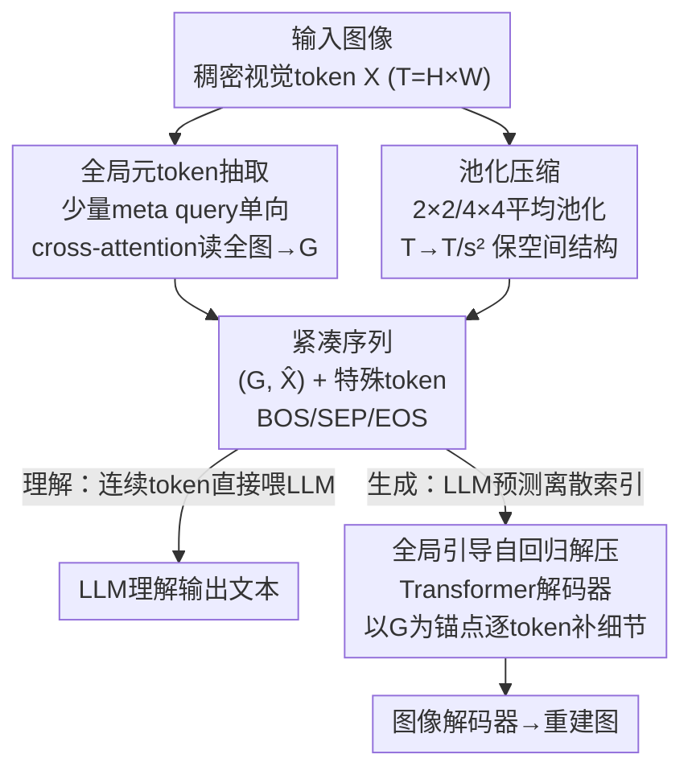

# UniCompress: Token Compression for Unified Vision-Language Understanding and Generation

**会议**: CVPR 2026  
**论文**: [CVF Open Access](https://openaccess.thecvf.com/content/CVPR2026/html/Wang_UniCompress_Token_Compression_for_Unified_Vision-Language_Understanding_and_Generation_CVPR_2026_paper.html)  
**代码**: 待确认  
**领域**: 多模态VLM / 视觉token压缩  
**关键词**: 统一多模态模型, 视觉token压缩, 全局元token, 自回归解压, 即插即用

## 一句话总结
UniCompress 在现成离散 tokenizer 外面套一组轻量「全局元token 抽取 + 平均池化压缩 + 全局引导的自回归解压」模块，把统一理解-生成模型的视觉 token 数砍 4×，理解几乎不掉点、生成只小幅退化，且无需重训语言模型。

## 研究背景与动机

**领域现状**：当前多模态正在往「统一模型」走——同一个自回归框架里，把图像经离散 tokenizer 编成视觉 token，和文本 token 拼成一条序列，用一个 LLM backbone 同时做理解（captioning、VQA）和生成（image synthesis、editing）。这种共享 token 空间的设计架构简洁、跨模态协同好，UniTok、VILA-U、VARGPT 等都是代表。

**现有痛点**：致命短板是 **token 效率**。VQ-VAE / VQGAN 这类码本式 tokenizer 通常把一张 512×512 的图下采样 16 倍编成 32×32=1024 个 token。统一模型理解要喂这么长，生成又要吐这么长，显存、训练成本、推理延迟全被序列长度拖垮，根本没法部署到具身智能这种资源受限场景。共享一个 tokenizer 只省了工程复杂度，序列长度一点没减。

**核心矛盾**：最直接的想法是压缩视觉 token，但作者实测发现——**朴素下采样 / 均匀剪枝对理解有效，对生成却是灾难**，生成质量掉超过 15%。原因是图像生成依赖细粒度、空间一致的 token 来重建细节，对剪枝极其敏感；而理解只需要粗粒度语义就够。理解和生成对 token 的需求本质不同，单一压缩策略很难同时讨好两边。

**第二重约束**：换一个更高效的 tokenizer（如一维 tokenizer TiTok）虽然能压，但通常要把下游 LLM 从头重训，代价高昂；而且一维 tokenizer 丢了空间信息，生成依旧拉胯。所以理想方案必须是**模块化、即插即用**，能套在任何现成 tokenizer 上，避开昂贵的 LLM 重训。

**核心 idea**：用「少量可学习的全局元token 携带场景级语义 + 池化压缩保留局部证据 + 解压时让全局token 当语义锚点自回归地把细节补回来」这一套外挂模块，在不改 LLM、不全量重训的前提下，同时压缩理解和生成两条路径的视觉序列。

## 方法详解

### 整体框架
UniCompress 的核心观察是：压缩之所以伤生成，是因为局部 token 被砍掉后丢了重建细节所需的空间信息；那就在压缩的同时**单独留一束「全局元token」当场景级约束**，解压阶段拿它当锚点把丢失的局部纹理逐步补回来。具体做法是给视觉 tokenizer 外挂三个轻量模块、**完全不动 LLM**：(1) 全局token 抽取器——用单向 cross-attention 把整张图的 token 场总结成几个全局元token；(2) 池化压缩器——把 token 网格按 2×2 / 4×4 非重叠块平均池化成短序列；(3) 自回归解压器——一个 Transformer decoder，在生成阶段以全局+压缩 token 为条件，把紧凑表示自回归地展开回原分辨率的稠密 token 网格喂给图像解码器。

训练分两阶段：先冻住 LLM、用重建损失训练「tokenizer + 三模块」这一栈，让它学会把稠密序列 $X$ 压成 $(G, \hat{X}^{cont})$ 再高保真还原；然后冻住整个压缩 tokenizer、轻量微调 LLM 适应紧凑序列。推理时，理解任务把连续的压缩 token 投影进 LLM 输入；生成任务让 LLM 预测全局 token 和压缩局部 token 的离散索引，再走码本反量化 + 解压器还原成图。这套「压一次、理解生成都复用」的接口，让它能直接嵌进各种统一模型 backbone（包括用多 tokenizer 的 UniFork、用扩散头的 OpenUni/Bagel）而不改架构。

### 关键设计

**1. 全局元token 抽取：用可学习查询把全图语义浓缩成几个锚点**

朴素压缩伤生成的根因是局部 token 被砍后丢了「这张图整体长啥样」的约束。UniCompress 的对策是另开一条细线，专门携带场景级语义。设基础编码器输出连续视觉序列 $X \in \mathbb{R}^{T\times d}$（$T=H\times W$），引入一小撮可学习的元查询 token $Q \in \mathbb{R}^{N_g\times d}$，用**单向** cross-attention 抽取全局上下文：元token 去 query 整个图像 token 场，而图像 token 自身原封不动透传：

$$G = \mathrm{MHA}(QW_Q,\ XW_K,\ XW_V),\qquad G \leftarrow \mathrm{LN}(Q+G)$$

由于 $N_g \ll T$（实验里 $N_g=4$），额外序列开销极小，却为版面布局和物体关系提供了强全局引导，全局 token 还用自己的位置编码。关键是「单向」——元token 主动读全图、不反向污染局部 token，相当于在压缩前先把整图语义「拍照存档」。消融显示，比起均值池化或 ViT 的 CLS token，这种 query 式抽取对理解三者差不多，但对生成 FID/CLIP 明显更好，因为它显式「读」了整张 token 图并写出图像特定的全局语义，给解压器更强的条件。

**2. 平均池化压缩 + 双表示：理解吃连续、生成吃离散，同一套机制**

要缩短序列，UniCompress 先把 $X$ 还原成 $H\times W$ 网格，按非重叠空间块做**固定大小平均池化**（默认操作），降空间冗余的同时保住粗结构。给定下采样因子 $s$：

$$\hat{X}^{cont} = \mathrm{AvgPool}(X, s),\qquad \tilde{T} = T/s^2$$

选平均池化而非 top-k 剪枝或 strided conv 是有讲究的：池化保留空间布局（生成命脉），所以只用整数池化窗（2×2、4×4）；消融里 AvgPool 在同样 4× 预算下 FID 最低、理解均分最高，top-k token 选择则明显更差。压缩后用三个特殊 embedding 把视觉段插进多模态序列：图像起始 [IMG_BOS]、分隔全局与局部的 [IMG_SEP]、图像结束 [IMG_EOS]。巧的是同一套压缩支持**双表示**——理解任务直接用连续特征 $\{G,\hat{X}\}$（不量化），生成任务用原码本把全局和局部都量化成离散索引 $\hat{Z}^{(g)}, \hat{Z}^{(x)}$，目标序列排成 `[IMG_BOS], Ẑ^(g), [IMG_SEP], Ẑ^(x), [IMG_EOS]`。一次压缩，两条路径复用。

**3. 全局引导的自回归解压：拿语义锚点逐 token 把细节补回来**

压缩省了序列，但生成时怎么从短表示还原出高保真图？这是最关键的一步。生成阶段 LLM 自回归吐出全局和压缩局部的离散索引，先经码本 $\mathcal{E}$ 反量化回连续特征 $\hat{G}=\mathcal{E}(\hat{Z}^{(g)})$、$\hat{X}^{deq}=\mathcal{E}(\hat{Z}^{(x)})$。解压器 $f_{dec}$ 是一个 Transformer 解码器，对已生成的稠密前缀做**带掩码的自注意力**、对 $(\hat{G},\hat{X}^{deq})$ 在每一层做 **cross-attention**，在光栅步 $t$ 预测下一个稠密 token：

$$x_t = f_{dec}(X^{dense}_{<t},\ \hat{X}^{deq},\ \hat{G})$$

沿生成顺序施加因果掩码，训练用 teacher forcing 对齐 tokenizer 的稠密目标 $X$。直觉上，压缩 token 携带显著的局部证据，全局元token 提供场景级约束；解压时把全局token 当语义锚点，自回归地精修局部纹理和边界，正好弥补了均匀压缩丢失的细节。可视化消融印证：去掉全局 token 长程一致性就崩，去掉自回归解压（改非自回归朴素解压）纹理过平滑、出 artifact——两者缺一不可。

**4. 两阶段轻量训练：改动全压在 tokenizer 侧，LLM 几乎不动**

整套流程刻意把改动锁在 tokenizer 侧，避开昂贵的 LLM 重训。**第一阶段（tokenizer 侧）**冻 LLM，用重建目标训练「可学习元查询全局抽取器 + 固定平均池化压缩器 + 码本 $\mathcal{E}$ + 解压器 $f_{dec}$」这一栈，学会稠密序列 $X \leftrightarrow$ 紧凑对 $(G,\hat{X}^{cont})$ 的高保真往返；重建损失是稠密特征空间的逐 token 回归项加码本一致性项：$\mathcal{L}_{recon} = \mathcal{L}_{reg} + \lambda_{cb}\mathcal{L}_{cb}$。**第二阶段（LLM 侧）**冻住 tokenizer，在紧凑数据上轻量微调 LLM——理解吃连续 $\{G,\hat{X}^{cont}\}$，生成自回归吐两路离散索引再反量化、解压成稠密 token 喂图像解码器。因为 LLM 接口只是标准的「特殊 token + 视觉索引」自回归序列，UniCompress 能零架构改动地接进现有统一模型。实验用 Llama-3.2-1B 当 backbone，JDB+ShareGPT4V 各一个 epoch 预训练再单 epoch 微调，训练调度极轻。

## 实验关键数据

### 主实验：理解几乎不掉点
6 个统一模型 backbone（UniTok、VILA-U、VARGPT、UniFork、OpenUni、Bagel）各自和「插了 UniCompress 的压缩版」对比，统一 $s=2$（4× 压缩）、$N_g=4$。理解侧（越高越好，节选）：

| Backbone | GQA | MME Cog. | POPE | MM-Bench |
|----------|-----|----------|------|----------|
| UNITOK | 55.71 | 251.79 | 82.66 | 40.34 |
| UNITOK-COMPRESSED | 53.07 | 235.00 | 79.36 | **42.14** |
| VARGPT | 58.12 | 269.30 | 88.04 | 44.22 |
| VARGPT-COMPRESSED | 55.90 | 265.83 | 84.99 | 41.15 |
| OPENUNI | 53.33 | 243.59 | 80.60 | 39.28 |
| OPENUNI-COMPRESSED | 49.80 | 230.21 | 78.17 | **39.88** |

压缩后 GQA、POPE 等只小幅下降（UniTok GQA 55.71→53.07），部分 backbone 甚至在 MM-Bench 上反超原版（OpenUni 39.28→39.88），整体理解掉点 ≤3 pt，验证全局引导重建在紧凑表示下仍能准确还原视觉语义。

### 生成实验：FID 小涨、CLIP 多数守住
生成侧在 MJHQ-30K 上报 FID（越低越好）和 CLIP（越高越好）：

| Backbone | FID(↓) | CLIP(↑) | 压缩版 FID | 压缩版 CLIP |
|----------|--------|---------|-----------|------------|
| UNITOK | 16.14 | 30.5 | 16.33 | 22.0 |
| VILA-U | 14.80 | 29.8 | **16.37** | **28.9** |
| VARGPT | 14.77 | 24.2 | 15.02 | 21.6 |
| BAGEL | 12.73 | 32.0 | 17.22 | 28.8 |
| OPENUNI | 16.45 | 26.7 | 24.29 | 22.3 |

轻量 backbone 退化很小（VILA-U FID 14.80→16.37、CLIP 29.8→28.9 几乎不变），但**对 token 缩减敏感的设计（OpenUni）退化明显**（FID 16.45→24.29），说明压缩友好度因架构而异。总体生成掉点控制在 ≤5-pt FID。

### 效率：生成推理提速 40%+
| Backbone | 生成训练(h) | 生成推理(min) |
|----------|-----------|--------------|
| UNITOK | 4.60 | 32.25 |
| UNITOK-COMPRESSED | 3.89 | **18.96** |
| VARGPT | 5.52 | 38.74 |
| VARGPT-COMPRESSED | 4.67 | 22.71 |

UniTok 生成推理从 32.25 min 降到 18.96 min，相对提速 >40%；论文整体宣称最高 41.8% 推理延迟下降、15.4% 训练时间缩短。自回归生成里每个 token 都直接影响延迟，所以序列变短在生成端收益最大——这正是以往只优化训练吞吐 / 显存的压缩方法做不到的端到端解码加速。

### 消融：压缩器选型与压缩率
压缩器对比（同 4× 预算）：

| 压缩器 | GQA | 理解均分 | FID(↓) |
|--------|-----|---------|--------|
| AvgPool (本文) | 53.07 | 39.29 | 20.01 |
| MaxPool | 50.80 | 39.03 | 20.15 |
| Strided Conv (2×2) | 51.20 | 39.33 | 19.95 |
| Top-k Token 选择 | **49.90** | **38.37** | **21.00** |
| Learned Pooling (Gated) | 51.30 | 39.42 | 19.90 |

### 关键发现
- **理解对压缩鲁棒、生成极敏感**：保留率从 1 压到 1/16，GQA 仅 55.71→49.00，而 MJHQ-30K CLIP 从 30.5 暴跌到 ~11——这正是论文动机的实证，也定下 1/4（$s=2$）为甜点。
- **全局元token 是生成保真的命门**：均值池化 / CLS token / 元token 三者理解几乎无差，但元token 在生成 FID/CLIP 上显著领先，因为 query 式抽取显式读全图、写出图像特定全局语义。
- **平均池化 > 剪枝**：top-k token 选择无论理解还是生成都最差，验证「保空间布局」对生成的不可替代性；learned gated pooling 略好但增加复杂度，AvgPool 性价比最高。

## 亮点与洞察
- **「压缩 + 单独留全局锚点 + 解压补细节」的拆分**很巧：它没有跟「压缩必然丢信息」硬碰，而是承认局部会丢、用一束廉价的全局 token 把场景级约束单独存下来，解压时当锚点把细节逐步重建——把一个不可逆的有损压缩，变成了「有引导的可恢复压缩」。
- **即插即用、不动 LLM** 是最实用的工程点：所有改动锁在 tokenizer 侧、两阶段训练只轻调 LLM，能同时套到共享 tokenizer（UniTok）、双 tokenizer（UniFork）、扩散头（OpenUni/Bagel）多种统一模型上，泛化性强。
- **同一套压缩支持连续（理解）/ 离散（生成）双表示**，避免为两个任务各做一套压缩，是「统一」二字落到 token 级的具体体现。
- 可迁移性：「主信号压缩 + 少量全局 token 当条件锚点 + 自回归解码补细节」这个范式，可以迁到视频 token 压缩、3D token 压缩等任何「生成对细节敏感、理解只要语义」的场景。

## 局限与展望
- **生成端退化不均匀**：OpenUni 压缩后 FID 从 16.45 飙到 24.29，说明方法对某些（尤其扩散头）架构压缩友好度差，论文对此只给现象、没给适配方案。
- **固定压缩率**：正文用固定 $s=2$ 做受控对比，虽提到「天然可扩展到内容自适应压缩率」，但没实现——对信息密度高的图，固定 4× 可能过压。
- **CLIP 普遍下滑**：多个 backbone 压缩后 CLIP 明显降（UniTok 30.5→22.0），图文对齐受损比 FID 更隐蔽，论文淡化了这点。
- **规模有限**：只在 Llama-3.2-1B + 单 epoch 轻训上验证，更大 LLM、更长训练下结论是否成立未知。
- 改进方向：把全局 token 数 / 压缩率做成内容自适应；对扩散头设计专门的压缩-解压接口；引入感知 / 对齐损失抑制 CLIP 下滑。

## 相关工作与启发
- **vs 理解向 token 剪枝（FastV 等基于 attention 剪枝）**：它们只优化理解的 pipeline FLOPs、推理时剪枝不微调，且任务专用，无法直接用到生成；UniCompress 在统一接口下同时压缩理解和生成两条路径。
- **vs 一维 tokenizer（TiTok）**：TiTok 用 1D tokenizer 压缩，理解 OK 但丢空间信息、生成拉胯，且常要下游 LLM 从头训；UniCompress 用池化保空间结构 + 即插即用不重训。
- **vs 生成加速（MaskGIT / next-scale prediction / HMAR）**：这些是生成专用的推理时预测优化，任务特定、不能搬到理解；UniCompress 是任务无关的 token 级压缩，理解生成通吃。
- **vs UniTok / VILA-U / VARGPT 等统一模型本身**：它们解决「如何统一」但没解决「token 太长」，UniCompress 正交于它们、作为外挂层补上效率短板。

## 评分
- 新颖性: ⭐⭐⭐⭐ 「全局锚点 + 自回归解压」把有损压缩变可恢复，是统一模型 token 压缩里少见的同时顾及理解与生成的思路。
- 实验充分度: ⭐⭐⭐⭐ 覆盖 6 个 backbone、理解/生成/效率三类指标 + 压缩器/压缩率/全局token 多重消融，较扎实；但缺更大模型与内容自适应验证。
- 写作质量: ⭐⭐⭐⭐ 动机—挑战—方法链条清晰，公式与可视化到位；个别段落（生成结果）有重复。
- 价值: ⭐⭐⭐⭐ 即插即用、不重训 LLM、生成推理提速 40%+，对资源受限部署有直接实用价值。

<!-- RELATED:START -->

## 相关论文

- [\[CVPR 2026\] Rosetta Stone for Unified MLLMs: A Unified Tokenizer to Decipher Understanding and Generation](rosetta_stone_for_unified_mllms_a_unified_tokenizer_to_decipher_understanding_an.md)
- [\[CVPR 2026\] EvoComp: Learning Visual Token Compression for Multimodal Large Language Models via Semantic-Guided Evolutionary Labeling](evocomp_learning_visual_token_compression_for_multimodal_large_language_models_v.md)
- [\[CVPR 2026\] OneCAT: Decoder-Only Auto-Regressive Model for Unified Understanding and Generation](onecat_decoder-only_auto-regressive_model_for_unified_understanding_and_generati.md)
- [\[CVPR 2026\] HBridge: H-Shape Bridging of Heterogeneous Experts for Unified Multimodal Understanding and Generation](hbridge_h-shape_bridging_of_heterogeneous_experts_for_unified_multimodal_underst.md)
- [\[CVPR 2026\] Unified Personalized Understanding, Generating and Editing](unified_personalized_understanding_generating_and_editing.md)

<!-- RELATED:END -->
