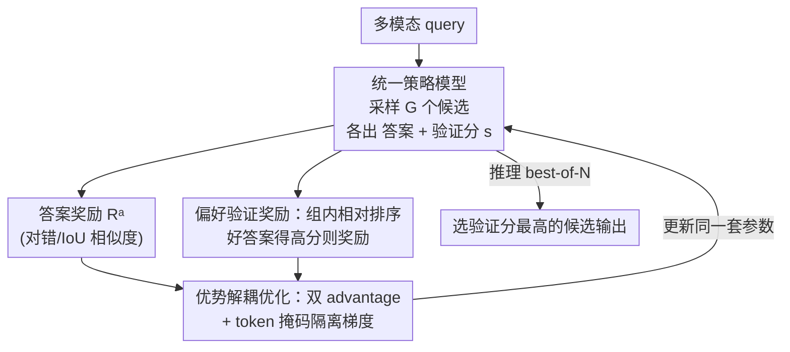

# Unified Generation and Self-Verification for Vision-Language Models via Advantage Decoupled Preference Optimization

**会议**: CVPR 2026  
**论文**: [CVF Open Access](https://openaccess.thecvf.com/content/CVPR2026/html/Qiu_Unified_Generation_and_Self-Verification_for_Vision-Language_Models_via_Advantage_Decoupled_CVPR_2026_paper.html)  
**代码**: https://github.com/ZJUSCL/ADPO  
**领域**: 多模态VLM  
**关键词**: 测试时扩展, 自验证, 偏好优化, GRPO, best-of-N

## 一句话总结
ADPO 用一套强化学习目标让**同一个 VLM 既生成答案、又给自己打验证分**，靠「偏好验证奖励」解决类别不平衡、靠「优势解耦优化」防止 reward hacking，使单模型的 best-of-N 选择在数学/视觉定位/手机 agent 三类任务上都超过传统「生成器+验证器」双模型，同时把推理延迟最多降 53.5%。

## 研究背景与动机
**领域现状**：测试时扩展（test-time scaling）是提升大模型可靠性的主流手段，分两条路——串行扩展（多生成 thinking token，如 DeepSeek-R1、o1）和并行扩展（一次采多个候选答案再选最好）。在数学/代码上串行扩展很灵，但搬到多模态后，多个研究发现「想得更长」在图像分类、视频理解、空间理解上几乎不涨点，于是并行扩展的 best-of-N 成了多模态更靠谱的方向。

**现有痛点**：要做好 best-of-N，关键在于「怎么从 N 个候选里挑出对的那个」。当前主流做法是部署**两个独立模型**：一个生成器负责产候选，一个验证器（reward model）负责打分排序。这带来两个硬伤——训练上要准备两套数据、训两个模型，资源翻倍；部署上推理时两个模型得同时跑，算力开销大。而如果只训生成器（用多数投票选答案）或只训验证器（用 base 模型生成），效果又明显比训两个差。

**核心矛盾**：能不能用**一个策略模型**同时干生成和自验证？这看似省事，却踩中两个深坑。其一是**类别不平衡**：让模型用二值奖励给自己的答案判对错，随着训练推进模型越来越准，正样本（对的答案）占比飙到 80%+，验证分会迅速塌缩成「一律打 1 分」，梯度消失、判别力归零（论文 Fig.2 显示 17 步内几乎全塌）。其二是**reward hacking**：如果只是把答案奖励和验证奖励简单相加，模型会学会「故意生成一个明显错的答案、再给它打个极低验证分」，照样拿高总奖励，结果生成质量被严重拖垮。

**本文目标 / 核心 idea**：在一个统一的 GRPO 框架里同时学好生成和自验证，对应解决上面两坑——用**偏好验证奖励**（把验证从「绝对判对错」改成「组内相对排序」）扛住类别不平衡；用**优势解耦优化**（按奖励类型分别算 advantage + token 掩码隔离梯度）扛住 reward hacking。

## 方法详解

### 整体框架
ADPO（Advantage Decoupled Preference Optimization）把 GRPO 扩展成「一个策略模型同时输出答案和验证分」的统一范式。对每个多模态 query，模型先在 `<think></think>` 里推理、在 `<answer></answer>` 里给答案，再扮演「正确性评估助手」在 `<score></score>` 里输出一个 $s\in[0,1]$ 的自验证分。训练时一次采样 $G=8$ 个候选 rollout，每个候选拿到两类奖励：衡量答案质量的**答案奖励** $R^a$ 和衡量打分排序是否合理的**偏好验证奖励** $R^p$。这两类奖励各自在组内归一化算 advantage，再用互斥的 token 掩码把梯度分别灌到「生成 token」和「验证分 token」上，合成统一目标更新同一套参数。推理时用批量解码采 N 个候选，直接选**自验证分最高**的那个作为最终输出——不需要外挂验证器，因此既可靠又省延迟。

### 关键设计

**1. 统一生成-验证策略：一个模型既答又判，best-of-N 不再外挂验证器**

传统 best-of-N 要么靠多数投票（不会判质量、只数票），要么外挂一个独立 reward model（训练+部署都贵）。ADPO 让同一个策略模型在生成答案后追加输出一个自验证分 $s$（prompt 里明确要求「答完后扮演正确性评估助手、给 0~1 分，越自信越接近 1」），推理时对 N 个候选直接取最高分者。这样一来，验证能力和生成能力共享同一套权重与多模态表征，不必维护两套数据/两个模型；而且因为验证分是生成过程顺带产出的，推理时不需要再过一遍独立验证器——论文 Tab.7 显示在 MathVista best-of-8 下，ADPO 65.0% 准确率、2.6s 延迟，相比「GRPO 当生成器 + GRPO 当 judge」的 60.8%/5.6s，准确率更高、延迟近乎砍半。这个范式是后两个设计要解决的两个挑战的来源——把生成和验证塞进一个策略，正是不平衡和 hacking 的温床。

**2. 偏好验证奖励：把「绝对判对错」改成「组内相对排序」，扛住类别不平衡**

最朴素的自验证奖励是二值的：设阈值 $\tau_s,\tau_a$，当预测正确性与真实正确性一致时 $R^b=\mathbb{1}\{(s-\tau_s)(R^a-\tau_a)>0\}$ 给 1 分。问题在于训练越久模型越准，正样本压倒性多于负样本，模型只要无脑打高分就几乎总「对」，验证分迅速塌缩到全 1、组内奖励全相同、advantage 归零、梯度消失（Fig.2 实测 17 步全塌）。

ADPO 把验证重构成**排序问题**：不跟固定阈值比，而是在组内按答案质量自适应划正负集，奖励模型「给好答案打更高分、给差答案打更低分」。对样本 $i$，其偏好验证奖励为

$$R^p_i = \frac{1}{\max(|C_i|,1)} \sum_{j\in C_i} \mathbb{1}\big[(s_i-s_j)(R^a_i-R^a_j)>0\big]$$

即它在对比集 $C_i$ 内的「排序命中率」——当 $R^a_i>R^a_j$（$i$ 答得更好）时若 $s_i>s_j$ 就记一次命中。离散任务（数学、agent 导航）按答案对错划对比集 $C_i=\{j\mid R^a_j\neq R^a_i\}$；连续任务（视觉定位，用 IoU 当答案奖励）则引入间隔 $\gamma>0$，把质量差超过 $\gamma$ 的当负样本 $C_i=\{j\mid |R^a_j-R^a_i|>\gamma\}$。关键在于：只要组内还有质量差异，就总能构造出有梯度的对比对；只有当所有 rollout 全对或全错时奖励才一致为零（此时本就无信息可学）。因此即便正负极度不平衡，排序监督依然密集、梯度不灭。由于这是相对排序而非校准概率，论文用 AUC/AP（不依赖概率刻度）来衡量，消融里偏好奖励比二值奖励 AUC/AP 最高提升约 0.19。

**3. 优势解耦优化：双 advantage + token 掩码隔离梯度，掐死 reward hacking**

把答案奖励和验证奖励简单相加 $R_{total}=R^a+R^p$ 会出乱子：生成和验证是两个目标本就冲突的任务（答案奖励偏爱答得好的样本，验证奖励偏爱打分校准好的样本），模型会钻空子——**故意给一个明显错的答案、再配一个极低的自验证分**，因为「答错+判它错」在排序上也算「判得准」，于是总奖励照样高，但生成质量被搞坏。

ADPO 的办法是**按奖励类型解耦 advantage + token 级互斥掩码**。先分别在两个奖励组内归一化算优势：$\hat{A}^{(a)}$ 只由答案奖励估计、$\hat{A}^{(p)}$ 只由偏好奖励估计。再定义两个不相交的 token 掩码：$M^a$ 覆盖答案生成 token（含推理 token），$M^p$ 只覆盖验证分 token。统一目标写成

$$\mathcal{J}(\theta) = M^a \odot \mathcal{J}_\theta(\hat{A}^{(a)}) + M^p \odot \mathcal{J}_\theta(\hat{A}^{(p)})$$

其中 $\odot$ 是 token 维度的逐元素相乘。这样一来，答案质量的提升**只**由 $\hat{A}^{(a)}$ 通过生成 token 驱动，验证分的校准**只**由 $\hat{A}^{(p)}$ 通过验证 token 驱动，两路梯度互不串扰。模型再也没法用「压低验证分」去补偿「答错」——因为答错的惩罚只走生成 token 这条路，验证分那条路救不了它。消融显示解耦相比纠缠（entangled）在 GUI agent 上 best@8 提升 +2.8%、AUC 提升高达 +34.1%。

### 损失函数 / 训练策略
底座基于 GRPO 的 PPO-style 裁剪目标。答案奖励 $R^a$ 按任务分两类：离散任务（数学、agent）用对错匹配 $R^a_{discrete}=\text{match}(y,y^*)\in\{0,1\}$，连续任务（视觉定位）用相似度 $R^a_{continuous}=\text{sim}(y,y^*)\in[0,1]$（定位用 IoU）。统一超参：学习率 $1\times10^{-6}$、batch size 128、组大小 $G=8$、裁剪 $\varepsilon=0.2$、KL 系数 $\beta=0.01$。数学推理在 Qwen2-VL-7B 上训 1200 步；视觉定位、手机 agent 从 Qwen2.5-VL-7B 起训，分别 1200 / 8000 步。rollout 用 $T=1.0,\text{top-}p=0.99$，评测用 $T=0.2$。

## 实验关键数据

### 主实验
覆盖三大领域五个 benchmark：数学推理（MathVista 域内 / MMMU OOD，报 accuracy）、视觉定位（ReasonSeg，报 cIoU）、手机 agent（AndroidControl / GUI Odyssey，报 step success rate）。下表为 best-of-N 下 ADPO 相对 GRPO+多数投票的提升（同采样预算）：

| 任务 | 指标 | ADPO best-of-N | vs GRPO(majority) | 关键观察 |
|--------|------|------|----------|------|
| MathVista (域内) | Acc % | 64.8/65.0/65.3 (N=4/8/12) | +1.4/+2.1/+1.9 | pass@1 与 GRPO 持平(62.4 vs 62.2)，best-of-N 稳涨 |
| MMMU (OOD) | Acc % | 50.8/52.1/52.3 | +1.4/+1.0/+0.6 | 跨域泛化也有持续增益 |
| ReasonSeg | cIoU | 61.1/61.2/61.6 | +1.7/+1.6/+2.2 | 比 base 多数投票高 +3.6~+4.0 |
| AndroidControl | SR % | 72.7/72.7/72.9 | +1.7/+1.9/+1.8 | 比 base 高 +14~+16.7 |
| GUI Odyssey | SR % | best-of-N 均超 GRPO | >0 | pass@1 79.7 vs GRPO 79.8 基本持平 |

核心信息：ADPO 的 **pass@1 生成质量与纯 GRPO 几乎无损**（MathVista 62.4 vs 62.2、ReasonSeg 59.1 vs 59.5、AndroidControl 70.9 vs 71.0），但靠可靠的自验证分在 best-of-N 上全面超越，且随 N 增大持续受益。

### 消融实验
| 配置 | 关键指标 | 说明 |
|------|---------|------|
| 偏好奖励 vs 二值奖励 | AUC +1.3%/+3.6%/+11.8%（数学/定位/agent） | 排序监督扛住类别不平衡，验证分更可分 |
| 解耦 vs 纠缠 advantage | AUC +3.6%/+4.8%/+34.1%；agent best@8 +2.8% | 隔离梯度防 reward hacking，agent 上增益最猛 |
| margin $\gamma$ (ReasonSeg) | $\gamma=0.1$ 时 ACC 73.5%（最优） | 太小判别不足、太大偏好信号太稀 |
| 推理效率 (MathVista best-of-8) | ADPO 65.0%/2.6s vs GRPO-judge 60.8%/5.6s | 准确率更高、延迟近乎减半 |

### 关键发现
- **解耦优化对 agent 任务收益最大**（AUC +34.1%、best@8 +2.8%），说明 agent 这类长序列、reward 容易被钻空子的任务，最受益于「掐断生成-验证梯度串扰」。
- **偏好奖励的价值随类别不平衡加剧而放大**：训练后期正样本压倒性多，二值奖励早已塌缩，偏好奖励仍提供密集梯度，因此 AUC 提升在 agent 上达 +11.8%。
- **统一范式的真正卖点是「不掉 pass@1 的前提下白赚 best-of-N」**：验证能力是生成的副产品，几乎零额外推理成本，还省掉一整个外挂验证器。

## 亮点与洞察
- **把自验证从「分类」重构成「排序」是点睛之笔**：类别不平衡下绝对阈值必然塌缩，而组内相对排序只要有质量差就有梯度，从根上绕开了梯度消失——这个 trick 可迁移到任何「正负极度不平衡的自评分」场景（如自一致性打分、置信度校准）。
- **token 级掩码隔离梯度是防 reward hacking 的干净手段**：与其设计复杂的联合奖励去堵漏洞，不如直接让「答案的优势只更新答案 token、验证的优势只更新验证 token」，物理隔离两个冲突目标，简洁且有效。
- **「一个模型自产自验」对部署极友好**：省掉独立 reward model，延迟近乎减半，对真实系统的复杂度和成本是实打实的降低。

## 局限性 / 可改进方向
- **验证分是相对排序而非校准概率**：作者明确只报 AUC/AP，意味着这个分数不能直接当「绝对正确性概率」用——下游若需要可信概率（如带阈值的拒答）还得额外校准。
- **三类任务都用 7B Qwen 底座**：没验证更大/更小模型或更多任务族（如视频、文档）上的规律，统一范式是否在弱模型上仍能学出可靠验证分存疑。
- **连续任务依赖 margin $\gamma$ 手调**：$\gamma$ 对结果敏感（0.025~0.2 之间 ACC 波动数个点），不同任务可能要重新调，缺乏自适应机制。
- **best-of-N 的增益绝对值偏小**：数学/定位上多在 +1~2 点量级，主要价值在「同等预算下白赚 + 省一个验证器」，而非生成质量本身的飞跃。

## 相关工作与启发
- **vs 双模型「生成器+验证器」（如 MM-Verifier）**：他们训两套数据、部署两个模型并发跑；ADPO 用一个策略同时产答案和验证分，训练/部署成本减半，best-of-N 还更高（MathVista 上 N=4/8/12 超 MM-Verifier +5.0/+2.5/+1.2）。
- **vs 纯 GRPO + 多数投票**：多数投票只数票、不会判质量；ADPO 的学得的自验证分能挑出「少数派对的答案」，在 pass@1 持平的前提下 best-of-N 全面占优。
- **vs 串行扩展（DeepSeek-R1 / o1 路线）**：串行靠加长 thinking token，但在多模态上增益有限（「no-think」现象）；ADPO 走并行 best-of-N + 学习式自验证，不依赖脆弱的长链推理。
- **vs 生成式验证器 / LLM-as-judge**：他们也让模型既解又判，但 ADPO 的差异在于用 RL + 双 advantage + 互斥掩码训练，且不刻意控制训练数据正负比，靠偏好奖励而非二值奖励，使 best-of-N 在多模态上稳定可用。

## 评分
- 新颖性: ⭐⭐⭐⭐ 「排序重构验证奖励 + token 掩码解耦优势」两招组合，针对统一自验证的两大死穴，思路干净且有针对性。
- 实验充分度: ⭐⭐⭐⭐ 三领域五 benchmark + 完整消融（偏好/解耦/margin/延迟）覆盖到位，但底座单一、增益绝对值偏小。
- 写作质量: ⭐⭐⭐⭐ 痛点-机制-公式链条清晰，Fig.2 把类别不平衡塌缩讲得直观。
- 价值: ⭐⭐⭐⭐ 单模型自产自验、延迟减半、省外挂验证器，对多模态 best-of-N 的工程落地有实用价值。

<!-- RELATED:START -->

## 相关论文

- [\[CVPR 2026\] Dynamics-Aware Preference Optimization for Vision-Language Models](dynamics-aware_preference_optimization_for_vision-language_models.md)
- [\[CVPR 2026\] Self-Consistency for LLM-Based Motion Trajectory Generation and Verification](self-consistency_for_llm-based_motion_trajectory_generation_and_verification.md)
- [\[ICLR 2026\] Uni-DPO: A Unified Paradigm for Dynamic Preference Optimization of LLMs](../../ICLR2026/multimodal_vlm/uni-dpo_a_unified_paradigm_for_dynamic_preference_optimization_of_llms.md)
- [\[CVPR 2026\] VisPlay: Self-Evolving Vision-Language Models](visplay_self-evolving_vision-language_models.md)
- [\[CVPR 2026\] HOG-Layout: Hierarchical 3D Scene Generation, Optimization and Editing via Vision-Language Models](hog_layout_hierarchical_3d_scene_generation_optimization_and_editing.md)

<!-- RELATED:END -->
