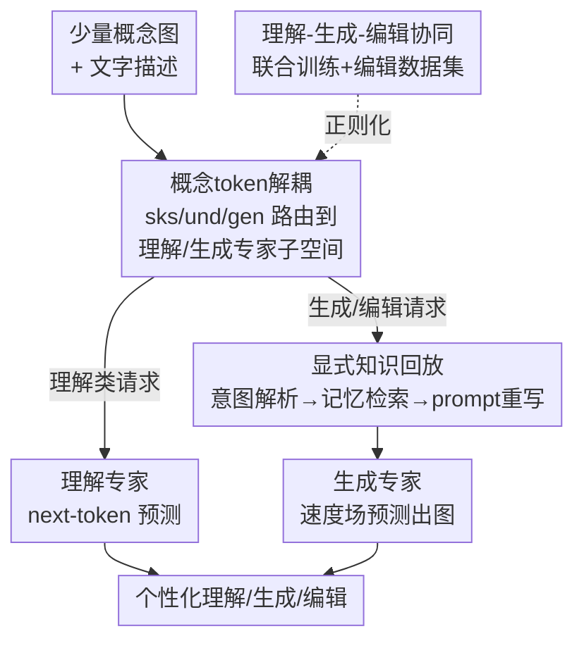

# Unified Personalized Understanding, Generating and Editing

**会议**: CVPR 2026  
**论文**: [CVF Open Access](https://openaccess.thecvf.com/content/CVPR2026/html/Zhong_Unified_Personalized_Understanding_Generating_and_Editing_CVPR_2026_paper.html)  
**领域**: 多模态VLM  
**关键词**: 个性化、统一多模态模型、概念token解耦、知识回放、个性化图像编辑

## 一句话总结
OmniPersona 在一个统一大多模态模型里同时实现"个性化的理解、生成、编辑"：用结构解耦的概念 token 把同一个概念按任务路由到不同专家子空间以减少互相干扰，再用推理时的"显式知识回放"把概念属性先问答出来再喂给生成，从而第一次把个性化图像编辑也纳入统一框架，并配套提出 OmniPBench 评测基准。

## 研究背景与动机
**领域现状**：统一大多模态模型（Unified LMM，如 Chameleon、Janus、Bagel、Show-o）已经能在一个网络里同时做理解（VQA、对话）和生成（文生图），表现出很强的通用能力。但它们都是"一刀切"的通用助手，不认识用户自己的概念——比如你给一只狗起名叫 `<maeve>`，模型并不能在理解、生成、编辑里都稳定一致地把它当成同一只狗。

**现有痛点**：现有个性化方法主要两条路。一是检索增强（RAG），把概念的属性描述当外部上下文塞进去——低效，而且和统一多模态管线是"贴上去"的、没真正融进模型。二是学习 soft prompt 把概念编码进隐空间（MyVLM、Yo'LLaVA），但要么把理解和生成耦合在一组 token 里、要么靠复杂的多阶段训练，最后导致跨任务互相打架、个性化知识模糊或对不齐。

**核心矛盾**：作者把问题拆成三点。(i) **表示耦合冲突**：统一模型里理解和生成共享同一套参数空间，少样本个性化时还要让一组概念表示同时撑起理解、生成、编辑，梯度方向天然打架，却没有结构上可区分的"槽位"去分别承载不同任务的解空间。(ii) **知识隐变量不透明**：概念被压成一团黑盒 embedding，你无法验证它到底"记住了什么"——特别是"个性化属性推理生成"（PARG，比如"生成 `<wangkai>` 在他家"时要回忆出他家在海边）这种需要显式调用文字知识的任务，模型分不清自己是真用了文字属性还是只在背训练图。(iii) **个性化编辑空白**：以前的工作压根没碰个性化图像编辑，而编辑恰恰是最难的——要在精确定位并保住目标身份的前提下做局部/结构修改，等于把理解和生成耦合进一次操作；现有基准既不评测它，也没研究"加入编辑数据是否反过来能提升其他个性化任务"。

**本文目标 / 核心 idea**：做一个端到端、单一架构就能覆盖个性化"理解 + 生成 + 编辑"的框架。三招对应三个痛点——**结构解耦的概念 token** 解耦表示冲突；**显式知识回放** 把黑盒知识外显成可读文字再回灌生成，解决不透明和 PARG；用**理解-生成-编辑协同**（含自建编辑数据集 + OmniPBench）证明编辑监督反而能正则化、增强整体个性化表示。

## 方法详解

### 整体框架
OmniPersona 以统一多模态模型 Bagel 为骨干。给定某个概念的几张图 + 文字描述，它为该概念分配一组可学习的"特殊标识符" token（如 `<sks>`，共 $N=32$ 个），训练时这些 token 被**按任务路由**到两条专家分支：理解专家和生成专家各拿一半。推理时分两种模式走：纯理解类请求直接用理解分支做 next-token 预测；涉及生成/编辑的请求先经过一个推理时的"知识回放"流程（在同一个模型里递归跑文本模式，把意图解析成 query → 检索概念记忆 → 重写成精确 prompt），再交给生成分支做速度场预测出图。训练端则把理解（交叉熵）、生成（Rectified Flow MSE）、编辑（MSE）三个目标联合优化，让同一套概念 token 同时服务三类任务。

### 关键设计

**1. 概念 token 表示解耦：给同一个概念在不同任务上开"专用槽位"**

针对痛点 (i) 的表示耦合冲突。作者不再学一组统一的 prompt，而是把每个概念的标识符拆成多个可学习 token，并**路由到任务专属的专家子空间**。系统 prompt 被组织成 `"<sks> is <und_1>…<und_Nu> <gen_1>…<gen_Ng>."`，其中 `<sks>` 和所有 `<und_i>`（$N_u=16$）走理解专家，所有 `<gen_j>`（$N_g=16$）走生成专家。形式化地，两组 token 的 embedding 矩阵为 $P^{(und)}=[p_{sks}, p^{(und)}_1,\dots,p^{(und)}_{N_u}]$ 和 $P^{(gen)}=[p^{(gen)}_1,\dots,p^{(gen)}_{N_g}]$，前向时每个专家只处理路由到自己的那部分 prompt 和对应输入：$H^{(und)}=F_{und}(P^{(und)}, X^{(und)})$，$H^{(gen)}=F_{gen}(P^{(gen)}, X^{(gen)})$。

这么做之所以有效，是因为它在参数层面给理解和生成"分了家"：同一个概念由相关但不同的 token 沿不同任务通路被刻画，避免理解 token 被生成专属的梯度污染。注意 $p_{sks}$ 被放进理解专家以承担"概念识别"。t-SNE 可视化显示，不解耦时所有 embedding 共享一个 transformer、簇严重重叠（破坏性干扰），解耦后两类 token 分到各自专家子空间、簇清晰可分，理解任务因此能选择性复用预训练知识而不被合成先验干扰。

**2. 显式知识回放：把黑盒概念知识"问答"出来再回灌生成**

针对痛点 (ii) 的知识隐变量不透明和 PARG 难题。光解耦还不够——学到的 embedding 依然是黑盒，分不清模型是真懂语义还是在背图。作者提出推理时的显式知识回放，把隐式的生成请求变成"显式、有依据、忠实"的 prompt，整条链路在同一个统一模型 UMM 里递归执行、一次成图。三阶段为：

$$Q = \text{UMM}_{text}(T),\quad A = \text{UMM}_{text}(Q, P),\quad \hat{T} = \text{UMM}_{text}(A, T)$$

阶段 1 **意图解析**：把原始请求 $T$（如"生成 `<sks>` 的玩具"）重写成显式的信息查询 $Q$（"`<sks>` 的玩具是什么？"）；阶段 2 **记忆检索**：用 $Q$ 从学到的 token 表示 $P$ 里检索出有依据的答案 $A$（"`<sks>` 的玩具是黑色挖掘机"）；阶段 3 **prompt 重写**：把 $A$ 整合回上下文得到精炼 prompt $\hat{T}$（"生成 `<sks>` 的黑色挖掘机"）。最后 $I_{gen}=\text{UMM}_{gen}(\hat{T}, P)$ 出图。

它有效的关键在于把"模型脑子里记的文字属性"先外显成可读中间表示再用于生成，从而保证输出是显式（查询化）、有据（记忆检索）、忠实（重写）且个性化（概念感知生成）的。这正好命中 PARG——以前模型对"`<wangkai>` 在家"这种需要回忆隐含文字知识（家在海边）的请求容易瞎画，现在被强制走一遍 concept→text→image 通路，文字知识被显式注入。消融显示这一步对 PARG 是命门：去掉后 PARG 分数从 0.613 暴跌到 0.312（−49.1%），而 CLIP-I 几乎不变（0.788→0.765），说明黑盒 embedding 保得住身份、却调不动语义知识。

**3. 理解-生成-编辑协同：用编辑数据反向正则化整套个性化表示**

针对痛点 (iii) 的编辑空白，同时把编辑当成"增益项"而非单纯新任务。作者构建个性化编辑数据集 $D_{edit}$，每条是三元组 $(I_{src}, E_{edit}, I_{tgt})$——源图、编辑指令（如"从照片里移除 `<sks>`"）、目标图，目标图用 inpainting 模型合成、人工核验（90% 通过质检）。训练端联合优化三个损失：理解用交叉熵 $L^{CE}_{text}=-\sum_i x_i\log\hat{x}_i$；生成与编辑都用 Rectified Flow 的 MSE，给定干净隐变量 $x_0$ 和噪声 $x_1$、插值 $x_t=(1-t)x_0+tx_1$，预测速度场 $L^{MSE}_{image}=\mathbb{E}[\lVert g_\theta(x_t\mid c)-(x_0-x_1)\rVert_2^2]$，编辑损失把条件换成"源图 + 编辑指令" $c_{edit}$。总目标为：

$$L_{total} = L^{CE}_{text} + \lambda_{image} L^{MSE}_{image} + \lambda_{edit} L^{MSE}_{edit}$$

为什么有效：作者观察到只训理解+生成的模型会"自发"长出初步编辑能力，于是反向假设——编辑这个任务的约束结构最苛刻（必须同时做概念定位=理解、身份保持=生成、指令对齐），它逼着概念 token 学出"既编码不变身份属性、又编码可改上下文属性"的解耦表示，这种细粒度约束反过来给身份保持做了正则化，迁移到所有个性化生成场景。消融证实这个双向协同：加入编辑数据让识别 +1.4%、QA-GPT +2.9%、人脸相似度 +4.0%，编辑本身也 +3.1%。

### 损失函数 / 训练策略
每个概念分配 $N=32$ 个 token（理解 16 + 生成 16），用 AdamW 训 2000 步、batch size 8，骨干为 Bagel（7B MoT），在 H20 GPU 上跑。总损失即上式三项加权联合优化，$\lambda_{image}$、$\lambda_{edit}$ 控制生成与编辑的相对权重。值得注意的是它只需 ∼10 张训练图（远少于 Yo'Chameleon 的 ∼1000 张）。

## 实验关键数据

### 主实验
评测在自建的 OmniPBench 上进行（基于 UnifyBench 的 20 个概念：人 10、宠物 5、物体 5，外加新增的个性化编辑数据 + 跨任务协议），覆盖四类任务：理解、生成、PARG、编辑。下表摘取最能说明问题的统一模型对比（节选关键列）：

| 方法 | 规模/Token | 识别 Rec. | VQA-GPT | 生成 CLIP-I | 人脸相似 | PARG Score | 编辑 SEMA-C | 编辑 Avg. |
|------|-----------|-----------|---------|-------------|----------|-----------|-------------|-----------|
| Bagel+TP（零样本） | 7B / 长上下文 | 0.788 | 0.542 | 0.697 | 0.309 | 0.813 | 0.297 | 0.432 |
| Yo'Chameleon | 7B / 32（∼1000图） | 0.764 | 0.507 | 0.697 | 0.224 | 0.266 | 0.108 | 0.234 |
| Unictoken | 1.3B / 32（∼10图） | 0.790 | 0.523 | 0.750 | 0.334 | 0.359 | 0.155 | 0.184 |
| **OmniPersona** | 7B / 32（∼10图） | **0.852** | **0.603** | **0.791** | **0.413** | 0.613 | **0.711** | **0.658** |

关键读数：相比同类统一模型 Unictoken，识别 +7.8%、问答平均 +13.1%；生成端拿到最高 CLIP-I（0.791）和大幅领先的人脸相似度（0.413 vs 0.334）。编辑是核心贡献——总分 0.658 超过 GPT-4o+IP（0.558）17.9%，语义对齐 SEMA-C 0.711 远超所有基线（Bagel+TP 仅 0.297）。

> ⚠️ caveat：在 DINO（0.579 < Unictoken 0.646）和 CLIP-T（0.273 < Bagel+TP 0.284）上略低，作者解释为"身份优先于泛文本对齐"的设计取舍；PARG 总分 0.613 也低于 Bagel+TP 的 0.813（后者靠直接塞长上下文描述），但 OmniPersona 是把知识内化进紧凑 token、不增加推理开销，且 0.613 已比同为"学习 token"路线的 Unictoken（0.359）高 70.8%。

### 消融实验
| 配置 | 识别 Rec. | PARG Score | 生成 CLIP-I | 编辑 Avg. | 说明 |
|------|-----------|-----------|-------------|-----------|------|
| Ours (Full) | 0.852 | 0.613 | 0.791 | 0.658 | 完整模型 |
| w/o 概念 token 解耦 | 0.804 | — | 0.778 | 0.633 | 共享 transformer，识别 −5.6%、VQA-BLEU −9.8%、VQA-GPT −10.3% |
| w/o 知识回放 | — | 0.312 | 0.765 | — | PARG 暴跌 −49.1%，CLIP-I 基本不变 |
| w/o 编辑数据 | 0.840 | — | 0.772 | 0.638 | 识别 −1.4%、QA-GPT −2.9%、人脸 −4.0%、编辑 −3.1% |

### 关键发现
- **知识回放是 PARG 的命门**：去掉它 PARG 从 0.613 掉到 0.312，但 CLIP-I（身份保持）几乎不动——说明黑盒 embedding 能记住"长什么样"，却调不出"它的属性是什么"，必须把文字知识显式外化。
- **token 解耦主要救理解**：去掉解耦后理解类指标（识别、VQA-BLEU/GPT）掉得最狠（−5.6%∼−10.3%），印证"共享空间里理解特征被生成梯度污染"的判断。
- **意图解析能 in-context 泛化**：把 in-context 示例从 0 增到 6，PARG 生成分从 0.30 升到 0.62（+106.7%），说明结构化示例能让解析器稳健地把各种措辞的用户意图改写成显式知识查询。
- **编辑监督是双向增益**：加编辑数据不仅自己涨，还反哺识别/QA/人脸相似度——因为编辑同时逼着模型做定位+身份保持+指令对齐，正则化了概念表示。

## 亮点与洞察
- **"先问答再生成"把黑盒知识变可审计**：知识回放不引入新模块、全在同一个 UMM 里递归跑文本模式，却把"模型到底记住了什么属性"显式打印出来再回灌——这是个很轻、又能直接攻克 PARG 的巧设计，可迁移到任何"生成前需要回忆隐含知识"的条件生成任务。
- **第一次把个性化编辑纳入统一框架并证明它是"增益"而非"负担"**：把最难的编辑当成正则项，用它反向强化理解和生成，这个"用更难的任务约束更简单任务的表示"的思路很有启发。
- **token 按任务路由到专家子空间**：在一个统一模型内部用"结构槽位"而非"多阶段训练"来化解跨任务梯度冲突，比 Unictoken 的三阶段互学习更简洁，且只需 ∼10 张图。

## 局限与展望
- **编辑数据偏"移除"类**：编辑数据集自动生成时主要用"remove `<sks>`"模板 + inpainting 合成目标图，虽设计了多样指令模板，但对"替换/姿态改变/材质修改"等复杂结构编辑的覆盖和质量（90% 质检通过率意味着 10% 噪声）仍有限。
- **PARG 仍打不过长上下文基线**：把知识内化进紧凑 token 虽省推理开销，但 PARG 总分（0.613）明显低于直接塞描述的 Bagel+TP（0.813），说明"内化"相比"显式喂全文"还有信息损失。
- **泛文本对齐被牺牲**：DINO / CLIP-T 低于部分基线，身份优先的取舍在需要强文本可控性的场景可能反成短板。
- **评测用 LLM-as-judge**：编辑的语义对齐和质量靠 LLM 打分，存在评判偏差，缺人类评测交叉验证。

## 相关工作与启发
- **vs Yo'Chameleon**：同样统一个性化理解+生成、用双 soft prompt + self-prompting，但它把任务耦合在一组 prompt 里、需 ∼1000 张训练图，且完全没碰编辑；OmniPersona 用结构解耦 token（∼10 张图）+ 显式知识回放，并第一次纳入编辑，编辑 Avg. 0.658 vs 0.234。
- **vs Unictoken**：用统一概念 token + 三阶段互学习融合理解/生成语义；OmniPersona 改用任务专家子空间路由（无需多阶段），识别 +7.8%、PARG 0.613 vs 0.359（+70.8%），并补上编辑维度。
- **vs RAG 路线（RAP-MLLM / LaMP）**：检索增强把概念属性当外部记忆显式检索；OmniPersona 的知识回放在思想上类似"自检索"，但全在单模型内部完成、把知识内化进可学 token，不依赖外部库、不增加推理时检索开销。
- **vs DreamBooth 等生成专用法**：DreamBooth 靠少样本微调扩散模型做高保真主体生成，但只管生成、不懂理解也不能编辑；OmniPersona 在统一 LMM 里把三件事打通。

## 评分
- 新颖性: ⭐⭐⭐⭐⭐ 第一个把个性化编辑纳入统一 LMM，且"显式知识回放 + 任务专家 token 解耦"组合很有想法。
- 实验充分度: ⭐⭐⭐⭐ 四任务全覆盖 + 三项消融到位，但编辑评测依赖 LLM-as-judge、缺人类评测。
- 写作质量: ⭐⭐⭐⭐ 三大痛点→三招对应清晰，公式和流程讲得明白。
- 价值: ⭐⭐⭐⭐ 配套 OmniPBench 基准 + 强基线，对"统一个性化"方向有推动作用。

<!-- RELATED:START -->

## 相关论文

- [\[CVPR 2026\] UniCompress: Token Compression for Unified Vision-Language Understanding and Generation](unicompress_token_compression_for_unified_vision-language_understanding_and_gene.md)
- [\[CVPR 2026\] PersonaVLM: Long-Term Personalized Multimodal LLMs](personavlm_long_term_personalized_multimodal_llms.md)
- [\[CVPR 2026\] Rosetta Stone for Unified MLLMs: A Unified Tokenizer to Decipher Understanding and Generation](rosetta_stone_for_unified_mllms_a_unified_tokenizer_to_decipher_understanding_an.md)
- [\[CVPR 2026\] Personalized Image Descriptions from Attention Sequences](personalized_image_descriptions_from_attention_sequences.md)
- [\[CVPR 2026\] TUNA: Taming Unified Visual Representations for Native Unified Multimodal Models](tuna_taming_unified_visual_representations_for_native_unified_multimodal_models.md)

<!-- RELATED:END -->
