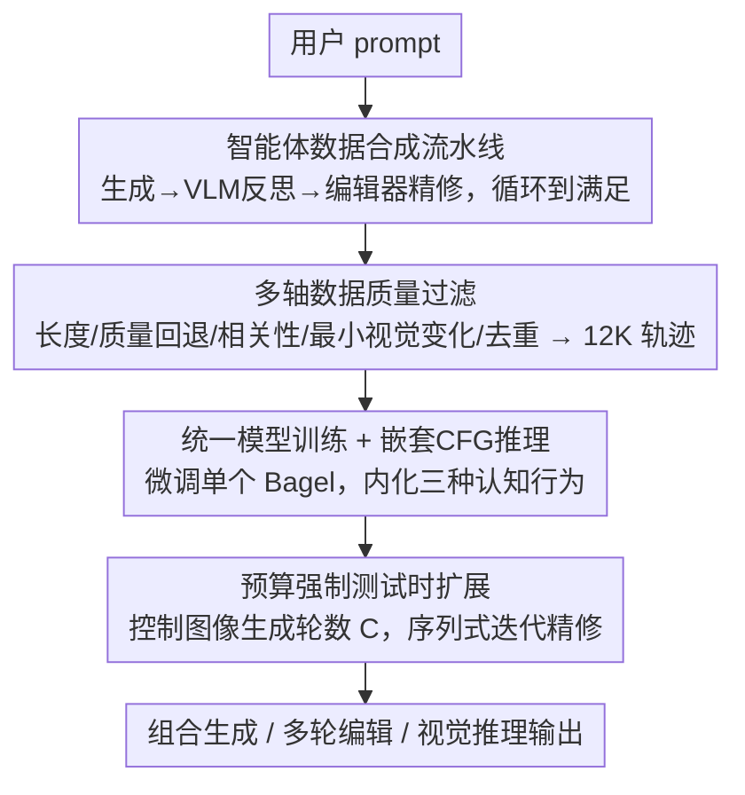

# UniT: Unified Multimodal Chain-of-Thought Test-time Scaling

**会议**: CVPR 2026  
**论文**: [CVF Open Access](https://openaccess.thecvf.com/content/CVPR2026/html/Chen_UniT_Unified_Multimodal_Chain-of-Thought_Test-time_Scaling_CVPR_2026_paper.html)  
**代码**: 待确认  
**领域**: 多模态VLM  
**关键词**: 统一多模态模型, 测试时扩展, 多模态思维链, 迭代精修, 智能体数据合成  

## 一句话总结
UniT 把语言模型里的"测试时扩展（test-time scaling）"搬到统一多模态模型上：用一个多模型智能体流水线合成"生成→反思→精修"的多轮思维链数据，微调单个统一模型（Bagel），让它在推理时自己迭代地生成、验证、修正图像，并通过"预算强制"控制图像生成轮数，在组合生成、多轮编辑、视觉推理上都拿到显著提升。

## 研究背景与动机
**领域现状**：统一多模态模型（unified multimodal models，如 Bagel、Janus-Pro）把视觉理解和图像生成塞进同一个架构里，理论上能在一段对话里无缝交错"看图"和"画图"，做到比模块化流水线更强的跨模态接地。但现实里它们几乎都是**单次前向（single-pass）**：给一次输出就完事，没有评估、反思、再修正的机制。

**现有痛点**：很多多模态任务天然需要多步：组合生成（多个物体、复杂空间关系）、多轮编辑（指令逐步累加）、复杂视觉推理——这些场景下"一次画对"几乎不可能，需要先分解指令、再验证中间结果、再迭代纠错。单次前向的统一模型对这类任务束手无策。

**核心矛盾**：语言模型这边，测试时扩展（TTS，靠延长思维链 / 多次采样 / 迭代精修来换性能）已经被 o1、DeepSeek-R1 证明非常有效；但要把这套搬到统一多模态模型上很难，因为 TTS 所需的能力分散在不同专用模型里——图像生成靠扩散模型、验证靠 VLM、精修靠编辑模型。没有一个框架能把"数据合成 + 模型训练 + 推理机制"统一起来。

**本文目标**：让**单个统一模型**能像 reasoning LLM 那样，在推理时迭代地生成、反思、精修，并且推理预算可调（难任务多分点算力）。

**切入角度**：作者发现，可以**用一个多模型智能体流水线（生成器 + VLM 批评者 + 编辑器）当"老师"去合成多轮思维链轨迹**，这些轨迹天然带有三种认知行为（验证 / 子目标分解 / 内容记忆）；然后把这些行为**蒸馏进一个统一模型**，推理时就只用这一个模型自给自足。

**核心 idea**：用"智能体合成的多轮思维链数据"训练统一模型，把分散在多个专用模型里的认知行为内化进单一模型，再用预算强制实现序列式（chain-of-thought）测试时扩展——而且序列式扩展比 best-of-N 并行采样更省算力、更可扩展。

## 方法详解

### 整体框架
UniT 由三块紧耦合的部件组成：**(i) 智能体数据合成**——多模型流水线自动产出带显式思维链的多轮"生成-反思-精修"轨迹；**(ii) 统一模型训练**——用约 12K 条高质量轨迹微调 Bagel，让它把多模态推理模式内化；**(iii) 测试时扩展推理**——训练后的单个模型用"预算强制"控制图像生成轮数，自己完成全部规划、生成、反思、精修。

一个关键区分：**多模型智能体框架只用于合成训练数据**；推理时只用单个统一 Bagel 模型，不再调用任何外部模型。整条管线是"老师团队产数据 → 学生模型内化 → 学生独立推理"的蒸馏闭环。

### 关键设计

**1. 智能体数据合成流水线：让多个专用模型"演"出认知行为，再录下来当教材**

痛点是：统一模型本身不会"反思+精修"，但人也无法手工标多轮思维链轨迹。作者搭了一条自动流水线：① Llama-4-Scout-17B 生成 20K 条覆盖组合属性、空间关系的多样 prompt；② Flux Pro 产初始图（复杂 prompt 先由 Qwen3-VL 做子目标分解再生成第一步）；③ Qwen3-VL 做**验证**——判断图是否满足 prompt，不满足就吐出显式思维链，指出缺陷、规划改进、写出编辑指令；④ Flux Kontext / Qwen-Image-Edit 按指令**精修**；⑤ 重复③④直到 VLM 判定满足。这条循环天然录下了三种认知行为：**验证**（拿输出对标指令）、**子目标分解**（把复杂指令拆成顺序编辑步骤）、**内容记忆**（跨轮保持对图像内容的理解）。为什么有效：与其让一个弱模型凭空学会反思，不如让一组强专用模型"现场表演"完整推理痕迹，把生成-验证-规划之间的互动显式记录下来，比任何人工标注都更贴近真实的多步问题求解过程。

**2. 多轴数据质量过滤：决定 TTS 成败的不是数据量而是数据干不干净**

合成出来的轨迹质量参差，作者用五条规则筛：① 长度约束——超 8 轮的轨迹删掉，平衡效率与推理深度；② 质量回退——若最终图的指令遵循质量比前三张里任何一张都差（Qwen3-VL 度量），整条删；③ 相关性过滤——某轮编辑指令与原任务语义无关（Llama-4-Scout 度量）则删；④ 最小视觉变化——相邻图 LPIPS < 0.03 的轮删掉（基本没改动的废轮）；⑤ benchmark 去重——训练 prompt 用 5-gram 匹配从评测集里剔掉，防数据泄漏。过滤后保留 12K 条高质量轨迹。消融（表 6）显示不同过滤器影响不同能力：去掉相关性过滤最伤组合任务，去掉最小视觉变化过滤最伤多轮编辑——说明"沿多个质量维度精修数据"本身就是 TTS 能不能扩展的前提。

**3. 统一模型训练 + 嵌套 CFG 推理：把认知行为内化进单一模型**

训练上用 Bagel（同时具理解与生成的统一架构），在合成数据上跑 700 H100 小时；为模拟多轮编辑里用户的真实输入，10% 的中间编辑指令不计损失。推理上采用**嵌套式 classifier-free guidance（CFG）**：先做文本 CFG（有/无当前文本指令的对比），再做图像 CFG（有/无历史图像的对比）。形式上记 $v_t$ 为全条件预测、$v_{t,\text{unc}}$ 为文本无条件、$v_{i,\text{unc}}$ 为图像无条件，则先算 $v_{\text{text}}=v_{t,\text{unc}}+s_t(v_t-v_{t,\text{unc}})$，再算 $v_{\text{final}}=v_{i,\text{unc}}+s_i(v_{\text{text}}-v_{i,\text{unc}})$，取 $s_t=4.0,\ s_i=2.0$（⚠️ 以原文为准）。这种"图像引导叠在文本引导之上"的嵌套，让模型能**独立控制 prompt 遵循度与视觉一致性**——多轮编辑时既保持对文本指令的强对齐，又保持跨轮的结构连贯。作者还发现：没训练过的原始 Bagel 即使被强制走思维链，图像质量也会随上下文图增多而迅速崩坏、还会幻觉，所以**训练是必需的**，这套行为不能靠 prompt 凭空诱发。

**4. 预算强制实现序列式测试时扩展：把"控 token 数"换成"控图像轮数"**

把文本 TTS 里的 budget forcing 改造到多模态：文本方法控的是推理 token 数，UniT 控的是**图像生成轮数**（因为扩散生成主导推理延迟）。指定算力预算 $C$ 为图像生成轮数，每轮 = 一段文本思维链 + 一次图像生成/编辑。强制手段有两个方向：① **强制延长推理**——若模型不到 $C$ 轮就想停，抑制 EOS、追加"Let's edit the image"、等它推理完再强制生成；② **预算约束**——若模型生成超过 $C$ 张，只取第 $C$ 轮的最终图。这套机制让作者能干净地对比**序列式思维链扩展**（迭代精修、每轮基于上一轮）与**并行 best-of-N 扩展**（独立采 N 张选最好）。一个值得记的涌现现象：模型在平均 3.6 轮的短轨迹上训练，测试时却能泛化到平均 4.7 轮的更长推理链——这种"超训练分布外推"此前只在纯文本模型里见过。

## 实验关键数据

### 主实验
覆盖文生图、组合编辑、多轮编辑、视觉推理四类基准；对比 Bagel（无思维链基座）、Bagel+CoT（仅文本思维链）、UniT（完整多模态思维链）。除特别说明外报 $C=10$（ImgEdit 为 $C=4$）。

| 任务 / 基准 | 指标 | Bagel | Bagel+CoT | UniT |
|--------|------|------|----------|------|
| 组合生成 OneIG-Bench | Alignment ↑ (Overall) | 0.764 | 0.790 | **0.843** |
| 多物体编辑 CompBench | Overall ↑ | 0.936 | 0.956 | **0.988** |
| 多轮编辑 ImgEdit | 人评 0-10 (Overall) | 1.31 | 1.92 | **4.26** |
| 视觉推理 MIRA | Acc ↑ (Overall) | 7.5 | 9.2 | **11.5** |

相对单次生成，UniT 在 CompBench 多物体编辑上提升 5.56%、ImgEdit 多轮编辑人评提升 2.95 分、OneIG 指令遵循提升 10.34%，分布外视觉推理 MIRA 提升 53.33%（均为 $C=1\to C=10$，ImgEdit 为 $C=1\to C=4$，达 225.19% 相对提升）。说明：MIRA 上 UniT（11.5）仍低于 GPT-5（16.5）、Qwen2.5-VL-72B（13.1），但这是基座规模差异，作者的贡献是方法层面证明 TTS 能迁移到多模态，基座变强 UniT 直接受益。

### 序列式 vs 并行扩展
| 任务 | 序列相对并行提升（C=10，ImgEdit C=4） |
|------|------|
| OneIG-Bench | +4.85% |
| CompBench | +3.89% |
| ImgEdit | +71.77% |
| MIRA | +33.72% |

序列式在所有任务都胜过并行 best-of-N，且**算力省 2.5×**（如 $C=4$ 的序列 ≈ $N=10$ 的并行）。原因：序列式累积成功编辑、每轮基于上一轮做显式思维链纠错、可利用扩张的文本上下文；并行采样样本间不互相学习，几样之后就饱和。

### 消融实验
**认知行为消融（表 5）**：分别从智能体框架里去掉一种认知行为重训。

| 配置 | OneIG Align(%) | CompBench(%) | ImgEdit | MIRA Acc(%) |
|------|------|---------|------|------|
| All behaviours | 84.3 | 98.8 | 4.26 | 11.5 |
| w/o Verification | 81.2 (-3.1) | 96.8 (-2.0) | 3.55 (-0.71) | 9.6 (-1.9) |
| w/o Subgoal Decomp. | 80.5 (-3.8) | 96.3 (-2.5) | 3.75 (-0.51) | 10.3 (-1.2) |
| w/o Content Memory | 82.8 (-1.5) | 97.8 (-1.0) | 2.45 (-1.81) | 10.8 (-0.7) |

**数据质量消融（表 6）**：分别去掉一个过滤器。去相关性过滤最伤组合任务（OneIG -3.1、CompBench -2.5）；去最小视觉变化过滤最伤多轮编辑（ImgEdit -1.16）；去质量回退过滤最伤视觉推理（MIRA -1.5）。

### 关键发现
- **内容记忆对多轮编辑是命门**：去掉它 ImgEdit 从 4.26 掉到 2.45（相对 -42.5%），但对单轮任务只掉 1.0-1.5%——验证"跨轮记住改了什么"正是多轮交互的核心。
- **子目标分解主导组合任务**：去掉它在 OneIG / CompBench 上掉最多（-3.8% / -2.5%），印证多步规划对复杂组合生成的价值。
- **验证最影响视觉推理**：去掉它 MIRA 掉 1.9%，因为推理需要逐步自我校验。三种行为各司其职、互不替代。
- **数据质量沿多轴都重要**：不同过滤器影响不同能力，单看一个维度的"干净"不够。

## 亮点与洞察
- **"老师团队产数据 + 学生独立推理"的解耦很巧**：训练期用 Flux Pro + Qwen3-VL + 编辑器组成的强专用模型团队录认知行为，推理期蒸馏成单个 Bagel 自给自足——既拿到高质量监督，又避免了部署多模型的通信开销。这套"多模型当教师、单模型当学生"的范式可迁移到任何需要复杂行为但难以单模型直接学的场景。
- **把 TTS 的"算力旋钮"从 token 换成图像轮数**，是让 budget forcing 在多模态落地的关键洞察：扩散生成主导延迟，所以控图像轮数才真正对应算力成本。
- **短轨迹训练→长链推理外推**这个涌现现象（3.6 轮训练泛化到 4.7 轮推理）此前只在纯文本 reasoning 模型里见过，说明"测试时扩展"是跨模态的一般范式而非语言模型专属。
- **序列式比并行更省算力**（2.5×）的结论很实用：在生成式多模态里，迭代精修比独立多采样更高效，因为它能累积上一轮的成功并显式纠错。

## 局限与展望
- **基座能力天花板明显**：MIRA 上 UniT（11.5）远不及 GPT-5（16.5），作者承认这是 Bagel 基座规模/数据的差距，方法本身不解决基座弱的问题。
- **依赖强外部教师模型产数据**：整条合成流水线用了 Llama-4-Scout、Flux Pro、Qwen3-VL、Flux Kontext / Qwen-Image-Edit 等一堆前沿专用模型，复现成本高，且训练数据质量上限受这些教师约束。
- **序列式扩展的延迟代价**：序列优化性能但牺牲延迟（每轮要等扩散采样完），并行才优化延迟；作者提到可用投机解码、跨轮 KV-cache 复用、满足即早停来缩小延迟差，但论文未给出实测加速数据。
- **预算上限受显存约束**：$C$ 最多到 10（ImgEdit 每轮最多 4），更大预算下的扩展行为未知。
- **CFG 尺度等超参靠经验设定**（$s_t=4.0,s_i=2.0$），未做系统敏感性分析。

## 相关工作与启发
- **vs 纯文本 TTS（o1 / DeepSeek-R1 / budget forcing）**：它们控推理 token 做文本迭代；UniT 把这套搬到多模态，控的是图像生成轮数，并证明"短训练→长外推""序列优于并行"这些规律在多模态里同样成立。
- **vs Uni-CoT 等统一模型思维链**：Uni-CoT 耦合宏观/微观推理做视觉语言理解，但不研究算力扩展也不做迭代编辑；UniT 的重点正是**测试时算力扩展**和**跨轮迭代精修**，且同时惠及生成与理解。
- **vs 反思式图像精修（Reflection 类方法）**：它们也迭代批评+精修生成图，但 UniT 强调用单个统一模型做语义正确性 + 视觉质量的双重精修，并把多模态思维链确立为同时利于生成与理解的统一范式。
- **vs 模块化流水线**：传统做法用独立的感知/验证/生成模型串起来；UniT 推理时全在单模型内完成，消除模型间通信开销、保持单架构内的无缝多模态上下文，更易部署。

## 评分
- 新颖性: ⭐⭐⭐⭐⭐ 首次系统地把测试时扩展从纯文本搬到统一多模态模型，"智能体产数据 + 单模型推理"的解耦设计有原创性。
- 实验充分度: ⭐⭐⭐⭐ 覆盖四类任务 + 序列/并行对比 + 两组消融，但缺延迟实测、缺更大预算的扩展曲线、强依赖外部教师。
- 写作质量: ⭐⭐⭐⭐⭐ 三部件框架、关键区分、涌现现象都讲得很清楚，图表支撑到位。
- 价值: ⭐⭐⭐⭐ 给统一多模态模型提供了一条可调算力的推理范式，结论（序列优于并行、短训长推）有迁移价值，但落地受基座与教师模型成本制约。

<!-- RELATED:START -->

## 相关论文

- [\[CVPR 2026\] Fuel Gauge: Estimating Chain-of-Thought Length Ahead of Time in Large Multimodal Models](fuel_gauge_estimating_chain-of-thought_length_ahead_of_time_in_large_multimodal_.md)
- [\[CVPR 2026\] Scaling Test-Time Robustness of Vision-Language Models via Self-Critical Inference Framework](scaling_test-time_robustness_of_vision-language_models_via_self-critical_inferen.md)
- [\[CVPR 2026\] Chain-of-Thought Guided Multi-Modal Object Re-Identification](chain-of-thought_guided_multi-modal_object_re-identification.md)
- [\[CVPR 2026\] DuetSVG: Unified Multimodal SVG Generation with Internal Visual Guidance](duetsvg_unified_multimodal_svg_generation_with_internal_visual_guidance.md)
- [\[CVPR 2026\] When Visualizing is the First Step to Reasoning: MIRA, a Benchmark for Visual Chain-of-Thought](when_visualizing_is_the_first_step_to_reasoning_mira_a_benchmark_for_visual_chai.md)

<!-- RELATED:END -->
