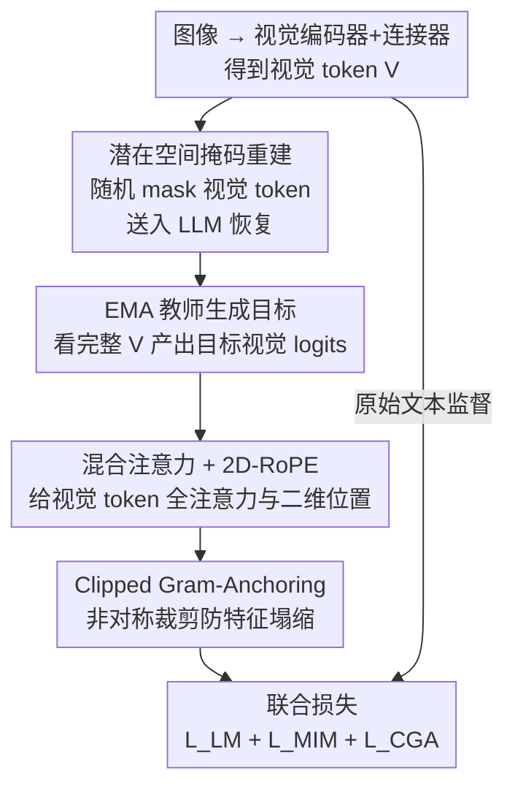

# Unleashing the Intrinsic Visual Representation Capability of Multimodal Large Language Models

**会议**: CVPR 2026  
**论文**: [CVF Open Access](https://openaccess.thecvf.com/content/CVPR2026/html/Li_Unleashing_the_Intrinsic_Visual_Representation_Capability_of_Multimodal_Large_Language_CVPR_2026_paper.html)  
**代码**: https://github.com/Fir-lat/LaVer  
**领域**: 多模态VLM  
**关键词**: 模态失衡, 掩码图像建模, 视觉表示, 自监督, 视觉幻觉

## 一句话总结
针对 MLLM「越深越偏文本、视觉表示逐层同质化」的模态失衡问题，本文提出 LaVer：在 LLM 的潜在语义空间里对视觉 token 做掩码重建（latent MIM），并用 Clipped Gram-Anchoring 防止特征塌缩，给视觉表示提供直接监督信号，在 OCR/视觉中心等密集视觉任务上显著提升（如 OCRBench +19.22%）。

## 研究背景与动机
**领域现状**：主流 MLLM 是「视觉编码器 + 连接器（MLP）+ 预训练 LLM」的级联架构，图像被编码成一串视觉 token 拼到文本前面，整个模型只用一个目标训练——next-text-token-prediction（对文本响应做交叉熵）。

**现有痛点**：这种范式带来系统性的「模态失衡」：模型在多模态任务里过度依赖文本，甚至在视觉输入缺失或与文本冲突时也能自信地给出（错误）回答，把更多注意力分给文本 token 而非视觉 token，最终表现退化、视觉幻觉增多。

**核心矛盾**：失衡的根源在于训练监督的「不对称」——文本有逐 token 的直接监督（交叉熵），而视觉只能依靠隐式的 vision-to-text 对齐获得间接、微弱的监督。在语言能力极强的 LLM backbone 主导下，模型自然倾向于丢弃「对文本输出没用」的视觉信息。本文进一步用实验验证了一个现象：**视觉表示的逐层同质化**——深层视觉 token 之间的余弦相似度急剧升高、t-SNE 上视觉与文本 token 始终分离，说明视觉语义在前向传播中被逐渐抹平。

**本文目标**：给视觉表示一个**直接的内在监督信号**，让 MLLM 在深层也保留有区分度的视觉结构，而不是只为文本输出服务。

**切入角度**：借鉴自监督的掩码图像建模（MIM）。但与在原始像素上做 mask（MAE）或重建细粒度低级视觉信号的做法不同——低级像素有冗余和噪声，对需要高层语义推理的任务并不理想——作者把 mask 直接打在**输入嵌入空间的视觉 token**上，让模型在**LLM 自己的潜在语义空间**里把缺失的视觉 token 恢复出来。

**核心 idea**：用「在 LLM 潜在空间里重建被 mask 的视觉 token」这一自监督任务，给 MLLM 注入直接视觉监督，并配一个非对称正则项防止模型走捷径输出千篇一律的视觉特征。

## 方法详解

### 整体框架
LaVer 在标准 MLLM 之上加一条**视觉自监督支路**，与原有的语言建模目标联合训练。给定一张图，先用视觉编码器 + 连接器得到视觉 token 序列 $V=\{v_1,\dots,v_N\}$；随机把一部分视觉 token 替换成可学习的 `[MASK]` token，送进 LLM 让它在潜在空间里把这些位置的视觉表示恢复出来。监督信号来自一个 EMA 教师（student-teacher 框架）：教师看完整未 mask 的视觉 token，产出每个位置的目标视觉 logits，学生则要在被遮住的位置预测出教师的输出。为了让 MIM 真正学到判别性特征、而不是塌缩成一模一样的向量，再加一个 Clipped Gram-Anchoring 正则。最终损失是「语言建模 + MIM + CGA」三项之和。

### 关键设计

**1. 潜在空间掩码视觉重建（Latent Visual Reconstruction）：在 LLM 自己的语义空间里给视觉补直接监督**

这是为了治「视觉只有间接监督、深层被同质化」的病根。具体做法：用二值 mask $M\in\{0,1\}^N$ 以概率 $r$ 随机选中一批视觉位置，被选中的位置用可学习的 mask token $e_{[\text{MASK}]}$ 替换，$\tilde v_i = M_i\cdot e_{[\text{MASK}]} + (1-M_i)\cdot v_i$。把替换后的序列过 LLM 得到隐藏态 $\tilde H=F_\theta(\tilde V)$，再用一个 3 层 MLP 视觉头投影成视觉 logits $\tilde Z=V_\psi(\tilde H)$。监督目标来自 EMA 教师 $\hat\Phi$（学生参数的指数滑动平均，$\hat\theta^{(t)}=\lambda\hat\theta^{(t-1)}+(1-\lambda)\theta^{(t)}$），教师看完整 $V$ 产出目标 logits $\hat Z$。学生只在被 mask 的位置上去匹配教师分布：

$$\mathcal{L}_{\text{MIM}} = -\sum_{i\in P_M}\mathrm{softmax}(\hat z_i/\tau_{\text{tea}})\cdot\log\mathrm{softmax}(\tilde z_i/\tau_{\text{stu}})$$

其中 $P_M$ 是被 mask 的位置集合，$\tau_{\text{tea}},\tau_{\text{stu}}$ 是温度。关键区别在于「在哪里重建」：以往要么 mask 原始像素、要么重建细粒度低级信号，而 LaVer 直接在 **LLM 的高层潜在语义空间**预测视觉 token，绕开了低级像素的冗余噪声，给模型内在视觉表示提供了真正的直接监督。为避免这条支路干扰原始多模态序列，作者把所有被 mask 的视觉 token **打包成一条独立序列**，用对角分块的双向注意力和分块 2D-RoPE，防止不同图像之间信息泄漏。

**2. 面向视觉的空间感知：混合注意力 + 2D-RoPE，让视觉 token 能看全图**

MIM 要求模型靠邻域空间上下文来恢复缺失 token，也就是视觉 token 必须能注意到整张图。但 LLM 原生的因果注意力和一维 RoPE 是为序列文本设计的，和视觉建模的需求根本不匹配——因果 mask 让每个视觉 token 只能看到「前面」的 token，丢掉了二维空间结构。为此 LaVer 引入**混合注意力**：视觉 token 之间用双向全注意力（互相能看见），文本 token 仍保持因果注意力；同时用 **2D-RoPE**，把图像 patch 的网格行列坐标当作视觉 token 的二维位置索引，文本 token 则用相同的行列索引以保持与序列处理的兼容。消融显示，只加混合注意力就能从 55.72 提升到 56.78（SigLIP 2），二者叠加后给最终模型奠定空间感知基础。

**3. Clipped Gram-Anchoring（CGA）：非对称裁剪，堵住「输出千篇一律视觉特征」的捷径**

只用 MIM 会被模型钻空子——它可以让所有视觉 token 输出高度相似的特征来「骗」过重建损失，导致视觉特征塌缩、局部结构丢失（训练中余弦相似度先降后升、最终甚至超过 baseline）。根因是 MIM 损失只逐 token 对齐学生与教师分布，没约束整组视觉 token 之间的结构多样性。作者先引入 Gram-Anchoring（GA），用 L2 归一化后的 Gram 矩阵 $G(Z)=\mathrm{Norm}(Z)\cdot\mathrm{Norm}(Z)^\top$ 来对齐学生与教师的相对结构：$\mathcal{L}_{\text{GA}}=\|G(\tilde Z)-G(\hat Z)\|_F^2$。但 GA 是对称的，会一视同仁地惩罚所有偏差——当学生比教师**更有判别力**（$G(\tilde Z)<G(\hat Z)$）时，反而被惩罚压回去。于是改成非对称的 CGA：

$$\mathcal{L}_{\text{CGA}} = \|\mathrm{Clip}(G(\tilde Z)-G(\hat Z))\|_F^2,\quad \mathrm{Clip}(\cdot)=\max(0,\cdot)$$

逐元素裁剪只惩罚「学生比教师更不判别」这一不良方向，对「学生更判别」的方向放行。这样既防住了特征塌缩，又鼓励学生学出比教师更有区分度的表示，训练中余弦相似度持续下降。最终目标为 $\mathcal{L}_{\text{LaVer}}=\mathcal{L}_{\text{LM}}+\omega_{\text{MIM}}\mathcal{L}_{\text{MIM}}+\omega_{\text{CGA}}\mathcal{L}_{\text{CGA}}$（默认权重均为 1.0）。

### 损失函数 / 训练策略
采用 Qwen2.5-7B-Instruct 作为语言 backbone，16 张 A100(80G) 训练，沿用 LLaVA-OneVision 1.5 的三阶段流程：Stage 1 用 LLaVA-558K 做连接器对齐；Stage 2 用 FineVision 23M 抽样的 800K 对应用 LaVer 做内在视觉建模与知识注入；Stage 3 用 LLaVA-OneVision 4M 抽样 800K 做视觉指令微调。

## 实验关键数据

### 主实验
在 6 种视觉编码范式（固定分辨率 SigLIP2/CLIP/DINOv2、原生分辨率 AIMv2/Qwen-ViT、以及无编码器的 MLP+Qwen2.5）上，LaVer 几乎全面超过 baseline，平均分均有提升。下表摘取 SigLIP 2 上的代表性结果（%）：

| Benchmark | 类型 | Baseline | LaVer | 提升 |
|-----------|------|----------|-------|------|
| OCRB | OCR | 536 | 639 | ↑103 (19.22%) |
| MMVP | 视觉中心 | 43.52 | 50.24 | ↑6.72 |
| RWQA | 通用VQA | 53.86 | 59.35 | ↑5.49 |
| CV-B2D | 视觉中心 | 52.20 | 55.60 | ↑3.40 |
| AI2D | OCR | 86.51 | 89.09 | ↑2.58 |
| Hallu | 幻觉 | 69.00 | 70.33 | ↑1.33 |
| 平均 | — | 55.72 | 57.87 | ↑2.15 |

跨编码器看，提升在密集视觉任务上尤为突出：CLIP 上 ChartQA +6.07、MMVP +12.00；AIMv2/Qwen-ViT 上 TextVQA 分别 +3.34/+7.02；连无编码器架构也有 +1.37 的整体增益，说明方法不依赖特定架构。此外在 Reasoning Segmentation 上，LaVer 初始化的模型零样本 gIoU 比 baseline 高 1.36（SigLIP 2）/1.17（CLIP），印证视觉感知与语言推理的耦合也受益。

### 消融实验
| 配置 | SigLIP 2 | CLIP | 说明 |
|------|----------|------|------|
| Baseline | 55.72 | 50.58 | 无任何组件 |
| + 混合注意力 | 56.78 | 51.40 | 仅空间感知之一 |
| + 2D-RoPE | 55.57 | 50.59 | 单独加几乎无效 |
| + 混合注意力 + 2D-RoPE | 56.43 | 51.99 | 空间感知组合 |
| 完整空间感知 + LaVer | 57.87 | 53.24 | Full model |

| 损失配置 | SigLIP 2 | CLIP | 说明 |
|----------|----------|------|------|
| Baseline | 55.72 | 50.58 | 无 MIM |
| w/ MIM | 53.76 | 49.71 | 单用 MIM 反而掉点（特征塌缩） |
| w/ MIM + GA | 56.46 | 52.01 | 对称 GA 救回并超 baseline |
| w/ MIM + CGA | 57.87 | 53.24 | 非对称裁剪最佳 |

### 关键发现
- **CGA 是不可或缺的安全阀**：只加 MIM 反而比 baseline 低 1.96 分（55.72→53.76），印证「模型会钻空子输出同质特征」的论断；加上对称 GA 救回到 56.46，换成非对称 CGA 进一步到 57.87，验证「只罚变差方向」的设计有效。
- **2D-RoPE 单独几乎无效、需配混合注意力**：单加 2D-RoPE 仅 55.57（甚至略低于 baseline），但与混合注意力组合才发挥作用——说明二维位置编码要在「视觉 token 能互相看见」的全注意力下才有意义。
- **可扩展性良好**：参数从 1.5B→3B→7B、数据从 800K→2M→4M，LaVer 相对 baseline 的优势稳定保持甚至放大；mask ratio、EMA decay 等超参在较宽范围内鲁棒（余弦掩码策略与 0.999 decay 表现较优）。
- **增益集中在密集视觉任务**：OCR、vision-centric 提升最大，正好对应「需要充分利用视觉信息」的场景，符合方法动机。

## 亮点与洞察
- **把 MIM 搬进 LLM 的潜在语义空间**：以往视觉重建都在像素或低级特征上做，本文洞察到「低级信号冗余噪声多、对高层语义推理无益」，转而让模型预测自己潜在空间里的视觉 token——这个「自己监督自己内在表示」的切口很巧妙，也解释了为何对 OCR/推理类任务收益大。
- **非对称裁剪正则是可复用的小 trick**：CGA 的本质是「只惩罚变坏、不惩罚变好」，用一个 $\max(0,\cdot)$ 就把对称约束改成单向约束，避免好特征被压回去——这种思路可迁移到任何「学生不该被强行拉回教师水平」的蒸馏/自监督场景。
- **诊断先行**：作者先用余弦相似度、t-SNE、注意力分配三组可视化把「逐层同质化」这一现象量化出来，再对症下药，方法动机扎实而非拍脑袋。

## 局限与展望
- **额外训练开销**：EMA 教师 + 视觉头 + 独立重建序列都增加了训练显存与计算（16×A100），论文未充分讨论训练成本与收益的性价比。
- **提升幅度温和**：多数通用 benchmark 提升在 1-2 分量级，平均仅 +2.15；真正大幅提升集中在 OCR/视觉中心少数任务，对纯文本推理类增益有限。
- **超参与组件耦合**：2D-RoPE 单独无效、必须配混合注意力，说明组件之间存在依赖；mask ratio、EMA 策略对结果有可见波动，迁移到新架构时可能需要重新调参。
- **只验证到 7B**：scaling 实验止于 7B，方法在更大模型（如 70B）上是否仍有同等收益、同质化问题是否依然存在，尚待验证。

## 相关工作与启发
- **vs MAE / 像素级 MIM**：MAE 在原始像素空间重建，本文在 LLM 潜在语义空间重建被 mask 的视觉 token，避开低级像素冗余，更契合需要高层语义的多模态推理任务。
- **vs iBOT / JEPA**：本文借用了 iBOT 的 student-teacher EMA + 在线教师范式与「潜在空间预测」（JEPA）思想，但把它落到 MLLM 内部、并新增 CGA 解决 MLLM 特有的特征塌缩问题。
- **vs 视觉对比解码 / 加权注意力等去失衡方法**：那些方法多在推理期或注意力层面缓解失衡，本文从训练监督入手，直接给视觉表示加自监督信号，属于「治本」路线。

## 评分
- 新颖性: ⭐⭐⭐⭐ 「潜在空间 latent MIM + 非对称 CGA」组合切口新颖，动机由扎实的同质化诊断支撑
- 实验充分度: ⭐⭐⭐⭐⭐ 6 种编码器 × 17 benchmark + 复杂推理分割 + 参数/数据 scaling + 多组超参消融，非常全面
- 写作质量: ⭐⭐⭐⭐ 逻辑清晰、公式与可视化齐备，符号略密集但可读
- 价值: ⭐⭐⭐⭐ 即插即用、不改架构、对密集视觉任务收益明显，是缓解 MLLM 模态失衡的实用训练框架

<!-- RELATED:START -->

## 相关论文

- [\[CVPR 2026\] Predictive Regularization Against Visual Representation Degradation in Multimodal Large Language Models](predictive_regularization_against_visual_representation_degradation_in_multimoda.md)
- [\[CVPR 2026\] Taxonomy-Aware Representation Alignment for Hierarchical Visual Recognition with Large Multimodal Models](taxonomy-aware_representation_alignment_for_hierarchical_visual_recognition_with.md)
- [\[CVPR 2026\] Prototype-as-Prompt: Multimodal Sentiment Prototypes Endowing Large Language Models the Capability to Perform Multimodal Sentiment Analysis](prototype-as-prompt_multimodal_sentiment_prototypes_endowing_large_language_mode.md)
- [\[ACL 2026\] TRACE: Unleashing Spatial Reasoning in Multimodal Large Language Models via Textual Representation Guided Reasoning](../../ACL2026/multimodal_vlm/unleashing_spatial_reasoning_in_multimodal_large_language_models_via_textual_rep.md)
- [\[ECCV 2024\] NavGPT-2: Unleashing Navigational Reasoning Capability for Large Vision-Language Models](../../ECCV2024/multimodal_vlm/navgpt-2_unleashing_navigational_reasoning_capability_for_large_vision-language_.md)

<!-- RELATED:END -->
